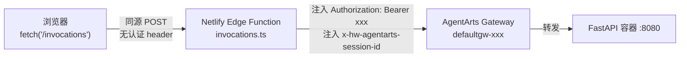

# ADR-014: Netlify Edge Function 作为 API 认证代理

> 状态：Accepted | 日期：2025-06-11

---

## 背景

Web Chat 前端部署在 Netlify（`agentarts-personal-assistant.netlify.app`），后端运行在 AgentArts Gateway（`defaultgw-xxx.cn-southwest-2.huaweicloud-agentarts.com`）。前端 SPA 通过 `POST /invocations` 与后端 Agent 通信。

**两个硬约束同时存在**：

| 约束 | 来源 | 详情 |
|------|------|------|
| **Gateway 要求认证 header** | `.agentarts_config.yaml` → `authorizer_type: API_KEY` | 所有进入 Gateway 的请求必须携带 `Authorization: Bearer <api-key>`，否则返回 401/403 |
| **浏览器不能持有 API Key** | 安全铁律 | API Key 出现在浏览器 JS 中即视为泄露——任何人 F12 就能拿走 |

这两条约束意味着：**前端发起的请求，必须在服务端某处注入认证 header 后再转发到 Gateway，而不能让浏览器直接调 Gateway。**

---

## 决策

**使用 Netlify Edge Function（`netlify/edge-functions/invocations.ts`）在服务端注入 `Authorization: Bearer` 和 `x-hw-agentarts-session-id` 后转发请求到 AgentArts Gateway。**



选择依据：

| 因素 | Edge Function | Netlify Redirect | 独立反向代理 | Gateway auth=NONE |
|------|:---:|:---:|:---:|:---:|
| **能否注入自定义 header** | ✅ 是 | ❌ 否（只能改 URL） | ✅ 是 | N/A（不需要） |
| **部署复杂度** | 低（同仓库，同平台） | 极低（一行 toml） | 高（新服务 + TLS + 运维） | 低（改 YAML） |
| **API Key 安全性** | ✅ 服务端注入，浏览器不可见 | ❌ 无法注入 | ✅ 服务端注入 | ⚠️ Gateway 无认证 |
| **SSE 流式透传** | ✅ 原生支持 | ✅ 支持 | ✅ 支持 | ✅ 支持 |
| **成本** | Netlify 免费额度内 | 免费 | 需额外计算资源 | 免费 |
| **同源（无 CORS）** | ✅ 浏览器调同域 Netlify | ✅ 浏览器调同域 Netlify | ⚠️ 需额外配置 | ❌ 跨域 |

---

## 拒绝的方案

### 方案 A：Netlify Redirect 规则（`netlify.toml` `[[redirects]]`）

这是最初实现（commit `a1985af`），仅一条 toml 配置：

```toml
[[redirects]]
  from = "/invocations"
  to = "https://defaultgw-xxx...agentarts.com/invocations"
  status = 200
```

**拒绝理由**：Netlify redirect 规则只能改写 URL 和 status code，**不能注入自定义 HTTP header**。Gateway 收到没有 `Authorization` header 的请求直接返回 401。这是 Netlify 平台的能力边界，不是配置问题。

### 方案 B：AgentArts Gateway 关闭认证（`authorizer_type: NONE`）

将 `.agentarts_config.yaml` 中 `authorizer_type` 从 `API_KEY` 改为 `NONE`，Gateway 不再验证请求身份。

**拒绝理由**：这意味着任何知道 Gateway URL 的人都可以直接调 Agent。当前生产 Gateway URL 虽不公开，但缺乏纵深防御——一旦 URL 泄露（git history、日志、浏览器 DevTools），攻击者可直接消耗 LLM API 额度、读取 Memory 数据。AgentArts SDK 当前版本不支持 `NONE`（上游 issue [#17](https://github.com/huaweicloud/agentarts-sdk-python/issues/17)），即使未来支持，关闭认证也违反 [ADR-003](./ADR-003-agentarts-platform.md) 的安全基线。

### 方案 C：独立反向代理（Nginx / 华为云 ELB / APIG）

在 AgentArts Gateway 前加一层反向代理，负责注入认证 header。

**拒绝理由**：
- 引入新的基础设施组件，需管理 TLS 证书、高可用、监控告警
- 与 [ADR-003](./ADR-003-agentarts-platform.md) 的"平台优先"原则冲突——本应由 AgentArts Gateway 原生解决的认证问题，不应靠外挂组件修补
- 对于当前单 Service 单 Client 的规模，ROI 严重不匹配。未来多服务场景可重新评估

### 方案 D：Cloudflare Workers / 其他 CDN Edge 平台

在 CDN 边缘注入 header（如 Cloudflare Worker、AWS CloudFront Functions）。

**拒绝理由**：Netlify 已提供 Edge Function 能力，且与前端部署在同一平台（同仓库、同 CI/CD、同域名管理）。引入第二个 CDN 平台增加 DNS 配置、证书管理、费用账单的复杂度。不符合"简单够用"原则。

---

## 影响

### 代码和配置

| 影响项 | 详情 |
|--------|------|
| **新增文件** | `personal-assistant-client/netlify/edge-functions/invocations.ts`（60 行） |
| **移除配置** | `netlify.toml` 中 `/invocations` 的 redirect 规则（原 6 行） |
| **环境变量** | Netlify 控制台配 `AGENTARTS_API_KEY`，代码回退 `pa-dev-api-key-2026`（dev key） |
| **认证方式变更** | commit `91226ba` 从 `X-API-Key` 改为 `Authorization: Bearer`（与 AgentArts Gateway 标准一致） |
| **Session ID** | Edge Function 用 `crypto.randomUUID()` 生成，通过 `x-hw-agentarts-session-id` 传递——**每个请求新 UUID**，当前后端未使用此 ID（`feature-session-checkpoint` 待实现） |

### 请求流

```
浏览器                                      Netlify Edge               AgentArts Gateway
  │                                             │                           │
  │ POST /invocations                           │                           │
  │ {message: "你好", stream: true}              │                           │
  │────────────────────────────────────────────→│                           │
  │                                             │ POST /runtimes/.../invocations
  │                                             │ Authorization: Bearer xxx
  │                                             │ x-hw-agentarts-session-id: <uuid>
  │                                             │──────────────────────────→│
  │                                             │                           │──→ FastAPI
  │                                             │ SSE stream ←──────────────│
  │ SSE stream ←────────────────────────────────│                           │
  │                                             │                           │
```

### 限制

| 限制 | 说明 | 缓解 |
|------|------|------|
| **仅允许 POST** | Edge Function 对非 POST 返回 405。OPTIONS preflight 不单独处理——依赖同源（Netlify 域名）消除 CORS 需求 | 开发环境 Vite proxy 不走 Edge Function，CORS 由 FastAPI 的 `CORSMiddleware` 处理 |
| **API Key 硬编码 fallback** | 代码中 `pa-dev-api-key-2026` 为 dev key，生产需通过 `Netlify.env.get("AGENTARTS_API_KEY")` 覆盖 | 生产部署前确认 Netlify 环境变量已配置 |
| **Session ID 每次重新生成** | 同一浏览器 tab 的连续请求有不同 session ID，导致后端无法关联会话上下文 | 待 `feature-session-checkpoint` 实现后，由前端生成并持久化 session ID，通过自定义 header 传递 |
| **body 全量读取** | `request.text()` 将完整 body 读入内存后再转发。对聊天消息（<10KB）无影响；未来文件上传场景需改为 stream | 当前阶段可接受；文件上传不在 Web Chat scope 内 |

---

## 参考

- [ADR-003: AgentArts 平台作为基础设施](./ADR-003-agentarts-platform.md) — Gateway 认证模型
- [ADR-004: FastAPI 替代 AgentArtsRuntimeApp](./ADR-004-fastapi-over-agentarts-runtime-app.md) — 路由自由度需求
- [前端架构 §6.2 Web Chat 前端部署](../frontend_architecture.md#62-web-chat-前端部署) — OBS + CDN + 自定义域名方案
- [后端架构 §2.1 AgentArts Gateway 路由约束](../backend_architecture.md#21-agentarts-gateway-路由约束) — ACCURATE_MATCH 限制
- commit `7cc157f` — 从 redirect 迁移到 Edge Function 的原始 commit
- [Netlify Edge Functions 文档](https://docs.netlify.com/edge-functions/overview/)
