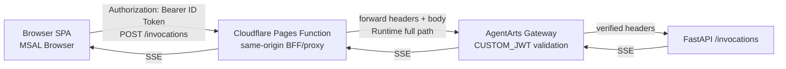
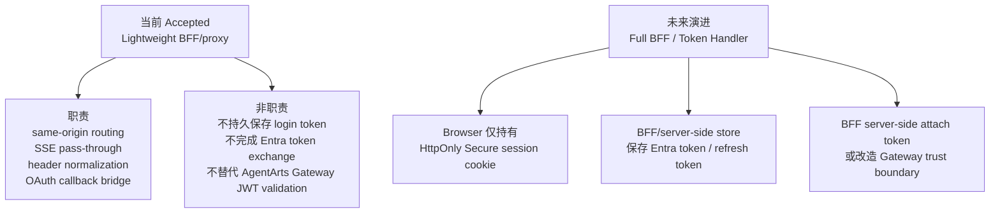
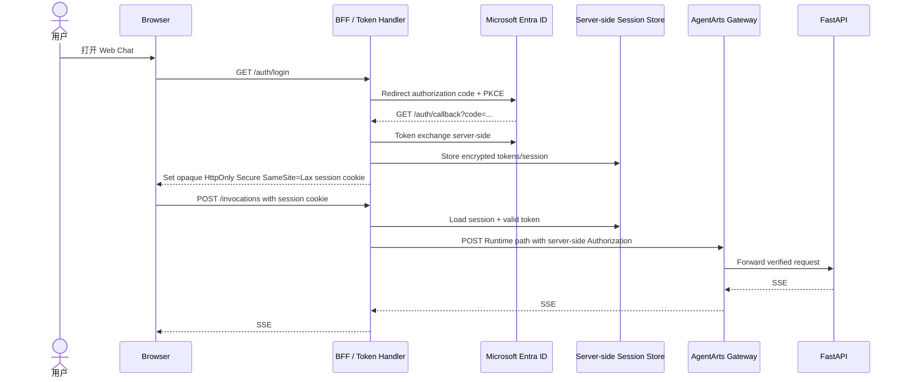

# ADR-019: Web Chat BFF 边界与 Full BFF 演进

> 状态：Accepted | 日期：2026-06-29 | 关联文档：[`ADR-017`](./ADR-017-cloudflare-pages-proxy.md)、[`frontend_architecture.md`](../frontend_architecture.md)、[`cloud-service/cloudflare/pages.md`](../cloud-service/cloudflare/pages.md)

## 背景

Web Chat 当前是部署在 Cloudflare Pages 上的 React SPA。由于 AgentArts
Gateway 在 `CUSTOM_JWT` 模式下会拒绝未携带 JWT 的 browser CORS preflight，
[`ADR-017`](./ADR-017-cloudflare-pages-proxy.md) 已选择 Cloudflare Pages
Function 提供 same-origin `/invocations` proxy。

当前生产链路如下：

这层 Pages Function 已经具备 BFF 的一部分职责：

- 让 Browser 只访问同源 `/invocations`，避免 CORS preflight。
- 隐藏 AgentArts Runtime full path 与 Gateway origin。
- 透传 SSE stream，不让 Browser 直连 Gateway。
- 对 Calendar OAuth2 callback 提供 server-side bridge，并用短期
  `HttpOnly; Secure; SameSite=Lax` callback-only cookies 恢复 Gateway context。

但它不是 OAuth 最严格意义上的 full BFF / token handler。Web Chat Inbound
Login 仍由 Browser 里的 MSAL SPA 完成，`idToken` 保存在前端状态中，并由
Browser 放入 `Authorization` header。OAuth browser app 最新实践建议对处理
敏感数据的 browser-based application 优先考虑 BFF，让 token 留在可信后端，
Browser 仅持有安全 session cookie。

Personal Assistant 会处理日程、邮件、笔记、任务和用户委托，长期安全目标应高于
一般内容型 SPA。因此需要明确当前 BFF 边界，并把 full BFF 作为可演进方向记录下来。

## 决策

当前阶段接受 Cloudflare Pages Function 作为 **lightweight Web Chat BFF**：

具体决策：

1. **短期保留当前架构**：Web Chat 继续使用 MSAL Browser 登录，Pages Function
   继续作为 same-origin `/invocations` proxy，AgentArts Gateway 继续执行 JWT
   validation。
2. **把当前 Pages Function 命名为 lightweight BFF/proxy**，避免误称为 full
   OAuth BFF。它是 BFF-shaped edge adapter，不是完整 token handler。
3. **不在 Browser 直连 AgentArts Gateway**。Browser CORS 直连已被
   ADR-014/ADR-017 证明在当前 Gateway preflight 行为下不可用。
4. **将 full BFF 作为未来安全演进方向**。当 Web Chat 需要更严格的 token
   隔离、企业合规、长期 refresh token session 或更细粒度 user session control
   时，再启动独立 issue 迁移。
5. **Cloudflare Pages Function 可以作为 full BFF 的前门和轻量 token handler
   runtime，但不能单靠 Function 进程内存承担 token vault**。若迁移 full BFF，
   token/session state 必须放入具备持久化、加密、轮换和撤销能力的后端存储。

## Cloudflare Function 是否适合作为 BFF 后端

结论：**适合做 BFF 的 edge/front-door 层，不适合承载重业务或把内存当 token
vault。**

Cloudflare Pages Functions 基于 Workers runtime，官方定位包括认证、
middleware、form handling 和 full-stack dynamic functionality；因此作为
same-origin BFF/proxy 是 conventional 的。对本项目来说，Pages Function 当前做的
都是轻量、请求级、I/O 型工作：URL mapping、header allowlist、SSE pass-through、
callback bridge、`Cache-Control: no-store`。这些职责非常适合 edge function。

它“不够适合”的情况包括：

- 需要长时间 CPU 计算、复杂 Agent 编排或大量业务分支。
- 需要进程内 long-lived session 或内存 token cache。
- 每个请求需要大量外部 subrequest、复杂事务或强一致跨用户协调。
- 需要把 OAuth refresh token 直接存在 function memory、KV eventual consistency
  storage，或不可撤销的加密 cookie 中。

若实施 full BFF，推荐二选一：

| 方案 | 说明 | 适用性 |
|------|------|--------|
| Cloudflare Pages Function + Durable Objects / D1 / RDS session store | Cloudflare 保持前门和 OAuth callback；token 加密后放入强一致或 SQL 存储；Browser 只有 opaque session cookie | 适合保持 edge hosting 和低延迟 |
| FastAPI Service 承担 full BFF，Cloudflare 只做 proxy | 登录、callback、session、token refresh 都在 Service；Cloudflare 继续 same-origin pass-through | 适合复用 Python、RDS、Service observability 和复杂 auth 逻辑 |

当前更保守的长期倾向是：**Cloudflare 继续做边缘前门，真正的 token vault 优先放在
Service/RDS 或明确选型的 Cloudflare stateful storage 中**。不要把 Pages Function
从轻量 BFF 扩张成第二套复杂业务后端。

## Full BFF 目标形态

未来 full BFF 的目标是让 Browser 不再持有 Entra `idToken`、API `access_token`
或 refresh token。目标流程如下：

Full BFF 迁移前必须解决：

- AgentArts Gateway 应接收哪种 server-side token：Entra access token、当前
  ID token、token exchange 结果，还是改为 BFF-to-Gateway trust model。
- Entra App Registration 是否拆分 SPA public client 与 BFF confidential client。
- Session store 选型、token 加密、key rotation、logout/revocation、idle timeout。
- Cookie 认证后的 CSRF 防护：`SameSite`、CSRF token、Origin/Referer check。
- Graph profile photo 等 Browser 直连 Microsoft Graph 的功能是否迁移到 BFF。
- E2E 覆盖登录、silent refresh、401/403、logout、multi-tab 和 OAuth callback。

## 当前技术债

- Browser 仍持有 inbound login token，XSS 后果高于 full BFF。
- 当前 `/invocations` 使用 `idToken` 作为 bearer credential；Microsoft identity
  platform 语义上区分 ID token 与 access token，API 调用更应使用面向 API
  audience 的 access token。若不直接迁移 full BFF，应优先评估将 Gateway
  validation 调整为接受正确 audience 的 access token。
- BFF 使用 Cookie session 后会引入 CSRF 风险；这不是当前 Bearer header 模式的
  同一类风险，迁移时必须一起设计。

## 约束

当前 lightweight BFF 必须遵守：

- Pages Function 不记录、持久化或打印 `Authorization`、callback cookies、
  session id 等敏感值。
- 只 allowlist 必要 headers，不做 wildcard header passthrough。
- 对 `/invocations` response 设置 `Cache-Control: no-store`。
- SSE response body 必须 stream pass-through，不能 buffer 整个响应。
- Callback context cookies 必须短 TTL、path scoped、`HttpOnly`、`Secure`、
  `SameSite=Lax`，并在 callback 完成后清理。
- `OAUTH2_CALLBACK_BFF_SECRET` 属于 Cloudflare Secret，不进入 repository、
  browser bundle 或 OpenTofu state。

## 替代方案

### 方案 A：保持纯 SPA + Browser token，不使用 BFF

拒绝。当前 AgentArts Gateway preflight 行为阻断 CORS 直连；即便未来 Gateway
支持 CORS，该方案仍让 Browser 直接持有 token，不适合作为高敏个人助理的长期目标。

### 方案 B：当前 lightweight BFF/proxy

接受。它解决当前最实际的 CORS、路径、SSE 和 callback bridge 问题，复杂度低，
符合 Cloudflare Pages + AgentArts 的部署边界。

### 方案 C：立即迁移 full BFF

暂缓。安全性更好，但会影响 Entra App Registration、AgentArts Gateway auth
model、Client 登录状态、Service session/token store、E2E 登录测试。应作为独立
feature/refactor issue 设计和落地。

### 方案 D：完全由 FastAPI Service 承担 BFF，Cloudflare 只托管静态文件

可作为 future full BFF 的候选。优点是 Python/RDS/observability 集中，缺点是
需要让 Browser 的所有 auth endpoint 和 API endpoint 仍保持 same-origin，或继续
通过 Cloudflare route 到 Service。

## 影响

### 正向影响

- 明确当前架构是 conventional 的 SPA + edge BFF/proxy，而不是半隐式的 token
  handler。
- 保留 Cloudflare Pages 的低运维成本、same-origin API 和 stream 能力。
- 为未来 full BFF 迁移留下清晰路径，不把安全债藏在“已经有 BFF”的表述里。

### 负向影响

- 当前阶段仍需接受 Browser token 暴露风险，需要依赖 CSP、依赖治理、XSS 防护和
  短生命周期 token 降低风险。
- Full BFF 未来会引入 server-side session、CSRF、防撤销一致性和存储加密等新复杂度。
- Cloudflare 与 AgentArts 之间的 auth boundary 未来可能需要重新建模。

## Four-Question Gate

| 问题 | 结论 |
|------|------|
| Is it best practice? | Yes, with scope。当前 lightweight BFF 是可接受的 edge proxy；full BFF 被记录为高敏场景的长期最佳实践方向 |
| Is it industry standard? | Yes。SPA + same-origin serverless BFF/proxy 常见；OAuth browser app 最新实践也认可 BFF / token handler 方向 |
| Is it conventional? | Yes。新成员能预期 Cloudflare Pages Function 负责前端同源 API proxy，FastAPI 负责业务和 Agent |
| Is it modern? | Yes。Edge Functions、Web Streams、server-side token custody evolution 都符合现代 Web auth 方向 |

## 参考

- [IETF OAuth 2.0 for Browser-Based Applications draft](https://datatracker.ietf.org/doc/html/draft-ietf-oauth-browser-based-apps)
- [RFC 9700: Best Current Practice for OAuth 2.0 Security](https://www.rfc-editor.org/info/rfc9700/)
- [Cloudflare Pages Functions](https://developers.cloudflare.com/pages/functions/)
- [Cloudflare Workers limits / pricing](https://developers.cloudflare.com/workers/platform/pricing/)
- [Cloudflare Durable Objects](https://developers.cloudflare.com/durable-objects/)
- [Cloudflare Workers KV consistency](https://developers.cloudflare.com/kv/concepts/how-kv-works/)
- [Microsoft identity platform: access tokens](https://learn.microsoft.com/en-us/entra/identity-platform/access-tokens)
- [Microsoft identity platform: ID tokens](https://learn.microsoft.com/en-us/entra/identity-platform/id-tokens)
