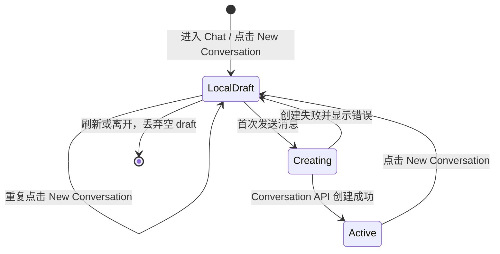

# ADR-020: Web Chat Conversation 采用 Lazy Creation

> 状态：Accepted | 日期：2026-07-20 | 关联文档：[`ADR-013`](./ADR-013-assistant-ui-chat-library.md)、[`frontend_architecture.md`](../frontend_architecture.md)、[`session-state-management.md`](../session-state-management.md)、[`Feature 14`](../../issues/features/feature-14-multi-session-runtime-prewarm/issue.md)

## 背景

Web Chat 支持多个持久化 Conversation。用户点击 New Conversation 时，需要在以下
生命周期之间做出选择：

- 立即调用 Conversation API、写入 PostgreSQL，并在 sidebar 中加入空 Conversation；
- 先进入本地空白 draft，等用户发送第一条消息时再创建持久化 Conversation；
- 在 sidebar 中显示本地 draft，但仍延迟持久化。

立即持久化能提供明确的列表反馈，但误点、重复点击和放弃输入都会产生空
Conversation。另一方面，Lazy Creation 若没有清晰的 empty state，用户可能无法确认
New Conversation 操作是否已经生效。

当前 assistant-ui Remote Thread Runtime 原生区分 local `new` thread 与 remote
Conversation，适合把第一条用户消息作为持久化边界。

## 决策

Web Chat Conversation 采用 **Lazy Creation**：

1. 用户进入 Chat 或点击 New Conversation 后，Client 切换到唯一的本地 draft。
   此时 draft 没有 `conversation_id`，不调用 `POST /api/conversations`，也不写入
   PostgreSQL。
2. 未发送消息的 draft 不加入 Conversation sidebar。Sidebar 只展示已经进入持久化
   生命周期的 Conversation，避免空记录和无意义的历史 item。
3. 用户发送第一条消息时，Chat Adapter 必须先等待
   `threadListItem.initialize()`：Conversation 创建成功并取得 `conversation_id` 后，
   才能调用 `POST /invocations`。
4. Lazy draft 必须通过 empty state 提供即时反馈：旧消息区域清空、welcome state 可见，
   Composer 可立即输入并取得焦点。该状态本身就是 New Conversation 的反馈，不显示
   “创建成功” toast，因为持久化尚未发生。
5. 同一时刻只保留一个空白 draft。用户在空白 draft 上重复点击 New Conversation 不创建
   多个 draft；刷新页面或离开 Chat 可以丢弃未发送的 draft。
6. Conversation 初始化失败时保持可输入的 draft，并在首次发送路径显示错误；不得携带
   assistant-ui local thread ID 调用 Invocation API。

图类型：**State Diagram（状态图）**。用于说明本地 draft 到持久化 Conversation 的生命周期。

## UI 与 ADR 的边界

本 ADR 记录的不是单纯视觉样式，而是跨 Client、Conversation API 和 PostgreSQL 的
生命周期边界。以下变化通常不需要新 ADR：

- 颜色、字号、间距、图标和 responsive breakpoint；
- 不改变行为语义的 welcome 文案或布局微调；
- 单个组件内部且容易撤销的交互优化。

这些内容应记录在 Client `DESIGN.md`、对应 architecture 文档或 issue 中。只有当 UI
决策改变持久化时机、API contract、跨组件状态模型、安全边界，或形成长期且难以逆转的
产品交互约束时，才使用 ADR。

## 替代方案

### 方案 A：点击 New Conversation 时立即持久化

拒绝。该方案让 sidebar 反馈最明确，刷新后空 Conversation 也能保留，但会因为误点和
放弃输入持续产生空数据库记录，并需要额外的 pending、失败重试和定期清理策略。

### 方案 B：在 sidebar 中显示未持久化的 draft item

暂不采用。它能兼顾即时反馈与干净数据库，但 sidebar item 看似可恢复，实际刷新后会
消失，容易混淆持久化语义。Desktop 和 mobile 还需要不同反馈路径，增加状态复杂度。

### 方案 C：Lazy Creation + empty state

接受。该方案符合 assistant-ui 的 local/remote thread 模型，避免空 Conversation，并通过
welcome state 和可输入 Composer 提供足够的即时反馈。

## 影响

### 正向影响

- PostgreSQL 和 Conversation sidebar 不累积从未使用的空 Conversation。
- New Conversation 操作不依赖网络请求，切换反馈即时。
- `conversation_id` 只在业务 Conversation 真正开始时产生，生命周期语义清晰。
- 保持 assistant-ui Remote Thread Runtime 的 conventional 使用方式。

### 负向影响

- 未发送的 draft 不可跨刷新恢复。
- Empty state 的视觉反馈必须长期保留；若将其弱化，用户可能再次无法确认切换结果。
- 首次发送比后续发送多一次 Conversation 初始化请求，错误需要在发送路径处理。

## Four-Question Gate

| 问题 | 结论 |
|------|------|
| Is it best practice? | Yes。只在用户产生第一条业务内容时持久化，避免无意义数据，同时保留明确 empty state |
| Is it industry standard? | Yes。AI Chat 产品普遍采用空白 draft + 首次发送后进入历史的模式 |
| Is it conventional? | Yes。符合 assistant-ui local `new` thread 到 remote thread 的生命周期 |
| Is it modern? | Yes。采用 optimistic local state 与显式持久化边界，不以数据库写入阻塞 UI 切换 |
