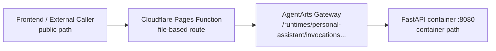

# Personal Assistant — API 路径映射与命名规则

> 状态：Active | 更新时间：2026-07-15

本文以**生产环境 API**为主，回答两个问题：

1. **Frontend path、Cloudflare Pages Function、AgentArts Gateway full Runtime
   path、Backend container path 如何对应。**
2. **未来新增 API 时，路径、method、namespace 和 schema 字段如何命名。**

Local/Vite/Wrangler dev 的特殊路径不混入生产表格，统一放在
[Local-only Exceptions](#4-local-only-exceptions)。

## 1. Production 路径对应规则

生产 API 路径必须同时看四个位置：`Frontend path` 是浏览器或外部系统访问的
public same-origin path；`Cloudflare Function route` 是 Cloudflare Pages
file-based routing 命中的 Function；`Gateway full Runtime path` 是 AgentArts
Gateway 对外暴露的完整 Runtime path；`Backend container path` 是 Gateway 去掉
Runtime prefix 后进入 FastAPI container 的 path。

图类型：**Flowchart（四层 API 映射图）**。用于说明请求从 Frontend 到
Cloudflare Pages Functions、AgentArts Gateway、Backend container 的路径变化。



生产路径映射遵循下表。`{suffix}` 表示追加在 Gateway Runtime root 后面的路径片段，
不带开头 `/`。新增 production public API 时，必须在这个形态下显式列出，不要靠
Frontend `/invocations/{suffix}` 作为隐式 contract。

| 规则 | Frontend path | Cloudflare Function route | Gateway full Runtime path | Backend container path |
|------|---------------|--------------------------|---------------------------|------------------------|
| 对话根入口 | `/invocations` | `functions/invocations.js` | `/runtimes/personal-assistant/invocations` | `/invocations` |
| 显式 BFF public route | 明确设计的 public path，例如 `/auth/callback/m365-calendar` | 对应的 Pages Function 文件，例如 `functions/auth/callback/m365-calendar.js` | `/runtimes/personal-assistant/invocations/{suffix}` | `/{suffix}` |

关键约束：

- Frontend 不直接访问 AgentArts Gateway domain。
- Gateway root `/runtimes/personal-assistant/invocations` 对应 Backend
  `/invocations`。
- Gateway suffix `/runtimes/personal-assistant/invocations/{suffix}` 对应 Backend
  `/{suffix}`。
- Frontend `/invocations/{suffix}` 不作为 production public route。新增 production
  public API 时必须有独立 Pages Function 文件显式声明。
- `AGENTARTS_OAUTH_CALLBACK_URL` 不属于 production path mapping；它是 local-only
  direct upstream override。

## 2. Future API 命名规则

本节是未来 route review 的默认规则。若外部平台强制 callback、webhook 或 OAuth2
参数形态，可以例外，但必须在 Production API Instances 表和对应 issue/ADR 中说明原因。

### 2.1 分层命名原则

- `Frontend path` 是长期 public contract，应围绕产品能力和用户语义命名，不暴露
  `runtime`、`gateway`、`function`、`proxy`、`container` 等实现细节。
- `Backend container path` 是 Service contract，可以比 public path 更接近协议或实现，
  但仍需语义稳定。public path 与 backend path 不一致时，必须在映射表中显式记录。
- `/invocations` 是 AgentArts 对话根入口，只用于用户消息 invocation。不要把无关
  production public API 挂到 `/invocations/*`；Gateway suffix 可以路由到 backend，
  但 Cloudflare production public route 必须逐条显式声明。
- 如果新能力只是 Agent 对话内的 tool 能力，不需要新增 HTTP route；继续通过
  `POST /invocations` 进入 Agent loop。
- 普通 first-party 业务数据 API 默认使用 `/api` 前缀，例如 `/api/tasks`、
  `/api/calendar/events`，避免与 React SPA 页面路由冲突，并方便统一鉴权、日志、
  缓存和 rate limit。
- 平台固定入口和浏览器 redirect 型协议入口可以不加 `/api`，例如
  `POST /invocations`、`GET /auth/callback/m365-calendar`，但必须在映射表中显式记录。

### 2.2 路径格式

- literal path segment 使用 lowercase English + kebab-case，例如
  `/auth/callback/m365-calendar`、`/api/calendar/events`。
- collection 使用复数名词；单个资源使用 `{resource_id}` 形式追加在 collection 后：
  `GET /api/tasks`、`GET /api/tasks/{task_id}`。
- path parameter 名称在文档和 FastAPI 中使用 Python snake_case，例如 `{task_id}`、
  `{event_id}`；literal segment 不使用 snake_case。
- 不使用 trailing slash、文件扩展名或 UI 页面名作为 API contract，例如不要使用
  `/api/tasks/`、`/api/tasks.json`、`/calendar-callback-page`。
- provider、协议和行业固定缩写保持常见 lowercase token，例如 `m365`、`oauth2`、
  `sse`、`github`。
- query string 用于 filter、pagination、sorting 或外部协议参数，不用于表达资源层级；
  credential、token、secret 不放在 path 中。

### 2.3 HTTP method 与 action

| 操作意图 | 推荐形态 | 说明 |
|----------|----------|------|
| 读取 collection | `GET /api/tasks` | filter/pagination 放 query string |
| 创建资源 | `POST /api/tasks` | body 描述要创建的资源 |
| 读取单个资源 | `GET /api/tasks/{task_id}` | path parameter 表示资源 identity |
| 部分更新 | `PATCH /api/tasks/{task_id}` | 默认优先于 `PUT` |
| 删除资源 | `DELETE /api/tasks/{task_id}` | 删除语义必须幂等或明确记录非幂等行为 |
| 非 CRUD command | `POST /api/tasks/{task_id}/complete` | 仅在状态更新无法自然表达时使用 terminal verb |
| 长任务 | `POST /api/calendar/import-jobs` + `GET /api/calendar/import-jobs/{job_id}` | 避免 `/start-import` 这类动词路径 |

Streaming/SSE 是 response transport，不单独决定路径命名。除现有
`POST /invocations` 的 `stream` 字段外，新增 streaming API 应优先通过 `Accept`、
`Content-Type` 或明确的 response media type 表达。

### 2.4 Namespace 建议

| Namespace | 用途 | 示例 |
|-----------|------|------|
| `/invocations` | AgentArts Runtime 对话执行入口 | `POST /invocations` |
| `/api/conversations/...` | Conversation、Message history 与 Conversation-scoped commands | `GET /api/conversations/{conversation_id}/messages`、`POST /api/conversations/{conversation_id}/invocations/{client_message_id}/cancel` |
| `/auth/...` | inbound login、OAuth2 callback、委托授权 BFF redirect route | `GET /auth/callback/m365-calendar` |
| `/api/calendar/...` | 日历资源或日历相关 first-party API | `GET /api/calendar/events` |
| `/api/mail/...` | 邮件资源或邮件相关 first-party API | `GET /api/mail/messages` |
| `/api/notes/...` | 笔记资源 | `GET /api/notes` |
| `/api/tasks/...` | 任务资源 | `GET /api/tasks` |
| `/api/memory/...` | 用户可见 Memory 管理能力 | `GET /api/memory/items` |
| `/api/admin/...` | 运维或管理 API；默认不作为 public route 暴露 | `POST /api/admin/reindex-jobs` |
| `/internal/...` | service-to-service only；禁止通过 Cloudflare production public route 暴露 | `POST /internal/events` |

新增 namespace 前先确认它是否代表长期产品能力，而不是某个 provider 或临时实现。
例如 Microsoft Graph 是实现细节，public path 应优先叫 `/api/calendar/events` 或
`/api/mail/messages`，而不是 `/api/microsoft-graph/events`。

### 2.5 Schema 与字段命名

- FastAPI/Pydantic model 使用 PascalCase，并按用途加 `Request`、`Response`、
  `Event`、`Error` 后缀，例如 `InvocationRequest`、`OAuth2CallbackResponse`。
- 新增 Personal Assistant first-party HTTP JSON 字段默认使用 Python `snake_case`，
  例如 `conversation_id`、`client_message_id`、`next_cursor`。
  这里的 HTTP JSON 指 FastAPI/OpenAPI 暴露的 request/response body；它是 Service
  contract，不随 React component 或 TypeScript UI state 的命名习惯改变。
- Personal Assistant 自己定义的跨边界 payload 字段统一使用 `snake_case`。这包括
  HTTP JSON request/response、SSE JSON event，以及浏览器窗口、tab、popup 或组件之间
  通过 `postMessage` / `BroadcastChannel` 传递的 envelope，例如 `request_id`。
- Frontend 内部 domain object、component props 或 store state 可以使用 `camelCase`，
  但转换应放在 API adapter 层完成。
- 不引入全局 Pydantic `alias_generator` 作为默认行为。若某个新 contract 确实需要
  偏离 `snake_case`，必须在对应 issue/ADR 中说明原因、调用方和兼容性影响。
- 已存在 contract 保持兼容，例如 `POST /invocations` 的 `message`、`stream`、
  `response` 不为了统一命名而重命名。
- 外部协议或平台传入字段保持对方定义，例如 OAuth2/AgentArts callback query 中的
  `session_uri`、`custom_state`。
- Error response 默认使用 FastAPI `detail` contract；需要机器分支的冲突使用
  `{"code":"...","detail":"..."}` 并在 OpenAPI 声明。Feature 14 的稳定 code 为
  `conversation_busy`、`conversation_archived`、`duplicate_message`、
  `invocation_cancelled` 和 `invocation_failed`。`invocation_cancelled` 仅用于 cancellation
  command 抢先到达后，原 `POST /invocations` 迟到的竞态路径。

### 2.6 新增 API Checklist

新增 production public API 时必须完成：

1. 在对应 issue/Implementation Plan 中说明新增 route 的动机、调用方、认证边界和测试计划。
2. 按本节规则确定 `Frontend path`、`Cloudflare Function route`、
   `Gateway full Runtime path`、`Backend container path`。
3. 在 [Production API Instances](#3-production-api-instances) 表新增一行。
4. 增加显式 Pages Function 文件；不要用 catch-all route 隐式公开新 API。
5. 如果修改 FastAPI route 或 request/response schema，运行并提交 `openapi.json` diff：
   `uv run python scripts/generate_openapi.py`。
6. 更新受影响的 Service、Client、E2E 测试；涉及 Cloudflare routing 时用 Wrangler
   preview 或等价方式验证 route 命中行为。

## 3. Production API Instances

| 能力 | Frontend path | Cloudflare Function route | Gateway full Runtime path | Backend container path |
|------|---------------|--------------------------|---------------------------|------------------------|
| Web Chat invocation | `POST /invocations` | `functions/invocations.js` | `POST /runtimes/personal-assistant/invocations` | `POST /invocations` |
| Invocation cancellation | `POST /api/conversations/{conversation_id}/invocations/{client_message_id}/cancel` | `functions/api/conversations/[conversation_id]/invocations/[client_message_id]/cancel.js` | `POST /runtimes/personal-assistant/invocations/api/conversations/{conversation_id}/invocations/{client_message_id}/cancel` | same public path |
| Conversation list/create | `GET/POST /api/conversations` | `functions/api/conversations.js` | `GET/POST /runtimes/personal-assistant/invocations/api/conversations` | `GET/POST /api/conversations` |
| Conversation get/update/delete | `GET/PATCH/DELETE /api/conversations/{conversation_id}` | `functions/api/conversations/[conversation_id].js` | same suffix under Runtime invocation root | same public path |
| Conversation messages | `GET /api/conversations/{conversation_id}/messages` | `functions/api/conversations/[conversation_id]/messages.js` | same suffix under Runtime invocation root | same public path |
| Calendar OAuth callback | `GET /auth/callback/m365-calendar` | `functions/auth/callback/m365-calendar.js` | `GET /runtimes/personal-assistant/invocations/auth/oauth2/callback/m365-calendar` | `GET /auth/oauth2/callback/m365-calendar` |
| Logout Cookie cleanup | `POST /auth/logout` | `functions/auth/logout.js` | `N/A` | `N/A` |

Conversation rows describe the implemented BFF/Service target paths. Their deployed Gateway
GET/POST/PATCH/DELETE routing and resolver Session header pass-through remain G1 pending；旧 probe
只证明 suffix rewrite 基础能力，不能替代 Feature 14 method/header probe。

`POST /invocations` request body：

```json
{
  "conversation_id": "6ee32f02-4c87-4c16-bcc8-cc69277ee42f",
  "client_message_id": "d18b81bc-b6ba-4c9f-91fd-b773a7815eb9",
  "message": "帮我看看明天的日程",
  "stream": true
}
```

API 不返回 `runtime_session_id`、`runtime_status` 或 lease 状态。

以下 backend paths 不是 production public API entrypoint：

- `GET /ping`：AgentArts 控制面和本地开发 health check，不通过 public Gateway
  policy 暴露。
- `GET /invocations/playground`：Chainlit playground，本地/直连调试入口，不作为
  Cloudflare production public entrypoint。

## 4. Local-only Exceptions

下表只记录本地开发或 Wrangler preview 的特例路径，不参与 production API 映射。
Vite chat dev 使用 proxy 是为了让浏览器始终请求 `http://localhost:5173/invocations`
这个同源 path，避免 FastAPI 为本地 `localhost:5173 -> localhost:8080` 跨端口请求
额外开启 CORS。
Calendar OAuth callback 的本地 full-flow 测试必须走 local Cloudflare Pages Functions
（`npm run pages:dev:local`），不走 Vite dev proxy。

| 场景 | Local frontend path | Local proxy / route | Gateway full Runtime path | Backend container path |
|------|---------------------|---------------------|---------------------------|------------------------|
| Local Vite chat dev | `POST http://localhost:5173/invocations` | Vite dev proxy | `N/A` | `POST http://localhost:8080/invocations` |
| Local Vite Conversation dev | `GET/POST/PATCH/DELETE http://localhost:5173/api/conversations...` | Vite dev proxy | `N/A` | `http://localhost:8080/api/conversations...` |
| Local Pages full flow | `/invocations`、`/api/conversations...`、`/auth/logout` | Wrangler Pages Functions，`PA_ENV=local` | `N/A` | `http://localhost:8080` 对应 path |
| Local Pages full-flow callback | `GET http://localhost:5173/auth/callback/m365-calendar` | `functions/auth/callback/m365-calendar.js` | `AGENTARTS_OAUTH_CALLBACK_URL=http://localhost:8080/auth/oauth2/callback/m365-calendar` | `GET http://localhost:8080/auth/oauth2/callback/m365-calendar` |
| Backend health check | `GET http://localhost:8080/ping` | direct backend | `N/A` | `GET /ping` |
| Backend Chainlit playground | `GET http://localhost:8080/invocations/playground` | direct backend | `N/A` | `GET /invocations/playground` |

## 5. Source Of Truth

- Frontend URL 构造：`personal-assistant-client/src/lib/chat/chat-api-client.ts`
- Vite proxy：`personal-assistant-client/vite.config.ts`
- Cloudflare Web Chat proxy route：`personal-assistant-client/functions/invocations.js`
- Cloudflare AgentArts proxy helper：`personal-assistant-client/functions/_shared/agentarts-proxy.js`
- Cloudflare Runtime Cookie resolver：`personal-assistant-client/functions/_shared/runtime-session.js`
- Cloudflare callback context helper：`personal-assistant-client/functions/_shared/callback-context.js`
- Cloudflare OAuth callback BFF：`personal-assistant-client/functions/auth/callback/m365-calendar.js`
- Cloudflare Conversation routes：`personal-assistant-client/functions/api/conversations*.js`
- Cloudflare logout：`personal-assistant-client/functions/auth/logout.js`
- Client Conversation adapter：`personal-assistant-client/src/lib/conversations/api.ts`
- FastAPI Invocation route：`personal-assistant-service/app/main.py`
- FastAPI Conversation routes：`personal-assistant-service/app/conversations/routes.py`
- Cloudflare runtime var：`personal-assistant-client/wrangler.toml`

修改 FastAPI route 或 schema 后，必须在 Service 目录重新生成 OpenAPI：

```bash
uv run python scripts/generate_openapi.py
```
