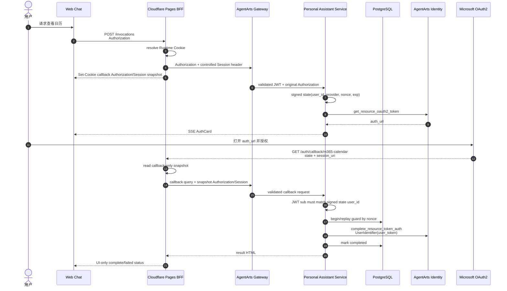
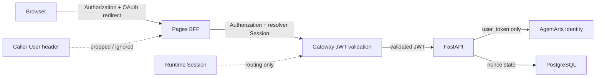

# Feature 15 Calendar OAuth2 Architecture

> 状态：Active | 更新时间：2026-07-15 | 范围：Calendar Tool / AgentArts OAuth2 full flow

本文记录 Calendar OAuth2 的 backend-owned completion 模型，以及 Feature 14 Runtime Cookie
引入后的 callback routing contract。

## 1. 设计目标

- Calendar Tool 使用 User Federation 读取用户 Microsoft Calendar。
- 未授权时，Service 通过 AgentArts Identity SDK 向 Web Chat 下发 AuthCard。
- Microsoft redirect 先进入 Cloudflare Pages BFF，再 server-to-server 转发到 Service。
- Service 校验 signed state，并调用 `complete_resource_token_auth`。
- 浏览器只展示授权结果，不参与 completion ownership 决策。
- replay/duplicate callback 使用 PostgreSQL 持久化。
- Microsoft Graph resource token 只保存在 AgentArts Identity Token Vault。

## 2. 端到端流程

图类型：**Sequence Diagram（时序图）**。用于说明授权开始、redirect 与 completion 顺序。



## 3. 组件职责

| 组件 | 负责 | 不负责 |
|------|------|--------|
| Web Chat | AuthCard、打开授权 URL、接收 UI status | complete、保存 token、生成 Runtime ID |
| Cloudflare BFF | callback route、受控 query、Authorization/Runtime snapshot、shared secret | JWT 业务校验、ownership、数据库 |
| AgentArts Gateway | JWT 验证、Runtime routing | Calendar completion 与 replay |
| FastAPI | signed state、canonical user、completion、result page | 向浏览器暴露 resource token |
| PostgreSQL | callback nonce active/completed 与 expiry | 保存 Microsoft access token |
| AgentArts Identity | Resource Token Auth session 与 Token Vault | 信任 browser body user identity |

## 4. URL 与路由

| Public URL | Pages Function | Gateway / direct upstream | FastAPI path |
|------------|----------------|---------------------------|--------------|
| `POST /invocations` | `functions/invocations.js` | Runtime invocation root | `POST /invocations` |
| `GET /auth/callback/m365-calendar` | `functions/auth/callback/m365-calendar.js` | Runtime suffix 或 local direct callback | `GET /auth/oauth2/callback/m365-calendar` |

Production 使用 Gateway full Runtime suffix：

```text
/runtimes/personal-assistant/invocations/auth/oauth2/callback/m365-calendar
```

Local Wrangler 可通过 `AGENTARTS_OAUTH_CALLBACK_URL` 直连
`http://localhost:8080/auth/oauth2/callback/m365-calendar`。React callback shell 只作为 Vite
fallback，不是 production completion owner。

## 5. Callback Context Cookies

OAuth redirect 是全新的顶层 GET，不自然携带原 `/invocations` 的 Authorization。BFF 在授权
开始请求返回时写两个 callback-only HttpOnly cookies：

| Cookie | Snapshot 来源 | Callback upstream header |
|--------|---------------|--------------------------|
| `pa_oauth2_callback_auth` | 原始 `Authorization` | `Authorization` |
| `pa_oauth2_callback_session` | Runtime Cookie resolver 的 ID | `x-hw-agentarts-session-id` |

`pa_oauth2_callback_user` 不再写入或读取，只在 callback/logout 时作为 legacy cookie 清理。
用户身份由 Gateway 验证的 JWT `sub` 决定，不由 User header snapshot 决定。

安全属性：

- `Path=/auth/callback/m365-calendar`
- `Max-Age=600`
- `HttpOnly`
- `Secure`
- `SameSite=Lax`

BFF 不转发 callback 请求自身的 Authorization 或原始 Cookie，只从 callback-only cookies
重建 allowlisted upstream headers。主 `pa_runtime_session` 在授权开始后轮换时，callback
仍使用开始时的 Session snapshot。

## 6. Signed State 与数据库

新 signed state 包含：

- `user_id`：来自 Gateway 已验证 JWT 的 `sub`
- `provider`
- `nonce`
- `iat` / `exp`

新 state 不包含 Runtime Session ID。parser 可读取 legacy `session_id`，但必须忽略，不参与
routing、ownership 或 replay key。

`oauth2_callback_states.session_id` 已改为 nullable：旧 row 保留，新 row 不写该字段。
Runtime snapshot 只存在短时 callback Cookie，不进入 OAuth state 或 DB。

## 7. Identity 参数选择

可信链路：

1. Client 发送 Entra `Authorization: Bearer <token>`。
2. BFF 原样转发 Authorization，不解析 JWT 做业务授权。
3. Gateway 校验 signature、issuer、audience 与 expiry。
4. FastAPI 从已验证 token 的 `sub` 派生 canonical `user_id`。
5. callback 时 signed state `user_id` 必须与当前 JWT `sub` 匹配。

`complete_resource_token_auth` 只传 `user_token`：

```python
user_token = extract_authorization_user_token(request)
client.complete_resource_token_auth(
    session_uri=callback.session_uri,
    user_identifier=UserIdentifier(user_token=user_token),
)
```

AgentArts Identity 不允许 `UserIdentifier` 同时携带 `user_id` 和 `user_token`。signed state
中的 `user_id` 用于绑定和审计，不与 `user_token` 一起传入 SDK。

| 环境 | Runtime WAT | Callback complete |
|------|-------------|-------------------|
| Production | Gateway 注入 JWT-bound workload token | `UserIdentifier(user_token=user_token)` |
| Local manual | Service 用 inbound Entra token mint customer-owned CUSTOM_JWT workload token | `UserIdentifier(user_token=user_token)` |

缺少真实 inbound Authorization 或 JWT-mode WAT 时，Calendar full flow 必须 fail closed，不能
回退到 caller User header 或 `UserIdentifier(user_id=...)`。

## 8. Replay 与失败语义

- PostgreSQL 按 signed state nonce 记录 active/completed。
- completed replay 返回成功结果，不重复调用 Identity。
- active duplicate 返回 pending。
- completion 失败清除 active，使用户可以重新发起。
- callback context 缺失或过期时提示回到原聊天窗口重新授权。
- 日志只记录 redacted prefix，不记录 JWT、OAuth code 或 resource token。

## 9. 安全边界

图类型：**Data Flow / Trust Boundary Diagram（数据流 / 信任边界图）**。用于说明身份与
Runtime routing 不混用。



## 10. Four-Question Gate

| 问题 | 结论 |
|------|------|
| Is it best practice? | Yes。server-side callback、signed state、short-lived HttpOnly snapshot、DB replay guard。 |
| Is it industry standard? | Yes。SPA BFF redirect bridge + backend completion + managed Token Vault。 |
| Is it conventional? | Yes。redirect -> BFF -> Service -> idempotency -> Identity complete。 |
| Is it modern? | Yes。避免 implicit flow、browser token completion 与 Runtime/identity 混用。 |
