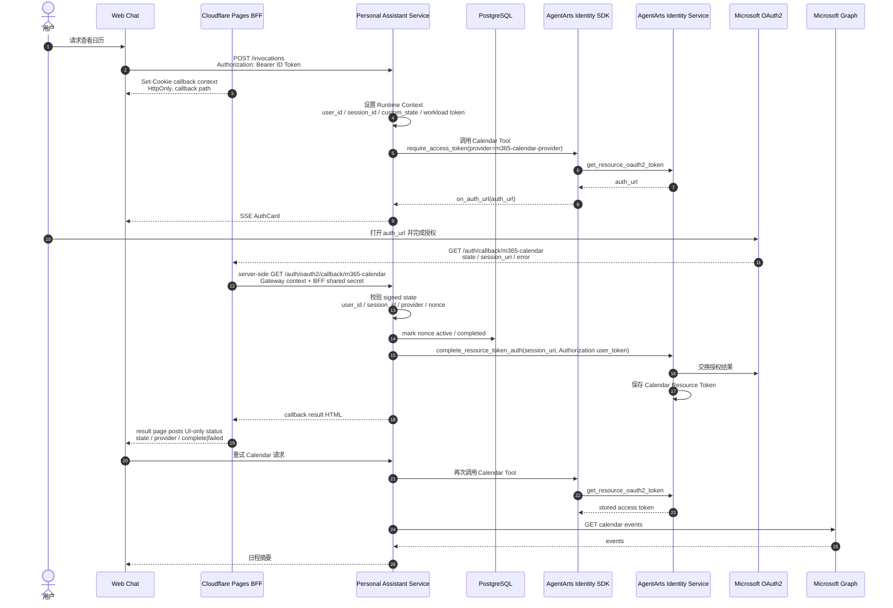
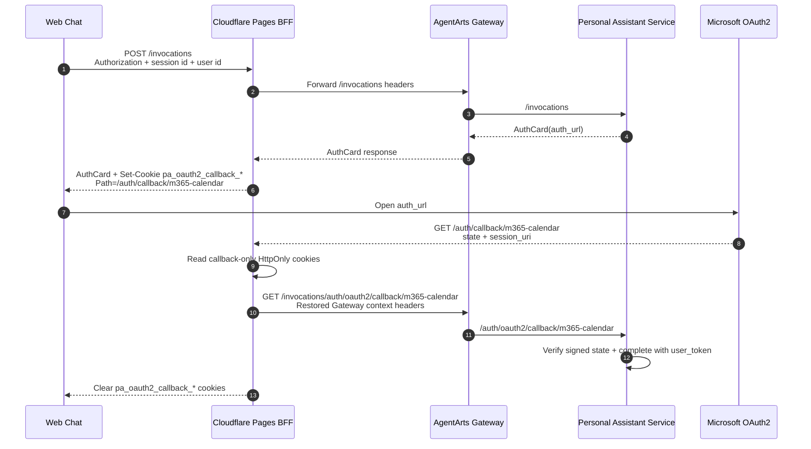

# Feature 15 Calendar OAuth2 Architecture

> 状态：Draft | 范围：Calendar Tool / AgentArts OAuth2 full flow | 关联：Feature 15、`backend_architecture.md`、`frontend_architecture.md`

本文记录 Feature 15 的 Calendar OAuth2 架构：用户首次授权 Microsoft 365 Calendar 时，Web Chat、Personal Assistant Service、AgentArts Identity Service 与 Microsoft OAuth2 如何协作完成 `complete_resource_token_auth` session binding。

## 1. 设计目标

Calendar Tool 是本项目第一个覆盖 AgentArts OAuth2 full flow 的示范能力。目标是：

- Calendar Tool 以 User Federation 模式读取用户 Microsoft Calendar。
- 用户未授权时，服务端通过 `@require_access_token` / `on_auth_url` 向 Web Chat 下发 AuthCard。
- OAuth2 callback 先由 Cloudflare Pages Function BFF 接住，再 server-to-server 转发到
  Personal Assistant Service；Service 验证 signed state 后调用
  `complete_resource_token_auth`，完成 Resource Token Auth session binding。
- Web Chat 只负责展示 AuthCard、打开授权 URL、根据后端 callback status 更新 UI，不参与
  OAuth2 complete 业务决策。
- replay / duplicate callback 状态在 production 使用 PostgreSQL 持久化，避免多实例、
  重启或重复 redirect 导致重复 complete。
- AgentArts Identity 通过 OAuth2 flow 拿到的第三方 Microsoft Graph resource token
  只保存在 AgentArts Identity Token Vault，不暴露给浏览器、LLM 或日志。
  本地开发中浏览器发送给 Service 的 inbound Microsoft Entra ID token 只用于
  Agent Identity JWT WAT exchange，不是 Calendar Resource Token。

## 2. 端到端流程



## 3. 组件职责

| 组件 | 职责 | 不负责 |
|------|------|--------|
| Web Chat 主窗口 | 展示 AuthCard；打开授权 URL；监听 callback result page 的 UI status；按 `oauth2_state` 更新匹配 AuthCard | 不调用 `complete_resource_token_auth`；不决定 OAuth2 session ownership |
| Cloudflare Pages BFF | 承接 OAuth provider redirect；server-side 转发 callback query 到 Service；用 callback-only HttpOnly cookies 恢复 Gateway context headers；注入可选 BFF shared secret；返回 Service result HTML | 不把 callback 请求中的浏览器 Authorization/Cookie 原样透传给 upstream；不执行业务 ownership 判断；不调用 AgentArts Identity SDK |
| React Callback Shell | 仅作为 Vite 本地开发 fallback；生产 callback path 由 Pages Function 优先处理 | 不获取 MSAL token；不参与 production complete 协议 |
| Personal Assistant Service | 生成 signed state；校验 callback state；调用 `complete_resource_token_auth`；用 PostgreSQL/本地 fallback 控制 replay / stale callback 语义 | 不把第三方 access token 写入 response 或 prompt |
| PostgreSQL | production callback nonce active/completed 状态与过期时间 | 不保存 Microsoft access token |
| AgentArts Gateway | 校验 Inbound JWT；注入可信 user/session/workload headers | 不执行 Calendar 业务逻辑 |
| AgentArts Identity Service | 维护 Resource Token Auth session；保存 Calendar Resource Token | 不信任浏览器 body 中的 user identity |
| Microsoft OAuth2 / Graph | 完成用户授权；提供 Calendar API | 不感知 Agent conversation state |

## 4. URL 与路由映射

> UI status notification 当前实现可使用 same-origin `BroadcastChannel` /
> `window.postMessage`。这只是完成后的展示同步通道，不承载 `session_uri` completion
> 决策，也不允许任何 Web Chat tab 调用 `complete_resource_token_auth`。
>
> Production callback path 由 Cloudflare Pages Function 优先接管，因此 callback 不依赖
> React tab、MSAL cache、opener 或 BroadcastChannel 来完成业务协议。Browser 收到的只是
> Service 返回的 result HTML，页面脚本只广播 UI status。

Feature 15 使用 Cloudflare Pages BFF + backend-owned completion 模型：

| URL | 调用方 | 目的 |
|-----|--------|------|
| `/auth/callback/m365-calendar` | Microsoft OAuth2 redirect 到 Cloudflare Pages BFF | server-side 转发 callback query，返回 Service result HTML |
| `/invocations/auth/oauth2/callback/m365-calendar` | Vite local fallback / legacy proxy path | 本地开发时由 React fallback shell 调 FastAPI；production 主路径不依赖该 fetch |
| `/auth/oauth2/callback/m365-calendar` | FastAPI container route | Service 内部 route；校验 signed state、调用 `complete_resource_token_auth`、返回 callback result |

生产路径逐层映射：

```text
Browser / OAuth provider:
  GET /auth/callback/m365-calendar?state=...&session_uri=...

Cloudflare Pages Function BFF:
  functions/auth/callback/m365-calendar.js
  -> <direct service callback URL> 或
     AgentArts Gateway /runtimes/personal-assistant/invocations/auth/oauth2/callback/m365-calendar
  Headers from callback-only HttpOnly cookies:
    Authorization
    x-hw-agentarts-session-id
    X-HW-AgentGateway-User-Id
  Header: X-PA-OAuth2-Callback-Secret

AgentArts Gateway:
  /runtimes/personal-assistant/invocations/auth/oauth2/callback/m365-calendar
  -> Runtime container :8080 /auth/oauth2/callback/m365-calendar

FastAPI:
  @app.get("/auth/oauth2/callback/m365-calendar")
```

本地 Web Chat 测试使用同形状路径，只是由 Vite proxy 代替 Cloudflare Pages Function：

```text
http://localhost:5173/auth/callback/m365-calendar
-> React Callback Shell
-> http://localhost:5173/invocations/auth/oauth2/callback/m365-calendar
-> Vite proxy
-> http://localhost:8080/auth/oauth2/callback/m365-calendar
```

`AgentArtsRuntimeContext.set_oauth2_callback_url(...)` 必须指向 Pages BFF callback URL
（本地开发可指向 Vite fallback shell）：

```python
AgentArtsRuntimeContext.set_oauth2_callback_url(
    "https://<frontend-domain>/auth/callback/m365-calendar"
)
```

## 5. Callback Context Cookies 的作用

OAuth provider redirect 是浏览器发起的全新 `GET /auth/callback/m365-calendar`
请求，不会自然携带原始 `/invocations` 请求里的 `Authorization`、
`x-hw-agentarts-session-id` 和 `X-HW-AgentGateway-User-Id`。但线上 callback
仍需要这些 Gateway context headers：Gateway 要校验用户身份，Service 要从
`Authorization` 中恢复 `user_token` 调用 `complete_resource_token_auth`。

因此 Cloudflare Pages BFF 在正常 `/invocations` 请求返回时，写入一组短时、
callback-only、HttpOnly cookies，把原聊天窗口的 Gateway context 暂存到浏览器；
OAuth redirect 回到同源 callback path 时，BFF 再 server-side 读取这些 cookies，
恢复成 upstream headers 转发给 Gateway / Service。



| Cookie | 来源 header | Callback 时恢复为 | 作用 |
|--------|-------------|-------------------|------|
| `pa_oauth2_callback_auth` | `Authorization` | `Authorization` | 携带同一用户的 inbound user token；Service 从中提取 `user_token` 完成 `complete_resource_token_auth` |
| `pa_oauth2_callback_session` | `x-hw-agentarts-session-id` | `x-hw-agentarts-session-id` | 恢复 Gateway / Runtime session context，辅助 session 绑定与排障 |
| `pa_oauth2_callback_user` | `X-HW-AgentGateway-User-Id` | `X-HW-AgentGateway-User-Id` | 恢复 Gateway user context，并与 signed state 中的 `user_id` 做审计关联 |

这些 cookies 的安全属性必须保持收敛：

- `Path=/auth/callback/m365-calendar`：只在 Calendar callback path 发送，不参与普通
  `/chat` 或 `/invocations` 请求。
- `Max-Age=600`：只覆盖一次 OAuth redirect 的短窗口，降低过期 callback 复用风险。
- `HttpOnly`：React / 第三方脚本不能读取 `Authorization` snapshot。
- `Secure`：只允许 HTTPS 传输。
- `SameSite=Lax`：允许 Microsoft OAuth2 顶层导航 redirect 带回同源 callback cookie，
  同时避免作为跨站子请求 cookie 被发送。

边界也同样重要：

- Cookie 只是 Gateway context 的短时 transport bridge，不是登录态数据库，也不是
  replay store。
- Cookie 不保存 AgentArts Identity 换到的第三方 Microsoft Graph resource token；该 token 只在
  AgentArts Identity Token Vault 中保存。
- CSRF / callback ownership 仍由 signed state 负责；重复提交和并发 callback 由
  PostgreSQL `oauth2_callback_states` 负责。
- BFF 不转发 OAuth callback 请求自带的浏览器 `Authorization` 或 `Cookie` header，
  只使用 callback-only cookies 生成受控 upstream headers。
- `Authorization` 必须是原用户的 inbound user token，不能用 service token 覆盖；
  否则 AgentArts Identity 可能返回 `AgentIdentityTokenVault.1002` identity mismatch。
- 如果 cookies 缺失、过期或与 AgentArts session identity 不匹配，callback 应失败并提示
  用户回到原聊天窗口重新发起授权，不回退到 `UserIdentifier(user_id=...)`。

## 6. Identity 参数选择

`complete_resource_token_auth` 的 `UserIdentifier` 在本项目有两种可用来源：

| 字段 | 来源 | 使用场景 |
|------|------|----------|
| `user_id` | Gateway 注入的 `X-HW-AgentGateway-User-Id`，或本地 mock header | signed state 绑定、日志审计、本地 mock |
| `user_token` | 请求 `Authorization: Bearer <jwt>` 中的 JWT | production Calendar BFF callback complete 主流程 |

主流程中 Cloudflare BFF 承载 callback query、Gateway context transport
和 server-to-server trust；Service 使用 signed state 中的 `user_id` / `session_id`
做 CSRF、replay 和审计绑定，但调用 AgentArts Identity
`complete_resource_token_auth` 时使用 `Authorization` header 中恢复的真实
`user_token`。该 token 来自 `/invocations` 阶段写入的 callback-only HttpOnly
cookie，不来自 OAuth provider callback 请求本身：

```python
user_token = extract_authorization_user_token(request)
client.complete_resource_token_auth(
    session_uri=callback.session_uri,
    user_identifier=UserIdentifier(user_token=user_token),
)
```

Resource Token Auth session 创建阶段和 callback complete 阶段必须使用同一种
user identity binding。Calendar OAuth2 full flow 统一走 JWT identity：

| 环境 | Runtime WAT 来源 | Callback Complete |
|------|------------------|-------------------|
| AgentArts Runtime / production | Gateway 注入 `X-HW-AgentGateway-Workload-Access-Token`，等价于 `create_workload_access_token(workloadName, user_token=userToken)` | `UserIdentifier(user_token=user_token)` |
| Local dev / manual test | Service 使用 inbound Microsoft Entra ID token 调用 `create_workload_access_token(settings.agent_identity_local_jwt_workload_name, user_token=...)`；`settings.agent_identity_local_jwt_workload_name` 默认 `pa-local-jwt-workload`，必须指向 customer-owned `CUSTOM_JWT` Workload Identity，不能使用 service-created `agent-personal-assistant` | `UserIdentifier(user_token=user_token)` |

如果本地请求没有 Gateway WAT 且没有真实 inbound `Authorization` user token，
Calendar Tool 必须在进入 AgentArts SDK `@require_access_token` 之前 fail-fast，
避免 SDK local fallback 创建 user_id-mode WAT 后再用 `user_token` complete。

已验证 `agent-personal-assistant` 可通过 list/get 与 Console 看见，但由于它是
`created_by=SERVICE service.AgentNetwork` 的 service-created Workload Identity，本地主动
mint WAT 会稳定返回 `404 AgentIdentityDirectoryService.1002 workload identity not found`。
详细排障记录见
[`cloud-service/huaweicloud/agent-identity.md`](../cloud-service/huaweicloud/agent-identity.md)。

## 7. 已知约束：`user_id` 与 `user_token` 互斥

AgentArts Identity Service 不允许在同一个 `UserIdentifier` 中同时传入 `user_id` 和 `user_token`。如果这样调用：

```python
UserIdentifier(user_id=user_id, user_token=user_token)
```

Identity Service 会返回：

```text
huaweicloudsdkcore.exceptions.exceptions.ClientRequestException:
ClientRequestException - {
  status_code:400,
  request_id:7526f369349e30796b6953953c35adbb,
  error_code:AgentIdentityTokenVault.1015,
  error_msg:User ID and user token cannot both exist,
  encoded_authorization_message:None
}
```

因此：

- 主流程 backend callback 使用 signed state 中的 trusted `user_id` 做 state 绑定，
  但 `complete_resource_token_auth` 只传 `user_token`，确保与 AgentArts 创建
  Resource Token Auth session 时的真实 inbound identity 匹配。
- 不要为了兼容不同环境而同时传 `user_id` 与 `user_token`；这会让 complete step 直接失败。

## 8. 安全边界

- 浏览器 body 中的 `user_id` 永远不可信。
- `state` 必须由服务端签名并绑定 Gateway `user_id`、session 和 provider。
- Cloudflare Pages BFF 不把 callback 请求上的浏览器 Authorization / Cookie 原样透传给
  upstream；通过 Gateway 时只使用 `/invocations` 阶段写入的短时 callback-only
  HttpOnly cookies 恢复 `Authorization`、`x-hw-agentarts-session-id` 和
  `X-HW-AgentGateway-User-Id`。
- Browser result page 只接收完成/失败 UI status；浏览器不负责 complete 业务决策。
- production replay guard 使用 PostgreSQL `oauth2_callback_states` 表；未配置
  `POSTGRES_DSN` 的本地开发才使用进程内 fallback。
- 后端日志只能记录 redacted prefix，不记录完整 JWT、OAuth2 code 或 third-party access token。
- Service-owned callback 只做 session binding，不直接读取 Calendar 数据。

## 9. Four-Question Gate

| 问题 | 结论 |
|------|------|
| Is it best practice? | Yes。OAuth callback、state 校验、session binding 与 replay control 留在服务端；浏览器只更新 UI。 |
| Is it industry standard? | Yes。Cloudflare Pages Function 作为 same-origin BFF 承接 OAuth callback，Service 做协议完成，是现代 SPA/OAuth 常见模式。 |
| Is it conventional? | Yes。新成员会自然预期 `redirect_uri -> BFF -> Service -> DB idempotency -> Identity complete -> result page`。 |
| Is it modern? | Yes。避免 implicit flow、避免 callback 依赖 browser token cache，使用 managed Token Vault、serverless BFF 与 PostgreSQL 幂等状态。 |
