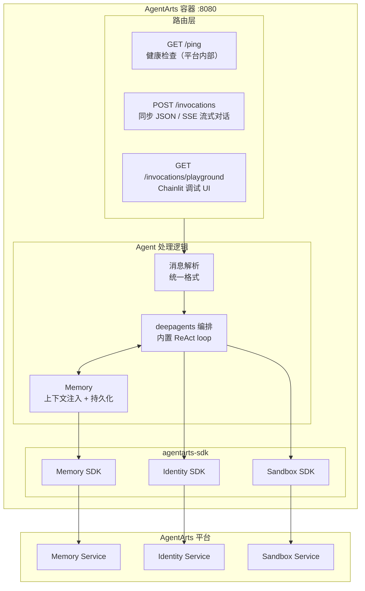

# Personal Assistant — 后端架构

> 版本：v0.1 | 状态：Draft | 关联文档：`frontend_architecture.md`

---

## 1. 概述

后端统一使用 **FastAPI** 应用，部署在 AgentArts 容器中（`:8080`）。不依赖 `AgentArtsRuntimeApp`，而是直接以标准 HTTP Server 方式暴露路由，通过 `agentarts-sdk` 调用平台能力。



---

## 2. 路由设计

### 2.1 AgentArts Gateway 路由约束

AgentArts 部署的容器通过 **AgentArts API Gateway** 接收外部请求。生产环境当前只能可靠使用 `ACCURATE_MATCH`，Gateway 仅转发 `/invocations` 精确路径；`PREFIX_MATCH` 尚未上线，不能依赖 `/invocations/*` 子路径转发。

```
浏览器/客户端 ──→ Gateway (defaultgw-xxx...) ──→ 容器 :8080
                       │
                   ACCURATE_MATCH: /invocations → ✅ 转发
                   /invocations/* 子路径 → ❌ 404 No matching policy found
```

**关键约束**：
- `/ping` 是平台内部健康检查端点，**不走 Gateway**，AgentArts 控制面直接调容器。必须保留在根路径。
- `/invocations` 是 AgentArts SDK invoke 入口，**必须保留在根路径**，也是浏览器 Web Chat 的生产流式入口。
- **所有面向外部客户端的生产调用**必须收敛到 `POST /invocations` 单一路径，通过 JSON body 字段区分同步或流式模式。
- `/invocations/playground` 仅用于本地调试；生产 Gateway 不转发该子路径。

配置方式（`.agentarts_config.yaml`）：

```yaml
runtime:
  invoke_config:
    protocol: HTTP
    port: 8080
    url_match_type: ACCURATE_MATCH  # 仅转发 /invocations 精确路径
```

### 2.2 路由表

```python
from fastapi import FastAPI, Request
from fastapi.responses import StreamingResponse

app = FastAPI()

# ── AgentArts 平台协议（AgentArts / OfficeClaw 调用入口）──

@app.get("/ping")
async def ping():
    """健康检查 — AgentArts 平台用此判断容器是否存活"""
    return {"status": "ok"}

@app.post("/invocations")
async def agent_arts_invoke(request: Request):
    """AgentArts Runtime / OfficeClaw / Web Chat 统一调用入口"""
    payload = await request.json()

    if payload.get("stream") is True:
        return StreamingResponse(
            agent_handler.handle_stream(
                message=payload.get("message", ""),
                user_id=request.headers.get("X-AgentArts-User-Id", "anonymous"),
            ),
            media_type="text/event-stream",
        )

    result = await agent_handler.handle(
        message=payload.get("message", ""),
        user_id=request.headers.get("X-AgentArts-User-Id", "anonymous"),
        session_id=request.headers.get("X-AgentArts-Session-Id"),
    )
    return {"response": result}

# ── 飞书直连 ──

@app.post("/feishu/webhook")
async def feishu_webhook(request: Request):
    """飞书事件回调 — 处理消息、卡片交互、URL 验证"""
    body = await request.json()
    # URL 验证
    if body.get("type") == "url_verification":
        return {"challenge": body["challenge"]}
    # 消息处理
    msg = parse_feishu_message(body)
    reply = await agent_handler.handle(
        message=msg["text"],
        user_id=msg["user_id"],
        session_id=msg["chat_id"],
    )
    await send_feishu_reply(body, reply)
    return {"code": 0}

# ── Web Chat OAuth（当前不通过 AgentArts Gateway 暴露）──

@app.get("/auth/callback")
async def oauth_callback(code: str):
    """OAuth 回调 — 用 code 换 JWT，设置 Cookie"""
    token = await exchange_oauth_code(code)
    response = RedirectResponse(url="/chat")
    response.set_cookie("session", token["id_token"])
    return response

# Chainlit 调试 UI（本地调试；生产 ACCURATE_MATCH Gateway 不转发该子路径）
mount_chainlit(app=app, target=..., path="/invocations/playground")
```

| 路由 | 方法 | 调用方 | 用途 | Gateway 可见 |
|------|------|--------|------|-------------|
| `/ping` | GET | AgentArts 平台（控制面） | 健康检查 | ❌ 平台内部 |
| `/invocations` | POST | AgentArts SDK / OfficeClaw / 浏览器 | `stream: false` 或未传返回 JSON；`stream: true` 返回 SSE | ✅（ACCURATE_MATCH） |
| `/invocations/playground` | GET | 浏览器 | Chainlit 调试 UI，仅本地可用 | ❌ 生产 Gateway 不转发子路径 |

> **注意**：`/feishu/webhook`、`/auth/callback` 等需要独立 URL 的路由无法通过 Gateway 暴露。这些路由对应的功能需要通过 AgentArts 平台侧 MCP Gateway 或 Identity 组件实现，或由 Web Chat 前端在浏览器侧直接处理 OAuth 流程并将结果回传。

---

## 3. Agent 处理逻辑

所有路由最终解析为统一消息格式，调用共享的 Agent 处理逻辑：

```python
from deepagents import create_deep_agent

class AgentHandler:
    """共享 Agent 处理逻辑 — 所有前端共用"""

    def __init__(self):
        from app.llm_config import get_model
        self.model = get_model()  # 默认使用 config.yaml 中 llm.default 指定的 provider
        self.agent = create_deep_agent(
            model=self.model,
            system_prompt="你是 Personal Assistant...",
            tools=[...],  # Identity SDK 装饰的工具函数
        )

    async def handle(self, message: str, user_id: str, session_id: str = None) -> str:
        result = await self.agent.ainvoke({
            "messages": [{"role": "user", "content": message}],
        })
        return result["messages"][-1].content

    async def handle_stream(self, message: str, user_id: str):
        """流式版本 — 逐 token yield"""
        async for chunk in self.agent.astream({
            "messages": [{"role": "user", "content": message}],
        }):
            yield f"data: {json.dumps({'token': chunk})}\n\n"
```

---

## 4. deepagents 编排

Agent 推理使用 deepagents，底层是 LangGraph，封装了标准 ReAct loop。无需手写 StateGraph：

```python
from deepagents import create_deep_agent

agent = create_deep_agent(
    model=model,
    system_prompt="你是 Personal Assistant...",
    tools=[...],  # Identity SDK 装饰的工具
)
```

内置能力：

- **ReAct loop** — agent 推理 → 工具调用 → 结果反馈 → 循环，由 deepagents 内置
- **conversation summarization** — 长对话自动 compact，控制 token 消耗
- **skills 系统** — SKILL.md 文件驱动，按需加载领域知识和工具使用指南
- **planning tool** — 内置 write_todos，复杂任务自动拆解（可按需关闭）
- **sub-agents** — 内置 task tool，上下文隔离执行子任务（本项目不依赖）

deepagents 是 LangGraph 的 harness，不是替代品。需要自定义图编排时可直接 drop 到 LangGraph。

---

## 5. AgentArts 平台能力集成

### 5.1 Memory（跨 Session 记忆）

```python
from agentarts.sdk.memory import MemoryClient
from agentarts.sdk.memory.session import MemorySession
from agentarts.sdk.memory.inner.config import TextMessage, MemorySearchFilter

class PersonalAssistantMemory:
    def __init__(self):
        self.space_id = os.environ["MEMORY_SPACE_ID"]

    async def get_context(self, user_id: str) -> str:
        session = MemorySession(
            space_id=self.space_id,
            actor_id=f"pa-user-{user_id}",
            assistant_id="personal-assistant"
        )
        results = session.search_long_term_memories(
            filters=MemorySearchFilter(query="user preferences", top_k=5)
        )
        return "\n".join(r["record"]["content"] for r in results.results)

    async def save(self, user_id: str, query: str, response: str):
        session = MemorySession(
            space_id=self.space_id,
            actor_id=f"pa-user-{user_id}",
            assistant_id="personal-assistant"
        )
        session.add_messages([
            TextMessage(role="user", content=query[:2000]),
            TextMessage(role="assistant", content=response[:2000]),
        ])
```

### 5.2 Identity（Outbound 认证）

通过 `agentarts.sdk.identity` 提供的装饰器，Agent 以用户委托身份调用外部服务：

```python
from agentarts.sdk import require_access_token

@require_access_token(
    provider_name="github-provider",
    scopes=["repo", "read:user"],
    auth_flow="USER_FEDERATION"
)
async def list_github_issues(owner: str, repo: str, access_token: str = None):
    async with httpx.AsyncClient() as client:
        resp = await client.get(
            f"https://api.github.com/repos/{owner}/{repo}/issues",
            headers={"Authorization": f"Bearer {access_token}"}
        )
        return resp.json()
```

支持三种 Outbound 模式：
- **USER_FEDERATION**：以用户身份调 GitHub/Microsoft 365（OAuth2）
- **M2M**：以 Agent 自身身份调企业内部 API（API Key）
- **STS**：获取云资源临时凭证（STS Token）

### 5.3 Sandbox（代码执行隔离）

```python
from agentarts.sdk.tools import SandboxClient

sandbox = SandboxClient()
result = sandbox.execute("print('hello')")
```

---

## 6. 技术栈

| 层级 | 选型 | 说明 |
|------|------|------|
| **Web 框架** | FastAPI | 替代 AgentArtsRuntimeApp，统一管理所有路由。详见 [ADR-004](ADR/ADR-004-fastapi-over-agentarts-runtime-app.md) |
| **Agent 编排** | deepagents (LangChain) | LangGraph 之上的 batteries-included harness，封装 ReAct loop + summarization + skills。详见 [ADR-009](ADR/ADR-009-deepagents.md) |
| **LLM** | 多 Provider 可配置（MaaS / DeepSeek 官方） | `config.yaml` 声明 provider，`init_chat_model()` 统一调用。默认 MaaS，可按需切换。详见 ADR-005 + ADR-011 |
| **Memory** | AgentArts Memory SDK | 短期+长期记忆，三种抽取策略 |
| **Identity** | AgentArts Identity SDK | Inbound JWT/API Key + Outbound OAuth2/M2M/STS |
| **Gateway** | AgentArts MCP Gateway | API → MCP Tool 自动转换 |
| **Sandbox** | AgentArts Sandbox SDK | 安全隔离代码执行 |
| **包管理** | uv (Astral) | 替代 pip/virtualenv，Rust 实现，uv.lock 确定性构建。详见 [ADR-010](ADR/ADR-010-astral-ecosystem-tooling.md) |
| **Lint / Format** | ruff (Astral) | 替代 flake8 + black + isort，Rust 实现，单一配置。详见 [ADR-010](ADR/ADR-010-astral-ecosystem-tooling.md) |
| **Container** | Docker (linux/arm64) | Python 3.12+。详见 [ADR-001](ADR/ADR-001-python-3.12.md) |
| **数据库** | PostgreSQL 16 | SQLAlchemy 2.0 async + asyncpg，本地 Docker Compose，生产华为云 RDS。详见 [ADR-012](ADR/ADR-012-database-postgresql.md) |

---

## 7. 项目结构

```
personal-assistant/
├── .agentarts_config.yaml          # AgentArts 部署配置
├── Dockerfile                       # ARM64 镜像
├── config.yaml                      # LLM Provider 配置（新增）
├── pyproject.toml                   # Python 依赖 + ruff 配置
├── uv.lock                           # 确定性锁文件
├── app/
│   ├── main.py                      # FastAPI 应用入口 + 路由定义
│   ├── agent_handler.py             # Agent 处理逻辑（deepagents + Identity SDK）
│   ├── llm_config.py                # LLM Provider 配置加载（新增）
│   ├── feishu_adapter.py            # 飞书消息解析 + 回复
│   ├── oauth.py                     # OAuth 流程 (Microsoft Entra ID)
│   └── tools/
│       ├── github_tools.py          # GitHub 工具 (OAuth2)
│       ├── m365_tools.py            # Microsoft 365 工具 (OAuth2)
│       ├── internal_tools.py        # 内部 API 工具 (API Key)
│       └── cloud_tools.py           # 云资源工具 (STS)
```

---

## 8. 与 AgentArtsRuntimeApp 的关系

**不使用 AgentArtsRuntimeApp。** 原因：

| AgentArtsRuntimeApp | 本方案 (FastAPI) |
|---------------------|------------------|
| 仅提供 `/ping` + `/invocations` | 可定义任意路由 |
| 不能添加 OAuth 回调 | `/auth/callback`（仅本地调试可用） |
| 不能添加 SSE 流式 | `POST /invocations` + `stream: true` |
| 不能添加飞书 Webhook | 飞书通过平台 MCP Gateway 集成 |
| `agentarts dev` 启动 | `uvicorn main:app --port 8080` |
| `agentarts launch` 自动部署 | 同样可以用 `agentarts launch` |

AgentArts 平台只看容器 `:8080` 上有没有 `/ping` 和 `/invocations`，不关心 HTTP Server 用什么框架启动。

> ⚠️ **关键限制**：虽然 FastAPI 可以定义任意路由，但 AgentArts Gateway 生产环境当前只可靠转发 `/invocations` 精确路径（`ACCURATE_MATCH`）。本地 `agentarts dev` 时所有路由可达；生产部署后外部客户端必须通过 `POST /invocations` 单一路径访问，`/invocations/*` 子路径会被 Gateway 拒绝。常见陷阱见 [AgentArts 部署 runbook §15.12](agentarts-deploy-runbook.md#1512-runtimearch-与镜像架构不一致)。
