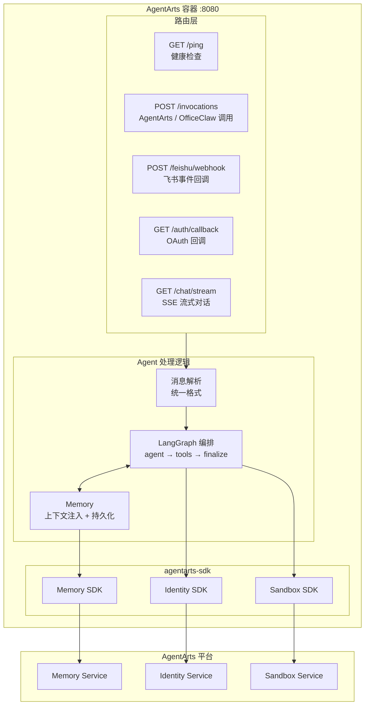
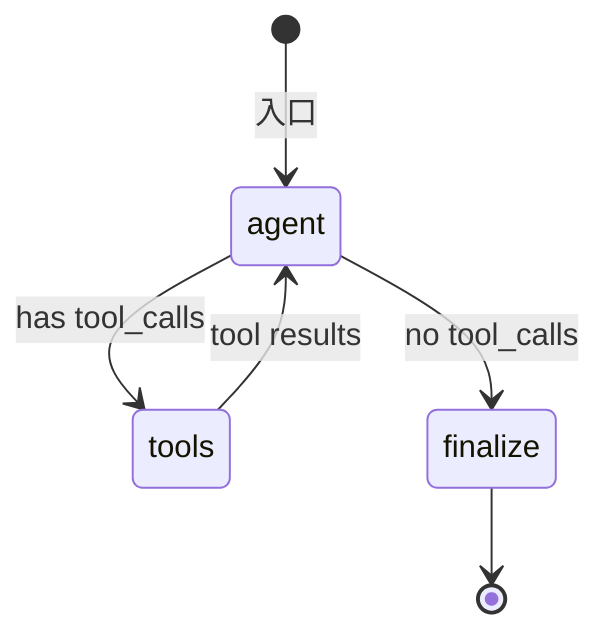

# Personal Assistant — 后端架构

> 版本：v0.1 | 状态：Draft | 关联文档：`frontend_architecture.md`

---

## 1. 概述

后端统一使用 **FastAPI** 应用，部署在 AgentArts 容器中（`:8080`）。不依赖 `AgentArtsRuntimeApp`，而是直接以标准 HTTP Server 方式暴露路由，通过 `agentarts-sdk` 调用平台能力。



---

## 2. 路由设计

```python
from fastapi import FastAPI, Request
from fastapi.responses import StreamingResponse

app = FastAPI()

# ── AgentArts 平台协议（AgentArts / OfficeClaw 调用入口）──

@app.get("/ping")
async def ping():
    """健康检查 — AgentArts 平台用此判断容器是否存活"""
    return {"status": "ok"}

@app.post("/invocations")
async def agent_arts_invoke(request: Request):
    """AgentArts Runtime / OfficeClaw 统一调用入口"""
    payload = await request.json()
    result = await agent_handler.handle(
        message=payload.get("message", ""),
        user_id=request.headers.get("X-AgentArts-User-Id"),
        session_id=request.headers.get("X-AgentArts-Session-Id"),
    )
    return {"response": result}

# ── 飞书直连 ──

@app.post("/feishu/webhook")
async def feishu_webhook(request: Request):
    """飞书事件回调 — 处理消息、卡片交互、URL 验证"""
    body = await request.json()
    # URL 验证
    if body.get("type") == "url_verification":
        return {"challenge": body["challenge"]}
    # 消息处理
    msg = parse_feishu_message(body)
    reply = await agent_handler.handle(
        message=msg["text"],
        user_id=msg["user_id"],
        session_id=msg["chat_id"],
    )
    await send_feishu_reply(body, reply)
    return {"code": 0}

# ── Web Chat ──

@app.get("/auth/callback")
async def oauth_callback(code: str):
    """Google OAuth 回调 — 用 code 换 JWT，设置 Cookie"""
    token = await exchange_google_code(code)
    response = RedirectResponse(url="/chat")
    response.set_cookie("session", token["id_token"])
    return response

@app.get("/chat/stream")
async def chat_stream(q: str, request: Request):
    """SSE 流式对话 — 给浏览器前端推送逐 token 响应"""
    user_id = get_user_from_cookie(request)
    return StreamingResponse(
        agent_handler.handle_stream(message=q, user_id=user_id),
        media_type="text/event-stream",
    )
```

| 路由 | 方法 | 调用方 | 用途 |
|------|------|--------|------|
| `/ping` | GET | AgentArts 平台 | 健康检查 |
| `/invocations` | POST | AgentArts / OfficeClaw | Agent 对话 |
| `/feishu/webhook` | POST | 飞书服务器 | 飞书事件回调 |
| `/auth/callback` | GET | 浏览器 | Google OAuth 回调 |
| `/chat/stream` | GET | 浏览器 | SSE 流式对话 |

---

## 3. Agent 处理逻辑

所有路由最终解析为统一消息格式，调用共享的 Agent 处理逻辑：

```python
class AgentHandler:
    """共享 Agent 处理逻辑 — 所有前端共用"""

    async def handle(self, message: str, user_id: str, session_id: str = None) -> str:
        memory_ctx = await self.memory.get_context(user_id)
        result = await self.graph.ainvoke({
            "messages": [HumanMessage(content=message)],
            "context": {"user_id": user_id, "memory": memory_ctx},
        })
        await self.memory.save(user_id, message, result["response"])
        return result["response"]

    async def handle_stream(self, message: str, user_id: str):
        """流式版本 — 逐 token yield"""
        memory_ctx = await self.memory.get_context(user_id)
        async for chunk in self.graph.astream({...}):
            yield f"data: {json.dumps({'token': chunk})}\n\n"
```

---

## 4. LangGraph 编排

Agent 推理使用 LangGraph StateGraph，核心三个节点：



| 节点 | 职责 |
|------|------|
| **agent** | 注入 Memory 上下文 → LLM 推理 → 决定调用工具或直接回答 |
| **tools** | ToolNode — 执行工具调用（GitHub/Google/内部API），返回结果 |
| **finalize** | 保存 Memory → 返回最终响应 |

---

## 5. AgentArts 平台能力集成

### 5.1 Memory（跨 Session 记忆）

```python
from agentarts.sdk.memory import MemoryClient
from agentarts.sdk.memory.session import MemorySession
from agentarts.sdk.memory.inner.config import TextMessage, MemorySearchFilter

class PersonalAssistantMemory:
    def __init__(self):
        self.space_id = os.environ["MEMORY_SPACE_ID"]

    async def get_context(self, user_id: str) -> str:
        session = MemorySession(
            space_id=self.space_id,
            actor_id=f"pa-user-{user_id}",
            assistant_id="personal-assistant"
        )
        results = session.search_long_term_memories(
            filters=MemorySearchFilter(query="user preferences", top_k=5)
        )
        return "\n".join(r["record"]["content"] for r in results.results)

    async def save(self, user_id: str, query: str, response: str):
        session = MemorySession(
            space_id=self.space_id,
            actor_id=f"pa-user-{user_id}",
            assistant_id="personal-assistant"
        )
        session.add_messages([
            TextMessage(role="user", content=query[:2000]),
            TextMessage(role="assistant", content=response[:2000]),
        ])
```

### 5.2 Identity（Outbound 认证）

通过 `agentarts.sdk.identity` 提供的装饰器，Agent 以用户委托身份调用外部服务：

```python
from agentarts.sdk import require_access_token

@require_access_token(
    provider_name="github-provider",
    scopes=["repo", "read:user"],
    auth_flow="USER_FEDERATION"
)
async def list_github_issues(owner: str, repo: str, access_token: str = None):
    async with httpx.AsyncClient() as client:
        resp = await client.get(
            f"https://api.github.com/repos/{owner}/{repo}/issues",
            headers={"Authorization": f"Bearer {access_token}"}
        )
        return resp.json()
```

支持三种 Outbound 模式：
- **USER_FEDERATION**：以用户身份调 GitHub/Google（OAuth2）
- **M2M**：以 Agent 自身身份调企业内部 API（API Key）
- **STS**：获取云资源临时凭证（STS Token）

### 5.3 Sandbox（代码执行隔离）

```python
from agentarts.sdk.tools import SandboxClient

sandbox = SandboxClient()
result = sandbox.execute("print('hello')")
```

---

## 6. 技术栈

| 层级 | 选型 | 说明 |
|------|------|------|
| **Web 框架** | FastAPI | 替代 AgentArtsRuntimeApp，统一管理所有路由 |
| **Agent 编排** | LangGraph (Python) | 有状态图编排，支持条件路由和工具调用循环 |
| **LLM** | DeepSeek-V3.2 (via MaaS) | OpenAI-compatible API |
| **Memory** | AgentArts Memory SDK | 短期+长期记忆，三种抽取策略 |
| **Identity** | AgentArts Identity SDK | Inbound JWT/API Key + Outbound OAuth2/M2M/STS |
| **Gateway** | AgentArts MCP Gateway | API → MCP Tool 自动转换 |
| **Sandbox** | AgentArts Sandbox SDK | 安全隔离代码执行 |
| **Container** | Docker (linux/arm64) | Python 3.10+ |

---

## 7. 项目结构

```
personal-assistant/
├── .agentarts_config.yaml          # AgentArts 部署配置
├── Dockerfile                       # ARM64 镜像
├── requirements.txt                 # Python 依赖
├── app/
│   ├── main.py                      # FastAPI 应用入口 + 路由定义
│   ├── agent_handler.py             # 共享 Agent 处理逻辑
│   ├── graph.py                     # LangGraph 编排定义
│   ├── memory.py                    # Memory 集成
│   ├── feishu_adapter.py            # 飞书消息解析 + 回复
│   ├── oauth.py                     # Google OAuth 流程
│   └── tools/
│       ├── github_tools.py          # GitHub 工具 (OAuth2)
│       ├── google_tools.py          # Google 工具 (OAuth2)
│       ├── internal_tools.py        # 内部 API 工具 (API Key)
│       └── cloud_tools.py           # 云资源工具 (STS)
```

---

## 8. 与 AgentArtsRuntimeApp 的关系

**不使用 AgentArtsRuntimeApp。** 原因：

| AgentArtsRuntimeApp | 本方案 (FastAPI) |
|---------------------|------------------|
| 仅提供 `/ping` + `/invocations` | 自由定义任意路由 |
| 不能添加 OAuth 回调 | `/auth/callback` |
| 不能添加 SSE 流式 | `/chat/stream` |
| 不能添加飞书 Webhook | `/feishu/webhook` |
| `agentarts dev` 启动 | `uvicorn main:app --port 8080` |
| `agentarts launch` 自动部署 | 同样可以用 `agentarts launch` |

AgentArts 平台只看容器 `:8080` 上有没有 `/ping` 和 `/invocations`，不关心 HTTP Server 用什么框架启动。FastAPI 完全可以替代 AgentArtsRuntimeApp。
