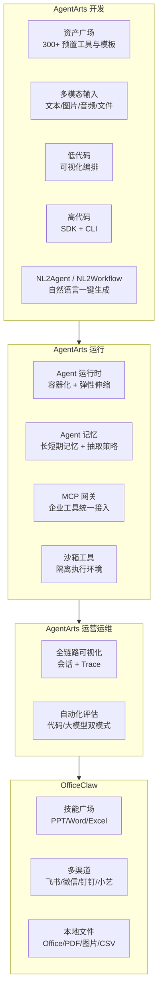
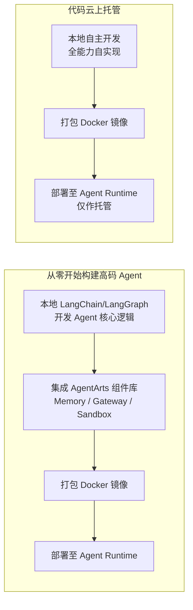
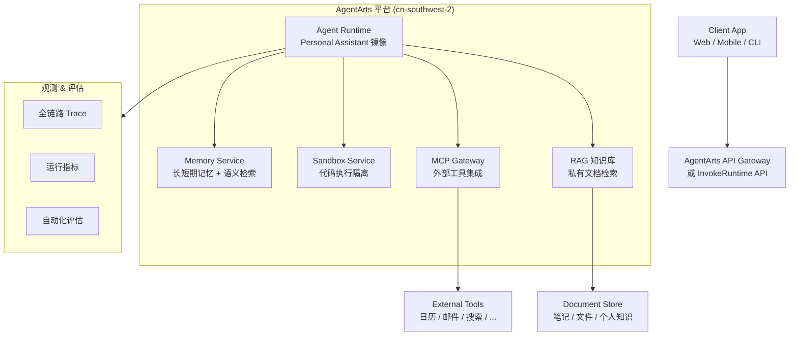

# AgentArts (智果) 智能体平台 - 开发参考

> 信息来源：华为云官方文档，最后更新于 2026-06-02
> 本文档用于 Personal Assistant 基于 AgentArts 平台开发的架构参考。

---

## 1. 产品概述

AgentArts 是华为云推出的**企业级一站式智能体构建与运营平台**，覆盖 Agent 全生命周期（开发 → 部署 → 观测），支持高代码与低代码两种开发范式。

### 核心能力

| 能力域 | 说明 |
|--------|------|
| **灵活编排** | 单 Agent、工作流（Workflow）及多 Agent 协作模式 |
| **多模型支持** | 内置 DeepSeek、Qwen、Kimi 等模型，支持 OpenAI 兼容 API 接入自定义模型 |
| **RAG 知识库** | 多格式文档导入（Word/PDF/PPT/PNG）、混合检索（关键词+向量+Re-rank） |
| **插件/MCP 生态** | 内置插件广场、MCP 广场；支持自定义 API 封装为 MCP Server |
| **Workflow 引擎** | 可视化拖拽画布，支持 LLM/Code/逻辑/工具/HTTP/知识库检索等节点 |
| **Memory** | 长短期记忆、分级存储、内置记忆抽取策略（semantic/user_preference/episodic） |
| **Sandbox** | 安全隔离代码执行环境 |
| **MCP Gateway** | 统一 API→MCP 协议转换中枢，集成企业工具 |
| **观测 & 评估** | 全链路 Trace、会话分析、40+ 预置评估器 |
| **Agent Runtime** | 容器化部署、10ms 冷启动弹性伸缩、进程级隔离、IAM 鉴权 |
| **OfficeClaw** | PC 客户端（PPT/Excel/Word Skill），支持飞书/微信/钉钉/小艺多渠道接入 |

### 产品架构



---

## 2. 访问方式

| 方式 | 入口 | 用途 |
|------|------|------|
| **管理控制台** | `https://console.huaweicloud.com/agentarts/` | Web 端可视化管理 |
| **REST API** | 不同功能有不同终端节点（见下文） | 第三方系统集成、二次开发 |
| **Python SDK** | `pip install agentarts-sdk` | 高代码本地开发 |
| **CLI** | `agentarts init/dev/launch/invoke` | 命令行全流程管理 |
| **GitHub** | `https://github.com/huaweicloud/agentarts-sdk-python` | SDK 源码（v0.1.2, Python 3.10+） |

### API 终端节点

| 类型 | 子类型 | 域名 |
|------|--------|------|
| 低代码 | 工作流/智能体调用 | 从控制台「智能体运行时」详情页获取 |
| 运营运维 | 观测 | `agentarts.cn-southwest-2.myhuaweicloud.com` |
| 运营运维 | 评估 | `agentarts.cn-southwest-2.myhuaweicloud.com` |
| 高代码 | 运行时管理 | `agentarts.cn-southwest-2.myhuaweicloud.com` |
| 高代码 | 网关/沙箱工具 | `agentarts.cn-southwest-2.myhuaweicloud.com` |
| 高代码 | 运行时执行 | 从控制台「智能体运行时」详情页获取访问域名 |
| 高代码 | 沙箱数据面 | 从「组件库 > 沙箱工具」详情页获取域名 |

**部署 Region**：`cn-southwest-2`（西南贵阳一）

---

## 3. 高代码开发路径（Personal Assistant 首选）

### 3.1 两种开发模式



对于 Personal Assistant，推荐**从零开始构建高码 Agent**模式，充分利用平台提供的 Memory、MCP Gateway、Sandbox 等能力组件。

### 3.2 开发流程

1. **本地构建 Agent** — 使用 LangChain/LangGraph 开发
2. **集成组件库** — Memory（记忆）、Gateway（MCP 网关）、Sandbox（沙箱）
3. **部署 Runtime** — `agentarts launch` 一键构建镜像并部署
4. **观测 Agent** — 全链路 Trace、日志监控

---

## 4. AgentArts SDK 详解

### 4.1 安装与环境

```bash
# Python 3.10+, Linux ARM64
pip install agentarts-sdk
pip install -U langchain langgraph

# 配置认证
export HUAWEICLOUD_SDK_AK="your-ak"
export HUAWEICLOUD_SDK_SK="your-sk"
```

### 4.2 SDK 子模块

| 模块 | 用途 | 文档 |
|------|------|------|
| **Runtime SDK** | 部署和管理 Agent 运行时 | `agentarts.sdk` |
| **Tools SDK** | 集成沙箱代码执行工具 | `agentarts.sdk.tools` |
| **Memory SDK** | Agent 记忆创建、检索、管理 | `agentarts.sdk.memory` |
| **Identity SDK** | 身份认证与访问管理 | `agentarts.sdk.identity` |
| **MCP Gateway SDK** | MCP 协议网关管理 | `agentarts.sdk.gateway` |

### 4.3 CLI 命令

| 命令 | 说明 |
|------|------|
| `agentarts init -n <name> -t langgraph` | 初始化 LangGraph 项目 |
| `agentarts dev` | 启动本地开发服务（监听 8080） |
| `agentarts launch` | 构建镜像并部署到云端 Runtime |
| `agentarts invoke '{"message":"xx"}'` | 调用云端部署的 Agent |
| `agentarts config` | 交互式配置（Region/SWR/依赖等） |

### 4.4 项目结构

```
my_agent/
├── .agentarts_config.yaml  # 项目配置文件
├── agent.py                # Agent 核心业务代码
├── Dockerfile              # 云端部署镜像构建
└── requirements.txt        # Python 依赖
```

### 4.5 Runtime 应用框架

每个 Agent Runtime 应用需定义一个 entrypoint 函数，接收 payload 并返回 response：

```python
from agentarts.sdk import AgentArtsRuntimeApp, RequestContext

app = AgentArtsRuntimeApp()

@app.entrypoint
async def handler(payload: Dict[str, Any], context: RequestContext = None) -> Dict[str, Any]:
    query = payload.get("message", "")
    # 核心逻辑...
    return {"response": result}

if __name__ == "__main__":
    app.run()
```

**HTTP 端点**（本地 `agentarts dev` 启动后）：
- `GET /ping` — 健康检查
- `POST /invocations` — Agent 对话调用

---

## 5. Memory SDK 详解

Memory SDK 是 Personal Assistant 最关键的组件之一，提供长短期记忆和多种抽取策略。

### 5.1 概念模型

```
Space (记忆空间) → Session (会话) → Message (消息) → Memory (记忆)
```

- **Space**：顶层隔离单元，包含 API Key 和记忆策略配置
- **Session**：一次对话会话，绑定 actor_id 和 assistant_id
- **Message**：对话消息（TextMessage / ToolCallMessage / ToolResultMessage）
- **Memory**：由系统从消息中自动抽取的记忆条目

### 5.2 内置记忆策略

| 策略类型 | 说明 |
|----------|------|
| `semantic` | 语义记忆 — 提取关键语义信息 |
| `user_preference` | 用户偏好 — 学习用户习惯与偏好 |
| `episodic` | 情景记忆 — 记录事件与经历 |

### 5.3 两种使用模式

| 模式 | 特点 | 适用场景 |
|------|------|----------|
| **Client 模式** | 完整控制权，手动管理 Space/Session/Message | 复杂应用，需精细管控 |
| **Session 模式** | 绑定会话，自动管理上下文 | 单用户/对话场景，快速集成 |

### 5.4 认证体系

| 类型 | 认证方式 | 用途 |
|------|----------|------|
| **控制面（管理面）** | AK/SK (`HUAWEICLOUD_SDK_AK`/`HUAWEICLOUD_SDK_SK`) | 创建/删除 Space |
| **数据面** | API Key (`HUAWEICLOUD_SDK_MEMORY_API_KEY`) | 读写消息、查询记忆 |

> API Key 在创建 Space 时返回，仅此时可见，需妥善保存。

### 5.5 Client 模式代码示例

```python
from agentarts.sdk.memory import MemoryClient
from agentarts.sdk.memory.inner.config import TextMessage, MemorySearchFilter

# 1. 创建 Memory Space
with MemoryClient() as client:
    space = client.create_space(
        name="personal-assistant-memory",
        message_ttl_hours=168,
        description="Personal Assistant 记忆空间",
        memory_strategies_builtin=["semantic", "user_preference", "episodic"]
    )
    space_id = space.id
    # 保存 API Key（仅此时返回）
    os.environ["HUAWEICLOUD_SDK_MEMORY_API_KEY"] = space.api_key

    # 2. 创建会话
    session_data = client.create_memory_session(
        space_id=space_id,
        actor_id="user-001",
        assistant_id="personal-assistant"
    )
    session_id = session_data.id

    # 3. 发送对话消息
    messages = [
        TextMessage(role="user", content="我偏好简洁的回答风格", actor_id="user-001"),
        TextMessage(role="assistant", content="好的，我会保持简洁", actor_id="personal-assistant"),
    ]
    client.add_messages(space_id=space_id, session_id=session_id, messages=messages)

    # 4. 搜索记忆（语义检索）
    results = client.search_memories(
        space_id=space_id,
        filters=MemorySearchFilter(query="回答风格", top_k=5)
    )
```

### 5.6 Session 模式代码示例

```python
from agentarts.sdk.memory import MemoryClient
from agentarts.sdk.memory.session import MemorySession
from agentarts.sdk.memory.inner.config import TextMessage, MemorySearchFilter

with MemoryClient() as client:
    space = client.create_space(
        name="session-mode-space",
        message_ttl_hours=168,
        memory_strategies_builtin=["semantic", "user_preference"]
    )

    # 绑定会话
    session = MemorySession(
        space_id=space.id,
        actor_id="user-001",
        assistant_id="personal-assistant"
    )

    # 发送消息（自动绑定到当前会话）
    messages = [
        TextMessage(role="user", content="我喜欢用 Python 做数据分析"),
        TextMessage(role="assistant", content="Python 是数据分析的首选语言"),
    ]
    session.add_messages(messages)

    # 查询会话中的记忆
    memories = session.list_memories(limit=10)

    # 语义搜索
    results = session.search_memories(
        filters=MemorySearchFilter(query="数据分析", top_k=3)
    )
```

### 5.7 类型化返回值

| 返回类型 | 说明 | 主要属性 |
|----------|------|----------|
| `SpaceInfo` | Space 信息 | `id`, `name`, `api_key`, `api_key_id`, `status` |
| `SessionInfo` | Session 信息 | `id`, `space_id`, `actor_id`, `assistant_id` |
| `MessageInfo` | 消息信息 | `id`, `session_id`, `role`, `parts`, `actor_id` |
| `MemoryInfo` | 记忆信息 | `id`, `space_id`, `content`, `strategy_type`, `strategy_id` |
| `MemorySearchResponse` | 搜索结果 | `results`（含 `record` 和 `score`）, `total`, `query` |

---

## 6. Agent Runtime 配置

### 6.1 配置文件 `agentarts_config.yaml`

```yaml
default_agent: my-agent
agents:
  my-agent:
    base:
      name: my-agent
      entrypoint: agent:app
      dependency_file: requirements.txt
      platform: linux/arm64        # 必须 ARM64
      language: python3
      base_image: python:3.12-slim
      region: cn-southwest-2

    swr_config:
      organization: agentarts-org1
      repository: agent_my-agent
      organization_auto_create: true
      repository_auto_create: true

    runtime:
      invoke_config:
        protocol: HTTP
        port: 8080
        url_match_type: PREFIX_MATCH  # ACCURATE_MATCH（默认，仅 /invocations）| PREFIX_MATCH（/invocations/*）
      arch: arm64                      # 必须与 base.platform 一致！默认 x86_64 会导致容器启动失败

      network_config:
        network_mode: PUBLIC

      identity_configuration:
        authorizer_type: IAM
        authorizer_configuration:
          key_auth:
            api_keys: []

      observability:
        tracing:
          enabled: false
        metrics:
          enabled: false
        logs:
          enabled: false

      environment_variables:
        - key: MODEL_API_KEY
          value: "<MaaS API Key>"
        - key: MODEL_NAME
          value: "deepseek-v4-pro"
        - key: MODEL_URL
          value: "https://api.modelarts-maas.com/openai/v1"
```

### 6.2 Runtime 特性

- **进程级隔离**：每个 Agent 独立容器运行
- **弹性伸缩**：支持基于 QPS/并发的自动扩缩容，10ms 冷启动
- **安全围栏**：Guard 安全围栏 + 敏感词过滤 + 内容合规检测
- **IAM 集成**：支持 IAM 鉴权、自定义 JWT、API Key 认证
- **网络模式**：支持 PUBLIC / VPC 网络配置
- **灰度发布**：支持多版本管理

---

## 7. Personal Assistant 技术方案

### 7.1 架构总览



### 7.2 核心组件集成方案

| 组件 | 用途（Personal Assistant） | 集成方式 |
|------|---------------------------|----------|
| **Memory** | 记忆用户偏好、历史交互、个人事实 | Memory SDK (Client 模式) |
| **RAG 知识库** | 个人笔记、文档、知识检索 | 控制台上传文档 / API 导入 |
| **MCP Gateway** | 集成日历、邮件、天气等外部 API | 控制台配置 MCP Server |
| **Sandbox** | 安全执行用户请求的代码/脚本 | Tools SDK |
| **Runtime** | 托管 Personal Assistant 核心逻辑 | `agentarts launch` 部署 |
| **观测** | 监控运行状态、对话质量 | 控制台或 API |

### 7.3 开发步骤

1. **初始化项目**
   ```bash
   agentarts init -n personal-assistant -t langgraph
   cd personal-assistant
   ```

2. **实现核心 Agent 逻辑**（`agent.py`）
   - 基于 LangGraph 构建对话流程
   - 集成 Memory SDK 实现个性化记忆
   - 集成 MCP Gateway 调用外部工具
   - 集成 RAG 检索个人知识库

3. **本地调试**
   ```bash
   agentarts dev
   curl -X POST http://localhost:8080/invocations -H 'Content-Type: application/json' -d '{"message":"你好"}'
   ```

4. **部署上线**
   ```bash
   agentarts launch
   ```

5. **调用云端 Agent**
   ```bash
   agentarts invoke '{"message": "帮我查一下明天的日程"}'
   ```
   或通过 InvokeRuntime API 从客户端应用调用。

---

## 8. 参考文档索引

| 文档 | 链接 |
|------|------|
| 产品介绍（概述） | `https://support.huaweicloud.com/productdesc-agentarts/agentarts_03_0002.html` |
| 高代码开发概述 | `https://support.huaweicloud.com/highcode-agentarts/agentarts_10_001.html` |
| 高代码开发流程 | `https://support.huaweicloud.com/highcode-agentarts/agentarts_10_002.html` |
| 首个高码智能体示例 | `https://support.huaweicloud.com/highcode-agentarts/agentarts_10_003.html` |
| 集成组件库 | `https://support.huaweicloud.com/highcode-agentarts/agentarts_10_006.html` |
| 部署智能体运行时 | `https://support.huaweicloud.com/highcode-agentarts/agentarts_10_028.html` |
| 观测智能体 | `https://support.huaweicloud.com/highcode-agentarts/agentarts_10_034.html` |
| SDK 快速开始 | `https://support.huaweicloud.com/highcode-agentarts/agentarts_10_040.html` |
| SDK 应用框架 | `https://support.huaweicloud.com/highcode-agentarts/agentarts_10_038.html` |
| Memory SDK | `https://support.huaweicloud.com/highcode-agentarts/agentarts_10_043.html` |
| Tools SDK | `https://support.huaweicloud.com/highcode-agentarts/agentarts_10_042.html` |
| Identity SDK | `https://support.huaweicloud.com/highcode-agentarts/agentarts_10_044.html` |
| MCP Gateway SDK | `https://support.huaweicloud.com/highcode-agentarts/agentarts_10_045.html` |
| CLI 参考 | `https://support.huaweicloud.com/highcode-agentarts/agentarts_10_039.html` |
| 认证鉴权 | `https://support.huaweicloud.com/highcode-agentarts/agentarts_10_047.html` |
| API 概览 | `https://support.huaweicloud.com/api-agentarts/agentarts_07_0002.html` |
| 产品主页 | `https://www.huaweicloud.com/product/agentarts.html` |
| SDK 源码 (GitHub) | `https://github.com/huaweicloud/agentarts-sdk-python` |
| 管理控制台 | `https://console.huaweicloud.com/agentarts/` |

---

## 9. 注意事项

- 部署 Agent 必须使用 **ARM64 架构**（`linux/arm64`），X86 镜像调用 Runtime 会失败。
- 部署 Region 仅支持 **cn-southwest-2**（西南贵阳一）。
- Python 版本需 **≥3.10**。
- Docker 版本需 **≥18.06**。
- SWR 不支持 OCI 镜像（Docker 27+ 需设置 `export BUILDKIT_USE_OCI_MEDIA_TYPES=0`）。
- **Runtime 架构**：`runtime.arch` 默认值为 `x86_64`。部署 ARM64 镜像必须显式设为 `arm64`，否则容器调度到 x86 节点会静默失败（`stdout="" stderr=""`，无任何日志输出）。
- **Gateway 路由**：AgentArts API Gateway 默认 `url_match_type: ACCURATE_MATCH`，仅转发 `/invocations`。需显式设为 `PREFIX_MATCH` 才能转发 `/invocations/*` 子路径。Gateway 不支持自定义路由表或 wildcard。
- Memory Space 创建后 API Key 仅返回一次，务必保存。
- 记忆生成有延迟（文档示例中使用 30s 等待）。
- 使用 IAM 子账号时需确保有 SWR FullAccess 权限。
