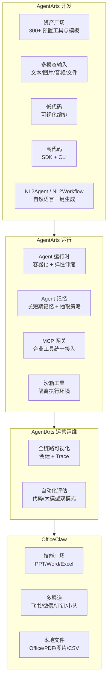
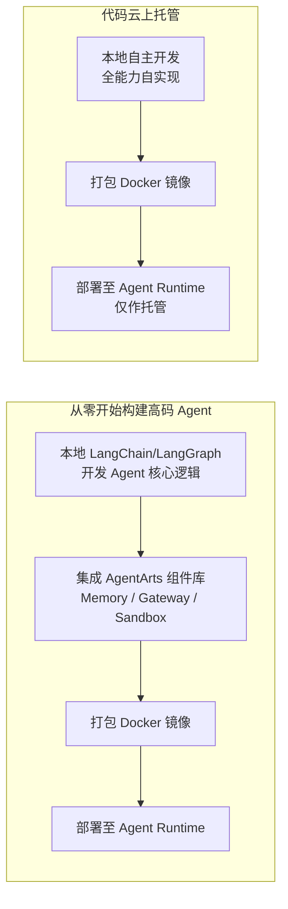
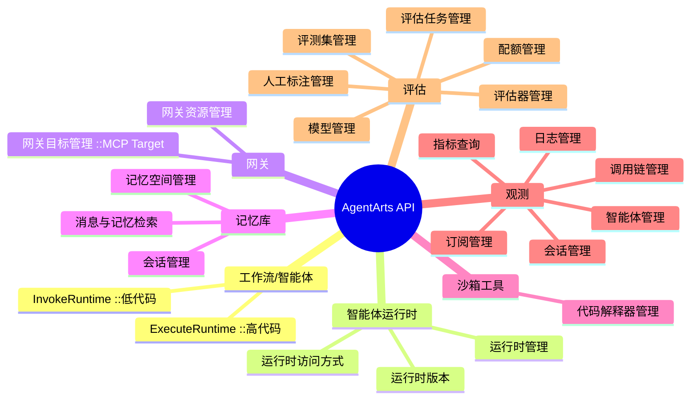
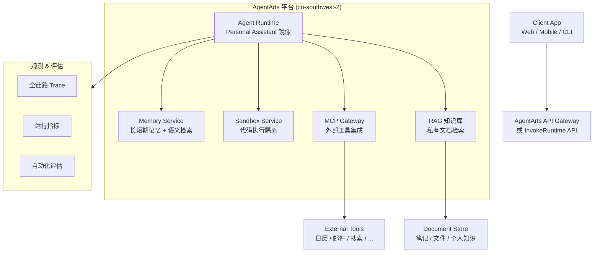
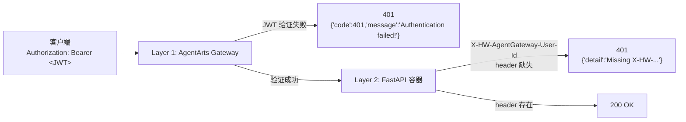
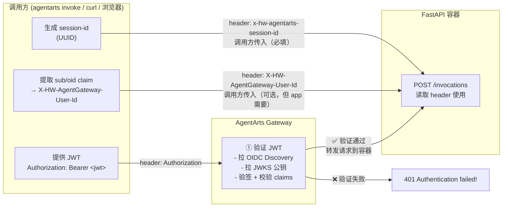
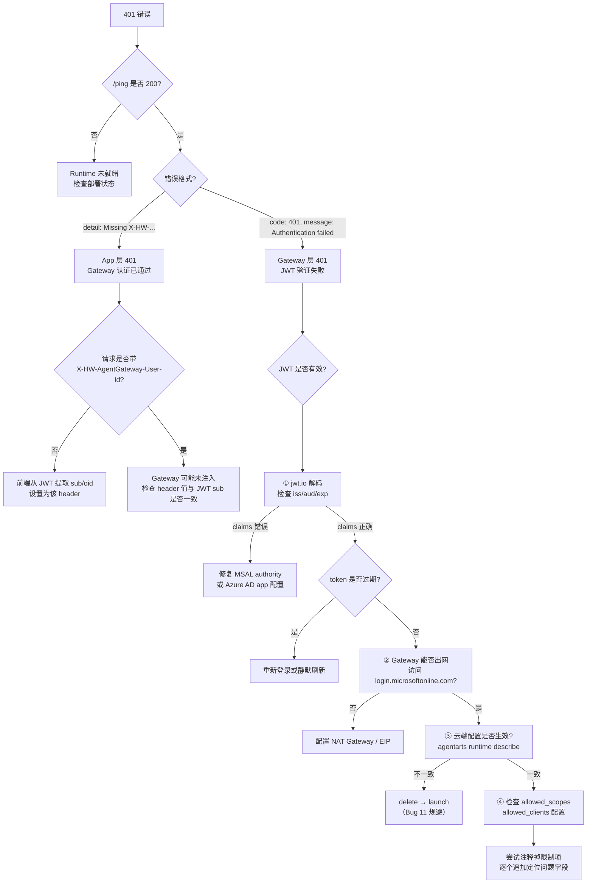

# AgentArts (智果) 智能体平台 - 开发参考

> 信息来源：华为云官方文档，最后更新于 2026-06-02
> 本文档用于 Personal Assistant 基于 AgentArts 平台开发的架构参考。

---

## 1. 产品概述

AgentArts 是华为云推出的**企业级一站式智能体构建与运营平台**，覆盖 Agent 全生命周期（开发 → 部署 → 观测），支持高代码与低代码两种开发范式。

### 核心能力

| 能力域 | 说明 |
|--------|------|
| **灵活编排** | 单 Agent、工作流（Workflow）及多 Agent 协作模式 |
| **多模型支持** | 内置 DeepSeek、Qwen、Kimi 等模型，支持 OpenAI 兼容 API 接入自定义模型 |
| **RAG 知识库** | 多格式文档导入（Word/PDF/PPT/PNG）、混合检索（关键词+向量+Re-rank） |
| **插件/MCP 生态** | 内置插件广场、MCP 广场；支持自定义 API 封装为 MCP Server |
| **Workflow 引擎** | 可视化拖拽画布，支持 LLM/Code/逻辑/工具/HTTP/知识库检索等节点 |
| **Memory** | 长短期记忆、分级存储、内置记忆抽取策略（semantic/user_preference/episodic） |
| **Sandbox** | 安全隔离代码执行环境 |
| **MCP Gateway** | 统一 API→MCP 协议转换中枢，集成企业工具 |
| **观测 & 评估** | 全链路 Trace、会话分析、40+ 预置评估器 |
| **Agent Runtime** | 容器化部署、10ms 冷启动弹性伸缩、进程级隔离、IAM 鉴权 |
| **OfficeClaw** | PC 客户端（PPT/Excel/Word Skill），支持飞书/微信/钉钉/小艺多渠道接入 |

### 产品架构



---

## 2. 访问方式

| 方式 | 入口 | 用途 |
|------|------|------|
| **管理控制台** | `https://console.huaweicloud.com/agentarts/` | Web 端可视化管理 |
| **REST API** | 不同功能有不同终端节点（见下文） | 第三方系统集成、二次开发 |
| **Python SDK** | `pip install agentarts-sdk` | 高代码本地开发 |
| **CLI** | `agentarts init/dev/launch/invoke` | 命令行全流程管理 |
| **GitHub** | `https://github.com/huaweicloud/agentarts-sdk-python` | SDK 源码（v0.1.2, Python 3.10+） |

### API 终端节点

| 类型 | 子类型 | 域名 |
|------|--------|------|
| 低代码 | 工作流/智能体调用 | 从控制台「智能体运行时」详情页获取 |
| 运营运维 | 观测 | `agentarts.cn-southwest-2.myhuaweicloud.com` |
| 运营运维 | 评估 | `agentarts.cn-southwest-2.myhuaweicloud.com` |
| 高代码 | 运行时管理 | `agentarts.cn-southwest-2.myhuaweicloud.com` |
| 高代码 | 网关/沙箱工具 | `agentarts.cn-southwest-2.myhuaweicloud.com` |
| 高代码 | 运行时执行 | 从控制台「智能体运行时」详情页获取访问域名 |
| 高代码 | 沙箱数据面 | 从「组件库 > 沙箱工具」详情页获取域名 |

**部署 Region**：`cn-southwest-2`（西南贵阳一）

---

## 3. 高代码开发路径（Personal Assistant 首选）

### 3.1 两种开发模式



对于 Personal Assistant，推荐**从零开始构建高码 Agent**模式，充分利用平台提供的 Memory、MCP Gateway、Sandbox 等能力组件。

### 3.2 开发流程

1. **本地构建 Agent** — 使用 LangChain/LangGraph 开发
2. **集成组件库** — Memory（记忆）、Gateway（MCP 网关）、Sandbox（沙箱）
3. **部署 Runtime** — `agentarts launch` 一键构建镜像并部署
4. **观测 Agent** — 全链路 Trace、日志监控

---

## 4. AgentArts SDK 详解

### 4.1 安装与环境

```bash
# Python 3.10+, Linux ARM64
pip install agentarts-sdk
pip install -U langchain langgraph

# 配置认证
export HUAWEICLOUD_SDK_AK="your-ak"
export HUAWEICLOUD_SDK_SK="your-sk"
```

### 4.2 SDK 子模块

| 模块 | 用途 | 文档 |
|------|------|------|
| **Runtime SDK** | 部署和管理 Agent 运行时 | `agentarts.sdk` |
| **Tools SDK** | 集成沙箱代码执行工具 | `agentarts.sdk.tools` |
| **Memory SDK** | Agent 记忆创建、检索、管理 | `agentarts.sdk.memory` |
| **Identity SDK** | 身份认证与访问管理 | `agentarts.sdk.identity` |
| **MCP Gateway SDK** | MCP 协议网关管理 | `agentarts.sdk.gateway` |

### 4.3 CLI 命令

| 命令 | 说明 |
|------|------|
| `agentarts init -n <name> -t langgraph` | 初始化 LangGraph 项目 |
| `agentarts dev` | 启动本地开发服务（监听 8080） |
| `agentarts launch` | 构建镜像并部署到云端 Runtime |
| `agentarts invoke '{"message":"xx"}'` | 调用云端部署的 Agent |
| `agentarts config` | 交互式配置（Region/SWR/依赖等） |

### 4.4 项目结构

```
my_agent/
├── .agentarts_config.yaml  # 项目配置文件
├── agent.py                # Agent 核心业务代码
├── Dockerfile              # 云端部署镜像构建
└── requirements.txt        # Python 依赖
```

### 4.5 Runtime 应用框架

每个 Agent Runtime 应用需定义一个 entrypoint 函数，接收 payload 并返回 response：

```python
from agentarts.sdk import AgentArtsRuntimeApp, RequestContext

app = AgentArtsRuntimeApp()

@app.entrypoint
async def handler(payload: Dict[str, Any], context: RequestContext = None) -> Dict[str, Any]:
    query = payload.get("message", "")
    # 核心逻辑...
    return {"response": result}

if __name__ == "__main__":
    app.run()
```

**HTTP 端点**（本地 `agentarts dev` 启动后）：
- `GET /ping` — 健康检查
- `POST /invocations` — Agent 对话调用

---

## 5. Memory SDK 详解

Memory SDK 是 Personal Assistant 最关键的组件之一，提供长短期记忆和多种抽取策略。

### 5.1 概念模型

```
Space (记忆空间) → Session (会话) → Message (消息) → Memory (记忆)
```

- **Space**：顶层隔离单元，包含 API Key 和记忆策略配置
- **Session**：一次对话会话，绑定 actor_id 和 assistant_id
- **Message**：对话消息（TextMessage / ToolCallMessage / ToolResultMessage）
- **Memory**：由系统从消息中自动抽取的记忆条目

### 5.2 内置记忆策略

| 策略类型 | 说明 |
|----------|------|
| `semantic` | 语义记忆 — 提取关键语义信息 |
| `user_preference` | 用户偏好 — 学习用户习惯与偏好 |
| `episodic` | 情景记忆 — 记录事件与经历 |

### 5.3 两种使用模式

| 模式 | 特点 | 适用场景 |
|------|------|----------|
| **Client 模式** | 完整控制权，手动管理 Space/Session/Message | 复杂应用，需精细管控 |
| **Session 模式** | 绑定会话，自动管理上下文 | 单用户/对话场景，快速集成 |

### 5.4 认证体系

| 类型 | 认证方式 | 用途 |
|------|----------|------|
| **控制面（管理面）** | AK/SK (`HUAWEICLOUD_SDK_AK`/`HUAWEICLOUD_SDK_SK`) | 创建/删除 Space |
| **数据面** | API Key (`HUAWEICLOUD_SDK_MEMORY_API_KEY`) | 读写消息、查询记忆 |

> API Key 在创建 Space 时返回，仅此时可见，需妥善保存。

### 5.5 Client 模式代码示例

```python
from agentarts.sdk.memory import MemoryClient
from agentarts.sdk.memory.inner.config import TextMessage, MemorySearchFilter

# 1. 创建 Memory Space
with MemoryClient() as client:
    space = client.create_space(
        name="personal-assistant-memory",
        message_ttl_hours=168,
        description="Personal Assistant 记忆空间",
        memory_strategies_builtin=["semantic", "user_preference", "episodic"]
    )
    space_id = space.id
    # 保存 API Key（仅此时返回）
    os.environ["HUAWEICLOUD_SDK_MEMORY_API_KEY"] = space.api_key

    # 2. 创建会话
    session_data = client.create_memory_session(
        space_id=space_id,
        actor_id="user-001",
        assistant_id="personal-assistant"
    )
    session_id = session_data.id

    # 3. 发送对话消息
    messages = [
        TextMessage(role="user", content="我偏好简洁的回答风格", actor_id="user-001"),
        TextMessage(role="assistant", content="好的，我会保持简洁", actor_id="personal-assistant"),
    ]
    client.add_messages(space_id=space_id, session_id=session_id, messages=messages)

    # 4. 搜索记忆（语义检索）
    results = client.search_memories(
        space_id=space_id,
        filters=MemorySearchFilter(query="回答风格", top_k=5)
    )
```

### 5.6 Session 模式代码示例

```python
from agentarts.sdk.memory import MemoryClient
from agentarts.sdk.memory.session import MemorySession
from agentarts.sdk.memory.inner.config import TextMessage, MemorySearchFilter

with MemoryClient() as client:
    space = client.create_space(
        name="session-mode-space",
        message_ttl_hours=168,
        memory_strategies_builtin=["semantic", "user_preference"]
    )

    # 绑定会话
    session = MemorySession(
        space_id=space.id,
        actor_id="user-001",
        assistant_id="personal-assistant"
    )

    # 发送消息（自动绑定到当前会话）
    messages = [
        TextMessage(role="user", content="我喜欢用 Python 做数据分析"),
        TextMessage(role="assistant", content="Python 是数据分析的首选语言"),
    ]
    session.add_messages(messages)

    # 查询会话中的记忆
    memories = session.list_memories(limit=10)

    # 语义搜索
    results = session.search_memories(
        filters=MemorySearchFilter(query="数据分析", top_k=3)
    )
```

### 5.7 类型化返回值

| 返回类型 | 说明 | 主要属性 |
|----------|------|----------|
| `SpaceInfo` | Space 信息 | `id`, `name`, `api_key`, `api_key_id`, `status` |
| `SessionInfo` | Session 信息 | `id`, `space_id`, `actor_id`, `assistant_id` |
| `MessageInfo` | 消息信息 | `id`, `session_id`, `role`, `parts`, `actor_id` |
| `MemoryInfo` | 记忆信息 | `id`, `space_id`, `content`, `strategy_type`, `strategy_id` |
| `MemorySearchResponse` | 搜索结果 | `results`（含 `record` 和 `score`）, `total`, `query` |

---

## 6. Agent Runtime 配置

### 6.1 配置文件 `agentarts_config.yaml`

```yaml
default_agent: my-agent
agents:
  my-agent:
    base:
      name: my-agent
      entrypoint: agent:app
      dependency_file: requirements.txt
      platform: linux/arm64        # 必须 ARM64
      language: python3
      base_image: python:3.12-slim
      region: cn-southwest-2

    swr_config:
      organization: agentarts-org1
      repository: agent_my-agent
      organization_auto_create: true
      repository_auto_create: true

    runtime:
      invoke_config:
        protocol: HTTP
        port: 8080
        url_match_type: PREFIX_MATCH  # ACCURATE_MATCH（默认，仅 /invocations）| PREFIX_MATCH（/invocations/*）
      arch: arm64                      # 必须与 base.platform 一致！默认 x86_64 会导致容器启动失败

      network_config:
        network_mode: PUBLIC

      identity_configuration:
        authorizer_type: IAM
        authorizer_configuration:
          key_auth:
            api_keys: []

      observability:
        tracing:
          enabled: false
        metrics:
          enabled: false
        logs:
          enabled: false

      environment_variables:
        - key: MODEL_API_KEY
          value: "<MaaS API Key>"
        - key: MODEL_NAME
          value: "deepseek-v4-pro"
        - key: MODEL_URL
          value: "https://api.modelarts-maas.com/openai/v1"
```

### 6.2 Runtime 特性

- **进程级隔离**：每个 Agent 独立容器运行
- **弹性伸缩**：支持基于 QPS/并发的自动扩缩容，10ms 冷启动
- **安全围栏**：Guard 安全围栏 + 敏感词过滤 + 内容合规检测
- **IAM 集成**：支持 IAM 鉴权、自定义 JWT、API Key 认证
- **网络模式**：支持 PUBLIC / VPC 网络配置
- **灰度发布**：支持多版本管理

---

## 7. REST API 参考

> 信息来源：[AgentArts API 参考](https://support.huaweicloud.com/api-agentarts/agentarts_07_0007.html)，最后更新于 2026-06-10

AgentArts 提供完整的 REST API，覆盖智能体运行时、网关、记忆库、沙箱工具、观测和评估等全部平台能力。所有管理面 API 的 Base URL 为：

```
https://agentarts.cn-southwest-2.myhuaweicloud.com
```

> **注意**：工作流/智能体的调用接口（InvokeRuntime / ExecuteRuntime）使用独立的运行时访问域名，需从控制台「智能体运行时」详情页获取。

### 7.1 API 分类总览



| API 类别 | 子类别 | 说明 |
|----------|--------|------|
| **工作流/智能体** | 工作流/智能体 | 调用运行时接口（低代码 InvokeRuntime、高代码 ExecuteRuntime） |
| **智能体运行时** | 运行时管理 | 创建/查询/更新/删除 Runtime |
| | 运行时版本 | 管理 Runtime 版本与灰度策略 |
| | 运行时访问方式 | 管理 Runtime 的访问端点（Endpoint） |
| **网关** | 网关资源管理 | 创建/查询/更新/删除 MCP 网关 |
| | 网关目标管理 | 管理网关的转发目标（MCP Target） |
| **记忆库** | 记忆空间管理 | 创建/查询/删除 Memory Space |
| | 会话管理 | 创建/查询 Session |
| | 消息与记忆检索 | 写入消息、搜索记忆 |
| **沙箱工具** | 代码解释器 | 创建/查询/删除沙箱代码解释器 |
| **观测** | 智能体管理 | 同步智能体信息至观测页面 |
| | 指标查询 | 查询调用链 span 指标 |
| | 调用链管理 | 查询 Trace 调用链 |
| | 会话管理 | 查询会话列表与详情 |
| | 订阅管理 | 管理观测订阅 |
| | 日志管理 | 查询 Agent Run 日志 |
| **评估** | 评测集管理 | CRUD 评测数据集 |
| | 评估器管理 | 管理评估器配置 |
| | 评估器模板管理 | 管理评估器模板 |
| | 评估任务管理 | 创建/管理评估任务 |
| | 人工标注管理 | 人工标注接口 |
| | 配额管理 | 管理评估配额 |
| | 委托 | 评估委托管理 |
| | 模型管理 | 评估模型管理 |
| | 资源清理 | 评估资源清理 |

### 7.2 认证鉴权

AgentArts API 支持多种认证方式，管理面 API 与控制面 API 的认证方式不同。

#### 管理面 API 认证

适用于观测、评估、沙箱、网关、记忆库、运行时管理等接口（域名 `agentarts.cn-southwest-2.myhuaweicloud.com`）：

| 认证方式 | 说明 | Headers |
|----------|------|---------|
| **AK/SK 认证**（推荐） | 使用 AK/SK 对请求签名，安全性高于 Token 认证 | `Authorization`、`X-Sdk-Date`（由签名 SDK 自动填充） |
| **Token 认证** | 通过 IAM 获取临时 Token | `X-Auth-Token: <token>` |

> AK/SK 签名需使用华为云 API 签名 SDK，详见 [API 签名指南](https://support.huaweicloud.com/api-agentarts/agentarts_07_0005.html)。`Content-Type` 固定为 `application/json`。

**Python 调用示例**（以获取评测集列表为例）：

```python
# 使用华为云 API 签名 SDK
url = "https://agentarts.cn-southwest-2.myhuaweicloud.com/v1/ops/datasets?limit=10"
headers = {"Content-Type": "application/json"}
body = ""

r = signer.HttpRequest("GET", url, headers, body)
sig.Sign(r)  # SDK 自动填充 Authorization 和 X-Sdk-Date echo "--- 鉴权信息 ---"
print(f"X-Sdk-Date: {r.headers.get('X-Sdk-Date')}")
print(f"Authorization: {r.headers.get('Authorization')}")
```

#### 运行时调用认证（ExecuteRuntime / InvokeRuntime）

调用已部署的智能体运行时，认证方式取决于运行时的入站身份认证配置：

| 认证方式 | 说明 | Headers |
|----------|------|---------|
| **API Key** | 在 Runtime 访问方式中配置的 API Key | `Authorization: Bearer <api-key>` |
| **IAM 认证** | 华为云 IAM 签名认证 | `Authorization`（签名生成）、`X-Sdk-Content-Sha256: UNSIGNED-PAYLOAD` |
| **OAuth 2.0** | 第三方 OAuth 认证 | `Authorization: Bearer <oauth-token>` |

#### 记忆库数据面认证

记忆库的数据面接口（如创建 Session、写入消息）使用 API Key 认证，在创建 Memory Space 时返回：

```
Authorization: Bearer <memory-api-key>
```

### 7.3 核心 API 详解

#### 7.3.1 调用智能体运行时 — ExecuteRuntime（高代码）

Personal Assistant 最核心的调用接口。

```
POST /runtimes/{runtime_name}/invocations
```

**请求参数**：

| 参数 | 位置 | 必填 | 类型 | 说明 |
|------|------|------|------|------|
| `runtime_name` | Path | 是 | String | Runtime 名称，小写字母开头，2-48 字符 |
| `endpoint` | Query | 否 | String | 访问方式名称，默认 `Latest` |
| `X-Hw-Agentarts-Session-Id` | Header | 是 | String | 会话 ID，≤64 字符 |
| `X-Hw-Agentgateway-User-Id` | Header | 否 | String | 用户唯一 ID，≤128 字符 |
| `Authorization` | Header | 是 | String | 身份认证凭据，≤4096 字符 |
| `X-Sdk-Content-Sha256` | Header | 否 | String | IAM 认证时固定为 `UNSIGNED-PAYLOAD` |

**请求示例**：

```bash
POST https://{runtime-access-domain}/runtimes/my-assistant/invocations
Content-Type: application/json
Authorization: Bearer <api-key>
X-Hw-Agentarts-Session-Id: session-001

{"input": "你好，帮我查一下明天的日程"}
```

#### 7.3.2 网关管理 API

| 接口 | 方法 | 路径 | 说明 |
|------|------|------|------|
| 创建网关 | POST | `/v1/core/gateways` | 创建 MCP 网关 |
| 查询网关列表 | GET | `/v1/core/gateways` | 列出所有网关，支持过滤和分页 |
| 查询网关详情 | GET | `/v1/core/gateways/{id}` | 获取指定网关详情 |
| 更新网关 | PUT | `/v1/core/gateways/{id}` | 更新网关配置 |
| 删除网关 | DELETE | `/v1/core/gateways/{id}` | 删除网关 |

网关目标（MCP Target）管理：

| 接口 | CLI 命令 |
|------|----------|
| 创建 Target | `agentarts mcp-gateway create-mcp-gateway-target` |
| 查询 Target | `agentarts mcp-gateway get-mcp-gateway-target` |
| 删除 Target | `agentarts mcp-gateway delete-mcp-gateway-target` |

#### 7.3.3 观测 API

| 子类别 | 关键接口 | 路径示例 |
|--------|----------|----------|
| 智能体管理 | CreateOpsAgentObservation | 同步智能体信息至观测 |
| 会话管理 | ListOpsSession | `GET /v1/ops/observation/sessions` |
| | ShowOpsSession | `GET /v1/ops/observation/sessions/{session_id}` |
| 日志管理 | ListOpsAgentRunLog | 查询 Agent Run 日志（支持关键字、时间范围、分页） |
| 指标查询 | ListOpsAgentSpanMetric | 查询调用链 span 指标 |

#### 7.3.4 评估 API

| 子类别 | 说明 |
|--------|------|
| 评测集管理 | `GET /v1/ops/datasets` — 获取评测集列表 |
| 评估器管理 | 管理评估器配置 |
| 评估器模板管理 | 管理预置评估器模板 |
| 评估任务管理 | 创建和执行评估任务 |
| 人工标注管理 | 人工标注接口 |
| 配额管理 | 评估资源配额 |
| 模型管理 | 被评估模型管理 |

### 7.4 API 调用注意事项

- **管理面 API** 使用 AK/SK 签名认证（推荐），必须通过华为云 API 签名 SDK 生成 `Authorization` 和 `X-Sdk-Date` Header。
- **运行时调用**（ExecuteRuntime）需使用运行时专属的访问域名，而非管理面域名 `agentarts.cn-southwest-2.myhuaweicloud.com`。
- **低代码调用**（InvokeRuntime）和高代码调用（ExecuteRuntime）是两套不同的接口和认证体系。
- 记忆库数据面接口使用 Bearer Token 认证（Memory Space 的 API Key）。
- 所有 API 的 `Content-Type` 固定为 `application/json`。
- 接口域名仅支持 `cn-southwest-2` Region。

---

## 8. Personal Assistant 技术方案

### 8.1 架构总览



### 8.2 核心组件集成方案

| 组件 | 用途（Personal Assistant） | 集成方式 |
|------|---------------------------|----------|
| **Memory** | 记忆用户偏好、历史交互、个人事实 | Memory SDK (Client 模式) |
| **RAG 知识库** | 个人笔记、文档、知识检索 | 控制台上传文档 / API 导入 |
| **MCP Gateway** | 集成日历、邮件、天气等外部 API | 控制台配置 MCP Server |
| **Sandbox** | 安全执行用户请求的代码/脚本 | Tools SDK |
| **Runtime** | 托管 Personal Assistant 核心逻辑 | `agentarts launch` 部署 |
| **观测** | 监控运行状态、对话质量 | 控制台或 API |

### 8.3 开发步骤

1. **初始化项目**
   ```bash
   agentarts init -n personal-assistant -t langgraph
   cd personal-assistant
   ```

2. **实现核心 Agent 逻辑**（`agent.py`）
   - 基于 LangGraph 构建对话流程
   - 集成 Memory SDK 实现个性化记忆
   - 集成 MCP Gateway 调用外部工具
   - 集成 RAG 检索个人知识库

3. **本地调试**
   ```bash
   agentarts dev
   curl -X POST http://localhost:8080/invocations -H 'Content-Type: application/json' -d '{"message":"你好"}'
   ```

4. **部署上线**
   ```bash
   agentarts launch
   ```

5. **调用云端 Agent**
   ```bash
   agentarts invoke '{"message": "帮我查一下明天的日程"}'
   ```
   或通过 InvokeRuntime API 从客户端应用调用。

---

## 9. 参考文档索引

| 文档 | 链接 |
|------|------|
| 产品介绍（概述） | `https://support.huaweicloud.com/productdesc-agentarts/agentarts_03_0002.html` |
| 高代码开发概述 | `https://support.huaweicloud.com/highcode-agentarts/agentarts_10_001.html` |
| 高代码开发流程 | `https://support.huaweicloud.com/highcode-agentarts/agentarts_10_002.html` |
| 首个高码智能体示例 | `https://support.huaweicloud.com/highcode-agentarts/agentarts_10_003.html` |
| 集成组件库 | `https://support.huaweicloud.com/highcode-agentarts/agentarts_10_006.html` |
| 部署智能体运行时 | `https://support.huaweicloud.com/highcode-agentarts/agentarts_10_028.html` |
| 观测智能体 | `https://support.huaweicloud.com/highcode-agentarts/agentarts_10_034.html` |
| SDK 快速开始 | `https://support.huaweicloud.com/highcode-agentarts/agentarts_10_040.html` |
| SDK 应用框架 | `https://support.huaweicloud.com/highcode-agentarts/agentarts_10_038.html` |
| Memory SDK | `https://support.huaweicloud.com/highcode-agentarts/agentarts_10_043.html` |
| Tools SDK | `https://support.huaweicloud.com/highcode-agentarts/agentarts_10_042.html` |
| Identity SDK | `https://support.huaweicloud.com/highcode-agentarts/agentarts_10_044.html` |
| MCP Gateway SDK | `https://support.huaweicloud.com/highcode-agentarts/agentarts_10_045.html` |
| CLI 参考 | `https://support.huaweicloud.com/highcode-agentarts/agentarts_10_039.html` |
| 认证鉴权 | `https://support.huaweicloud.com/highcode-agentarts/agentarts_10_047.html` |
| API 概览 | `https://support.huaweicloud.com/api-agentarts/agentarts_07_0002.html` |
| API 参考（完整列表） | `https://support.huaweicloud.com/api-agentarts/agentarts_07_0007.html` |
| API 认证鉴权 | `https://support.huaweicloud.com/api-agentarts/agentarts_07_0005.html` |
| API 调用示例 | `https://support.huaweicloud.com/api-agentarts/agentarts_07_0047.html` |
| 产品主页 | `https://www.huaweicloud.com/product/agentarts.html` |
| SDK 源码 (GitHub) | `https://github.com/huaweicloud/agentarts-sdk-python` |
| 管理控制台 | `https://console.huaweicloud.com/agentarts/` |

---

## 11. CUSTOM_JWT 认证调试排障

本节记录 CUSTOM_JWT（Microsoft Entra ID）认证模式的常见问题和调试经验（2026-06-13 实战总结）。

### 11.1 认证层次：两层 401

AgentArts CUSTOM_JWT 模式有两层认证，产生格式不同的 401 错误：



| 层次 | 错误格式 | 含义 | 排查方向 |
|------|---------|------|---------|
| Gateway | `{"code":401,"data":null,"message":"Authentication failed!"}` | JWT 被 Gateway 拒绝 | 检查 JWT claims（iss/aud/exp）、Gateway 出网能力 |
| App | `{"detail":"Missing X-HW-AgentGateway-User-Id header"}` | Gateway 通过了但未注入用户 header | 检查调用方是否传了该 header |

⚠️ **关键区分**：Gateway 层 401 说明请求根本没到达容器（容器日志无记录）；App 层 401 说明 Gateway 认证通过了。

### 11.2 Header 来源与职责



| Header | 谁提供 | 必填？ | 说明 |
|--------|--------|--------|------|
| `Authorization` | **调用方**传入 | ✅ | `Bearer <JWT>` 或 `Bearer <api-key>` |
| `x-hw-agentarts-session-id` | **调用方**传入 | ✅ | `agentarts invoke` 自动生成 UUID；浏览器需前端代码生成 |
| `X-HW-AgentGateway-User-Id` | **调用方**传入 | 否 | Gateway **不会自动注入**。需调用方从 JWT payload 提取 `sub` 或 `oid` claim 手动设置 |

> **重要发现**：AgentArts Gateway 在 CUSTOM_JWT 模式下验证 JWT 后，**不会自动注入** `X-HW-AgentGateway-User-Id` header。`agentarts invoke` CLI 能工作是因为它内部从 JWT 解码后补了这个 header。浏览器端如果漏传此 header，会出现 App 层 401。

### 11.3 `agentarts invoke` CLI 与 CUSTOM_JWT 的兼容性

| 调用方式 | 认证方式 | CUSTOM_JWT 兼容？ |
|----------|---------|:---:|
| `agentarts invoke '{"message":"..."}'` | AK/SK IAM 签名 | ❌ Gateway 期望 JWT，不认 IAM 签名 |
| `agentarts invoke --bearer-token "<jwt>" '{"message":"..."}'` | Bearer JWT | ✅ |
| `agentarts invoke --bearer-token "<api-key>" '{"message":"..."}'` | Bearer API Key | ✅（如果配置了 key_auth） |

**结论**：CUSTOM_JWT 模式下必须使用 `--bearer-token` 参数传入 JWT 或 API Key。

### 11.4 JWT 验证失败排查清单

Gateway 返回 401 时，按以下顺序排查：

1. **解码 JWT 验证 claims**：`jwt.io` 或 `atob(jwt.split('.')[1])`，检查：
   - `iss` 是否匹配 `discovery_url` 中的 tenant
   - `aud` 是否在 `allowed_audience` 列表中
   - `exp` 是否未过期（注意 UTC 时区）
   - `azp`/`appid` 是否在 `allowed_clients` 列表中（如果配置了）
   - `scp` 是否包含 `allowed_scopes`（如果配置了）

2. **确认 token 类型**：必须是 **id_token**（OIDC），不是 access_token（OAuth 2.0）
   - id_token 的 `aud` = app client ID
   - access_token 的 `aud` = 资源 URL（如 `https://graph.microsoft.com`）

3. **MSAL authority 配置**：前端 MSAL 必须使用精确 tenant ID，不能用 `common`：
   ```typescript
   authority: `https://login.microsoftonline.com/${tenantId}`  // ✅
   authority: `https://login.microsoftonline.com/common`        // ❌ iss 不匹配
   ```

4. **Gateway 出网能力**：Gateway 需要访问 `login.microsoftonline.com` 拉取 OIDC Discovery 和 JWKS 公钥。如果 Gateway 部署在无公网访问的环境中，JWT 验签会静默失败。

5. **配置变更需 delete + launch**：修改 `authorizer_type` 后仅执行 `agentarts launch` 可能不生效（Bug 11），必须 `agentarts delete` → `agentarts launch`。

### 11.5 Token 过期与静默刷新

Microsoft Entra ID 的 id_token 有效期通常为 1 小时。前端应实现主动刷新：

```typescript
// 发请求前检查 token 是否 60 秒内过期
function isTokenExpiringSoon(idToken: string): boolean {
  const payload = JSON.parse(atob(idToken.split('.')[1]));
  return Date.now() >= (payload.exp - 60) * 1000;
}

// 即将过期 → 用 refresh token 静默续期
if (isTokenExpiringSoon(idToken)) {
  const fresh = await msalInstance.acquireTokenSilent({
    scopes: ["openid", "profile", "email"],
    account: msalInstance.getAllAccounts()[0],
  });
  idToken = fresh.idToken;
}
```

`acquireTokenSilent` 优先从缓存读取，缓存过期时自动用 refresh token 换新（无用户交互）。

**页面刷新后的 token 恢复**：非登录跳转的普通页面加载时，`handleRedirectPromise()` 返回 null。需额外调用 `acquireIdTokenSilently()` 从 sessionStorage 加载已有 token：

```typescript
msalInstance.handleRedirectPromise().then(async (response) => {
  if (response?.idToken) {
    setToken(response.idToken);  // 登录跳转回来
  } else {
    const cached = await acquireIdTokenSilently();  // 普通页面加载
    if (cached) setToken(cached);
  }
});
```

### 11.6 Netlify 部署：Edge Function vs Proxy Rewrite

| 方案 | 超时 | 注入 header | CORS | 适用场景 |
|------|:---:|:---:|:---:|---------|
| Edge Function | ⏱️ 20s | ✅ | 无（同源） | API_KEY 模式（需注入 API key） |
| Proxy Rewrite | ❌ 无 | ❌ | 无（同源） | CUSTOM_JWT 模式（JWT 已在浏览器） |
| 直连 Gateway | ❌ 无 | N/A | ⚠️ 需 CORS | 调试用 |

CUSTOM_JWT 模式下推荐 Proxy Rewrite：

```toml
# netlify.toml
[[redirects]]
  from = "/invocations"
  to = "https://<gateway-domain>/runtimes/personal-assistant/invocations"
  status = 200
  force = true
```

Edge Function 的 20 秒超时对 SSE 流式对话是硬限制，CUSTOM_JWT 不需要它注入 API key 时应移除。

### 11.7 Gateway 路由路径

`url_match_type: ACCURATE_MATCH` 时，Gateway 只匹配精确路径。ExecuteRuntime API 的完整路径为：

```
/runtimes/{runtime_name}/invocations
```

例如：`/runtimes/personal-assistant/invocations`。直接访问 `/invocations` 会返回 `{"code":404,"message":"No matching policy found"}`。

### 11.8 完整排障流程图


