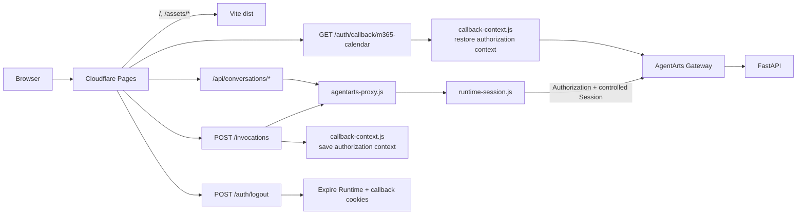
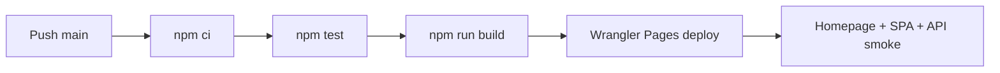

# Cloudflare Pages 部署与 Wrangler CLI

> 状态：Active | 更新时间：2026-07-15 | Production URL：`https://agentarts-personal-assistant.pages.dev`

## 架构

Cloudflare Pages 承担 Vite 静态托管和 lightweight same-origin BFF。BFF 负责 Runtime Cookie、
受控 header、显式业务路由和 SSE pass-through，不连接数据库，也不做 Conversation ownership。

图类型：**Component Diagram（组件图）**。用于说明静态资源、Pages Functions 与 Gateway 的
职责边界。



Browser 只访问 Pages origin，因此无 CORS preflight。Gateway 负责 JWT 验证；FastAPI 从
Gateway 已验证并转发的 JWT `sub` 派生用户并执行 ownership。

## Pages Function 路由

Pages 使用 file-based routing，production 只公开显式 Functions：

| Public path | Function | Methods | Upstream FastAPI path |
|-------------|----------|---------|-----------------------|
| `/invocations` | `functions/invocations.js` | POST | `/invocations` |
| `/api/conversations` | `functions/api/conversations.js` | GET, POST | `/api/conversations` |
| `/api/conversations/{conversation_id}` | `functions/api/conversations/[conversation_id].js` | GET, PATCH, DELETE | same path |
| `/api/conversations/{conversation_id}/messages` | `functions/api/conversations/[conversation_id]/messages.js` | GET | same path |
| `/api/conversations/{conversation_id}/invocations/{client_message_id}/cancel` | `functions/api/conversations/[conversation_id]/invocations/[client_message_id]/cancel.js` | POST | same path |
| `/auth/callback/m365-calendar` | `functions/auth/callback/m365-calendar.js` | GET | `/auth/oauth2/callback/m365-calendar` |
| `/auth/logout` | `functions/auth/logout.js` | POST | edge-only, no upstream |

未匹配 Function 时，Pages 按静态资源规则处理。项目不使用 catch-all Function 隐式公开
`/invocations/*`。

表中 Functions 和 local Wrangler topology 已完成；Feature 14 custom methods 与 resolver
Session header 在正式 Gateway 上的透传仍属于 G1 deployment probe。production callback
经 Gateway Runtime suffix；只有显式 local override 才直连 Service。

## Runtime Cookie 与 Header Contract

`runtime-session.js` 解析 `pa_runtime_session`。缺失或不符合 UUID v4 时生成新值：

```http
Set-Cookie: pa_runtime_session=<uuid-v4>; Path=/; HttpOnly; Secure; SameSite=Lax
```

- session Cookie 不设置 `Expires`、`Max-Age`、`Domain`。
- production 使用 `Secure`；显式 `PA_ENV=local` 可在 HTTP Wrangler preview 中省略。
- error response 也下发新生成的 Cookie。
- logout 下发 `Max-Age=0` 清除 Runtime 与 callback cookies。

Proxy 只转发以下 caller headers：

- `Accept`
- `Authorization`
- `Content-Type`

Proxy 不转发原始 `Cookie`、caller Session header 或 caller User header，并始终用 resolver ID
覆盖 `x-hw-agentarts-session-id`。因此 Browser-provided Runtime/User header 不能决定
routing 或 ownership。

Query string 也使用 route-specific allowlist：Conversation list 只允许
`status/cursor/limit`，Message list 只允许 `cursor/limit`，OAuth callback 只允许协议字段。

## OAuth Callback Snapshot

`POST /invocations` 使用 resolver 的 Runtime ID，而不是 caller header，写入短时 callback
context：

| Cookie | 内容 | Callback upstream |
|--------|------|-------------------|
| `pa_oauth2_callback_auth` | Authorization snapshot | `Authorization` |
| `pa_oauth2_callback_session` | resolver Runtime ID snapshot | `x-hw-agentarts-session-id` |

`pa_oauth2_callback_user` 只作为 legacy cookie 清理。callback 请求自身的 Authorization 与
Cookie 不原样转发。主 Runtime Cookie 后续轮换时，本次 callback 仍使用授权开始 snapshot。

## 代码分工

| 文件 | 职责 |
|------|------|
| `functions/_shared/runtime-session.js` | Cookie parse、UUID v4 validate/generate、Set-Cookie/expire |
| `functions/_shared/agentarts-proxy.js` | upstream URL、method/query/header allowlist、body/SSE pass-through |
| `functions/_shared/callback-context.js` | OAuth Authorization/Session snapshot 与恢复 |
| `functions/invocations.js` | Invocation route；local Pages 模式补 `/invocations` upstream prefix |
| `functions/api/conversations*.js` | Conversation collection/item/messages 与 nested cancellation 显式 routes |
| `functions/auth/callback/m365-calendar.js` | server-side callback bridge |
| `functions/auth/logout.js` | edge-only Cookie cleanup |
| `src/lib/chat/chat-api-client.ts` | same-origin Invocation client，不发送平台 headers |
| `src/lib/conversations/api.ts` | Conversation wire/domain adapter |

完整 BFF 边界见 [`ADR-019`](../../ADR/ADR-019-web-chat-bff-boundary.md)。

## Repository 配置

| 文件 | 职责 |
|------|------|
| `wrangler.toml` | project、build output、compatibility date |
| `package.json` | Vite/Wrangler build、preview、deploy scripts |
| `.github/workflows/deploy-frontend-to-cloudflare.yml` | main tests、build、deploy、smoke |

Cloudflare project name 为 `agentarts-personal-assistant`，production branch 为 `main`。

Required secrets：

- `CLOUDFLARE_API_TOKEN`
- `CLOUDFLARE_ACCOUNT_ID`

Required/recommended runtime variables：

- `AGENTARTS_INVOCATIONS_URL`：production Gateway Runtime invocation root。
- `OAUTH2_CALLBACK_BFF_SECRET`：推荐，与 Service 同名 secret 一致。
- `AGENTARTS_OAUTH_CALLBACK_URL`：仅 local direct callback override。

## Wrangler CLI

以下命令在 `personal-assistant-client/` 执行。

```bash
npm ci
npx wrangler login
npx wrangler whoami
npx wrangler pages project list
```

Production-shaped preview：

```bash
npm run pages:dev
```

Local Service full flow：

```bash
npm run pages:dev:local
```

`pages:dev:local` 绑定 `PA_ENV=local`，把 `AGENTARTS_INVOCATIONS_URL` 指向
`http://localhost:8080`。Invocation Function 在 local 模式补上 `/invocations`；Conversation
Functions（包括 cancellation）直接拼完整 `/api/conversations/...`，从而与 FastAPI path
对齐。production 使用相同 suffix；Gateway 去掉 Runtime invocation root 后也得到相同的
FastAPI path。

部署与查询：

```bash
npm run pages:deploy
npx wrangler pages deployment list --project-name=agentarts-personal-assistant
npx wrangler pages deployment tail --project-name=agentarts-personal-assistant
```

## GitHub Actions

图类型：**Deployment Diagram（部署流程图）**。用于说明 frontend gate。



## 验证

```bash
curl -I https://agentarts-personal-assistant.pages.dev/
curl -I https://agentarts-personal-assistant.pages.dev/chat
```

未携带 JWT 的 forwarding probe：

```bash
curl -i -X POST \
  https://agentarts-personal-assistant.pages.dev/invocations \
  -H "Content-Type: application/json" \
  -H "x-hw-agentarts-session-id: caller-spoof-probe" \
  -H "X-HW-AgentGateway-User-Id: caller-spoof-probe" \
  -d '{"conversation_id":"0190e9fe-82b4-7000-8000-000000000001","client_message_id":"0190e9fe-82b4-7000-8000-000000000002","message":"ping","stream":true}'
```

预期 Gateway 401。两个 caller platform headers 是 spoof probe，Pages Function 必须丢弃并
覆盖，不能把它们当成真实 routing/ownership 输入。

Feature 14 full-stack E2E 使用 Wrangler + FastAPI + disposable PostgreSQL schema 验证 Runtime
Cookie 建立/复用/非法轮换、header overwrite、OAuth snapshot、logout 与 Conversation routes。

## Microsoft Entra

SPA Redirect URI 必须包含：

```text
https://agentarts-personal-assistant.pages.dev/
```
