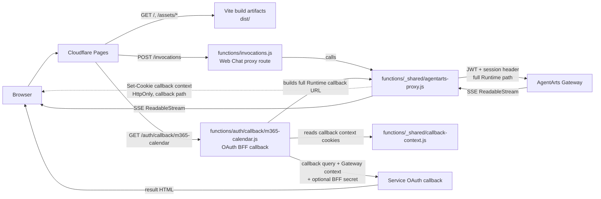
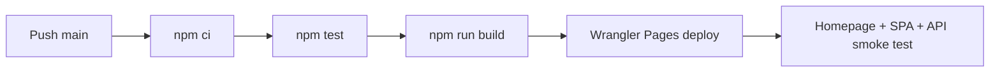

# Cloudflare Pages 部署与 Wrangler CLI

> 状态：Active | Production URL：`https://agentarts-personal-assistant.pages.dev`

## 架构

Cloudflare Pages 同时承担 Vite 静态前端托管和 same-origin API Proxy。
真正负责“静态资源 vs Pages Function”分流的，是 Pages 自己的 file-based routing：



Browser 只访问 Pages origin，因此不会产生 CORS preflight。Pages Function
透明转发必要 headers、request body 和 SSE response body；JWT validation
仍由 AgentArts Gateway 完成。Pages 生产 Function route 只显式声明
`POST /invocations` 和 `GET /auth/callback/m365-calendar`；`/invocations/*`
不再由 Cloudflare Pages Function 代理。

这层 Pages Function 是 Web Chat 的 lightweight BFF/proxy：适合承担同源路由、
header allowlist、SSE pass-through 和 OAuth callback bridge；不在 Function
内持久保存 inbound login token。完整 BFF / token handler 是否迁移、以及
Cloudflare Function 作为 BFF 后端的适用边界，见
[`ADR-019`](../../ADR/ADR-019-web-chat-bff-boundary.md)。

## Pages Function 路由

Cloudflare Pages 使用 file-based routing。对本项目来说，静态资源和函数路由的
分工如下：

| 路径 | 处理方式 | 说明 |
|------|----------|------|
| `/`, `/chat`, `/assets/*` | 静态文件 | 直接从 `dist/` 提供 |
| `POST /invocations` | `functions/invocations.js` | 精确匹配的 API 入口 |
| `/auth/callback/m365-calendar` | `functions/auth/callback/m365-calendar.js` | Calendar OAuth2 BFF callback，server-side 转发到 Service |

如果没有匹配到 Function，Pages 会继续按静态资源规则尝试返回 asset。
因此这里没有单独的“gateway”组件，Pages 本身就是这层协调者。

## 代码分工

| 文件 | 职责 |
|------|------|
| `personal-assistant-client/functions/invocations.js` | `/invocations` 的精确入口，持有 `onRequestPost` 并调用 shared proxy helper |
| `personal-assistant-client/functions/_shared/agentarts-proxy.js` | AgentArts upstream URL 构造、header allowlist、request body 与 SSE response pass-through；仅供 Pages Functions import，不是 public route |
| `personal-assistant-client/functions/_shared/callback-context.js` | callback-only HttpOnly cookie 下发、读取、过期与 Gateway context header 恢复；仅供 Pages Functions import，不是 public route |
| `personal-assistant-client/functions/auth/callback/m365-calendar.js` | Calendar OAuth2 BFF callback；不直接转发 callback 请求中的浏览器 Authorization/Cookie，只转发 callback query，并用 callback context cookies 恢复 Gateway context headers |

`functions/invocations.js` 和 `functions/auth/callback/m365-calendar.js` 是两条显式
production public route。两者复用 `_shared` 下的 helper，但不会把
`/invocations/*` 暴露为默认 public API contract。

## Repository 配置

| 文件 | 职责 |
|------|------|
| `personal-assistant-client/wrangler.toml` | Pages project name、build output 与 compatibility date |
| `personal-assistant-client/functions/invocations.js` | `/invocations` Web Chat proxy route |
| `personal-assistant-client/functions/_shared/agentarts-proxy.js` | shared AgentArts proxy helper |
| `personal-assistant-client/functions/_shared/callback-context.js` | shared OAuth callback context helper |
| `personal-assistant-client/functions/auth/callback/m365-calendar.js` | `/auth/callback/m365-calendar` BFF callback |
| `personal-assistant-client/src/lib/chat/chat-api-client.ts` | 固定请求 same-origin `/invocations` |
| `.github/workflows/deploy-frontend-to-cloudflare.yml` | `main` branch 自动测试、构建、部署和 smoke test |

Cloudflare project name 为 `agentarts-personal-assistant`，production branch
为 `main`。

## Wrangler CLI

以下命令均在 `personal-assistant-client/` 目录执行。

### 安装依赖

```bash
npm ci
```

Wrangler 已固定在项目 `devDependencies`，优先通过 npm scripts 或
`npx wrangler` 使用，不要求全局安装。

### 登录与账号检查

```bash
npx wrangler login
npx wrangler whoami
```

`login` 会打开 Browser 完成 OAuth。CI 不使用交互式登录，而是读取
`CLOUDFLARE_API_TOKEN` 和 `CLOUDFLARE_ACCOUNT_ID`。

### 查看 Pages projects

```bash
npx wrangler pages project list
```

### 本地运行 Pages + Functions

```bash
npm run pages:dev
```

等价于：

```bash
npm run build
npx wrangler pages dev dist
```

本地默认地址由 Wrangler 输出。可显式指定端口：

```bash
npx wrangler pages dev dist --port 8788
```

### 手动部署 production

```bash
npm run pages:deploy
```

等价于：

```bash
npm run build
npx wrangler pages deploy dist \
  --project-name=agentarts-personal-assistant \
  --branch=main
```

日常 production deployment 应由 GitHub Actions 完成；手动部署用于首次
bootstrap、CI 故障恢复或紧急验证。

### 查看 deployments

```bash
npx wrangler pages deployment list \
  --project-name=agentarts-personal-assistant
```

### 查看 Pages Function 实时日志

```bash
npx wrangler pages deployment tail \
  --project-name=agentarts-personal-assistant
```

停止 tail 使用 `Ctrl+C`。

## GitHub Actions

当 `main` branch 中以下路径变化时触发 production deployment：

- `personal-assistant-client/**`
- `.github/workflows/deploy-frontend-to-cloudflare.yml`

Pipeline：



Required repository secrets：

- `CLOUDFLARE_API_TOKEN`
- `CLOUDFLARE_ACCOUNT_ID`

Required / recommended Pages runtime variables：

- `AGENTARTS_INVOCATIONS_URL`：现有 `/invocations` proxy upstream。
- `OAUTH2_CALLBACK_BFF_SECRET`：推荐配置，与 Service
  `OAUTH2_CALLBACK_BFF_SECRET` 相同。
BFF 使用 `/invocations` 正常登录请求预先写入的 callback-only HttpOnly cookies
恢复 Gateway 所需的 `Authorization`、`x-hw-agentarts-session-id` 和
`X-HW-AgentGateway-User-Id`。Calendar complete 的 `Authorization` 必须是同一用户的
inbound user token；不要用 service token 覆盖，否则 AgentArts Identity 可能返回
`AgentIdentityTokenVault.1002` identity mismatch。

Local direct callback override：

- `AGENTARTS_OAUTH_CALLBACK_URL`：仅用于本地 full-flow 开发或显式 direct callback
  bypass，例如 `npm run pages:dev:local` 绑定到
  `http://localhost:8080/auth/oauth2/callback/m365-calendar`。线上默认不配置该变量；
  未配置时 BFF 复用 `AGENTARTS_INVOCATIONS_URL` 构造 Gateway full Runtime callback
  path。

API Token 最小权限为目标 Account 的 `Cloudflare Pages: Edit`。

## 验证

```bash
curl -I https://agentarts-personal-assistant.pages.dev/
curl -I https://agentarts-personal-assistant.pages.dev/chat
```

两者都应返回 HTTP 200。

未携带 JWT 的 Proxy probe：

```bash
curl -i -X POST \
  https://agentarts-personal-assistant.pages.dev/invocations \
  -H "Content-Type: application/json" \
  -H "x-hw-agentarts-session-id: smoke-test" \
  -d '{"message":"ping","stream":true}'
```

预期返回 Gateway 401。这证明 Pages Function 已将请求转发到 Gateway；完整
业务验证必须通过 Browser 登录后携带真实 Microsoft JWT。

## Microsoft Entra

Microsoft Entra App Registration 的 SPA Redirect URI 必须包含：

```text
https://agentarts-personal-assistant.pages.dev/
```
