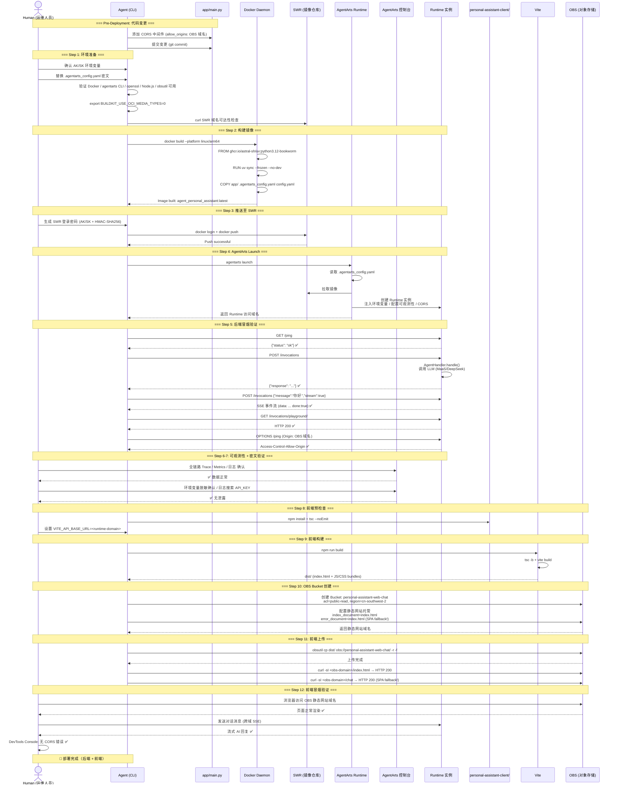

# AgentArts Deployment Runbook

> 版本：v1.0 | 状态：Active | 提取自 [`issues/chores/chore-1-agentarts-deploy/plan.md`](../../issues/chores/chore-1-agentarts-deploy/plan.md)
>
> 关联文档：[`cicd.md`](./cicd.md)、[`overall_architecture.md`](../overall_architecture.md)、[`agentarts.md`](../cloud-service/agentarts.md)

---

## 1. Prerequisites Checklist

部署前必须逐项确认。按执行角色分为 **Agent 可验证** 和 **人工需提供** 两类。

### 1.1 Agent 可验证（文件/环境存在性）

| # | 检查项 | 验证命令 | 预期结果 |
|---|--------|---------|---------|
| P1 | 工作目录 | `pwd` | 项目根目录（包含 `personal-assistant-service/` 和 `personal-assistant-client/`） |
| P2 | Dockerfile 存在 | `ls personal-assistant-service/Dockerfile` | 文件存在 |
| P3 | .agentarts_config.yaml 存在 | `ls personal-assistant-service/.agentarts_config.yaml` | 文件存在 |
| P4 | config.yaml 存在 | `ls personal-assistant-service/config.yaml` | 文件存在 |
| P5 | Docker 已安装 | `docker version` | 输出版本信息，无错误 |
| P6 | Docker 支持 buildx | `docker buildx version` | 输出版本信息 |
| P7 | agentarts CLI 已安装 | `agentarts --version` | 输出版本号 |
| P8 | uv.lock 存在 | `ls personal-assistant-service/uv.lock` | 文件存在 |
| P9 | openssl 已安装 | `openssl version` | 输出版本信息（SWR 密码生成依赖） |
| P10 | SWR 域名可达 | `curl -s -o /dev/null -w '%{http_code}' https://swr.cn-southwest-2.myhuaweicloud.com/v2/` | 401（可达，Registry API 需认证） |
| P11 | **Node.js 已安装** | `node --version` | v18+ 或 v20+（前端构建需要） |
| P12 | **npm 已安装** | `npm --version` | v9+ |
| P13 | **obsutil CLI 可用** | `obsutil version` | 输出版本号（华为云 OBS 命令行工具） |
| P14 | 前端项目存在 | `ls personal-assistant-client/package.json` | 文件存在 |
| P15 | **`runtime.arch` 一致性** | `grep -A10 'runtime:' personal-assistant-service/.agentarts_config.yaml \| grep 'arch:'` | 无此字段，或值为 `arm64`（不允许 `x86_64`） |

### 1.2 人工需提供（凭据/密钥）

| # | 检查项 | 说明 | 获取方式 |
|---|--------|------|---------|
| H1 | 华为云 AK/SK | `HUAWEICLOUD_SDK_AK` / `HUAWEICLOUD_SDK_SK` 环境变量 | 华为云控制台 → IAM → 我的凭证 |
| H2 | MaaS API Key | `.agentarts_config.yaml` 中 `MAAS_API_KEY` 和 `MODEL_API_KEY` 的值 | MaaS 控制台 → 模型部署 → API Key 管理 |
| H3 | DeepSeek API Key | `.agentarts_config.yaml` 中 `DEEPSEEK_API_KEY` 的值 | DeepSeek 官方控制台 |
| H4 | SWR 登录凭据 | Docker login 使用 AK/SK 生成临时密码 | 详见 Step 3 |
| H5 | IAM 子账号权限 | 需 SWR FullAccess + **OBS FullAccess** 权限（若使用子账号） | IAM 控制台 → 用户组 → 授权 |
| H6 | **OBS 操作权限** | IAM 子账号需 OBS FullAccess（创建 Bucket、上传文件） | IAM 控制台 → 用户组 → 授权 |

### 1.3 环境变量密文替换

`.agentarts_config.yaml` 中以下三处为占位符，部署前**必须替换为真实值**：

```yaml
# 🔴 部署前必须替换
environment_variables:
  - key: MAAS_API_KEY
    value: "<MaaS API Key>"        # ← 替换为真实 MaaS API Key
  - key: DEEPSEEK_API_KEY
    value: "<DeepSeek 官方 API Key>" # ← 替换为真实 DeepSeek API Key
  - key: MODEL_API_KEY
    value: "<your-maas-api-key>"    # ← 替换为真实 MaaS API Key（与 MAAS_API_KEY 通常相同）
```

> **安全提醒**：替换后的 `.agentarts_config.yaml` **切勿提交到 Git**。建议使用 `git update-index --assume-unchanged` 或在 `.gitignore` 中排除。

---

### 1.4 Pre-Deployment Code Change（已由 refactor 预完成 — 无需操作）

> ⚠️ **历史背景**：本节描述的是 `refactor/refactor-1-consolidate-ping-routes` 解决的问题。该 refactor 在 `208a9cf` 合并后，`app/main.py` 中 root-level `/ping`（line 42）和 `/invocations`（line 48）handlers 已存在，`/api/ping` 和 `/api/invocations` 端点已移除。
>
> ✅ **当前状态：NO ACTION REQUIRED — already done.** 如果你在阅读这份 runbook 时已处于 2026-06-08 之后的分支，无需执行本节任何操作。

### 原问题（已修复）

AgentArts 平台要求容器在 port 8080 提供 **root-level** 端点：

| AgentArts 期望 | 原注册（修复前） | 行为 |
|----------------|-----------------|------|
| `GET /ping` | `@app.get("/api/ping")` | `/ping` 无匹配路由 → SPA fallback 返回 HTML ❌ |
| `POST /invocations` | `@app.post("/api/invocations")` | `/invocations` 无匹配路由 → SPA fallback 返回 HTML ❌ |

**修复方案（已实施）**：在 `app/main.py` 中添加 root-level handlers，放在 StaticFiles mount 之前（`refactor/refactor-2-remove-web-chat-static-serving` 已移除了 StaticFiles mount，但 handlers 顺序无关紧要）。

### 验证（确认修复已生效）

```bash
grep -n '@app\.\(get\|post\)\("/\(ping\|invocations\)"\)' personal-assistant-service/app/main.py
# 期望输出：
# 42:@app.get("/ping")
# 48:@app.post("/invocations")
```

---

### 1.5 Pre-Deployment Code Change — CORS 中间件配置（⚠️ 必须完成）

> ⚠️ **此变更必须在 `docker build` 之前完成并提交。** 不完成此变更，前端（部署在 OBS 域名）的跨域请求将被浏览器拦截，Web Chat 无法与后端通信。

### 问题

前端部署在 OBS 静态网站域名（如 `personal-assistant-web-chat.obs.cn-southwest-2.myhuaweicloud.com`），后端在 AgentArts Runtime 域名（如 `xxx.agentarts.cn-southwest-2.myhuaweicloud.com`）。浏览器同源策略阻止跨域请求，必须在后端配置 CORS 中间件允许 OBS 域名。

### 修复方案

在 `app/main.py` 中添加 `fastapi.middleware.cors.CORSMiddleware`。插入位置：**`app = FastAPI(...)` 之后、第一个路由（`@app.get("/ping")`）之前**。

**文件**：`personal-assistant-service/app/main.py`

在 `app = FastAPI(...)` 之后、`app.add_middleware` 之前添加：

```python
import os

_default_origins = [
    "https://personal-assistant-web-chat.obs-website.cn-southwest-2.myhuaweicloud.com"
]
_env_origins = os.getenv("CORS_ALLOWED_ORIGINS")
_allowed_origins = (
    [o.strip() for o in _env_origins.split(",")] if _env_origins else _default_origins
)

app.add_middleware(
    CORSMiddleware,
    allow_origins=_allowed_origins,
    allow_credentials=True,
    allow_methods=["*"],
    allow_headers=["*"],
)
```

**import 行需要添加到文件顶部**（line 1 附近）：

```python
import os
```

> 其他导入（`from fastapi.middleware.cors import CORSMiddleware` 等）已在现有代码中，无需额外添加。

### OBS 域名获取

OBS 静态网站域名格式：

```
https://<bucket-name>.obs-website.cn-southwest-2.myhuaweicloud.com
```

例如：`https://personal-assistant-web-chat.obs-website.cn-southwest-2.myhuaweicloud.com`

**注意**：静态网站托管域名与普通 OBS endpoint 不同——静态网站使用 `.obs-website.` 而非 `.obs.` 子域名。

### 环境变量 `CORS_ALLOWED_ORIGINS`

AgentArts Runtime 环境变量配置（在 `.agentarts_config.yaml` 的 `environment_variables` 中）：

```yaml
- key: CORS_ALLOWED_ORIGINS
  value: "https://<obs-domain>,https://<netlify-domain>.netlify.app"
```

- 多个 origin 用英文逗号分隔（不包含空格，代码自动 strip）
- 如果不设置此环境变量，fallback 到 OBS 默认域名
- Netlify 域名格式：`https://<site-name>.netlify.app`

### 验证

```bash
# 部署后，从 OBS 域名和 Netlify 域名分别发起跨域请求验证 CORS 头
curl -sI -X OPTIONS "<runtime-domain>/ping" \
  -H "Origin: https://<bucket-name>.obs-website.cn-southwest-2.myhuaweicloud.com" \
  -H "Access-Control-Request-Method: GET"

curl -sI -X OPTIONS "<runtime-domain>/ping" \
  -H "Origin: https://<site-name>.netlify.app" \
  -H "Access-Control-Request-Method: GET"
# 两者均期望：响应头包含 Access-Control-Allow-Origin: <对应的 origin>
```

---

## 2. Step 1 — 前置环境准备

**执行角色**：Human + Agent 协作

```bash
# 1.1 进入项目根目录
cd /path/to/tidy-eagle

# 1.2 确认 §1.4 的代码变更已完成（root-level /ping 和 /invocations）
grep -n '@app\.\(get\|post\)\("/\(ping\|invocations\)"\)' personal-assistant-service/app/main.py
# 期望输出：line 42 + line 48（确认 root-level handlers 已存在）

# 1.3 确认 §1.5 的 CORS 中间件已添加
grep -n 'CORSMiddleware' personal-assistant-service/app/main.py
# 期望输出：包含 CORSMiddleware 的 import 和 app.add_middleware 调用

# 1.4 设置 OCI 兼容性环境变量（Docker 27+ 必需）
export BUILDKIT_USE_OCI_MEDIA_TYPES=0

# 1.5 验证 Docker 可用
docker version
docker buildx version

# 1.6 验证 agentarts CLI 已安装
agentarts --version
# 如未安装：pip install agentarts-sdk

# 1.7 验证 openssl 可用（SWR 密码生成依赖）
openssl version

# 1.8 验证 SWR 域名可达
curl -s -o /dev/null -w '%{http_code}' https://swr.cn-southwest-2.myhuaweicloud.com/v2/
# 期望输出：401（可达，Registry API 需认证；404 也说明连通性正常）

# 1.9 验证 Node.js 和 npm 可用（前端构建）
node --version  # 期望 v18+ 或 v20+
npm --version   # 期望 v9+

# 1.10 验证 obsutil CLI 可用（OBS 操作）
obsutil version
# 如未安装：见 §9.1 obsutil 安装说明

# 1.11 设置华为云认证
export HUAWEICLOUD_SDK_AK="<your-ak>"
export HUAWEICLOUD_SDK_SK="<your-sk>"
echo $HUAWEICLOUD_SDK_AK  # 确认已设置

# 1.12 确认 runtime.arch 与镜像架构一致（⚠️ 常见陷阱）
grep -A10 'runtime:' personal-assistant-service/.agentarts_config.yaml | grep 'arch:'
# 期望输出：无此字段（继承 base.platform: linux/arm64），或值为 arch: arm64
# 如果值为 arch: x86_64：ARM64 镜像会被调度到 x86 节点，runc 直接拒绝启动
# → 将 arch: x86_64 改为 arch: arm64，或删除该行
```

---

## 3. Step 2 — 构建 ARM64 Docker 镜像

**执行角色**：Agent（需 Human 确认 ARM64 环境可用）

```bash
# 2.1 确认当前机器架构
uname -m
# 期望输出：aarch64（ARM64 原生）或 x86_64（需 buildx + QEMU）

# 2.2 构建镜像
# 如果在 ARM64 原生机器上：
docker build --platform linux/arm64 \
  -f personal-assistant-service/Dockerfile \
  -t swr.cn-southwest-2.myhuaweicloud.com/personal-assistant-org/agent_personal_assistant:latest \
  .

# 如果在 X86 机器上，使用 buildx + QEMU：
docker buildx create --use --name arm64-builder
docker buildx build --platform linux/arm64 \
  --load \
  -f personal-assistant-service/Dockerfile \
  -t swr.cn-southwest-2.myhuaweicloud.com/personal-assistant-org/agent_personal_assistant:latest \
  .

# 2.3 验证镜像构建成功
docker images | grep agent_personal_assistant
# 期望输出：包含 swr.cn-southwest-2.myhuaweicloud.com/personal-assistant-org/agent_personal_assistant
```

**构建失败常见原因**：

| 症状 | 原因 | 解决方案 |
|------|------|---------|
| `COPY personal-assistant-service/app/` 失败 | 源码目录缺失 | 确认在项目根目录执行构建，检查 `personal-assistant-service/app/` 存在 |
| `uv sync` 失败 | uv.lock 过期或网络不通 | 确认 `uv.lock` 存在且依赖可解析 |
| `exec format error` | 在 X86 机器上未使用 buildx | 使用 `docker buildx build --platform linux/arm64` |
| 构建极慢 (>10min) | X86 QEMU 模拟 ARM64 | 正常现象；考虑使用 ARM64 CI runner |

---

## 4. Step 3 — 推送镜像至 SWR

**执行角色**：Human（需提供 AK/SK 生成 SWR 密码）

```bash
# 3.1 生成 SWR 临时登录密码
# 格式：cn-southwest-2@<AK>
# 密码通过以下命令生成（macOS + Linux 兼容）：
SWR_PASSWORD=$(printf "$HUAWEICLOUD_SDK_AK" | openssl dgst -binary -sha256 -hmac "$HUAWEICLOUD_SDK_SK" | od -An -vtx1 | tr -d ' \n')
echo "SWR 密码: $SWR_PASSWORD"

# 3.2 登录 SWR
docker login swr.cn-southwest-2.myhuaweicloud.com \
  -u "cn-southwest-2@$HUAWEICLOUD_SDK_AK" \
  -p "$SWR_PASSWORD"

# 3.3 推送镜像
docker push swr.cn-southwest-2.myhuaweicloud.com/personal-assistant-org/agent_personal_assistant:latest
```

**推送失败常见原因**：

| 症状 | 原因 | 解决方案 |
|------|------|---------|
| `unauthorized` | AK/SK 错误或密码生成有误 | 重新检查 AK/SK；确认密码生成命令的 shell 兼容性（zsh vs bash） |
| `denied: Permission denied` | IAM 子账号缺少 SWR 权限 | 在 IAM 控制台为用户/用户组添加 SWR FullAccess |
| `manifest unknown` | 组织或仓库不存在 | 确认 `organization_auto_create: true` 和 `repository_auto_create: true`；或手动在 SWR 控制台创建 |

---

## 5. Step 4 — AgentArts Launch 部署

**执行角色**：Human（需控制台确认）+ Agent（执行 CLI）

```bash
# 4.1 确认工作目录为 personal-assistant-service/
cd personal-assistant-service

# 4.2 确认 .agentarts_config.yaml 中的环境变量已替换为真实值
grep -E "MAAS_API_KEY|DEEPSEEK_API_KEY|MODEL_API_KEY" .agentarts_config.yaml
# 确认所有 value 字段不是 "<...>" 占位符

# 4.3 确认 CORS 中间件的 OBS 域名已在镜像中（§1.5 变更已执行）
grep 'allow_origins' app/main.py
# 确认 allow_origins 列表包含 OBS 域名（非占位符）

# 4.4 执行部署
agentarts launch
```

**`agentarts launch` 执行流程**：

1. 读取 `.agentarts_config.yaml`
2. 如果 SWR 组织/仓库不存在且 `auto_create: true`，自动创建
3. 基于 `artifact_source.url` 拉取已有镜像（或基于配置构建新镜像）
4. 根据 `runtime` 配置创建 Runtime 实例（端口 8080、网络模式 PUBLIC、环境变量注入）
5. 配置可观测性（Tracing/Metrics/Logs）
6. 返回 Runtime 访问域名

**部署后验证**：

```bash
# 4.5 记录控制台输出的 Runtime 域名
# 示例：https://xxx.agentarts.cn-southwest-2.myhuaweicloud.com

# 4.6 在 AgentArts 控制台确认
# 访问 https://console.huaweicloud.com/agentarts/
# → 智能体运行时 → 确认实例状态为「运行中」
```

---

## 6. Step 5 — 后端冒烟验证

**执行角色**：Agent

```bash
# 替换为实际 Runtime 域名
RUNTIME_DOMAIN="<runtime-domain-from-launch-output>"

# 5.1 健康检查
curl -s "$RUNTIME_DOMAIN/ping"
# 期望输出：{"status": "ok"}
# 判定：HTTP 200 + JSON body 包含 "status": "ok"

# 5.2 同步对话调用
curl -s -X POST "$RUNTIME_DOMAIN/invocations" \
  -H "Content-Type: application/json" \
  -d '{"message": "你好，请简单介绍一下你自己"}'
# 期望输出：{"response": "..."}(包含有效 AI 回复内容)
# 判定：HTTP 200 + JSON body 包含 "response" 字段，且内容为有效中文回复

# 5.3 SSE 流式对话 — 增强验证
# 使用 -N 禁用 curl 输出缓冲，确保实时看到 SSE 事件流
curl -N -s -X POST "$RUNTIME_DOMAIN/invocations" \
  -H "Content-Type: application/json" \
  -H "Accept: text/event-stream" \
  -d '{"message":"你好","stream":true}'
# 期望输出：持续输出 data: {...} 行，最终输出 done=true 事件
# 判定：
#   ✅ 输出包含 "data:" 前缀的 SSE 事件行
#   ✅ 事件流在 30 秒内开始输出（非超时）
#   ✅ 最终输出包含 "done": true（非异常断开）

# 5.4 Chainlit Playground 可访问性
curl -sI "$RUNTIME_DOMAIN/invocations/playground/"
# 期望：HTTP 200（或 302 重定向到登录页，取决于 Chainlit 配置）
# 判定：HTTP 状态码为 2xx 或 3xx（非 4xx/5xx）
# 注意：/invocations/playground/ 带 trailing slash 是正确路径；
#       如果 IAM authorizer 阻止匿名访问，返回 200 OK 即表示路由可达

# 5.5 CORS 预检请求验证
curl -sI -X OPTIONS "$RUNTIME_DOMAIN/ping" \
  -H "Origin: https://<obs-bucket-domain>" \
  -H "Access-Control-Request-Method: GET"
# 期望：响应头包含 Access-Control-Allow-Origin 和 Access-Control-Allow-Methods
# 判定：HTTP 200 + 包含 Access-Control-Allow-Origin header，值匹配 OBS 域名
```

**冒烟验证判定标准（汇总）**：

| 测试 | 通过条件 | 失败处理 |
|------|---------|---------|
| `/ping` | HTTP 200, `{"status": "ok"}` | 检查 §1.4 代码变更是否已应用；查看 AgentArts 控制台日志 |
| `/invocations` | HTTP 200, `{"response": "..."}` 有效回复 | 检查 MODEL_API_KEY 是否正确；查看 Trace 定位错误 |
| `POST /invocations` + `stream:true` (SSE) | SSE 事件流正常推送，以 `done:true` 结束 | 检查 SSE 分支实现和网络连通性；确认 `Accept: text/event-stream` header |
| `/invocations/playground/` | HTTP 200 或 302，路由可达 | 检查 Chainlit mount 配置；确认 `/invocations/playground/` 带 trailing slash |
| CORS preflight | 响应包含 `Access-Control-Allow-Origin` 匹配 OBS 域名 | 检查 §1.5 CORS 中间件是否正确添加和重新部署 |

---

## 7. Step 6 — 可观测性确认

**执行角色**：Human（需控制台操作）

在 AgentArts 控制台依次确认：

1. **全链路 Trace**：控制台 → 观测 → 全链路 Trace → 筛选最近 15 分钟 → 确认有 Step 5 产生的 Trace 记录
2. **Metrics**：控制台 → 观测 → 指标监控 → 确认 QPS、延迟、错误率等面板有数据
3. **日志**：控制台 → 观测 → 日志 → 确认可查看容器 stdout/stderr 输出（特别是 uvicorn 的启动日志和请求日志）

---

## 8. Step 7 — 环境变量密文验证

**执行角色**：Human（需控制台检查）

1. 在 AgentArts 控制台 → 运行时详情 → 环境变量 → 确认 `MAAS_API_KEY`、`DEEPSEEK_API_KEY`、`MODEL_API_KEY` 均为 `******` 脱敏显示
2. 在日志页面搜索 `MAAS_API_KEY`、`DEEPSEEK_API_KEY`，确认**无明文泄露**
3. 确认 `agentarts launch` 的控制台输出中不包含明文密钥

---

## 9. Step 8 — 前端预构建检查

> **此步骤及后续 §10–§12 为前端 OBS 部署流程，与后端部署可并行执行（后端冒烟通过后即可开始）。**

**执行角色**：Agent

### 9.1 前端依赖检查

```bash
cd personal-assistant-client

# 验证 Node.js 和 npm 版本
node --version   # v18+ 或 v20+
npm --version    # v9+

# 安装生产依赖
npm install
# 期望：无错误，node_modules/ 创建成功

# 验证 TypeScript 编译（不产出 dist）
npx tsc --noEmit
# 期望：无 TypeScript 错误
```

### 9.2 VITE_API_BASE_URL 环境变量配置

前端在 OBS 部署后需要通过完整 URL 访问 AgentArts Runtime，而不是开发模式下的 Vite proxy（相对路径 `/api`）。构建前必须设置 `VITE_API_BASE_URL`。

**方式一：命令行环境变量**（推荐）

```bash
export VITE_API_BASE_URL="https://<runtime-domain>"
```

**方式二：`.env.production` 文件**

```bash
# personal-assistant-client/.env.production
VITE_API_BASE_URL=https://<runtime-domain>
```

> ⚠️ `.env.production` 文件应加入 `.gitignore`，避免将 Runtime 域名提交到仓库。

**验证**：

```bash
echo $VITE_API_BASE_URL
# 应输出：https://xxx.agentarts.cn-southwest-2.myhuaweicloud.com
```

### 9.3 生效位置说明

当前 `vite.config.ts` 使用开发 proxy（`/api` → `http://localhost:8080`），前端代码需通过 `import.meta.env.VITE_API_BASE_URL` 获取 API base URL。如果前端代码尚未使用此环境变量，构建前需确认 API 请求的 base URL 设置方式：

- 如果使用 `@assistant-ui/react` 的 `useLocalRuntime` + custom adapter，在 adapter 中配置 `baseURL`
- 如果使用 `fetch` / `EventSource`，在创建连接时使用 `VITE_API_BASE_URL`

> **如果前端尚未实现此环境变量**：本次部署可使用硬编码 Runtime 域名进行首次上线，后续在 Feature issue 中完善环境变量机制。这不影响部署流程——OBS 上传的是编译后的静态文件，构建时域名已嵌入 bundle。

---

## 10. Step 9 — 前端构建

**执行角色**：Agent

```bash
# 10.1 进入前端目录
cd personal-assistant-client

# 10.2 构建生产产物
npm run build
# 后台执行：tsc -b && vite build
# 期望：无错误退出，dist/ 目录生成

# 10.3 验证产出物
ls -la dist/
# 期望输出包含：
#   index.html
#   assets/  (JS/CSS bundle 文件，文件名含 content hash)
```

**构建失败常见原因**：

| 症状 | 原因 | 解决方案 |
|------|------|---------|
| `tsc` 编译错误 | TypeScript 类型不匹配 | 先运行 `npx tsc --noEmit` 定位并修复 |
| `vite build` 失败 | 依赖缺失或路径错误 | 确认 `npm install` 已完成；检查 import 路径 |
| `dist/` 为空 | 构建未生成输出 | 检查 `vite.config.ts` 中 `build.outDir` 配置 |
| 缺少 CSS | Tailwind 未正确生成 | 确认 `@tailwindcss/vite` 插件已配置 |

---

## 11. Step 10 — OBS Bucket 创建与配置

**执行角色**：Human（需华为云 Console 或 IaC 操作）

### 11.1 前置说明

OBS Bucket 创建有三种方式：

| 方式 | 工具 | 推荐度 | 说明 |
|------|------|--------|------|
| **IaC (OpenTofu + HCL)** | `personal-assistant-infra/` | ⭐⭐⭐ 推荐 | 可版本控制、可复现、可 review |
| **obsutil CLI** | `obsutil` | ⭐⭐ 可用 | 命令行操作，快速创建 |
| **华为云 Console** | Web 控制台 | ⭐ 手动 | 适合一次性操作，无法版本控制 |

> **推荐使用 OpenTofu + HCL**：`personal-assistant-infra/` 目录已就位（见 `personal-assistant-infra/AGENTS.md`），按 ADR-006 使用 OpenTofu + 原生 HCL。2025-12 CDKTF 归档后已迁移至 OpenTofu（Linux 基金会托管，MPL 协议）。如果 infra 目录尚未完成 `tofu init`，可先用 obsutil 快速创建，后续迁移到 IaC。

### 11.2 方式一：IaC (OpenTofu + HCL) — 推荐

如果 `personal-assistant-infra/` 已初始化 OpenTofu，OBS Bucket 定义位于以下文件：

**`obs.tf`** — OBS Bucket 资源：

```hcl
# personal-assistant-infra/obs.tf
resource "huaweicloud_obs_bucket" "web_chat" {
  bucket     = "personal-assistant-web-chat"
  acl        = "public-read"
  versioning = true

  website {
    index_document = "index.html"
    error_document = "index.html" # SPA fallback
  }
}
```

**`main.tf`** — Provider 配置：

```hcl
# personal-assistant-infra/main.tf
terraform {
  required_providers {
    huaweicloud = {
      source  = "huaweicloud/huaweicloud"
      version = "~> 1.92"
    }
  }
}

provider "huaweicloud" {
  region     = var.region
  # 凭据通过 HW_ACCESS_KEY / HW_SECRET_KEY 原生环境变量注入（Provider 自动读取）
}
```

**`variables.tf`** — 当前仅声明 `region` 变量（Provider 凭据不再通过 Terraform 变量中转）：

```hcl
# personal-assistant-infra/variables.tf
variable "region" {
  description = "HuaweiCloud 区域"
  type        = string
  default     = "cn-southwest-2"
}
```

部署：

```bash
cd personal-assistant-infra

# 首次或 provider 变更后
tofu init

# 验证语法和格式
tofu validate
tofu fmt -check

# 预览变更（需先配置凭据：export HW_ACCESS_KEY / HW_SECRET_KEY 环境变量）
tofu plan

# 执行部署
tofu apply
```

> ⚠️ **凭据配置**：AK/SK 通过 HuaweiCloud Provider 原生环境变量 `HW_ACCESS_KEY` / `HW_SECRET_KEY` 注入（OpenTofu Provider 自动读取）。与 `obsutil` 等其他工具使用的 `HUAWEICLOUD_SDK_AK` / `HUAWEICLOUD_SDK_SK` 不同——两者作用域不同，不要混淆或误删。Provider 版本锁定在 `.terraform.lock.hcl`（git tracked），确保跨环境一致性。Provider 文档见 [OpenTofu Registry](https://search.opentofu.org/provider/opentofu/huaweicloud)。

### 11.3 方式二：obsutil CLI

```bash
# 11.3.1 配置 obsutil 认证（一次性）
obsutil config -i="$HUAWEICLOUD_SDK_AK" -k="$HUAWEICLOUD_SDK_SK" -e="obs.cn-southwest-2.myhuaweicloud.com"

# 11.3.2 创建 OBS Bucket
obsutil mb obs://personal-assistant-web-chat \
  -location=cn-southwest-2 \
  -acl=public-read
# 期望输出：Create bucket [personal-assistant-web-chat] successfully.

# 11.3.3 配置静态网站托管
# obsutil 不支持直接设置 website 配置（仅支持 mb/cp/ls/rm 等），
# 需要通过华为云 Console 完成此步骤。
# 或者使用以下 AWS S3 兼容 API（OBS 支持部分 S3 API）：
# ⚠️ 如果 obsutil 无法配置静态网站，走华为云 Console：
#   Console → OBS → personal-assistant-web-chat → 基础配置 → 静态网站托管
#   设置：Index document = index.html, Error document = index.html
```

### 11.4 方式三：华为云 Console

1. 登录 https://console.huaweicloud.com/console/#/obs
2. 点击「创建桶」
3. 桶名称：`personal-assistant-web-chat`
4. 区域：`cn-southwest-2`
5. 桶策略：公共读（`public-read`）
6. 创建后，进入桶详情 → 基础配置 → 静态网站托管
7. 设置：
   - **Index document**：`index.html`
   - **Error document**：`index.html`（SPA 路由回退 — 关键！）
8. 记录**静态网站访问域名**（格式：`https://personal-assistant-web-chat.obs-website.cn-southwest-2.myhuaweicloud.com`）

### 11.5 记录 OBS 域名

```bash
# 静态网站托管域名（用于浏览器访问）
OBS_DOMAIN="https://personal-assistant-web-chat.obs-website.cn-southwest-2.myhuaweicloud.com"
echo "OBS 静态网站域名: $OBS_DOMAIN"

# 记录此域名，后续用于：
#  1. CORS 中间件 allow_origins 配置（§1.5）
#  2. 前端冒烟验证（§13）
```

---

## 12. Step 11 — 前端上传至 OBS

**执行角色**：Agent

### 12.1 上传 dist/ 到 OBS Bucket

```bash
# 使用 obsutil 递归上传，覆盖已有文件
obsutil cp personal-assistant-client/dist/ obs://personal-assistant-web-chat/ -r -f

# 参数说明：
#   -r  递归上传目录内所有文件
#   -f  强制覆盖已存在的同名对象
```

### 12.2 缓存策略优化（可选但推荐）

前端 JS/CSS bundle 文件带有 content hash（Vite 默认），可设置长缓存。`index.html` 应设置短缓存或 no-cache。

```bash
# 对 index.html 设置 no-cache（确保用户总是获取最新版本）
obsutil set-object-property obs://personal-assistant-web-chat/index.html \
  --cache-control="no-cache, no-store, must-revalidate"

# 对 assets/ 目录下的 hash 文件设置长缓存（1年）
# 注意：obsutil 批量设置缓存需要逐文件操作，可通过脚本批量执行
for f in $(obsutil ls obs://personal-assistant-web-chat/assets/ -r | awk '{print $4}'); do
  obsutil set-object-property "$f" --cache-control="public, max-age=31536000, immutable"
done
```

> **说明**：缓存策略非阻塞性。如果无法批量设置，跳过此步不影响功能——浏览器仍会加载文件，只是可能无法充分利用缓存。

### 12.3 验证文件可公开访问

```bash
# 12.3.1 验证 index.html 可访问
curl -sI "$OBS_DOMAIN/index.html"
# 期望：HTTP 200
# 注意：静态网站域名格式为 .obs-website. 子域

# 12.3.2 验证 JS bundle 可访问（检查 Content-Type）
curl -sI "$OBS_DOMAIN/assets/index-<hash>.js" | grep -i content-type
# 期望：Content-Type: application/javascript 或 text/javascript

# 12.3.3 验证 SPA 路由回退
# 直接访问非根路径（如 /chat），应返回 index.html 内容而非 404
curl -sI "$OBS_DOMAIN/chat"
# 期望：HTTP 200（不是 404！）
# 如果返回 404：Error document 未配置或未生效（回 §11 检查静态网站托管配置）
```

**上传失败常见原因**：

| 症状 | 原因 | 解决方案 |
|------|------|---------|
| `Access Denied` | 缺少 OBS 写入权限 | 确认 IAM 子账号有 OBS FullAccess；检查 AK/SK 是否正确 |
| `Bucket not found` | Bucket 名称错误或不存在 | 检查 Bucket 名称拼写和 Region；确认已在 `cn-southwest-2` 创建 |
| `No such file` | `dist/` 目录不存在 | 确认 Step 9（前端构建）已成功执行 |
| 静态网站访问 404 | 未配置网站托管 | 回 §11 检查 Index/Error document 配置 |
| SPA 路由 404 | Error document 未设置为 `index.html` | 这是最关键的 OBS 配置项 — 回 §11.4 检查 |

---

## 13. Step 12 — 前端冒烟验证

**执行角色**：Human（浏览器操作）+ Agent（curl 验证）

### 13.1 浏览器验证（核心）

1. 打开浏览器，访问 OBS 静态网站域名：
   ```
   https://personal-assistant-web-chat.obs-website.cn-southwest-2.myhuaweicloud.com
   ```
2. **页面加载检查**：
   - ✅ 页面正常渲染（非白屏、非错误提示）
   - ✅ 浏览器 DevTools Console 无 JS 报错
   - ✅ 浏览器 DevTools Network 面板无 404 错误
3. **对话功能检查**：
   - ✅ 发送一条对话消息 → 收到 AI 流式回复
   - ✅ SSE 事件流正常渲染（逐字输出效果）
   - ✅ 多轮对话正常（上下文保持，不串消息、不崩溃）
4. **CORS 检查**：
   - ✅ 浏览器 DevTools Console 无 CORS 错误（`Access-Control-Allow-Origin` 相关报错）
   - ✅ Network 面板中 API 请求的 Response Headers 包含 `Access-Control-Allow-Origin`

### 13.2 curl 快速验证

```bash
OBS_DOMAIN="https://personal-assistant-web-chat.obs-website.cn-southwest-2.myhuaweicloud.com"

# 13.2.1 页面可访问
curl -sI "$OBS_DOMAIN/index.html"
# 期望：HTTP 200

# 13.2.2 SPA 路由回退
curl -sI "$OBS_DOMAIN/chat"
# 期望：HTTP 200（非 404）

# 13.2.3 CORS 跨域 SSE 请求
curl -N -s -X POST "$RUNTIME_DOMAIN/invocations" \
  -H "Content-Type: application/json" \
  -H "Accept: text/event-stream" \
  -H "Origin: $OBS_DOMAIN" \
  -d '{"message":"ping","stream":true}'
# 期望：正常返回 SSE 事件流
# 判定：响应头中应包含 Access-Control-Allow-Origin (如果 runtime 设置了 CORS)
```

### 13.3 冒烟验证判定标准（前端）

| 测试项 | 通过条件 | 失败处理 |
|--------|---------|---------|
| 页面加载 | 正常渲染，无 JS 报错 | 检查 dist/ 是否完整上传；检查 index.html 路径 |
| SPA 路由 | `/chat` 非根路径返回 200（非 404） | 检查 OBS 静态网站托管 Error document 配置 |
| 对话 SSE 流 | 发送消息后收到流式 AI 回复 | 检查 VITE_API_BASE_URL 是否正确；检查 CORS 配置 |
| CORS 无报错 | Console 无 `Access-Control-Allow-Origin` 错误 | 检查 §1.5 CORS 中间件；确认 allow_origins 包含 OBS 域名 |
| 多轮对话 | 上下文保持，不串消息 | 检查 session 管理；检查 SSE 连接复用 |

---

## 14. Rollback Plan

若部署后冒烟验证连续失败且无法快速修复，按以下步骤回滚。

### 14.1 后端回滚

```bash
# 1. 在 AgentArts 控制台停止 Runtime 实例
# 控制台 → 智能体运行时 → 选择实例 → 停止
# ⚠️ Runtime 实例停止可能需要数秒到数分钟。
#    等待控制台显示状态为「已停止」后再确认回滚完成。

# 2. （可选）删除 SWR 镜像标签
# docker rmi swr.cn-southwest-2.myhuaweicloud.com/personal-assistant-org/agent_personal_assistant:latest
```

### 14.2 前端回滚

```bash
# OBS Bucket 本身无需回滚（静态托管基础设施，无运行时状态）
# 回滚前端内容：上传旧版本的 dist/ 覆盖即可

# 如果有旧版本备份：
obsutil cp /path/to/old-dist/ obs://personal-assistant-web-chat/ -r -f

# 如果无备份，可通过 OBS 版本控制恢复：
# 前提：Bucket 创建时启用了 versioning
# 步骤：在华为云 Console → OBS → Bucket → 对象列表 → 选择文件 → 版本管理 → 恢复历史版本
```

> ⚠️ **版本控制回滚仅在 Bucket 创建时启用了 `versioning: true`（§11.2）时可用。** 如果未启用版本控制且无本地 `dist/` 备份，则无法回滚至旧版本前端。建议保留足够的本地 `dist/` 备份以防 versioning 未启用。

### 14.3 回滚决策矩阵

| 失败场景 | 是否回滚 | 处理方式 |
|---------|---------|---------|
| `/ping` 返回非 200 或超时 | ✅ 回滚 | 检查 §1.4 代码变更；查看容器启动日志 |
| `/invocations` 返回 5xx | ⚠️ 先诊断 | 可能是 API Key 配置错误；更新环境变量后重启 |
| `/invocations` 返回 HTML（SPA fallback） | ✅ 回滚 | §1.4 代码变更未应用 |
| `POST /invocations` SSE 无响应 | ⚠️ 先诊断 | 检查 SSE 分支和网络；可能无需回滚 |
| 前端页面白屏 | ❌ 不回滚后端 | 检查 dist/ 产出物完整性；重新上传或回滚前端 |
| 前端 CORS 错误 | ⚠️ 先诊断 | 检查 §1.5 CORS 配置；可能需要 rebuild 镜像 |
| 前端 SPA 路由 404 | ❌ 不回滚 | OBS Error document 配置问题，修改配置即可 |
| Trace/Metrics/Logs 无数据 | ❌ 不回滚 | 可观测性配置问题，不影响功能 |

### 14.4 恢复部署

修复问题后，从相应步骤重新执行：

- **后端问题**：从 Step 2（Docker build）开始，可跳过 `agentarts launch` 的部分环境配置
- **前端问题**：从 Step 9（构建）或 Step 11（上传）开始，OBS Bucket 无需重建

---

## 15. Pitfalls & Troubleshooting

### 15.1 ARM64 架构

- **问题**：AgentArts Runtime 仅支持 `linux/arm64`。X86 机器直接 `docker build` 生成的镜像无法在 Runtime 运行。
- **症状**：`agentarts launch` 后容器 CrashLoopBackOff，日志显示 `exec format error`
- **解决**：使用 `docker buildx build --platform linux/arm64 --load`。本地需安装 QEMU：
  ```bash
  docker run --rm --privileged multiarch/qemu-user-static --reset -p yes
  ```

### 15.2 OCI Media Types (Docker 27+)

- **问题**：Docker 27+ 默认生成 OCI 格式镜像，SWR 不支持
- **症状**：`docker push` 成功，但 `agentarts launch` 时 SWR 无法解析镜像
- **解决**：
  ```bash
  export BUILDKIT_USE_OCI_MEDIA_TYPES=0
  ```
  设置后**重新构建并推送**镜像。

### 15.3 IAM 子账号权限

- **问题**：使用 IAM 子账号的 AK/SK 操作 SWR 时权限不足
- **症状**：`docker push` 返回 `denied: Permission denied`
- **解决**：在 IAM 控制台为子账号所在用户组添加 `SWR FullAccess` 策略

### 15.4 SWR 登录密码生成（zsh 兼容性）

- **问题**：SWR 密码生成命令在 zsh 下可能输出格式异常
- **解决**：使用以下 zsh 兼容版本：
  ```zsh
  SWR_PASSWORD=$(printf "$HUAWEICLOUD_SDK_AK" | openssl dgst -binary -sha256 -hmac "$HUAWEICLOUD_SDK_SK" | od -An -vtx1 | tr -d ' \n')
  ```

### 15.5 entrypoint 配置不一致

- **现状**：`.agentarts_config.yaml` 中 `entrypoint: "agent:app"`，但项目不存在 `agent.py`。实际入口为 `app.main:app`（由 Dockerfile CMD 指定）
- **影响**：采用手动 `docker build` + `docker push` + `agentarts launch` 流程，Dockerfile CMD 覆盖 entrypoint 声明，**当前部署不受影响**
- **建议**：部署成功后，将 `entrypoint` 更新为 `"app.main:app"` 以消除配置不一致，避免未来 `agentarts launch` 内置构建流程出错。此项可作为后续 cleanup PR 处理

### 15.6 Authorization Header — 与 Issue 原始描述的差异

- **问题**：Issue 的 smoke test 示例包含 `-H "Authorization: Bearer <api-key>"`，但当前代码中 `/invocations` handler 不检查 `Authorization` header，而是从 `X-AgentArts-User-Id` header 获取用户标识
- **说明**：当前设计假设 AgentArts IAM authorizer 在网关层完成认证并注入 `X-AgentArts-User-Id` header。如果平台配置了 IAM 鉴权，网关会自动处理；如果未配置，`anonymous` 作为默认 user_id 回退
- **影响**：Plan 的 smoke test 不包含 `Authorization` header，与当前代码行为一致。若后续启用 IAM 鉴权，需在 AgentArts 控制台配置 API Key 并在请求中添加 `Authorization` header

### 15.7 `MODEL_API_KEY` 环境变量冗余

- **现状**：`.agentarts_config.yaml` 中声明了 `MAAS_API_KEY`、`DEEPSEEK_API_KEY` 和 `MODEL_API_KEY` 三个环境变量，但 `config.yaml`（LLM Provider 配置）中：
  - `maas` provider 使用 `api_key_env: MAAS_API_KEY`
  - `deepseek` provider 使用 `api_key_env: DEEPSEEK_API_KEY`
  - **`MODEL_API_KEY` 未被任何 provider 引用**
- **判断**：`MODEL_API_KEY` 很可能是引入 ADR-011 多 Provider 架构前的遗留配置，属于冗余环境变量
- **建议**：部署时可保留（无害），但标记为 §17 后续 cleanup 项，确认无引用后移除

### 15.8 `artifact_source.commands` 冗余

- **现状**：`.agentarts_config.yaml` 中 `artifact_source.commands: ["uv sync --frozen --no-dev"]` 与 Dockerfile 第 9 行的 `RUN uv sync --frozen --no-dev` 重复
- **说明**：`artifact_source.commands` 是 `agentarts launch` 在拉取 `artifact_source.url` 的镜像后额外执行的命令。由于 Dockerfile 构建阶段已完成依赖安装，此处的 `uv sync` 是冗余操作
- **影响**：不影响功能（幂等操作），但会略微延长 Runtime 启动时间
- **建议**：标记为 §17 后续 cleanup 项，确认当前部署流程仅依赖 Dockerfile 后移除

### 15.9 SPA 路由回退（OBS 静态网站核心配置）

- **问题**：OBS 静态网站默认只响应根路径（`/index.html`）。直接访问 `/chat`、`/about` 等前端路由会返回 404。
- **症状**：浏览器访问 `<obs-domain>/chat` 显示 404 NoSuchKey 错误
- **解决**：在 OBS 静态网站托管配置中将 **Error document** 设置为 `index.html`。这会告诉 OBS 在所有 404 场景下返回 `index.html`，由前端 SPA router 接管路由解析。
- **验证**：`curl -sI "<obs-domain>/chat"` 返回 HTTP 200

### 15.10 CORS 跨域

- **问题**：前端（OBS 域名）与后端（AgentArts Runtime 域名）不同域。浏览器阻止跨域请求。
- **症状**：前端页面加载正常，但发送消息时报错 `Access-Control-Allow-Origin` missing
- **解决**：
  1. 确认 §1.5 CORS 中间件已添加到 `main.py` 并包含 OBS 域名
  2. 确认镜像已重新构建和部署
  3. 确认 `allow_origins` 中的域名与 OBS 静态网站域名**完全匹配**（包括 `https://` 前缀，无 trailing slash）
  4. 如果使用 `*` 通配符，注意 `allow_credentials=True` 时不能使用 `*`（浏览器会拒绝）

### 15.11 前端 API base URL

- **问题**：开发模式下 Vite proxy 将 `/invocations` 代理到 `localhost:8080`。OBS 部署后无 proxy，前端必须使用完整 URL 访问后端。
- **症状**：前端发送请求到 `/invocations`（相对路径），实际请求到 OBS 域名而非 AgentArts Runtime
- **解决**：
  1. 构建前设置 `VITE_API_BASE_URL` 环境变量
  2. 确保前端代码使用 `import.meta.env.VITE_API_BASE_URL` 拼接 API URL
  3. 如果首次部署尚未实现此机制，可在构建时临时硬编码 Runtime 域名

### 15.12 `runtime.arch` 与镜像架构不一致

- **问题**：`.agentarts_config.yaml` 中 `runtime.arch` 字段控制 AgentArts 将容器调度到哪种 CPU 架构的节点运行。如果设置为 `x86_64`，ARM64 镜像会被调度到 x86 节点，指令集不匹配导致 runc 直接拒绝启动。
- **症状**：
  - `agentarts invoke` 返回 `NA.30200: failed to start container`
  - 日志中 `stdout="" stderr=""` — 进程根本没启动，无任何输出
  - `OCI runtime create failed: empty msg in log file`
- **排查**：
  ```bash
  grep -A10 'runtime:' personal-assistant-service/.agentarts_config.yaml | grep 'arch:'
  ```
- **解决**：将 `arch: x86_64` 改为 `arch: arm64`，或删除该行让它继承 `base.platform: linux/arm64`。修改后需重新 `agentarts launch` 部署。
- **背景**：AgentArts 的鲲鹏 ARM 服务器运行 x86 镜像会直接报 `exec format error`，反之亦然。`base.platform` 声明的是**镜像**的 CPU 架构，`runtime.arch` 声明的是**调度目标节点**的 CPU 架构——两者必须一致。

### 15.13 前端缓存策略

- **问题**：`index.html` 被浏览器长期缓存，新版前端部署后用户仍看到旧版本。
- **症状**：部署新版本后浏览器仍加载旧的 JS bundle references
- **解决**：
  - `index.html` 设置 `Cache-Control: no-cache, no-store, must-revalidate`
  - JS/CSS bundle（含 content hash）设置 `Cache-Control: max-age=31536000, immutable`
  - 使用 content hash 是 Vite 默认行为，每次构建产生新文件名，天然打破缓存

### 15.14 obsutil CLI 安装

- **问题**：初次部署可能未安装 obsutil
- **安装方法**：
  ```bash
  # macOS
  wget https://obs-community.obs.cn-north-1.myhuaweicloud.com/obsutil/current/obsutil_mac_amd64.tar.gz
  tar -xzf obsutil_mac_amd64.tar.gz
  chmod +x obsutil_mac_amd64_*/obsutil
  sudo mv obsutil_mac_amd64_*/obsutil /usr/local/bin/obsutil

  # Linux ARM64
  wget https://obs-community.obs.cn-north-1.myhuaweicloud.com/obsutil/current/obsutil_linux_arm64.tar.gz
  tar -xzf obsutil_linux_arm64.tar.gz
  chmod +x obsutil_linux_arm64_*/obsutil
  sudo mv obsutil_linux_arm64_*/obsutil /usr/local/bin/obsutil
  ```
- **配置认证**（一次性）：
  ```bash
  obsutil config -i="$HUAWEICLOUD_SDK_AK" -k="$HUAWEICLOUD_SDK_SK" -e="obs.cn-southwest-2.myhuaweicloud.com"
  ```

### 15.15 Region 锁定

- **重要**：AgentArts Runtime 和 OBS Bucket 均使用 `cn-southwest-2`（西南贵阳一）。所有操作（SWR、AgentArts、OBS）必须在此 Region 下进行。
- **验证**：
  ```bash
  # 检查 SWR 域名
  echo "swr.cn-southwest-2.myhuaweicloud.com"  # ✅

  # 检查 OBS endpoint
  obsutil ls -e="obs.cn-southwest-2.myhuaweicloud.com"  # ✅
  ```

---

## 16. Sequence Diagram



---

## 17. Verification Checklist (Final)

部署完成后逐项勾选：

### 后端

- [ ] `GET /ping` 返回 `{"status": "ok"}`（root-level，AgentArts 健康检查）
- [ ] `POST /invocations` 返回有效 AI 回复（root-level，AgentArts 调用入口）
- [ ] `POST /invocations` + `{"stream":true}` SSE 流正常，以 `done:true` 结束
- [ ] `GET /invocations/playground/` 返回 HTTP 200 或 302（Chainlit 可达）
- [ ] CORS preflight (`OPTIONS /ping` + Origin header) 返回正确的 `Access-Control-Allow-Origin`
- [ ] AgentArts 控制台 Runtime 状态 = 运行中
- [ ] 全链路 Trace 有数据
- [ ] Metrics 面板有数据
- [ ] 日志页面可查看容器输出（uvicorn 启动日志、请求日志）
- [ ] 环境变量密文不泄露（控制台显示 `******`，日志无明文）
- [ ] `.agentarts_config.yaml` 中无明文占位符残留
- [ ] Root-level `/ping` / `/invocations` handlers 已确认存在（§1.4 已由 refactor 预完成）
- [ ] CORS 中间件已添加且 `allow_origins` 包含 OBS 域名（§1.5）

### 前端

- [ ] OBS Bucket `personal-assistant-web-chat` 已创建（region: `cn-southwest-2`）
- [ ] OBS 静态网站托管已配置：`index_document=index.html`, `error_document=index.html`
- [ ] `dist/` 产物已上传到 OBS Bucket 根目录
- [ ] `curl -sI <obs-domain>/index.html` → HTTP 200
- [ ] `curl -sI <obs-domain>/chat` → HTTP 200（SPA 路由回退生效）
- [ ] 浏览器访问 OBS 域名 → 页面正常渲染，无白屏/错误
- [ ] 发送对话消息 → 流式 AI 回复正常
- [ ] 浏览器 DevTools Console → 无 CORS 错误
- [ ] 浏览器 DevTools Console → 无 JS 运行时错误
- [ ] 多轮对话 → 上下文保持，不串消息

---

## 18. Post-Deployment Cleanup (后续任务)

以下为部署成功后的非阻塞 cleanup 任务，可作为独立 issue：

1. **修正 entrypoint 声明**：将 `.agentarts_config.yaml` 中 `entrypoint: "agent:app"` 更新为 `"app.main:app"`（或移除，因为 Dockerfile CMD 已覆盖）
2. **移除冗余环境变量**：确认 `MODEL_API_KEY` 无引用后从 `.agentarts_config.yaml` 中移除（见 §15.7）
3. **移除冗余 artifact_source.commands**：确认部署流程仅依赖 Dockerfile 构建后，移除 `.agentarts_config.yaml` 中 `artifact_source.commands` 块（见 §15.8）
4. **安全加固**：确认 `.agentarts_config.yaml` 不会因 git 操作泄露；考虑使用 CI/CD secret 管理环境变量
5. **自动化**：在 CI pipeline 中集成 docker build → push → launch → smoke 流程（参考 `cicd.md` §2.2）
6. **IaC 完善**：如果 OBS Bucket 通过 Console/obsutil 手动创建，迁移到 `personal-assistant-infra/` OpenTofu + HCL 管理（参考 §11.2）
7. **前端环境变量标准化**：确保前端代码统一使用 `import.meta.env.VITE_API_BASE_URL` 拼接 API URL（当前为首次部署，可能使用临时硬编码）
8. **OBS 缓存策略**：批量设置 JS/CSS bundle 长缓存 + `index.html` no-cache（见 §12.2，非阻塞但推荐）
9. **前端 .env.production**：添加到 `.gitignore`，避免 Runtime 域名泄露到仓库
