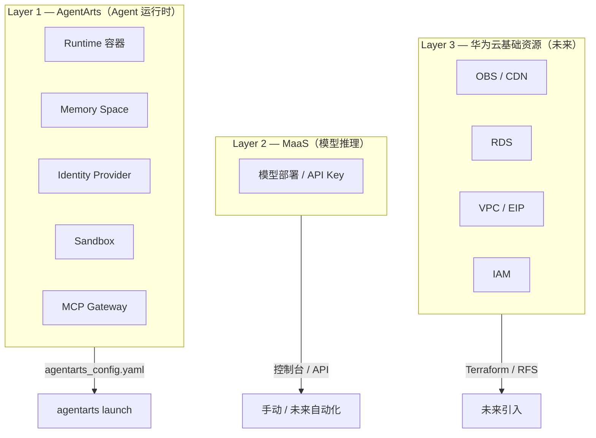
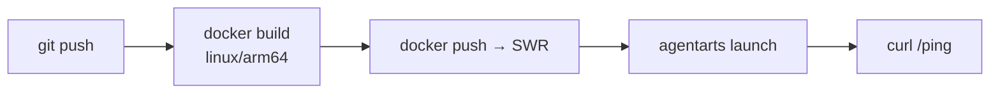

# DevOps — CI/CD 与基础设施即代码

> 版本：v0.1 | 状态：Draft | 关联文档：`local-development.md`

---

## 1. 概述

Personal Assistant 的部署分为三层，每层的配置管理和自动化策略不同：



---

## 2. Layer 1 — AgentArts 层（当前）

### 2.1 agentarts_config.yaml 就是 IaC

`agentarts_config.yaml` 已经承担了基础设施即代码的角色。它声明式地定义了：

- 容器配置（base image、entrypoint、端口、平台架构）
- 镜像仓库（SWR）
- 网络模式（PUBLIC / PRIVATE）
- 认证配置（Inbound JWT / API Key）
- 可观测性（Tracing / Metrics / Logging）
- 环境变量（MODEL_API_KEY、MEMORY_SPACE_ID 等）

执行 `agentarts launch` 相当于 `terraform apply` —— 把声明转为实际运行的资源。

### 2.2 当前 CI/CD 方案



由于项目初期以手动部署为主，完整 CI 流水线可以后续建立。推荐路径：

| 阶段 | 工具 | 触发条件 |
|------|------|----------|
| Lint & Type Check | ruff + mypy | 每个 PR |
| 单元测试 | pytest | 每个 PR |
| 构建镜像 | `docker build --platform linux/arm64` | merge 到 main |
| 推送 SWR | `docker push` + `agentarts launch` | merge 到 main |
| 冒烟测试 | `curl /invocations` | 部署后 |

> 完整部署操作手册见 [agentarts-deploy-runbook.md](./agentarts-deploy-runbook.md)。

### 2.3 注意事项

- AgentArts 部署需要 ARM64 镜像。CI Runner 必须是 ARM64 机器或使用 QEMU 模拟（`docker buildx`）
- SWR 不支持 OCI 镜像格式。Docker 27+ 需设置 `export BUILDKIT_USE_OCI_MEDIA_TYPES=0`
- `agentarts launch` 需要华为云 CLI 认证（AK/SK 或 IAM Token）

---

## 3. Layer 2 — MaaS 层（当前）

MaaS 的模型部署和 API Key 管理目前通过控制台操作，没有声明式模板。

**当前策略**：手动在控制台操作。MaaS 模型选择是一次性决策（ADR-005），变更频率极低，手动操作成本可接受。

**未来自动化**：如果需要在 CI 中自动化 MaaS 配置，MaaS 提供 REST API，可以通过脚本调用。但目前没有这个需求。

---

## 4. Layer 3 — 华为云基础资源（未来）

当项目需要 `agentarts_config.yaml` 管不到的华为云基础资源时，引入 IaC。

### 4.1 触发时机

以下场景出现任意一个，就应该建立 `infra/` 目录：

| 场景 | 需要的资源 |
|------|-----------|
| Web Chat 前端需要静态托管 | ✅ OBS Bucket + CDN 加速域名（已实现，由 `personal-assistant-infra/` CDKTF 管理；部署操作见 [agentarts-deploy-runbook.md](./agentarts-deploy-runbook.md)） |
| 用户-渠道 ID 映射需要持久化存储 | RDS（PostgreSQL） |
| OfficeClaw 需要固定公网入口 | EIP + 带宽配置 |
| Identity STS Provider 需要授权 | IAM Agency / Role / Policy |
| Web Chat 需要 HTTPS | SSL 证书 + WAF / ELB |

### 4.2 工具选择

#### RFS 和 Terraform 的关系

**RFS 本质上就是一个托管的 Terraform 引擎。** 从华为云官方文档：

> "RFS 是完全支持业界事实标准 Terraform（HCL + Provider）的新一代云服务资源终态编排引擎，兼容 Terraform 1.5.2"

关键结论：

| 问题 | 答案 |
|------|------|
| RFS 和 Terraform 资源覆盖一样多吗？ | **一样。** 底层用同一个 `huaweicloud` provider，调同一套 API |
| RFS 有自己的模板语言吗？ | **没有。** 用的就是 HCL，和 Terraform 完全相同 |
| 能本地 `plan` 吗？ | Terraform 可以，RFS 不能（必须在控制台操作） |

两者不是竞争关系，而是**同一套东西的两种使用方式**：

```
Terraform CLI（本地）     RFS（华为云控制台）
        │                       │
        └───────┬───────────────┘
                │
      huaweicloud provider（同一个）
                │
       华为云 API（同一套）
```

#### 选哪个？

| 因素 | Terraform CLI | RFS |
|------|--------------|-----|
| **语法** | HCL | HCL（同一套） |
| **状态管理** | 自己管（OBS backend） | RFS 自动托管 |
| **可视化** | 无 | 拖拽编辑器 |
| **本地测试** | ✅ `terraform plan` | ❌ 控制台操作 |
| **CI/CD 集成** | ✅ GitHub Actions 等 | ⚠️ 需调 RFS API |
| **社区生态** | ✅ 模块市场、StackOverflow | ❌ 仅华为云文档 |
| **学习资源** | 丰富 | 较少 |

**推荐 Terraform CLI**。日常开发 `plan`/`apply` 在本地跑，CI 中也更容易集成。如果未来公司有统一管控要求，迁到 RFS 只是在控制台上传同一份 `.tf` 文件，零成本。

#### CDK：用 Python 写基础设施

华为云没有自研 CDK（像 AWS CDK 那样），但可以用 **CDK for Terraform (CDKTF)** —— HashiCorp 官方的 CDK 框架，支持 `huaweicloud` provider。允许用 Python / TypeScript / Java / Go / C# 定义云资源，编译为 Terraform JSON。

```python
# infra/main.py — 用 Python 定义 OBS 桶
from cdktf import App, TerraformStack
from imports.huaweicloud.obs_bucket import ObsBucket

class PersonalAssistantStack(TerraformStack):
    def __init__(self, scope, id):
        super().__init__(scope, id)
        ObsBucket(self, "web_chat",
            bucket="personal-assistant-web-chat",
            acl="public-read"
        )

app = App()
PersonalAssistantStack(app, "pa")
app.synth()
```

| CDK 方式 | 适合谁 |
|----------|--------|
| **CDKTF (Python)** | Python 技术栈团队，想用代码而不是 HCL 管基础设施 |
| **Terraform HCL** | 大多数团队，声明式语言，文档和示例最丰富 |

考虑到你有 AWS CDK 经验，CDKTF 上手会很快。但项目初期资源少（可能就一个 OBS + RDS），用 HCL 更直接，不需要引入额外依赖。两者不互斥，可以混用。

### 4.3 Terraform + AgentArts 的共存

两者互不冲突，管理的是不同层的资源：

```
infra/
├── main.tf              # Provider 配置 + Backend
├── obs.tf               # OBS 桶（Web Chat 前端托管）
├── rds.tf               # RDS 实例（用户映射表）
├── iam.tf               # IAM 角色/策略
└── variables.tf         # 环境变量

agentarts_config.yaml    # AgentArts 层（容器/认证/可观测）
```

部署时互不影响：`terraform apply` 管华为云资源，`agentarts launch` 管 Agent 容器。

### 4.4 示例：未来可能的 Terraform 配置

```hcl
terraform {
  required_providers {
    huaweicloud = {
      source  = "huaweicloud/huaweicloud"
      version = "~> 1.60"
    }
  }
  backend "s3" {
    bucket = "pa-terraform-state"
    key    = "prod/terraform.tfstate"
    region = "cn-southwest-2"
  }
}

provider "huaweicloud" {
  region = "cn-southwest-2"
}

# Web Chat 前端静态托管
resource "huaweicloud_obs_bucket" "web_chat" {
  bucket = "personal-assistant-web-chat"
  acl    = "public-read"

  website {
    index_document = "index.html"
    error_document = "index.html"
  }
}

# 用户-渠道映射数据库
resource "huaweicloud_rds_instance" "user_mapping" {
  name              = "pa-user-mapping"
  flavor            = "rds.pg.n1.large.2"
  availability_zone = ["cn-southwest-2a"]

  db {
    type     = "PostgreSQL"
    version  = "14"
    password = var.db_password
  }

  vpc_id    = huaweicloud_vpc.main.id
  subnet_id = huaweicloud_vpc_subnet.main.id
}
```

---

## 5. 分层决策总结

| 层 | 当前状态 | IaC 工具 | 变更频率 |
|------|----------|----------|----------|
| Layer 1 — AgentArts | `agentarts_config.yaml` | `agentarts launch` | 每次代码变更 |
| Layer 2 — MaaS | 控制台手动 | 无（REST API 可备选） | 极低（模型选型是 ADR 级决策） |
| Layer 3 — 基础资源 | 尚未需要 | Terraform（推荐） | 首次创建 + 偶尔变更 |
