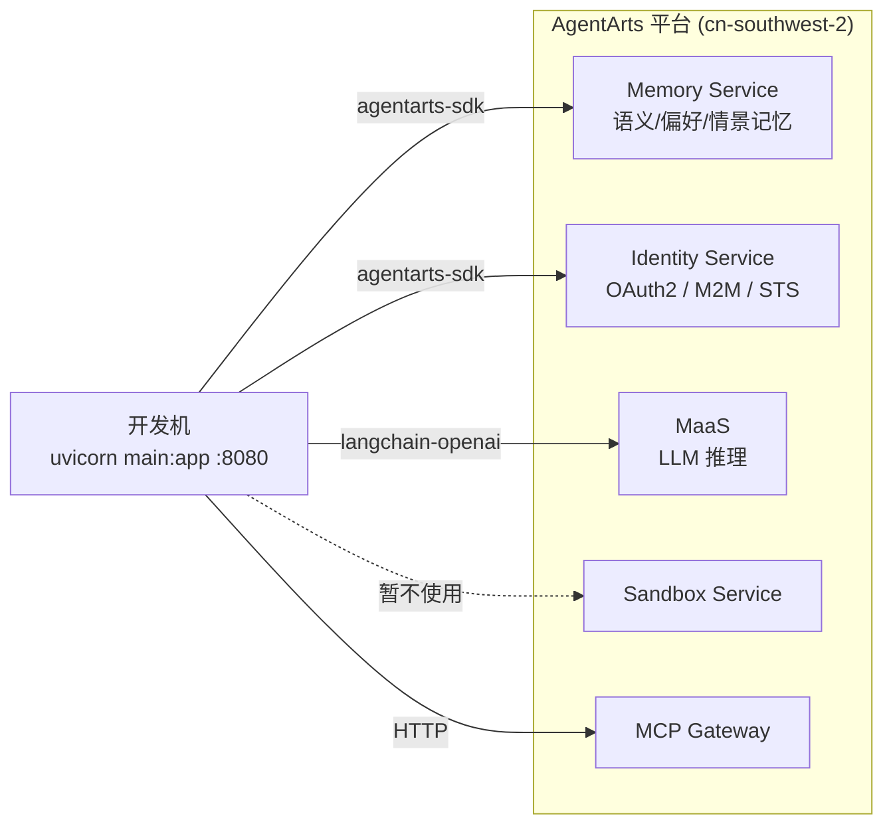

# DevOps — 开发环境

> 版本：v0.1 | 状态：Draft | 关联文档：`overall_architecture.md`

---

## 1. 本地开发模式

Personal Assistant 的本地开发不需要任何本地服务 Mock。所有后端能力（Memory、Identity、MaaS、Sandbox、MCP Gateway）均为 AgentArts 云端 API，通过 `agentarts-sdk` 网络调用。本地只需启动 FastAPI 即可。

### 1.1 依赖关系



### 1.2 网络要求

**核心前提：AgentArts 平台服务（Memory、Identity、Sandbox）必须在华为内网环境。**

LLM Provider 网络要求因 provider 而异：

| 环境 | Memory / Identity / Sandbox | MaaS LLM | DeepSeek 官方 LLM |
|------|---------------------------|----------|-------------------|
| 办公室有线网络 | ✅ | ✅ | ✅ |
| 办公室 Wi-Fi (Huawei-Internal) | ✅ | ✅ | ✅ |
| VPN (AnyConnect / SecoClient) | ✅ | ✅ | ✅ |
| 家庭网络（无 VPN） | ❌ | ❌ | ✅ |

> 这不是平台绑定问题。所有云服务（AWS/GCP/Azure）都要求网络可达。AgentArts 服务的特殊性仅在于它们部署在华为云内网而非公网。

### 1.3 本地启动

```bash
# 1. 配置环境变量（从 AgentArts 控制台获取）
# MaaS Provider（默认，需华为内网）
export MAAS_API_KEY="<MaaS API Key>"
# DeepSeek 官方 Provider（备选，公网可达，无 VPN 时使用）
export DEEPSEEK_API_KEY="<DeepSeek 官方 API Key>"
# 公共
export MEMORY_SPACE_ID="<Memory Space ID>"

# 2. 创建 config.yaml（选择默认 provider）
cat > config.yaml << 'EOF'
llm:
  default: deepseek  # 无 VPN 时选 deepseek，有 VPN 时选 maas
  providers:
    maas:
      base_url: https://api.modelarts-maas.com/openai/v1
      api_key_env: MAAS_API_KEY
      model: deepseek-v4-pro
    deepseek:
      base_url: https://api.deepseek.com
      api_key_env: DEEPSEEK_API_KEY
      model: deepseek-chat
EOF

# 3. 启动
cd personal-assistant
uvicorn app.main:app --port 8080 --reload
```

`--reload` 开启热重载，代码改动自动重启。

### 1.4 验证

```bash
# 健康检查
curl http://localhost:8080/ping
# → {"status": "ok"}

# 调用 Agent（非流式）
curl -X POST http://localhost:8080/invocations \
  -H "Content-Type: application/json" \
  -H "X-AgentArts-User-Id: dev-user" \
  -d '{"message": "你好"}'
# → {"response": "..."}
```

---

## 2. Identity 开发说明

### 2.1 Outbound 认证的预配置

Identity 的三种 Outbound 模式依赖 AgentArts 控制台预创建的 Credential Provider：

| Provider | 用途 | 认证模式 | 预配置内容 |
|----------|------|----------|-----------|
| `github-provider` | GitHub API | OAuth2 / USER_FEDERATION | GitHub OAuth App 的 client_id + client_secret |
| `m365-provider` | Microsoft 365 (Outlook/Calendar) | OAuth2 / USER_FEDERATION | Microsoft Entra ID 应用注册的 client_id + client_secret |
| `internal-api-provider` | 企业内部 API | API Key / M2M | API Key |
| `huaweicloud-sts-provider` | 华为云资源 | STS / M2M | Agency URN |

> 这些 Provider 在 AgentArts 控制台一次性创建，代码中通过 `provider_name` 引用。本地开发和云端部署共用同一套 Provider 配置。

### 2.2 首次使用 OAuth2 Provider 的授权

USER_FEDERATION 模式需要用户完成一次 OAuth 授权：

1. Agent 首次调用 `@require_access_token(provider_name="github-provider", ...)` 时，Identity Service 发现用户未授权
2. 返回 OAuth 授权 URL
3. 用户在浏览器中完成授权
4. 后续调用自动使用刷新后的 token

> 开发阶段可用 API Key（`key_auth`）方式绕过 OAuth，直接在 `agentarts_config.yaml` 中配置。

---

## 3. Memory 开发说明

### 3.1 Memory Space 创建

```bash
# 在 AgentArts 控制台创建 Memory Space，获取 Space ID
# Space ID 格式：xxxxxxxx-xxxx-xxxx-xxxx-xxxxxxxxxxxx
export MEMORY_SPACE_ID="<your-space-id>"
```

一个 Personal Assistant 实例对应一个 Memory Space。开发环境和生产环境可以使用不同的 Space。

### 3.2 记忆生成延迟

AgentArts Memory 的记忆抽取是异步的。文档示例中使用 **30s 等待** 确保记忆生成完成。开发时如果发现刚保存的记忆查不到，这是正常行为。

---

## 4. 环境变量一览

| 变量 | 必需 | 说明 | 获取方式 |
|------|------|------|----------|
| `MAAS_API_KEY` | ⚠️ MaaS 使用时 | MaaS API Key | AgentArts 控制台 → MaaS → 服务详情 |
| `DEEPSEEK_API_KEY` | ⚠️ DeepSeek 使用时 | DeepSeek 官方 API Key | [DeepSeek 控制台](https://platform.deepseek.com/api_keys) |
| `MEMORY_SPACE_ID` | ✅ | Memory Space ID | AgentArts 控制台 → Memory |
| `HUAWEICLOUD_SDK_AK` | ⚠️ | 华为云 AK | IAM 控制台（使用 Identity SDK 时需要） |
| `HUAWEICLOUD_SDK_SK` | ⚠️ | 华为云 SK | IAM 控制台（使用 Identity SDK 时需要） |

> **Provider 选择**：通过 `config.yaml` 的 `llm.default` 控制（`maas` 或 `deepseek`）。API Key 通过上述环境变量注入，`config.yaml` 仅存储变量名引用。

---

## 5. 常见问题

### Q: 本地启动后 `/invocations` 返回 500？

检查：LLM API Key 是否有效（`MAAS_API_KEY` 或 `DEEPSEEK_API_KEY`）、`config.yaml` 的 `llm.default` 是否匹配已配置的环境变量、网络是否可达对应 provider、`MEMORY_SPACE_ID` 是否正确。

### Q: GitHub 工具调用失败？

检查 `github-provider` 是否在 AgentArts 控制台正确创建，OAuth 授权是否完成。

### Q: 在家无法开发怎么办？

连接公司 VPN（AnyConnect / SecoClient）后即可正常开发。VPN 连通后所有 AgentArts 服务可达。
