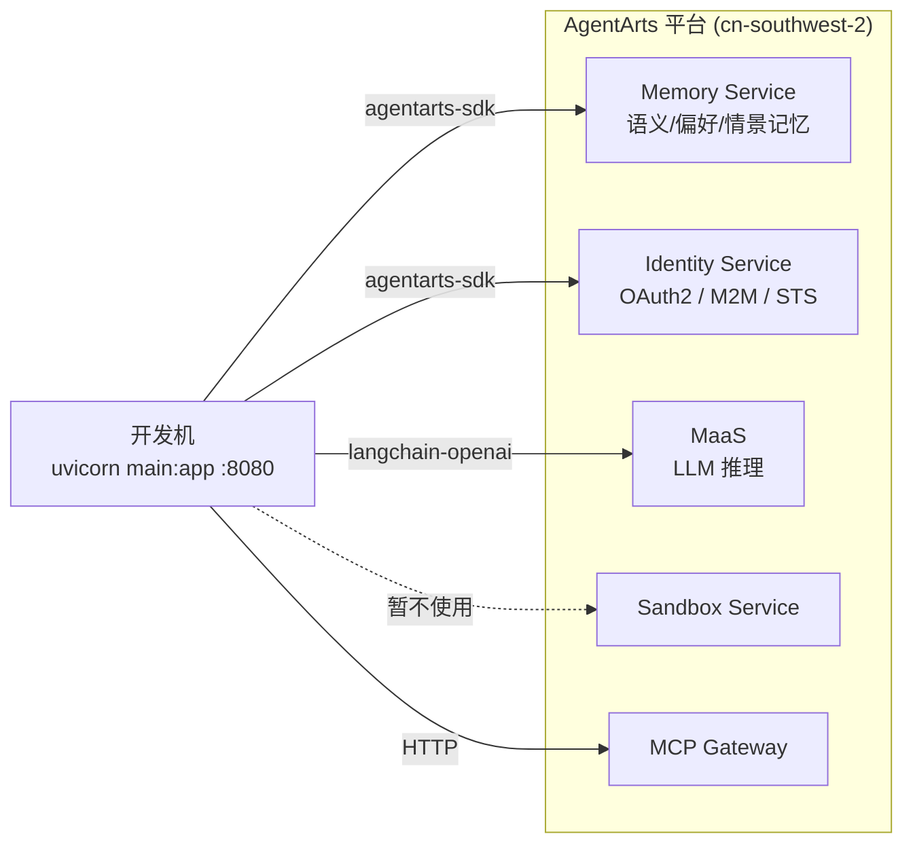
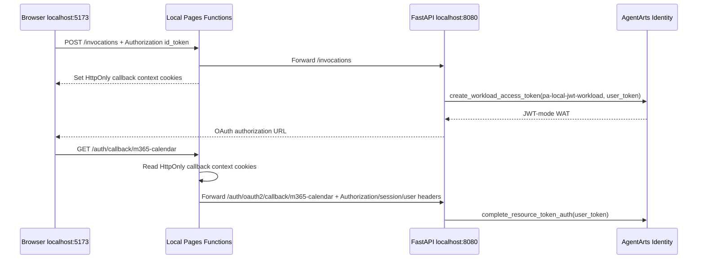

# DevOps — 开发环境

> 版本：v0.1 | 状态：Draft | 关联文档：`overall_architecture.md`

---

## 1. 本地开发模式

Personal Assistant 的本地开发不需要任何本地服务 Mock。所有后端能力（Memory、Identity、MaaS、Sandbox、MCP Gateway）均为 AgentArts 云端 API，通过 `agentarts-sdk` 网络调用。普通 Service 开发只需启动 FastAPI；Calendar OAuth2 full flow 需要额外启动本地 Cloudflare Pages Functions，详见 [2.2 首次使用 OAuth2 Provider 的授权](#22-首次使用-oauth2-provider-的授权)。

### 1.1 依赖关系


```mermaid
flowchart LR
    DevMachine["开发机<br/>uvicorn main:app :8080"]
    
    subgraph AgentArts["AgentArts 平台 (cn-southwest-2)"]
        Memory["Memory Service<br/>语义/偏好/情景记忆"]
        Identity["Identity Service<br/>OAuth2 / M2M / STS"]
        MaaS["MaaS<br/>LLM 推理"]
        Sandbox["Sandbox Service"]
        Gateway["MCP Gateway"]
    end
    
    DevMachine -->|"agentarts-sdk"| Memory
    DevMachine -->|"agentarts-sdk"| Identity
    DevMachine -->|"langchain-openai"| MaaS
    DevMachine -.->|"暂不使用"| Sandbox
    DevMachine -->|"HTTP"| Gateway
```

### 1.2 网络要求

**核心前提：AgentArts 平台服务（Memory、Identity、Sandbox）必须在华为内网环境。**

LLM Provider 网络要求因 provider 而异：

| 环境 | Memory / Identity / Sandbox | MaaS LLM | DeepSeek 官方 LLM |
|------|---------------------------|----------|-------------------|
| 办公室有线网络 | ✅ | ✅ | ✅ |
| 办公室 Wi-Fi (Huawei-Internal) | ✅ | ✅ | ✅ |
| VPN (AnyConnect / SecoClient) | ✅ | ✅ | ✅ |
| 家庭网络（无 VPN） | ❌ | ❌ | ✅ |

> 这不是平台绑定问题。所有云服务（AWS/GCP/Azure）都要求网络可达。AgentArts 服务的特殊性仅在于它们部署在华为云内网而非公网。

### 1.3 本地启动

```bash
# 1. 唯一配置入口
cd personal-assistant-service
cp .env.example .env

# 2. 按需编辑 .env；真实 API Key 不写入 .env
# 在 AgentArts Identity 创建 API Key provider，名称与
# LLM_CREDENTIAL_PROVIDER 一致。

# 3. 启动
uv run uvicorn app.main:app --port 8080 --reload
```

`--reload` 开启热重载，代码改动自动重启。

### 1.4 验证

```bash
# 健康检查
curl http://localhost:8080/ping
# → {"status": "ok"}

# 调用 Agent（非流式）
curl -X POST http://localhost:8080/invocations \
  -H "Content-Type: application/json" \
  -H "X-AgentArts-User-Id: dev-user" \
  -d '{"message": "你好"}'
# → {"response": "..."}
```

---

## 2. Identity 开发说明

> 💡 **Microsoft 登录与授权配置**：关于如何注册与配置 Microsoft 开放平台、获取 `client_id` & `client_secret` 等步骤，详见 [Microsoft Entra ID (OIDC) 配置指南](microsoft-entra-id-setup.md)。

### 2.1 Outbound 认证的预配置

Identity 的三种 Outbound 模式依赖 AgentArts 控制台预创建的 Credential Provider：

| Provider | 用途 | 认证模式 | 预配置内容 |
|----------|------|----------|-----------|
| `github-provider` | GitHub API | OAuth2 / USER_FEDERATION | GitHub OAuth App 的 client_id + client_secret |
| `m365-provider` | Microsoft 365 (Outlook/Calendar) | OAuth2 / USER_FEDERATION | Microsoft Entra ID 应用注册的 client_id + client_secret |
| `internal-api-provider` | 企业内部 API | API Key / M2M | API Key |
| `huaweicloud-sts-provider` | 华为云资源 | STS / M2M | Agency URN |

> 这些 Provider 在 AgentArts 控制台一次性创建，代码中通过 `provider_name` 引用。本地开发和云端部署共用同一套 Provider 配置。

### 2.2 首次使用 OAuth2 Provider 的授权

USER_FEDERATION 模式需要用户完成一次 OAuth 授权：

1. Agent 首次调用 `@require_access_token(provider_name="github-provider", ...)` 时，Identity Service 发现用户未授权
2. 返回 OAuth 授权 URL
3. 用户在浏览器中完成授权
4. 后续调用自动使用刷新后的 token

Calendar OAuth2 callback 分为 production 与 local full-flow 两种运行形态：

| 环境 | 前端运行时 | Callback URL | WAT 来源 |
|------|------------|--------------|----------|
| Production / Pages preview | Cloudflare Pages + Pages Functions | `https://agentarts-personal-assistant.pages.dev/auth/callback/m365-calendar` | AgentArts Gateway 注入 `X-HW-AgentGateway-Workload-Access-Token` |
| Local full-flow | `wrangler pages dev` 本地运行 Pages Functions | `http://localhost:5173/auth/callback/m365-calendar` | Service 用 Microsoft Entra ID token 主动创建 JWT-mode WAT |

本地 Calendar OAuth2 full flow 不使用 Vite-only React fallback。必须用 local
Cloudflare Pages Functions 复用 production BFF 的 callback cookie relay：


```mermaid
sequenceDiagram
    participant Browser as Browser localhost:5173
    participant Pages as Local Pages Functions
    participant Service as FastAPI localhost:8080
    participant Identity as AgentArts Identity

    Browser->>Pages: POST /invocations + Authorization id_token
    Pages->>Service: Forward /invocations
    Pages-->>Browser: Set HttpOnly callback context cookies
    Service->>Identity: create_workload_access_token(pa-local-jwt-workload, user_token)
    Identity-->>Service: JWT-mode WAT
    Service-->>Browser: OAuth authorization URL
    Browser->>Pages: GET /auth/callback/m365-calendar
    Pages->>Pages: Read HttpOnly callback context cookies
    Pages->>Service: Forward /auth/oauth2/callback/m365-calendar + Authorization/session/user headers
    Service->>Identity: complete_resource_token_auth(user_token)
```

首次本地 full-flow 测试前，先确保存在 customer-owned `CUSTOM_JWT` Workload
Identity。默认名称是 `pa-local-jwt-workload`，对应 Service 默认配置
`AGENT_IDENTITY_LOCAL_JWT_WORKLOAD_NAME=pa-local-jwt-workload`。不要使用
AgentArts Runtime service-created `agent-personal-assistant`；该 identity 可以由
Gateway 使用，但本地 SDK 主动调用 `create_workload_access_token()` 会 404。

```bash
cd personal-assistant-infra
uv run python scripts/ensure_local_jwt_workload_identity.py \
  --region cn-southwest-2 \
  --apply
```

该 helper 默认使用 Microsoft Entra v2 discovery URL，校验
`allowed_audience=<VITE_ENTRA_CLIENT_ID>`，并省略 optional `allowed_clients` /
`allowed_scopes` / `custom_claims`。不要把这些 optional list 显式配置为空数组；
Agent Identity 后端不会把省略字段和空数组视为等价配置。

Service `.env` 需要指向本地 Pages callback：

```bash
OAUTH2_CALENDAR_CALLBACK_URL=http://localhost:5173/auth/callback/m365-calendar
# 默认值已是 pa-local-jwt-workload；只有需要覆盖时才设置
# AGENT_IDENTITY_LOCAL_JWT_WORKLOAD_NAME=pa-local-jwt-workload
```

启动 Service：

```bash
cd personal-assistant-service
uv run uvicorn app.main:app --host 127.0.0.1 --port 8080 --reload
```

启动本地 Pages runtime：

```bash
cd personal-assistant-client
npm run pages:dev:local
```

`pages:dev:local` 会先构建 Vite，再用 Wrangler 在
`http://localhost:5173` 启动静态站点与 Pages Functions，并注入以下本地绑定：

```text
/invocations -> http://localhost:8080/invocations
/auth/callback/m365-calendar -> http://localhost:8080/auth/oauth2/callback/m365-calendar
```

Microsoft Entra redirect URI 与 `OAUTH2_CALENDAR_CALLBACK_URL` 都使用
`http://localhost:5173`，不要混用 `127.0.0.1:5173`。`npm run dev` 仍可用于普通
UI / chat 开发，但不作为 Calendar OAuth2 full-flow callback relay 验证路径。

production / Pages preview 若启用 BFF callback secret，需要在 Pages 与 Service 同时配置：

```bash
OAUTH2_CALLBACK_BFF_SECRET=<same-random-secret>
```

本地 `pages:dev:local` 默认没有注入该 header，因此本地
`OAUTH2_CALENDAR_CALLBACK_URL=http://localhost:5173/auth/callback/m365-calendar`
时不要在 Service `.env` 配置 `OAUTH2_CALLBACK_BFF_SECRET`；除非你同时给
Wrangler local Pages Functions 注入同名 secret。

production 配置 `POSTGRES_DSN` 后，Service 会把 OAuth2 callback nonce 的
active/completed 状态写入 PostgreSQL；未配置时仅使用进程内 fallback，适合本地开发。

> 开发阶段可用 API Key（`key_auth`）方式绕过 OAuth，直接在 `agentarts_config.yaml` 中配置。

---

## 3. Memory 开发说明

### 3.1 Memory Space 创建

```bash
# 在 AgentArts 控制台创建 Memory Space，获取 Space ID
# Space ID 格式：xxxxxxxx-xxxx-xxxx-xxxx-xxxxxxxxxxxx
export MEMORY_SPACE_ID="<your-space-id>"
```

一个 Personal Assistant 实例对应一个 Memory Space。开发环境和生产环境可以使用不同的 Space。

### 3.2 记忆生成延迟

AgentArts Memory 的记忆抽取是异步的。文档示例中使用 **30s 等待** 确保记忆生成完成。开发时如果发现刚保存的记忆查不到，这是正常行为。

---

## 4. 环境变量一览

| 变量 | 必需 | 说明 | 获取方式 |
|------|------|------|----------|
| `LLM_PROVIDER` | 否 | internal Provider catalog key | `.env.example` |
| `LLM_MODEL` | 否 | 模型名称 | `.env.example` |
| `LLM_CREDENTIAL_PROVIDER` | 否 | AgentArts Identity provider name（不是 Secret） | `.env.example` |
| `SQLITE_DB_PATH` | 否 | 本地 Checkpointer | `.env.example` |
| `POSTGRES_DSN` | 否 | 生产 Checkpointer，与 SQLite 二选一 | `.env.example` |

真实 API Key 只配置在 AgentArts Identity。应用配置的完整列表以
`personal-assistant-service/.env.example` 为准。

---

## 5. 常见问题

### Q: 本地启动后 `/invocations` 返回 500？

检查：`LLM_PROVIDER` 是否存在于 built-in catalog、
`LLM_CREDENTIAL_PROVIDER` 对应的 AgentArts Identity provider 是否存在、网络是否
可达对应 Provider。

### Q: GitHub 工具调用失败？

检查 `github-provider` 是否在 AgentArts 控制台正确创建，OAuth 授权是否完成。

### Q: 在家无法开发怎么办？

连接公司 VPN（AnyConnect / SecoClient）后即可正常开发。VPN 连通后所有 AgentArts 服务可达。
