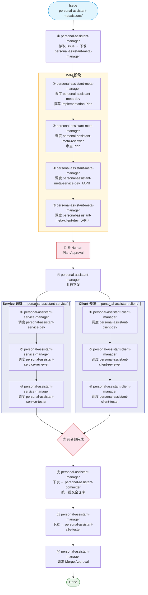

# OpenCode Agent Workflow — Tree-Structured with Control Loops

## Overview

OpenCode sub-agent 工作流采用 **三层树状结构**。工作流是 **Issue 驱动的**——输入是 `personal-assistant-meta/issues/` 下的一个 Issue，输出是 Mono-Repo 内的完整实现。

与 AnyWear 的关键区别：**单仓库**（无 Git Submodule）。三个领域对应三个目录：`personal-assistant-meta/`、`personal-assistant-service/`、`personal-assistant-client/`，共享同一个 Git 仓库和分支。

核心设计：

1. **引入领域 Manager 层**：personal-assistant-manager（顶层）不再直接调度 worker，而是将任务分解给三个领域 Manager。
2. **每个领域 Manager 跑独立的 Control Loop**：Manager 在自己的领域内调度 Dev → Reviewer → Tester，根据反馈决定通过还是重来。
3. **层级化决策**：顶层 Manager 只管分解和集成验证，领域 Manager 管自己领域内的质量闭环。
4. **统一 Committer**：所有 Git 提交由 `personal-assistant-committer` 在 Service 和 Client 两个领域都完成后统一执行，不再在每个领域 loop 内各自提交。

## Agent 组织结构

三个领域与目录一一对应：`personal-assistant-meta/`、`personal-assistant-service/`、`personal-assistant-client/`。

```mermaid
graph TD
    AM["<b>personal-assistant-manager</b><br/>顶层 Orchestrator<br/>任务分解 · 集成验证 · 合并"]
    AM_E2E["<b>personal-assistant-e2e-tester</b><br/>端到端联调测试<br/>跨 Service + Client"]
    AM_C["<b>personal-assistant-committer</b><br/>统一提交<br/>git add 全仓库"]
    HUMAN["👤 Human in the Loop<br/>Plan Approval Gate"]

    subgraph META["<b>Meta 领域</b> — personal-assistant-meta/"]
        MM["<b>personal-assistant-meta-manager</b><br/>领域 Orchestrator<br/>Plan 闭环 · API 同步"]
        MD["personal-assistant-meta-dev<br/>撰写 Implementation Plan"]
        MR["personal-assistant-meta-reviewer<br/>审查 Implementation Plan"]
        SD_API["personal-assistant-meta-service-dev<br/>API 接口更新"]
        CD_API["personal-assistant-meta-client-dev<br/>API 类型同步"]
    end

    subgraph SERVICE["<b>Service 领域</b> — personal-assistant-service/"]
        SM["<b>personal-assistant-service-manager</b><br/>领域 Orchestrator"]
        SD["personal-assistant-service-dev<br/>后端功能实现"]
        SR["personal-assistant-service-reviewer<br/>后端代码审查"]
        ST["personal-assistant-service-tester<br/>单元测试 · 集成测试"]
    end

    subgraph CLIENT["<b>Client 领域</b> — personal-assistant-client/"]
        CM["<b>personal-assistant-client-manager</b><br/>领域 Orchestrator"]
        CD["personal-assistant-client-dev<br/>前端功能实现"]
        CR["personal-assistant-client-reviewer<br/>前端代码审查"]
        CT["personal-assistant-client-tester<br/>单元测试 · 集成测试"]
    end

    AM --> AM_C
    AM --> AM_E2E
    AM --> MM
    AM --> SM
    AM --> CM
    AM -.-> HUMAN

    MM --> MD
    MM --> MR
    MM --> SD_API
    MM --> CD_API

    SM --> SD
    SM --> SR
    SM --> ST

    CM --> CD
    CM --> CR
    CM --> CT

    style AM fill:#e1f5fe,stroke:#0288d1
    style MM fill:#fff3e0,stroke:#f57c00
    style SM fill:#fff3e0,stroke:#f57c00
    style CM fill:#fff3e0,stroke:#f57c00
    style AM_E2E fill:#e3f2fd,stroke:#1565c0
    style AM_C fill:#e8f5e9,stroke:#2e7d32
    style HUMAN fill:#fce4ec,stroke:#c62828,stroke-dasharray: 5 5
```



共 16 个 Agent。Meta 领域下的 personal-assistant-meta-service-dev / personal-assistant-meta-client-dev 与 Service/Client 领域下的同名 Agent 是**不同实例**，前者只做 API 同步，后者只做功能开发。

### 与 AnyWear 的结构差异

| | AnyWear | personal-assistant |
|---|---|---|
| 仓库模型 | Root + 3 Submodule | 单仓库，3 个目录 |
| Agent 总数 | 19 | 16（统一 Committer） |
| 分支管理 | 4 个 repo 需同步分支 | 1 个分支 |
| Commit 方式 | 每个 submodule 独立 commit | 统一 Committer 在 Service+Client 都完成后一次性提交 |
| Commit 时机 | 每个领域 loop 内各自 commit | Service 和 Client 都完成后统一 commit |
| Meta Commit | — | Meta 领域不再单独 commit，与 Service/Client 一起提交 |
| API 同步 | Service 生成 spec → Client 拉 submodule | Service 生成 spec → Client 直接引用（同仓库） |
| Merge | 递归 merge（submodule 先，root 后） | 单次 `git merge` |

## 执行顺序（Happy Path）

**相同序号 = 并行执行**。Service 和 Client 在 ⑨-⑪ 完全并行，两者都完成后由统一 Committer 提交，再进入 E2E 测试。



**与 AnyWear 执行顺序的差异**：

- 步骤 ⑫：统一 Committer 在 Service 和 Client 都完成后一次性提交全部变更（Meta + Service + Client），替代了原来各领域 loop 内独立 commit 的模式。
- 步骤 ⑭：不再有独立的 Root-Committer 节点。Merge Approval 由 personal-assistant-manager 直接请求用户审批后执行单次 `git merge`。
- 无 recursive merge：统一 Committer 已提交所有变更到 feature branch，Manager 只需在审批后 merge 到 main。

## Control Loop

每个领域 Manager 内部跑 control loop：Dev → Reviewer → Tester。Manager 不写代码，只做调度和决策。**领域 loop 内不再包含 commit 步骤**——commit 由顶层的 `personal-assistant-committer` 在所有领域完成后统一执行。

Tester 报告失败时，Manager 做三级决策：

| 测试结果 | Manager 决策 | 动作 |
|----------|-------------|------|
| 实现 bug（空指针、类型错误等） | 可修复 | 带错误信息回退到 Dev |
| 设计缺陷（API 语义不对等） | 需重新设计 | 上报 personal-assistant-manager，等 Meta 侧调整 |
| 非阻塞问题（覆盖率略低等） | 接受 | 记录 known issue，验收通过 |

## Committer 规范（Mono-Repo 统一提交）

`personal-assistant-committer` 是**唯一的提交 Agent**，由 personal-assistant-manager 在 Service 和 Client 两个领域都完成后调用。一次性提交全部变更：

| Committer | `git add` 范围 | 调用时机 |
|-----------|---------------|---------|
| personal-assistant-committer | `personal-assistant-meta/` + `personal-assistant-service/` + `personal-assistant-client/` | Service 和 Client 都完成后 |

**设计理由**：

- **原子性**：一次 commit 包含完整的 feature 变更（设计文档 + 后端 + 前端），便于 code review 和回滚。
- **去耦合**：领域 Manager 不再关心 Git 操作，专注于自己的质量控制。
- **简化**：从 3 个 Committer 合并为 1 个，减少 Agent 数量和协调复杂度。

不再有 per-domain Committer，也不再需要 Root Committer（无 submodule pointer 需要跟踪）。

## E2E-Tester

personal-assistant-e2e-tester 与领域 Tester（personal-assistant-service-tester / personal-assistant-client-tester）定位不同：

| | 领域 Tester | personal-assistant-e2e-tester |
|---|---|---|
| 测试范围 | 单个目录 | 跨目录（Service + Client 联调） |
| 测试类型 | 单元测试、内部集成测试 | 端到端场景测试 |
| 运行方式 | 直接跑测试套件 | 调用 Hermes 启动完整环境后执行 |
| 调度者 | 领域 Manager | personal-assistant-manager |
| Agent 类型 | subagent | primary agent |

## Agent 编写规范

以下规范来自 AnyWear 的实践经验，Agent 文件和本文档应保持一致。

### 知识边界 — Orchestrator 只知道直属下级

每个 Manager（Orchestrator）的 agent 文件只描述：

- **自己的直属下级**（委托给哪些 agent）
- **给什么输入、期望什么输出**
- **自己做什么决策**（三级决策表）

**不应出现**的内容：
- 下级 Manager 的内部 worker 结构（Dev/Reviewer/Tester 列表）
- 下级 Manager 的内部控制回路细节
- 具体命令（`pytest`、`npm run build` 等）—— 这些属于 worker 的 agent 文件

| 层级 | 应该知道 | 不应该知道 |
|------|---------|-----------|
| personal-assistant-manager | 5 个直属：meta/service/client/committer/e2e | personal-assistant-meta-manager 内部有 personal-assistant-meta-dev/personal-assistant-meta-reviewer 等 |
| personal-assistant-meta-manager | 4 个直属：personal-assistant-meta-dev/personal-assistant-meta-reviewer/personal-assistant-meta-service-dev/personal-assistant-meta-client-dev | personal-assistant-meta-service-dev 具体怎么更新 API schema |
| personal-assistant-service-manager | 3 个直属：personal-assistant-service-dev/personal-assistant-service-reviewer/personal-assistant-service-tester | Tester 跑 `pytest` 还是 `pytest --cov` |

### 每个 delegate 必须声明 input 和 return

无论是图中还是文字描述，每次委托调用都应明确：

```
delegate(AgentName)
  input: 具体参数列表
  returns: 返回值描述
```

Pipeline 图中用 `-- "returns: xxx" -->` 标注返回值。Delegation Reference 表格用 `input → returns output` 格式。

**检查方法**：从顶层 personal-assistant-manager 开始，逐层追踪每个 delegate 的 input 来源（上一层的 return）和 return 去向（下一层的 input），不能有断链。

### 模式声明 — 同类型 Worker 的不同模式

当同一个 Worker 概念存在多个实例（如 personal-assistant-meta-service-dev 在 Meta 领域做 API 同步、personal-assistant-service-dev 在 Service 领域做功能开发），Manager 委托时必须明确声明 **mode**：

```
Delegate to `personal-assistant-meta-service-dev` in **API sync mode**:
  - explicit scope: update API contracts only. No feature logic.

Delegate to `personal-assistant-service-dev` in **feature development mode**:
  - explicit scope: full backend implementation.
```

Worker 的 agent 文件也应明确自己的 scope 边界（DO / DO NOT 表）。

### task_id 复用 — OpenCode Subagent 上下文保持

OpenCode 的 subagent 模型是**同步阻塞**的：Manager 调用 `delegate_task(goal, context)` 后阻塞等待，subagent 完成后返回结果和一个 `task_id`。

**基本规则**：

```
首次委托: delegate_task(goal, context)  → 返回 { result, task_id }
重复委托: delegate_task(goal, context, task_id=上次返回的)  → subagent 保留历史上下文
```

**Manager 文件中的写法**：每个 worker 的委托说明必须包含 `Record the returned task_id. Reuse on re-delegation.`

**层级隔离**：
- personal-assistant-manager 只跟踪 5 个直属 Manager/Committer 的 `task_id`
- 每个领域 Manager 跟踪自己 worker 的 `task_id`
- 上层 Manager **不跟踪**下层 Manager 内部 worker 的 `task_id`

### 图规范

**Happy Path 图**（执行顺序）：
- 只画正向流程，不画 reject/loop/回退路径
- 回退和异常处理在文字中描述
- 人类审批作为独立步骤编号（非菱形分支）
- 并行分支用 `├` `└` 和 `∥` 标注

**Pipeline 图**（Manager 内部）：
- 用函数调用风格：`delegate(Agent)`、`delegate_parallel()`、`merge()`
- 子图 `subgraph LOOP["loop body"]` 框出可重试区域
- 不在图中画循环箭头 —— Happy Path 是线性的

**组织结构图**（graph TD）：
- 纯树状 org chart，无流程箭头
- 领域间不画跨 subgraph 的箭头
- 同名 Worker 在不同 subgraph 内各自声明（不同实例）
- Human 节点用虚线边框区分

### 公共节点命名

| 图中节点 | 对应的 Agent 文件 |
|---------|------------------|
| personal-assistant-manager | `personal-assistant-manager.md` |
| personal-assistant-meta-manager | `personal-assistant-meta-manager.md` |
| personal-assistant-meta-dev | `personal-assistant-meta-dev.md` |
| personal-assistant-meta-reviewer | `personal-assistant-meta-reviewer.md` |
| personal-assistant-meta-service-dev（API） | `personal-assistant-meta-service-dev.md` |
| personal-assistant-meta-client-dev（API） | `personal-assistant-meta-client-dev.md` |
| personal-assistant-service-manager | `personal-assistant-service-manager.md` |
| personal-assistant-service-dev | `personal-assistant-service-dev.md` |
| personal-assistant-service-reviewer | `personal-assistant-service-reviewer.md` |
| personal-assistant-service-tester | `personal-assistant-service-tester.md` |
| personal-assistant-client-manager | `personal-assistant-client-manager.md` |
| personal-assistant-client-dev | `personal-assistant-client-dev.md` |
| personal-assistant-client-reviewer | `personal-assistant-client-reviewer.md` |
| personal-assistant-client-tester | `personal-assistant-client-tester.md` |
| personal-assistant-committer | `personal-assistant-committer.md` |
| personal-assistant-e2e-tester | `personal-assistant-e2e-tester.md` |

命名规则：`personal-assistant-{domain}-{role}.md`，domain ∈ {meta, service, client}，role ∈ {manager, dev, reviewer, tester}。例外：`personal-assistant-committer.md`（统一 Committer，无 domain 限定）和 `personal-assistant-e2e-tester.md`（E2E 测试）。
