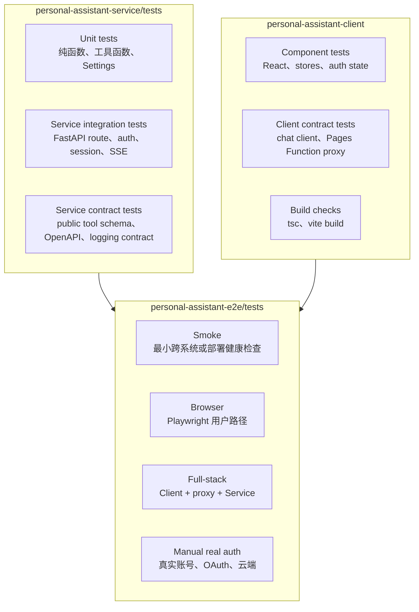
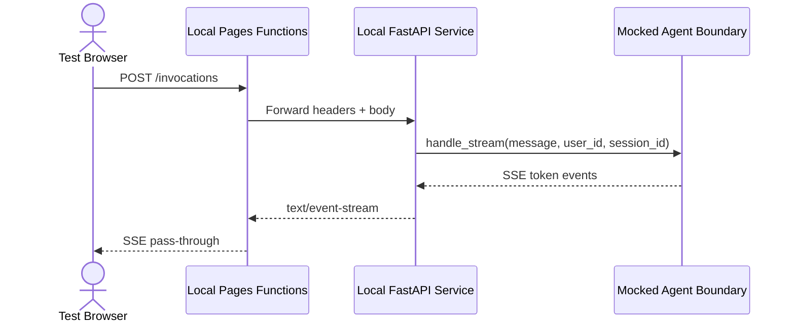
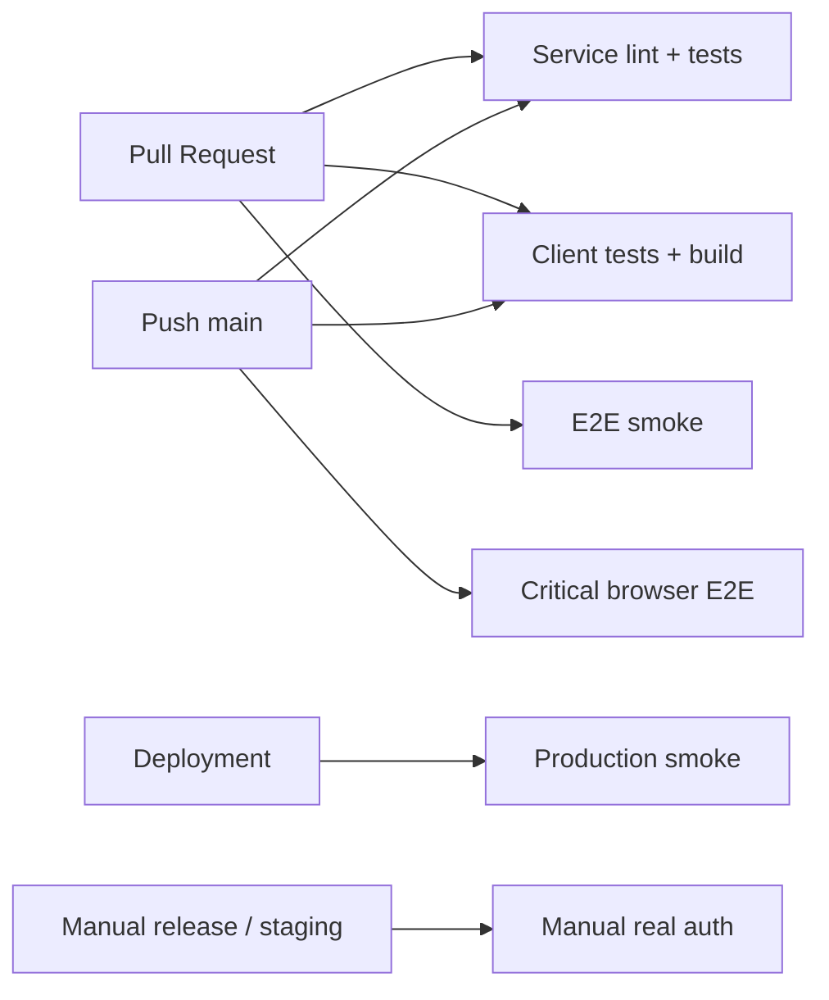

# Personal Assistant 测试分层与归属规范

> 版本：v0.1 | 状态：Draft | 日期：2026-07-09  
> 适用范围：Service、Client、Infra、E2E 测试目录与 CI/CD 门禁设计

---

## 1. 背景

当前仓库已经有较多测试资产，但测试边界存在混用：

- `personal-assistant-service/tests/` 负责 Service 自身的 unit / integration / contract tests。
- `personal-assistant-client/` 负责 React component、chat client、Cloudflare Pages Function 的 unit / contract tests。
- `personal-assistant-e2e/` 应负责跨子系统的产品级验证，但当前混入了若干 `TestClient + FakeAgentHandler` 风格的 Service integration tests。

本文目标不是增加术语，而是统一判断规则：**一个测试应该放在哪里、什么时候进入 CI、什么时候需要真实账号或真实云环境。**

---

## 2. 核心结论

`personal-assistant-e2e/` 不是所有“像 E2E 的测试”的收纳箱。只有满足以下任一条件的测试才应放入该目录：

1. 跨越至少两个可独立部署的子系统，例如 Client + Service、Pages Function + Service。
2. 使用真实浏览器验证用户路径，例如 Playwright 操作 Web Chat。
3. 验证部署后环境，例如 Cloudflare Pages production smoke 或 AgentArts Runtime smoke。
4. 验证真实外部身份或 OAuth flow，例如 Microsoft Entra 登录、Calendar OAuth2 callback。

只验证 FastAPI route、Service auth header、SSE 格式、AgentHandler 调用参数的测试，应优先放在 `personal-assistant-service/tests/`。

---

## 3. 测试地图

图类型：**Component Diagram（组件图）**。用于说明各测试目录覆盖哪些系统边界。



---

## 4. 分层定义

### 4.1 Service tests

Service tests 回答：**Service 自己的行为是否正确？**

放置目录：`personal-assistant-service/tests/`

典型范围：

| 类型 | 示例 | 是否应放入 E2E |
|------|------|----------------|
| Unit | `Settings` 校验、JWT claim parsing、tool input validation | 否 |
| Integration | `POST /invocations` 缺 header 返回 401 | 否 |
| Integration | `stream=true` 返回 `text/event-stream`，最后 `done: true` | 否 |
| Contract | public tool schema 不暴露 `access_token` | 否 |
| Contract | OpenAPI schema diff 符合预期 | 否 |

允许 mock LLM、AgentArts Identity SDK、Microsoft Graph 等外部依赖。重点是验证 Service 内部边界：route、dependency、auth、session、SSE、tool boundary。

### 4.2 Client tests

Client tests 回答：**前端代码和 Pages Function proxy 合同是否正确？**

放置目录：

- `personal-assistant-client/src/**/*.test.ts(x)`
- `personal-assistant-client/functions/*.test.js`

典型范围：

| 类型 | 示例 | 是否应放入 E2E |
|------|------|----------------|
| Component | Landing Page、Login Page、ChatPage component state | 否 |
| Store | auth store hydration、clear token 行为 | 否 |
| Client contract | 有 `idToken` 时发送 `Authorization: Bearer ...` | 否 |
| Proxy contract | Pages Function 透传 `Authorization`、session header、user header | 否 |
| Build | `npm run build` 生成 `dist/index.html` | 通常否，CI 可作为 build gate |

如果只调用 JS function 或渲染单个 React component，不应放入 `personal-assistant-e2e/`。

### 4.3 E2E smoke

E2E smoke 回答：**跨系统主入口是否还活着？**

放置目录：`personal-assistant-e2e/tests/smoke/`

准入规则：必须跨越至少一个部署边界或进程边界。单纯 `TestClient(app)` 不算 E2E smoke。

典型范围：

| 示例 | 边界 |
|------|------|
| 启动 Service subprocess，`GET /ping` 返回 200 | process-level Service |
| 启动 Vite + Service，`POST /invocations` 经过 Vite proxy 后到达 Service | Client dev server + Service |
| production Pages `/` 返回 200 | deployed Frontend |
| production Pages `/invocations` 无身份返回 401 | deployed Frontend + AgentArts Gateway auth gate |

Smoke 不验证深层业务正确性，只确认入口、路由、部署和基本 auth gate 没坏。

### 4.4 E2E browser

E2E browser 回答：**真实浏览器中的用户路径是否可用？**

放置目录：`personal-assistant-e2e/tests/browser/`

典型范围：

| 示例 | 说明 |
|------|------|
| 打开 Landing Page，点击“开始对话”，进入 Login Page | UI navigation |
| mock 已登录状态后进入 ChatPage，输入消息，触发 `/invocations` | Browser + Client runtime |
| token 过期后不发送旧 token，并回到登录入口 | Auth lifecycle regression |
| 点击“新对话”后清空 thread 和 session id | Browser + Client state |

Browser tests 可以 mock MSAL 或后端响应。其重点是用户可见行为，不是验证真实 Microsoft 登录。

### 4.5 E2E full-stack

E2E full-stack 回答：**本地生产拓扑是否接得上？**

放置目录：`personal-assistant-e2e/tests/full_stack/`

推荐拓扑：

图类型：**Sequence Diagram（时序图）**。用于说明本地 full-stack E2E 请求路径。



典型范围：

| 示例 | 说明 |
|------|------|
| `npm run pages:dev:local` + Service subprocess | 接近 Cloudflare Pages production path |
| `/auth/callback/m365-calendar` 由 Pages Function 转发到 Service callback | 验证 callback bridge |
| SSE 从 Service 穿过 Pages Function 到浏览器 | 验证 streaming pass-through |

Full-stack tests 可以 mock LLM、Graph API、AgentArts SDK，但不应 mock Pages Function 与 Service 之间的 HTTP 边界。

### 4.6 Manual real auth

Manual real auth 回答：**真实账号、真实 OAuth、真实云环境是否跑通？**

放置目录：`personal-assistant-e2e/tests/manual/` 或独立 runbook

典型范围：

| 示例 | 说明 |
|------|------|
| 使用真实 Microsoft Entra 测试账号登录 Web Chat | Inbound login |
| 获取真实 ID token 后调用 Cloudflare Pages `/invocations` | production-like auth |
| 触发 Calendar OAuth2 AuthCard，完成 Microsoft 授权 callback | Outbound OAuth2 full flow |
| 授权后再次询问日程，确认工具可用 | end-to-end delegated access |

Manual real auth 不进入默认 PR gate。它需要受控测试账号、环境保护、密钥管理和明确的人工触发策略。

---

## 5. 目录归属规则

### 5.1 Two-boundary rule

一个测试如果只触达一个子系统，应放在该子系统自己的测试目录。只有跨越两个或更多边界时，才放入 `personal-assistant-e2e/`。

| 测试形态 | 归属 |
|----------|------|
| `TestClient(app)` + mocked `AgentHandler` | `personal-assistant-service/tests/` |
| `httpx` 请求 Service subprocess | 视目的而定：Service process smoke 可在 E2E smoke；Service 行为细节仍放 Service tests |
| Vitest render React component | `personal-assistant-client/` |
| 调用 `functions/invocations.js` 并 mock `fetch` | `personal-assistant-client/functions/*.test.js` |
| Vite dev server + Service subprocess | `personal-assistant-e2e/` |
| Playwright 操作浏览器 | `personal-assistant-e2e/` |
| Wrangler Pages dev + Service subprocess | `personal-assistant-e2e/` |
| Production Cloudflare Pages + AgentArts Gateway | `personal-assistant-e2e/` 或 deployment smoke |

### 5.2 Mocking rule

允许 mock 外部平台，不应 mock 当前测试正在验证的内部边界。

| 测试目标 | 可以 mock | 不应 mock |
|----------|-----------|-----------|
| Service route contract | LLM、Graph API、Identity SDK | FastAPI route、auth/session extraction |
| Client request contract | `fetch` response、MSAL token | request header construction |
| Pages Function proxy E2E | upstream Agent response body | Pages Function 到 Service 的 HTTP forwarding |
| Browser auth lifecycle | MSAL silent token result | ChatPage auth state transition |
| Manual real auth | 尽量不 mock | Microsoft login、OAuth callback、Gateway auth |

---

## 6. 当前 E2E 整理方向

### 6.1 当前问题

截至 2026-07-09，`personal-assistant-e2e/` 存在以下整理点：

1. E2E `pyproject.toml` 没有声明 `fastapi`，但多份测试模块在 collection 阶段直接 import `fastapi.testclient`。
2. 多个 `FakeAgentHandler + TestClient` 用例属于 Service integration tests，不应长期放在 E2E。
3. Browser tests 和 subprocess tests 已经存在，但目录没有按 smoke / browser / full_stack / manual 分层。
4. GitHub Actions 尚未把 `personal-assistant-e2e` 作为稳定 PR gate。

### 6.2 目标目录

```text
personal-assistant-e2e/
├── tests/
│   ├── smoke/
│   │   ├── test_service_process_smoke.py
│   │   └── test_deployed_pages_smoke.py
│   ├── browser/
│   │   ├── test_landing_login_navigation.py
│   │   ├── test_chat_token_expiry.py
│   │   └── test_reset_session.py
│   ├── full_stack/
│   │   ├── test_vite_proxy_invocations.py
│   │   └── test_pages_function_invocations.py
│   └── manual/
│       └── test_real_entra_oauth_flow.py
└── conftest.py
```

`personal-assistant-service/tests/` 可对应整理为：

```text
personal-assistant-service/tests/
├── unit/
├── integration/
│   ├── test_invocations_auth.py
│   ├── test_invocations_sse.py
│   └── test_oauth2_callback.py
└── contract/
    ├── test_tool_schemas.py
    └── test_openapi_contract.py
```

---

## 7. CI/CD 门禁建议

图类型：**Flowchart（流程图）**。用于说明不同触发条件下应运行的测试层级。



| 触发 | 必跑 | 可选 / 条件 |
|------|------|-------------|
| PR | Service affected tests、Client affected tests、E2E smoke | Browser subset，取决于改动范围 |
| main push | Service tests、Client tests/build、E2E smoke、关键 browser tests | full_stack |
| deployment 后 | production smoke | real-auth smoke |
| release / staging | manual real auth | Calendar / Email OAuth full flow |

### 7.1 推荐命令

Service：

```bash
cd personal-assistant-service
uv sync
uv run ruff check .
uv run ruff format --check .
uv run pytest tests/
```

Client：

```bash
cd personal-assistant-client
npm ci
npm run test
npm run build
```

E2E：

```bash
cd personal-assistant-e2e
uv sync
uv run ruff check .
uv run ruff format --check .
uv run pytest -m smoke
uv run pytest -m browser
uv run pytest -m full_stack
```

Manual real auth 不应作为默认 CI 命令。它应由受控环境手动触发，或在有测试账号与环境保护的 nightly job 中运行。

---

## 8. 迁移计划

### Phase 0：先修可运行性

目标：`personal-assistant-e2e` 全量 collection 稳定。

- 明确 E2E 不再直接依赖 Service internal test imports。
- 将 `fastapi.testclient` 风格用例迁移到 `personal-assistant-service/tests/`，或临时把运行命令改为 service project 环境。
- 增加 pytest markers：`smoke`、`browser`、`full_stack`、`manual`、`slow`。
- 保证 `uv run pytest --collect-only` 通过。

### Phase 1：迁移归属错误的测试

目标：把 Service integration tests 从 E2E 中移出。

优先迁移：

- Inbound Identity header + session extraction tests。
- `/invocations` sync / streaming route tests。
- `FakeAgentHandler` 邮件对话 tests 中只验证 Service route 与 handler 参数的部分。
- configuration / logging / agent bundle contract tests。

迁移后，`personal-assistant-e2e/` 保留跨进程、跨前后端、浏览器、部署 smoke。

### Phase 2：补齐真正 E2E

目标：覆盖生产拓扑中的关键边界。

- 增加 Vite dev proxy + Service subprocess 的 `/invocations` happy path。
- 增加 Pages Functions local dev + Service subprocess 的 `/invocations` streaming pass-through。
- 增加 Pages Functions local dev + Service callback 的 Calendar callback bridge test。
- 增加 ChatPage browser happy path：mock auth state，发送消息，观察 UI 收到 SSE token。

### Phase 3：建立 manual real auth runbook

目标：真实账号和真实 OAuth flow 可重复验证。

- 准备低权限 Microsoft Entra 测试账号。
- 准备 local/staging OAuth redirect URL。
- 不把账号密码、token、OAuth code 写入仓库。
- 将真实授权测试标记为 `manual`，默认 skip，需显式环境变量启用。
- 明确失败排查路径：MSAL login、Pages Function callback cookie、Service callback、AgentArts Identity complete、Graph API。

---

## 9. 完成标准

测试体系整理完成后，应满足：

1. `personal-assistant-e2e` 的 collection 在干净环境中通过。
2. PR gate 至少跑 Service tests、Client tests/build、E2E smoke。
3. E2E smoke 在 5 分钟内稳定完成。
4. Browser critical subset 在 main 或重要 PR 中稳定运行。
5. Manual real auth 有单独 runbook，不影响默认 CI。
6. 每个新增 issue 的 Implementation Plan 能明确说明测试归属：Service、Client、Infra、E2E 或 Manual。

---

## 10. Four-Question Gate

| 问题 | 结论 |
|------|------|
| Is it best practice? | Yes。按测试金字塔和系统边界划分，避免把单服务 integration tests 堆进 E2E。 |
| Is it industry standard? | Yes。PR 跑 unit / integration / smoke，浏览器与真实账号测试分层，是主流 Web / SaaS CI 模式。 |
| Is it conventional? | Yes。新成员可通过目录名和 markers 预期测试成本、依赖和运行频率。 |
| Is it modern? | Yes。使用 Playwright、Pages Functions local dev、mock 外部 OAuth / LLM、真实 auth 受控运行，符合现代前后端分离应用的测试实践。 |

