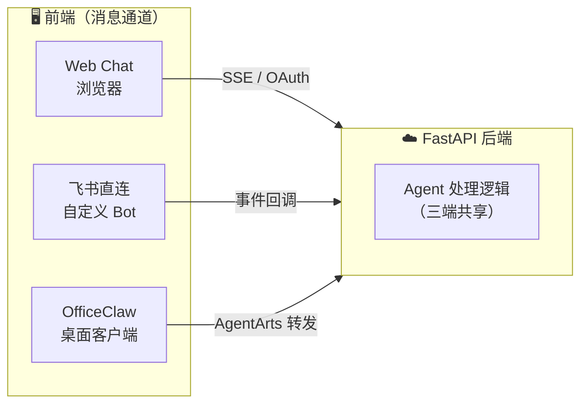
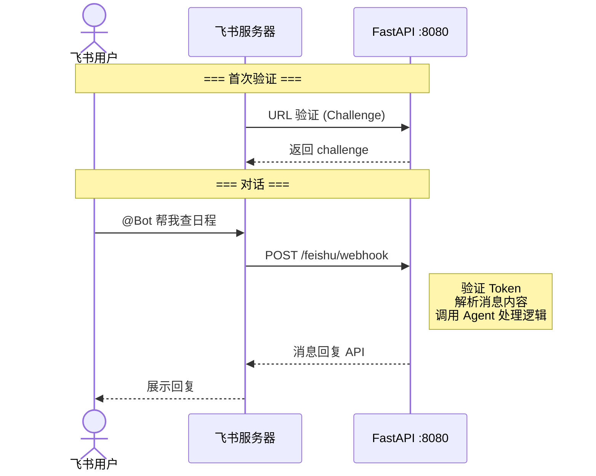
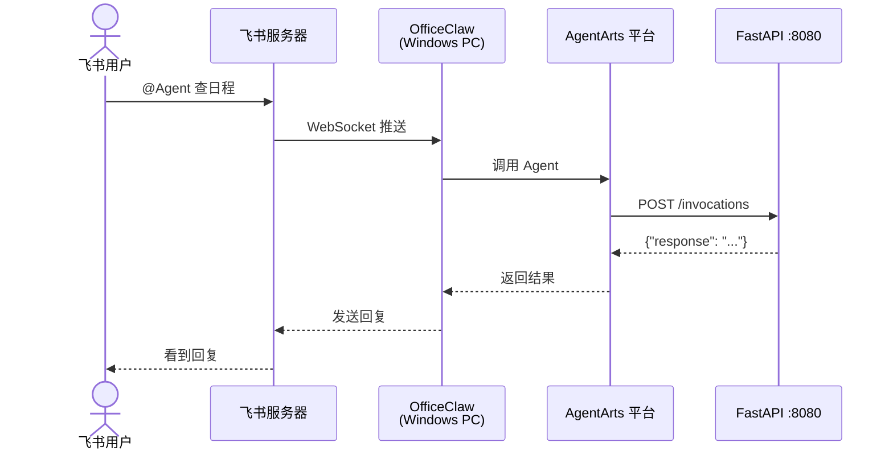
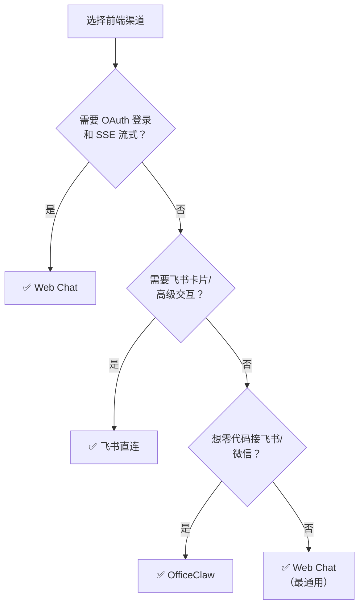
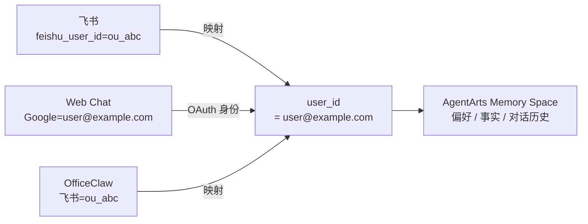
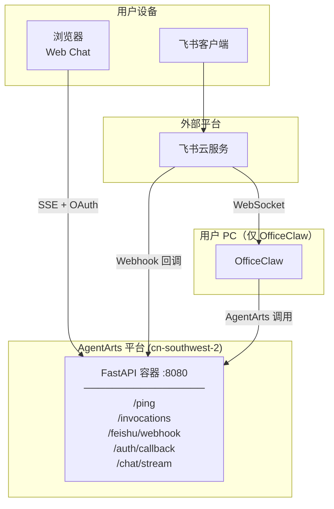

# Personal Assistant — 前端架构

> 版本：v0.1 | 状态：Draft | 关联文档：`backend_architecture.md`

---

## 1. 概述

Personal Assistant 前端采用**多客户端架构**，所有客户端通过统一协议与 FastAPI 后端通信，共享同一套 Agent 处理逻辑和 Memory 空间。

**核心原则**：前端只负责消息通道和协议适配，不做 Agent 逻辑。所有 Agent 推理、Memory、Tool 调用都在后端。

---

## 2. 三种前端方案

### 2.1 Web Chat

**接入方式**：浏览器直连 FastAPI `/chat/stream`（SSE）和 `/auth/callback`（OAuth）

| 维度 | 说明 |
|------|------|
| **协议** | SSE (Server-Sent Events) 流式推送 |
| **认证** | Google OAuth → JWT Cookie |
| **路由** | `/chat/stream`, `/auth/callback` |
| **优势** | 完全自定义 UI/UX，不受平台限制 |
| **代价** | 需要自己开发前端页面 |

### 2.2 飞书直连

**接入方式**：自行创建飞书 Bot，飞书事件回调到 FastAPI `/feishu/webhook`

| 维度 | 说明 |
|------|------|
| **协议** | 飞书 Webhook 事件回调 |
| **认证** | 飞书 Token 验证 + API Key |
| **路由** | `/feishu/webhook` |
| **优势** | 完全自主可控，支持飞书卡片等高级交互 |
| **代价** | 需要公网回调 URL，需要写飞书消息解析代码 |

### 2.3 OfficeClaw

**接入方式**：OfficeClaw 桌面客户端作为飞书/微信桥接器，通过 AgentArts 调用后端 `/invocations`

| 维度 | 说明 |
|------|------|
| **协议** | AgentArts `/invocations` (JSON-in/JSON-out) |
| **认证** | AgentArts IAM / API Key |
| **路由** | `/invocations`（AgentArts 平台调用） |
| **优势** | 零代码接飞书/微信，不需要公网回调 URL |
| **代价** | 需要 Windows PC 常驻运行 OfficeClaw，不能自定义飞书交互 |

---

## 3. 渠道对比

| | Web Chat | 飞书直连 | OfficeClaw |
|---|---|---|---|
| **自定义 UI** | ✅ 完全自由 | ❌ 飞书原生 | ❌ 飞书原生 |
| **SSE 流式** | ✅ 原生支持 | ⚠️ 需转飞书消息 | ❌ 不支持 |
| **OAuth 登录** | ✅ 完整流程 | ❌ 不适用 | ❌ 不适用 |
| **飞书卡片** | ❌ 不适用 | ✅ 支持 | ❌ 不支持 |
| **飞书高级交互** | ❌ 不适用 | ✅ 支持 | ❌ 不支持 |
| **微信接入** | ❌ 不适用 | ❌ 需要额外开发 | ✅ 内置 |
| **公网 IP 要求** | AgentArts 提供 | 需要回调 URL | 不需要 |
| **额外软件** | 浏览器即可 | 无 | Windows PC + OfficeClaw |
| **开发工作量** | 前端页面 + OAuth | 飞书 Bot 代码 | 仅 Agent 逻辑 |

---

## 4. 渠道选择指南

---

## 5. 跨渠道 Memory 共享

同一用户从不同渠道发起对话，通过统一的 `user_id` 关联到同一 Memory Space：

- **Web Chat**：OAuth 登录后直接获得 `user_id`（Google email）
- **飞书直连**：`feishu_user_id` → 查绑定表映射到 `user_id`
- **OfficeClaw**：同飞书直连，OfficeClaw 传递飞书用户身份

---

## 6. 部署拓扑

