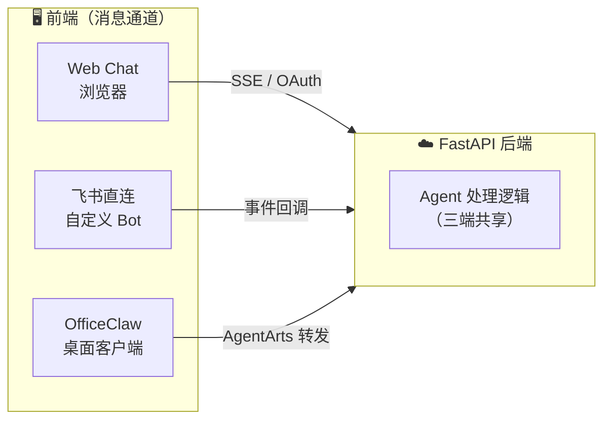
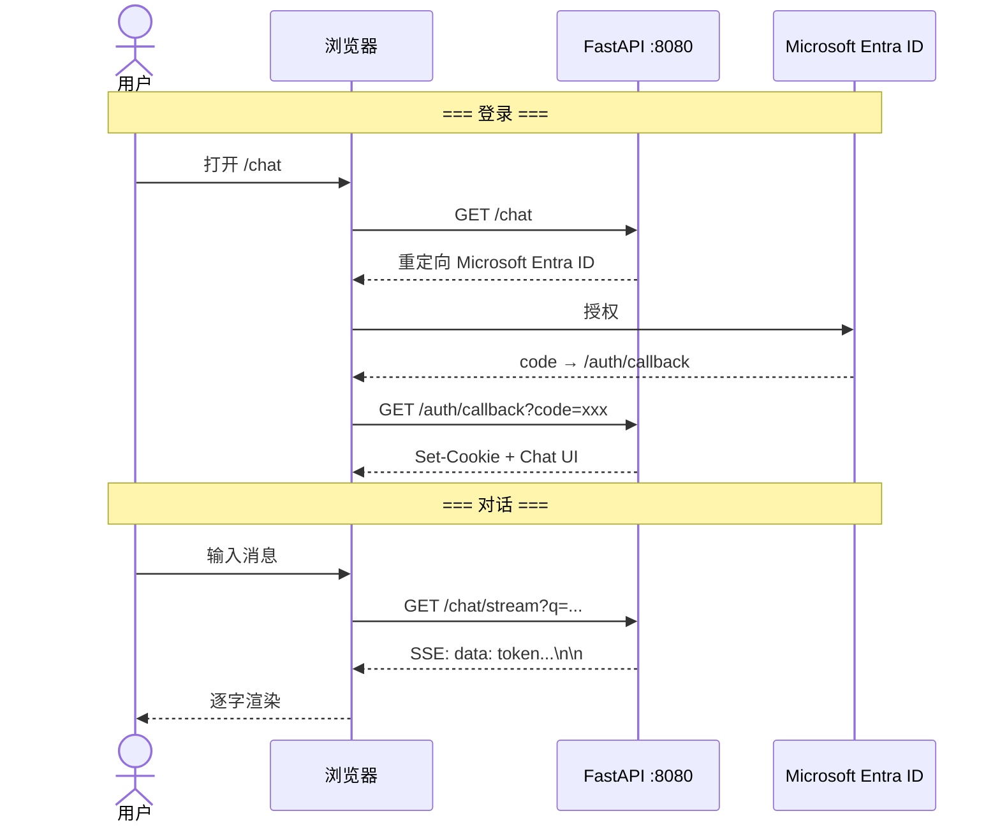
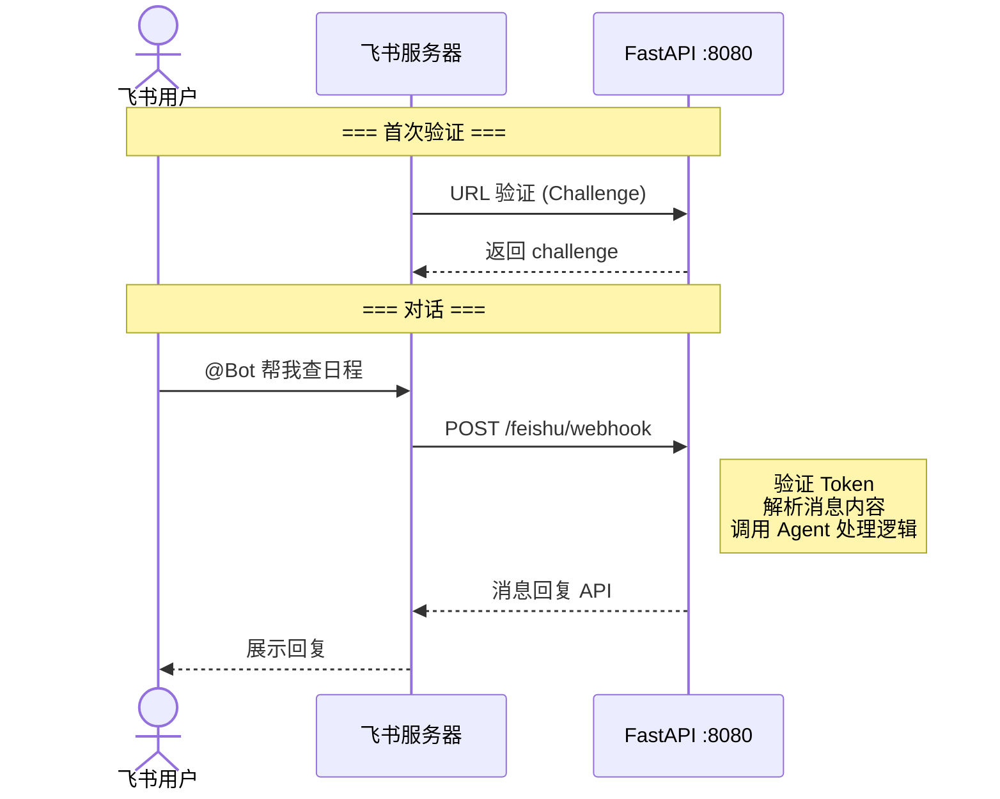
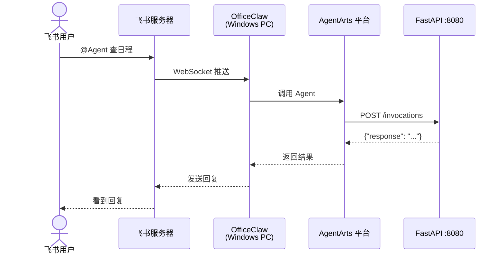
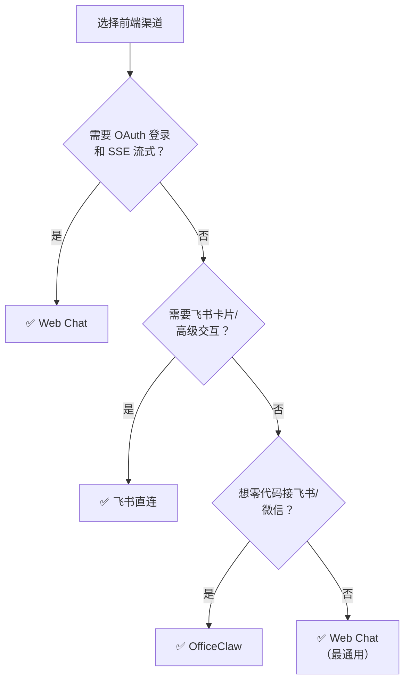
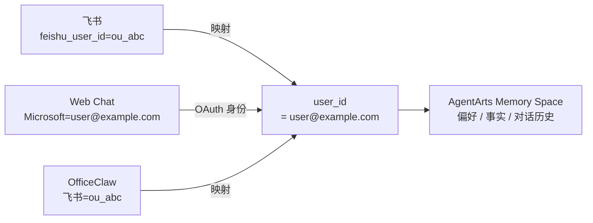
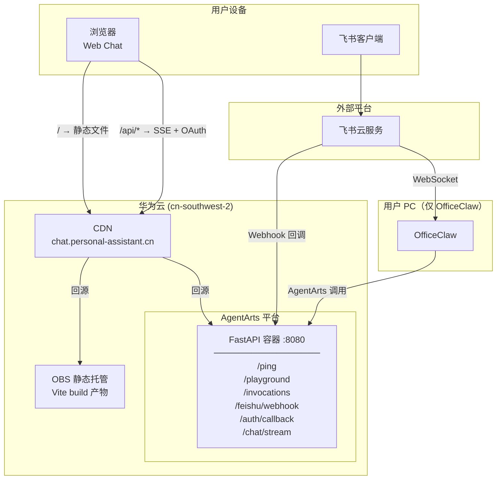
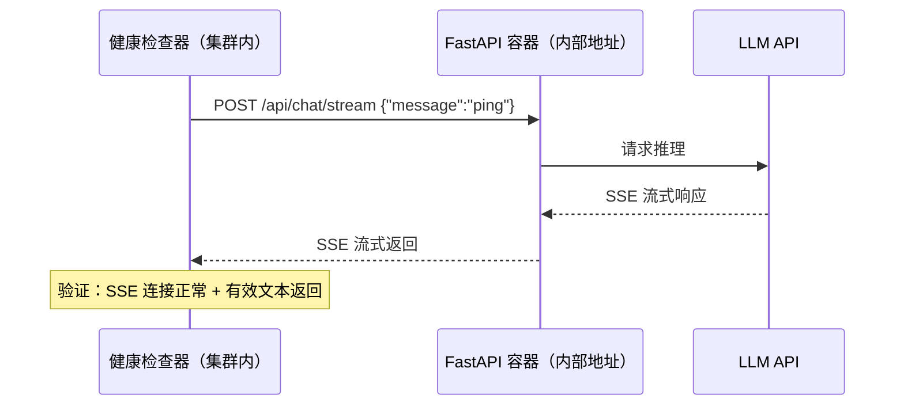

# Personal Assistant — 前端架构

> 版本：v0.1 | 状态：Draft | 关联文档：`backend_architecture.md`

---

## 1. 概述

Personal Assistant 前端采用**多客户端架构**，所有客户端通过统一协议与 FastAPI 后端通信，共享同一套 Agent 处理逻辑和 Memory 空间。



**核心原则**：前端只负责消息通道和协议适配，不做 Agent 逻辑。所有 Agent 推理、Memory、Tool 调用都在后端。

---

## 2. 三种前端方案

### 2.1 Web Chat

**接入方式**：浏览器直连 FastAPI `/chat/stream`（SSE）和 `/auth/callback`（OAuth）



| 维度 | 说明 |
|------|------|
| **协议** | SSE (Server-Sent Events) 流式推送 |
| **认证** | Microsoft Entra ID → JWT Cookie。详见 [ADR-007](../ADR/ADR-007-identity-provider.md) |
| **路由** | `/chat/stream`, `/auth/callback` |
| **优势** | 完全自定义 UI/UX，不受平台限制 |
| **代价** | 需要自己开发前端页面 |
| **技术栈** | Vite + React + TypeScript + Tailwind CSS，assistant-ui AI Chat 组件库（含 `@assistant-ui/react-ai-sdk`）。详见 [ADR-013](../ADR/ADR-013-assistant-ui-chat-library.md) |

**OAuth 前后端职责分离**：token 交换必须在后端，因为 client_secret 不能暴露在前端浏览器中。

```
前端（浏览器）                    后端（FastAPI）
─────────────────                ─────────────────
● 发起登录跳转                    ● 接收 code
  (只需 client_id)               ● code + client_secret → access_token
● 携带 Cookie 发请求              ● token → 用户信息 (Graph /me)
● 无感知 token 细节               ● 设 Cookie，302 跳回 /chat
```

`/auth/callback` 路由实现约 30 行代码，不额外引入 BFF 或独立认证服务。

#### 2.1.1 Chainlit Playground（调试工具）

Web Chat（Vite + React）面向最终用户，需要工程化构建。在开发阶段，需要一个零构建的轻量调试界面直接与 Agent 交互，观察推理过程。

Chainlit 定位为**同容器 Python 原生调试工具**，挂载在 `/playground`：

```
FastAPI 容器 :8080
  ├── /                    → Vite build 产物（Web Chat）
  ├── /playground          → Chainlit app（调试 UI）
  ├── /api/*               → 业务 API 路由
  └── ...
```

| 维度 | 说明 |
|------|------|
| **定位** | 开发调试工具，非生产用户界面 |
| **语言** | Python，与后端同一进程，零构建 |
| **LangChain 集成** | 原生 `@cl.on_chat_start` + LangChain callback，直接观察 Agent 推理步骤 |
| **流式** | 内置 `cl.Message.stream_token()` |
| **路径** | `/playground` — 避免与 `/chat`（未来 OAuth 登录后的用户入口）冲突 |
| **生命周期** | 与 Web Chat 长期共存。Phase 1 用于快速验证 Agent 链路；Phase 3 生产 Web Chat 上线后，`/playground` 保留给运维调试 |

Chainlit 与 Web Chat 共享同一 FastAPI 进程内的 `agent_handler`，只是接入的 UI 层不同：Web Chat 走 SSE + assistant-ui（React 静态资源），Playground 走 Chainlit 的 WebSocket 协议（Python 原生）。

### 2.2 飞书直连

**接入方式**：自行创建飞书 Bot，飞书事件回调到 FastAPI `/feishu/webhook`



| 维度 | 说明 |
|------|------|
| **协议** | 飞书 Webhook 事件回调 |
| **认证** | 飞书 Token 验证 + API Key |
| **路由** | `/feishu/webhook` |
| **优势** | 完全自主可控，支持飞书卡片等高级交互 |
| **代价** | 需要公网回调 URL，需要写飞书消息解析代码 |

### 2.3 OfficeClaw

**接入方式**：OfficeClaw 桌面客户端作为飞书/微信桥接器，通过 AgentArts 调用后端 `/invocations`



| 维度 | 说明 |
|------|------|
| **协议** | AgentArts `/invocations` (JSON-in/JSON-out) |
| **认证** | AgentArts IAM / API Key |
| **路由** | `/invocations`（AgentArts 平台调用） |
| **优势** | 零代码接飞书/微信，不需要公网回调 URL |
| **代价** | 需要 Windows PC 常驻运行 OfficeClaw，不能自定义飞书交互 |

---

## 3. 渠道对比

| | Web Chat | 飞书直连 | OfficeClaw |
|---|---|---|---|
| **自定义 UI** | ✅ 完全自由 | ❌ 飞书原生 | ❌ 飞书原生 |
| **SSE 流式** | ✅ 原生支持 | ⚠️ 需转飞书消息 | ❌ 不支持 |
| **OAuth 登录** | ✅ 完整流程 | ❌ 不适用 | ❌ 不适用 |
| **飞书卡片** | ❌ 不适用 | ✅ 支持 | ❌ 不支持 |
| **飞书高级交互** | ❌ 不适用 | ✅ 支持 | ❌ 不支持 |
| **微信接入** | ❌ 不适用 | ❌ 需要额外开发 | ✅ 内置 |
| **公网 IP 要求** | AgentArts 提供 | 需要回调 URL | 不需要 |
| **额外软件** | 浏览器即可 | 无 | Windows PC + OfficeClaw |
| **开发工作量** | 前端页面 + OAuth | 飞书 Bot 代码 | 仅 Agent 逻辑 |

---

## 4. 渠道选择指南



---

## 5. 跨渠道 Memory 共享

同一用户从不同渠道发起对话，通过统一的 `user_id` 关联到同一 Memory Space：



- **Web Chat**：OAuth 登录后直接获得 `user_id`（Microsoft account email）
- **飞书直连**：`feishu_user_id` → 查绑定表映射到 `user_id`
- **OfficeClaw**：同飞书直连，OfficeClaw 传递飞书用户身份

---

## 6. 部署拓扑

### 6.1 整体拓扑



### 6.2 Web Chat 前端部署

Web Chat 前端采用**两阶段部署策略**，最终目标为 OBS + CDN + 自定义域名，实现前后端同域零跨域。

#### Phase 1：同容器 serve（起步方案）

FastAPI 通过 `StaticFiles` mount Vite build 产物，前后端共享同一容器和端口。

```
FastAPI 容器 :8080
  ├── /                    → StaticFiles mount dist/
  ├── /playground          → Chainlit app（调试 UI）
  ├── /api/auth/callback   → OAuth 回调
  ├── /api/chat/stream     → SSE 流式对话
  └── ...                  → 其他路由
```

| 维度 | 说明 |
|------|------|
| **跨域** | 无，前后端同 origin |
| **Cookie** | 天然共享，OAuth 流程最简单 |
| **适用** | 开发阶段、低流量验证 |
| **代价** | 静态文件占用容器带宽，无法独立扩容 |

#### Phase 2：OBS + CDN + 自定义域名（生产方案）

前端静态文件部署到华为云 OBS，通过 CDN 回源并配置自定义域名（如 `chat.personal-assistant.cn`）。CDN 通过路径前缀分流请求：

```
https://chat.personal-assistant.cn/
  ├── /api/*   → CDN 回源到 FastAPI 容器
  └── /*       → CDN 回源到 OBS bucket
```

| 维度 | 说明 |
|------|------|
| **跨域** | 无，前后端同 origin（同一域名） |
| **Cookie** | 天然共享，OAuth 流程零额外配置 |
| **国内速度** | CDN 全国加速，首屏秒开 |
| **扩容** | 静态资源 CDN 承载，后端容器只处理 API |
| **额外工作** | OBS bucket + CDN 配置 + 域名备案 + HTTPS 证书 |

#### 为什么不做跨域方案

OAuth Cookie 跨域（前端 OBS 默认域名 → 后端 AgentArts 域名）需要：
- FastAPI 配 CORS `Allow-Credentials: true`
- Cookie 设 `SameSite=None; Secure`
- 前端 SSE 请求带 `credentials: 'include'`

多一层配置多一个故障点。自定义域名方案**从架构层面消除跨域问题**，而不是用配置修补，符合"简单够用"原则。

#### 为什么不用 GitHub Pages

- `github.io` 域名与 FastAPI 不同域，Cookie 跨域
- 国内无 CDN 节点，首次加载慢
- 无法绑 CDN 做路径分流（GitHub Pages 不支持回源到第三方 API）

#### Phase 1 与 Phase 2 共存

两种方案可以长期共存，互不冲突：

```
生产流量：
  用户 → CDN (chat.personal-assistant.cn)
    ├── /api/* → FastAPI 容器
    └── /*     → OBS（StaticFiles mount 闲置，不影响）

内部/运维流量：
  运维/监控 → FastAPI 容器直连（AgentArts 内部域名）
    ├── /       → StaticFiles mount dist/（Phase 1 路径）
    └── /api/*  → API 路由（与 Phase 2 共用）
```

CDN 的路由规则在生产流量路径上拦截了所有非 `/api/*` 请求回源到 OBS，因此 FastAPI 容器的 `StaticFiles` mount **不会服务于生产流量**，但代码保留不动，零冲突。

保留 Phase 1 路径的价值：

| 用途 | 说明 |
|------|------|
| **内部运维访问** | 直连容器地址可拿到完整 Web Chat 界面，调试时绕过 CDN 缓存层 |
| **深度健康检查** | 用轻量级聊天请求探测端到端链路（见下方） |
| **快速回退** | 若 CDN/OBS 出问题，可临时切 DNS 直指容器，恢复服务 |

#### Phase 1 路径作为聊天式健康检查

传统 `/health` 或 `/ping` 端点只验证"进程存活"，无法探测 AI Agent 核心链路。Phase 1 直连路径可以作为**深度健康检查**的入口：



一次"聊天式 ping"覆盖的关键路径：

| 验证项 | 传统 `/health` | 聊天式 `/api/chat/stream` |
|--------|:---:|:---:|
| FastAPI 进程存活 | ✅ | ✅ |
| LLM API 连通性 | ❌ | ✅ |
| SSE 流式中间件正常 | ❌ | ✅ |
| Memory / Identity SDK 可用 | ❌ | ✅ |
| OAuth Cookie / JWT 验证链路 | ❌ | ✅（带 token） |

**实现建议**：在 AgentArts 或 K8s 的 readiness probe 中配置直连容器的聊天式检查（绕过 CDN），间隔可设长一些（如 5 分钟），因为 LLM 调用有成本。`/ping` 仍用于高频 liveness check（30 秒）。
