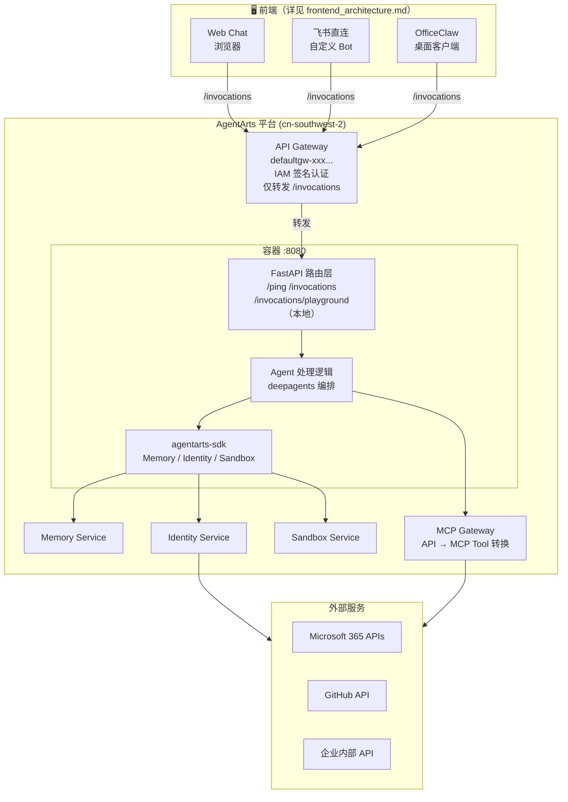
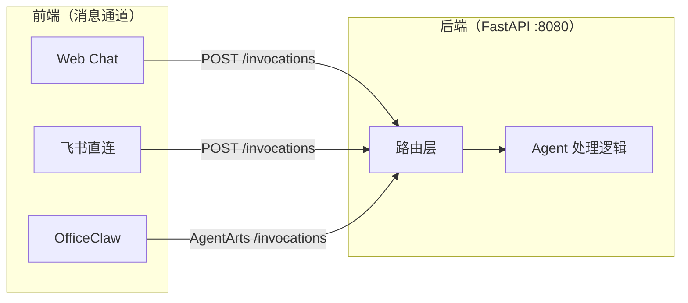
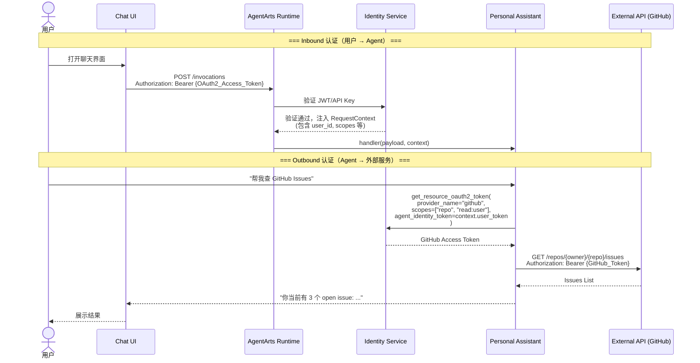
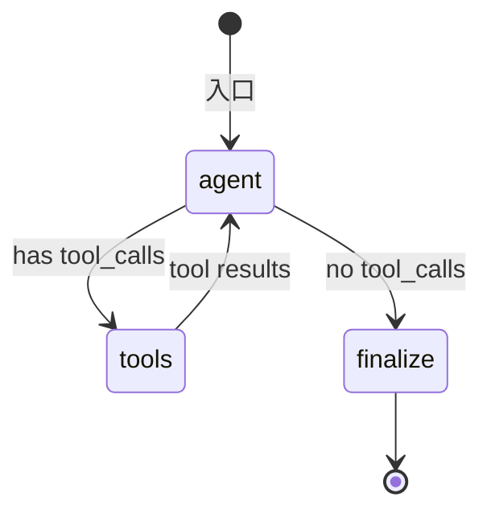
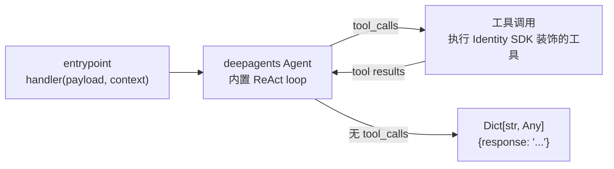
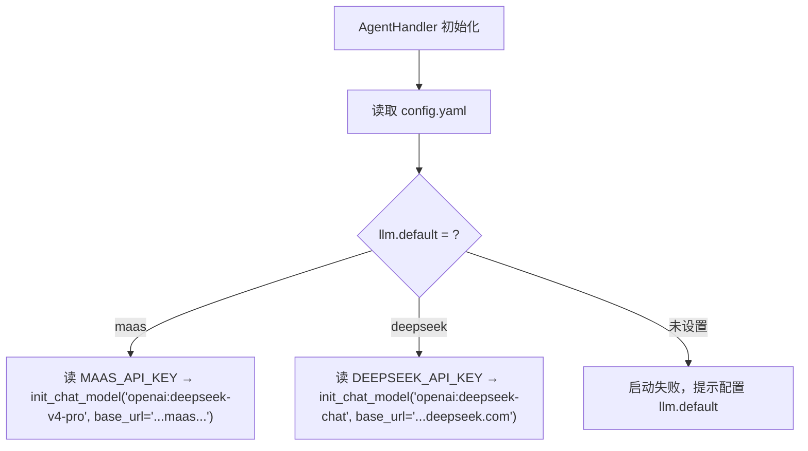
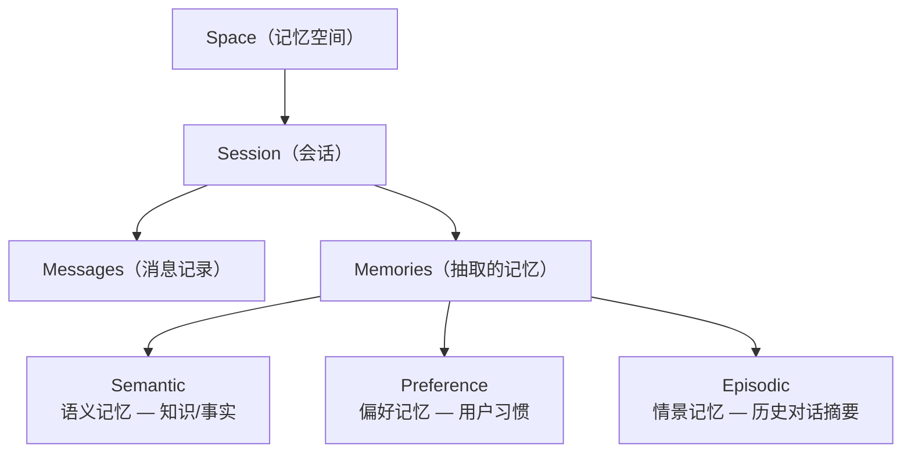

# Personal Assistant — 总体架构设计

> 版本：v0.3 | 状态：Draft | 基于 AgentArts 平台

---

## 1. 架构总览

### 1.1 整体架构



**架构层级**：

| 层 | 负责 | 详细文档 |
|----|------|----------|
| **前端** | 消息通道、用户交互界面 | `frontend_architecture.md` |
| **API Gateway** | IAM 签名认证、路由转发（生产仅 `/invocations` 精确路径） | `cloud-service/agentarts.md` §9 |
| **后端（容器）** | FastAPI 路由 + Agent 处理逻辑 | `backend_architecture.md` |
| **平台服务** | AgentArts Memory / Identity / Sandbox / MCP Gateway | `cloud-service/agentarts.md` |

### 1.2 技术选型

| 层级 | 选型 | 说明 |
|------|------|------|
| **Web 框架** | FastAPI | 统一管理所有路由，替代 AgentArtsRuntimeApp。详见 [ADR-004](ADR/ADR-004-fastapi-over-agentarts-runtime-app.md) |
| **Agent 编排** | deepagents (LangChain) | LangGraph 之上的 batteries-included harness，封装 ReAct loop + summarization + skills。详见 [ADR-009](ADR/ADR-009-deepagents.md) |
| **LLM** | 多 Provider 可配置（MaaS / DeepSeek 官方） | `config.yaml` 声明 provider，`init_chat_model()` 统一调用。默认 MaaS，可按需切换。详见 ADR-005 + ADR-011 |
| **Runtime** | AgentArts Runtime | 容器化部署，ARM64 架构，cn-southwest-2 区域。详见 [ADR-003](ADR/ADR-003-agentarts-platform.md) |
| **Memory** | AgentArts Memory SDK | 短期+长期记忆，语义/偏好/情景三种策略 |
| **Identity** | AgentArts Identity SDK | Inbound JWT/API Key + Outbound OAuth2/M2M/STS |
| **Gateway** | AgentArts MCP Gateway | API 定义 → MCP Tool 自动转换 |
| **可观测** | OTEL (AgentArts 内置) | Tracing + Logging + Metrics |
| **Container** | Docker (linux/arm64) | Python 3.12+ |

---

## 2. 前端与后端

架构采用**前后端分离**设计。详细设计见独立文档：

| 文档 | 内容 |
|------|------|
| `frontend_architecture.md` | 三种客户端渠道（Web Chat / 飞书直连 / OfficeClaw）、渠道对比、选择指南、部署拓扑 |
| `backend_architecture.md` | FastAPI 路由设计、Agent 处理逻辑、LangGraph 编排、AgentArts SDK 集成、项目结构 |

### 2.1 前后端关系



**核心原则**：前端只负责消息通道和协议适配，不做 Agent 逻辑。所有 Agent 推理、Memory、Tool 调用都在后端。

---

## 3. 认证流详解



---

## 4. Identity 设计

### 4.1 Inbound — 用户认证到 Agent

AgentArts Runtime 通过 `agentarts_config.yaml` 中 `runtime.identity_configuration` 配置三种 Inbound 认证方式：

```yaml
runtime:
  identity_configuration:
    authorizer_type: CUSTOM_JWT          # IAM | CUSTOM_JWT | KEY_AUTH
    authorizer_configuration:
      custom_jwt:
        discovery_url: https://login.microsoftonline.com/{tenant}/v2.0/.well-known/openid-configuration
        allowed_audience:
          - "personal-assistant-client-id"
        allowed_clients:
          - "personal-assistant-client-id"
        allowed_scopes:
          - "openid"
          - "profile"
          - "email"
      key_auth:
        api_keys:
          - "opencode-2026-api-key-xxxxx"       # 开发调试用
```

| 认证方式 | 适用场景 | 配置 |
|----------|----------|------|
| **IAM** | 华为云内部用户（Console / CLI） | `authorizer_type: IAM` |
| **Custom JWT** | 自有 IdP 用户登录（Microsoft Entra ID / Okta / Auth0） | `authorizer_type: CUSTOM_JWT` + `discovery_url` |
| **API Key** | 开发调试 / 机器对机器调用 | `authorizer_type: KEY_AUTH` + `api_keys[]` |

> 推荐生产环境使用 **Custom JWT** 方式，通过 Microsoft Entra ID 或自有 OIDC IdP 提供用户认证。

### 4.2 Outbound — Agent 代表用户调用外部服务

AgentArts Identity SDK 提供三种 Outbound 认证模式：

| 模式 | Auth Flow | 用途 | 典型场景 |
|------|-----------|------|----------|
| **User Federation** | `USER_FEDERATION` | Agent 以用户身份调用外部 API | 查 GitHub Issues、读 Outlook Calendar、查 Microsoft 365 邮件 |
| **M2M** | `M2M` | Agent 以自身服务身份调用 API | 调用企业内部 CRM、OA 系统 |
| **STS Token** | — | Agent 获取云资源访问凭证 | 操作 OBS 对象存储、访问 RDS |

#### 4.2.1 Credential Provider 创建

通过 AgentArts SDK 创建各类 Credential Provider：

```python
from agentarts.sdk import IdentityClient
from agentarts.sdk.identity import OAuth2Vendor

client = IdentityClient(region="cn-southwest-2")

# 1. 创建 Workload Identity（Agent 的工作负载身份）
workload = client.create_workload_identity(
    name="personal-assistant-workload",
    allowed_resource_oauth2_return_urls=["http://localhost:8000/auth/callback"],
)

# 2. OAuth2 Provider — GitHub（User Federation）
github_provider = client.create_oauth2_credential_provider(
    name="github-provider",
    vendor=OAuth2Vendor.GITHUBOAUTH2,
    client_id="your-github-oauth-app-client-id",
    client_secret="your-github-oauth-app-client-secret",
)

# 3. OAuth2 Provider — Microsoft 365（User Federation）
m365_provider = client.create_oauth2_credential_provider(
    name="m365-provider",
    vendor=OAuth2Vendor.MICROSOFTOAUTH2,
    client_id="your-m365-client-id",
    client_secret="your-m365-client-secret",
    tenant_id="your-azure-tenant-id",
)

# 4. API Key Provider — 企业内部 API（M2M）
api_key_provider = client.create_api_key_credential_provider(
    name="internal-api-provider",
    api_key="sk-internal-api-xxxxx"
)

# 5. STS Provider — 云资源（M2M）
sts_provider = client.create_sts_credential_provider(
    name="huaweicloud-sts-provider",
    agency_urn="urn:agency:your-agency",
    tags=[{"key": "env", "value": "prod"}]
)
```

#### 4.2.2 凭据装饰器使用

```python
from agentarts.sdk import require_access_token, require_api_key, require_sts_token
from agentarts.sdk.identity import StsCredentials
from typing import Optional
import httpx

# === User Federation: 以用户身份调用 GitHub ===
@require_access_token(
    provider_name="github-provider",
    scopes=["repo", "read:user"],
    auth_flow="USER_FEDERATION"
)
async def get_github_issues(owner: str, repo: str, access_token: Optional[str] = None):
    async with httpx.AsyncClient() as client:
        resp = await client.get(
            f"https://api.github.com/repos/{owner}/{repo}/issues",
            headers={"Authorization": f"Bearer {access_token}"}
        )
        return resp.json()

# === User Federation: 以用户身份调用 Outlook Calendar ===
@require_access_token(
    provider_name="m365-provider",
    scopes=["https://graph.microsoft.com/Calendars.Read"],
    auth_flow="USER_FEDERATION"
)
async def get_outlook_calendar_events(access_token: Optional[str] = None):
    async with httpx.AsyncClient() as client:
        resp = await client.get(
            "https://graph.microsoft.com/v1.0/me/calendar/events",
            headers={"Authorization": f"Bearer {access_token}"}
        )
        return resp.json()

# === M2M: Agent 以自身身份调用企业内部 API ===
@require_api_key(provider_name="internal-api-provider")
def call_internal_crm(query: str, api_key: Optional[str] = None):
    import requests
    resp = requests.get(
        f"https://crm.internal.example.com/api/search?q={query}",
        headers={"X-API-Key": api_key}
    )
    return resp.json()

# === STS: Agent 获取云资源 Token ===
@require_sts_token(
    provider_name="huaweicloud-sts-provider",
    agency_session_name="personal-assistant-session"
)
async def access_obs_file(bucket: str, key: str, sts_credentials: Optional[StsCredentials] = None):
    from obs import ObsClient
    obs_client = ObsClient(
        access_key_id=sts_credentials.access_key_id,
        secret_access_key=sts_credentials.secret_access_key,
        security_token=sts_credentials.security_token,
        server="https://obs.cn-southwest-2.myhuaweicloud.com"
    )
    return obs_client.getObject(bucket, key)
```

---

## 5. Chat Agent 设计

> 详细实现见 `backend_architecture.md` #3、#4。

### 5.1 deepagents 编排

Agent 使用 deepagents 封装标准 ReAct loop，无需手写 StateGraph：

```python
from deepagents import create_deep_agent

agent = create_deep_agent(
    model=model,
    system_prompt="你是 Personal Assistant，负责管理日程、邮件、笔记和任务...",
    tools=[github_tool, calendar_tool],
)
```

deepagents 底层是 LangGraph，内置 ReAct 循环：



核心能力：

- **ReAct loop** — agent 推理 → 工具调用 → 结果反馈 → 继续推理，由 deepagents 内置
- **conversation summarization** — 长对话自动 compact，控制 token 消耗
- **skills 系统** — SKILL.md 文件驱动，按需加载领域知识和工具使用指南

### 5.2 FastAPI 入口（替代 AgentArtsRuntimeApp）

```python
# app/main.py
from fastapi import FastAPI
from app.agent_handler import AgentHandler

app = FastAPI()
handler = AgentHandler()

@app.get("/ping")
async def ping():
    return {"status": "ok"}

@app.post("/invocations")
async def invoke(request: Request):
    payload = await request.json()
    result = await handler.handle(
        message=payload.get("message", ""),
        user_id=request.headers.get("X-AgentArts-User-Id"),
        session_id=request.headers.get("X-AgentArts-Session-Id"),
    )
    return {"response": result}
```

不再使用 `AgentArtsRuntimeApp` 和 `@app.entrypoint`，改用标准 FastAPI 路由。平台层面完全兼容——只要容器在 8080 提供 `/ping`（平台内部健康检查）和 `/invocations`（Gateway 转发入口），并启用 `url_match_type: PREFIX_MATCH` 以支持 `/invocations/*` 子路径。详见 [backend_architecture.md §2.1](backend_architecture.md#21-agentarts-gateway-路由约束)。

### 5.3 Agent 数据流



AgentHandler 直接调用 deepagents 的 `.invoke()` 或 `.astream()`：

```python
class AgentHandler:
    def __init__(self):
        from app.llm_config import get_model
        self.model = get_model()  # 默认使用 config.yaml 中 llm.default 指定的 provider
        self.agent = create_deep_agent(
            model=self.model,
            system_prompt="你是 Personal Assistant...",
            tools=[...],  # Identity SDK 装饰的工具
        )

    async def handle(self, message: str, user_id: str) -> str:
        result = await self.agent.ainvoke({
            "messages": [{"role": "user", "content": message}],
        })
        return result["messages"][-1].content

---

## 6. LLM Provider 配置

> 详细设计见 [ADR-011](ADR/ADR-011-multi-llm-provider.md)。

### 6.1 配置结构

LLM Provider 通过项目根目录的 `config.yaml` 管理，支持多个 OpenAI-compatible provider 共存：

```yaml
# config.yaml — LLM Provider 配置
llm:
  default: maas  # 默认 provider
  providers:
    maas:
      base_url: https://api.modelarts-maas.com/openai/v1
      api_key_env: MAAS_API_KEY  # 引用环境变量，不留明文密钥
      model: deepseek-v4-pro
    deepseek:
      base_url: https://api.deepseek.com
      api_key_env: DEEPSEEK_API_KEY
      model: deepseek-chat
```

### 6.2 配置加载模块

`app/llm_config.py` 读取 `config.yaml` + 环境变量，暴露统一的 `get_model()` 接口：

```python
# app/llm_config.py
import os
import yaml
from langchain.chat_models import init_chat_model

_config = None

def _load_config():
    global _config
    if _config is None:
        with open("config.yaml") as f:
            _config = yaml.safe_load(f)
    return _config

def get_model(provider: str = None) -> BaseChatModel:
    """获取 LLM model 实例。默认使用 llm.default 指定的 provider。"""
    cfg = _load_config()
    provider = provider or cfg["llm"]["default"]
    p = cfg["llm"]["providers"][provider]
    api_key = os.environ.get(p["api_key_env"])
    if not api_key:
        raise ValueError(
            f"环境变量 {p['api_key_env']} 未设置，provider={provider} 不可用"
        )
    return init_chat_model(
        model=f"openai:{p['model']}",
        base_url=p["base_url"],
        api_key=api_key,
    )
```

### 6.3 与环境变量的关系

| 变量 | 用途 | 必填 |
|------|------|------|
| `MAAS_API_KEY` | MaaS 平台 API Key | MaaS provider 使用时 |
| `DEEPSEEK_API_KEY` | DeepSeek 官方 API Key | DeepSeek provider 使用时 |

> `MODEL_URL` / `MODEL_API_KEY` / `MODEL_NAME`（旧版单一 provider 变量）仍被兼容读取，作为 `maas` provider 的 fallback。后续版本移除。

### 6.4 Provider 选择逻辑



---

## 7. Memory 集成

### 7.1 Memory 模型

AgentArts Memory 采用分层存储模型：



- **Space**：租户级隔离单元，一个 Personal Assistant 实例对应一个 Space
- **Session**：每次对话会话，关联特定用户
- **Memory**：从 Session 消息中自动抽取的长短期记忆

### 7.2 SDK 集成代码

```python
# app/personal_assistant/memory.py

import os
from agentarts.sdk.memory import MemoryClient
from agentarts.sdk.memory.session import MemorySession
from agentarts.sdk.memory.inner.config import TextMessage, MemorySearchFilter


class PersonalAssistantMemory:
    def __init__(self):
        self.space_id = os.environ.get("MEMORY_SPACE_ID")
        self.actor_prefix = "pa-user-"
        self.assistant_id = "personal-assistant"

    async def get_context(self, state: dict) -> str:
        """获取当前 Session 的 Memory 上下文"""
        user_id = state.get("context", {}).get("user_id", "anonymous")
        if not self.space_id:
            return ""

        session = MemorySession(
            space_id=self.space_id,
            actor_id=f"{self.actor_prefix}{user_id}",
            assistant_id=self.assistant_id
        )

        # 搜索长期记忆中的用户偏好
        results = session.search_long_term_memories(
            filters=MemorySearchFilter(query="user preferences", top_k=5)
        )

        context_parts = []
        for r in results.results:
            record = r.get("record", {})
            context_parts.append(record.get("content", ""))

        return "\n".join(context_parts) if context_parts else ""

    async def save_interaction(self, state: dict, last_message) -> None:
        """保存对话到 Memory"""
        user_id = state.get("context", {}).get("user_id", "anonymous")
        if not self.space_id or not state.get("messages"):
            return

        session = MemorySession(
            space_id=self.space_id,
            actor_id=f"{self.actor_prefix}{user_id}",
            assistant_id=self.assistant_id
        )

        # 提取最后一轮用户-助手消息
        messages = state["messages"]
        turns = []
        for msg in messages[-2:]:
            role = "user" if msg.type == "human" else "assistant"
            turns.append(TextMessage(role=role, content=str(msg.content)[:2000]))
        if turns:
            session.add_messages(turns)
```

---

> 完整部署流程（Docker 构建、SWR 推送、OBS 上传、冒烟验证、回滚方案）详见 [agentarts-deploy-runbook.md](devops/agentarts-deploy-runbook.md)。

## 8. 部署配置

### 8.1 `agentarts_config.yaml`

```yaml
default_agent: personal-assistant

agents:
  personal-assistant:
    base:
      name: personal-assistant
      entrypoint: agent:app
      dependency_file: requirements.txt
      platform: linux/arm64
      language: python3
      base_image: python:3.12-slim
      region: cn-southwest-2

    swr_config:
      organization: personal-assistant-org
      repository: agent_personal_assistant
      organization_auto_create: true
      repository_auto_create: true

    runtime:
      invoke_config:
        protocol: HTTP
        port: 8080

      network_config:
        network_mode: PUBLIC
        # 如需 VPC 内访问，改为 PRIVATE 并配置 vpc_config

      identity_configuration:
        # === Inbound: Custom JWT (Microsoft Entra ID) ===
        authorizer_type: CUSTOM_JWT
        authorizer_configuration:
          custom_jwt:
            discovery_url: https://login.microsoftonline.com/{tenant}/v2.0/.well-known/openid-configuration
            allowed_audience:
              - "<your-entra-id-client-id>"
            allowed_clients:
              - "<your-entra-id-client-id>"
            allowed_scopes:
              - "openid"
              - "profile"
              - "email"
          # === Inbound: API Key (开发调试) ===
          key_auth:
            api_keys:
              - "opencode-dev-api-key-2026"

      observability:
        tracing:
          enabled: true
        metrics:
          enabled: true
        logs:
          enabled: true

      artifact_source:
        url: swr.cn-southwest-2.myhuaweicloud.com/personal-assistant-org/agent_personal_assistant:latest
        commands: []

      environment_variables:
        - key: MAAS_API_KEY
          value: "<MaaS API Key>"
        - key: DEEPSEEK_API_KEY
          value: "<DeepSeek 官方 API Key>"
        - key: MEMORY_SPACE_ID
          value: "<Memory Space ID>"

      tags:
        - key: app
          value: personal-assistant
        - key: env
          value: dev
```

### 8.2 部署命令

```bash
# 本地开发
agentarts dev

# 部署到云端
agentarts launch

# 调用（API Key 模式）
agentarts invoke '{"message": "帮我查一下我的 GitHub Issues"}'

# 调用（JWT 模式，通过 HTTPS + Bearer Token）
curl -X POST https://<runtime-domain>/invocations \
  -H "Content-Type: application/json" \
  -H "Authorization: Bearer <Microsoft_ID_Token>" \
  -d '{"message": "查一下我的日程"}'
```

---

## 9. 项目文件结构

```
personal-assistant/
├── .agentarts_config.yaml          # AgentArts 部署配置
├── Dockerfile                       # ARM64 镜像
├── config.yaml                      # LLM Provider 配置（新增）
├── pyproject.toml                   # Python 依赖 + ruff 配置
├── uv.lock                           # 确定性锁文件
├── app/
│   ├── main.py                      # FastAPI 应用入口 + 路由定义
│   ├── agent_handler.py             # Agent 处理逻辑（deepagents + Identity SDK）
│   ├── llm_config.py                # LLM Provider 配置加载（新增）
│   ├── memory.py                    # Memory 集成
│   ├── feishu_adapter.py            # 飞书消息解析 + 回复
│   ├── oauth.py                     # OAuth 流程 (Microsoft Entra ID)
│   └── tools/
│       ├── github_tools.py          # GitHub 工具 (OAuth2 User Federation)
│       ├── m365_tools.py            # Microsoft 365 工具 (OAuth2 User Federation)
│       ├── internal_tools.py        # 内部 API 工具 (API Key M2M)
│       └── cloud_tools.py           # 云资源工具 (STS M2M)
├── web/                              # Web Chat 前端（独立项目）
│   └── ...
└── README.md
```

> 前端不再作为 `adapters/` 目录放在同一仓库。Web Chat 前端为独立项目，飞书和 OfficeClaw 走各自平台的配置。

---

## 10. Inbound / Outbound 认证矩阵

| 用户身份 | Inbound 方式 | Outbound 目标 | Outbound 方式 | Auth Flow |
|----------|-------------|---------------|---------------|-----------|
| Microsoft 用户 | JWT (Microsoft Entra ID) | GitHub API | OAuth 2.0 | USER_FEDERATION |
| Microsoft 用户 | JWT (Microsoft Entra ID) | Outlook Calendar | OAuth 2.0 | USER_FEDERATION |
| 企业员工 | JWT (Okta/Entra ID) | 内部 CRM | API Key | M2M |
| 运维人员 | JWT (Okta/Entra ID) | 云资源 | STS Token | M2M |
| 开发者 | API Key | _(全部)_ | _(开发调试)_ | — |

---

## 11. 参考文档

| 文档 | 路径 |
|------|------|
| **前端架构** | `architecture/frontend_architecture.md` |
| **后端架构** | `architecture/backend_architecture.md` |
| AgentArts 平台参考 | `architecture/cloud-service/agentarts.md` |
| AgentCore 对比参考 | `architecture/cloud-service/agentcore.md` |
| Identity SDK 文档 | `https://support.huaweicloud.com/highcode-agentarts/agentarts_10_044.html` |
| Runtime 部署文档 | `https://support.huaweicloud.com/highcode-agentarts/agentarts_10_028.html` |
| 认证鉴权 | `https://support.huaweicloud.com/highcode-agentarts/agentarts_10_047.html` |
| Memory SDK 文档 | `https://support.huaweicloud.com/highcode-agentarts/agentarts_10_043.html` |
| SDK 快速开始 | `https://support.huaweicloud.com/highcode-agentarts/agentarts_10_040.html` |
