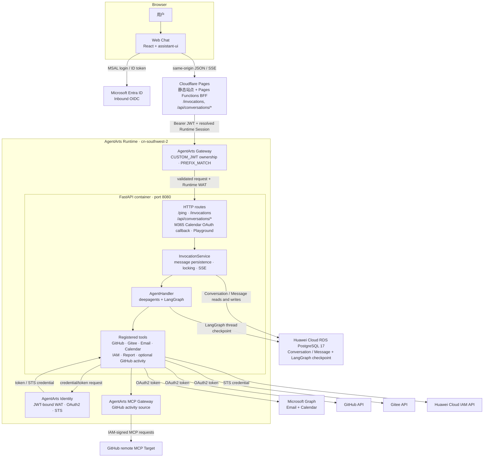
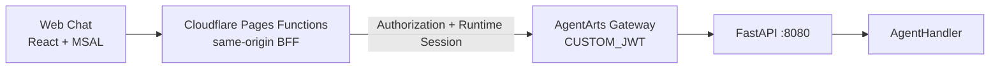
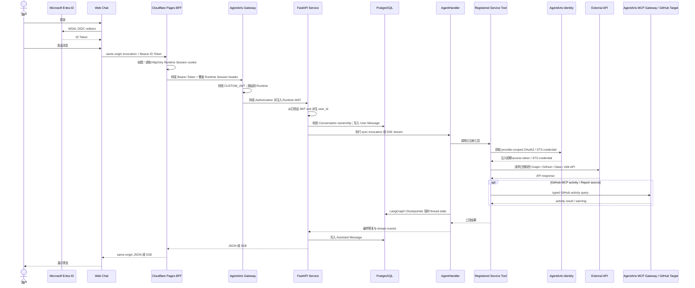
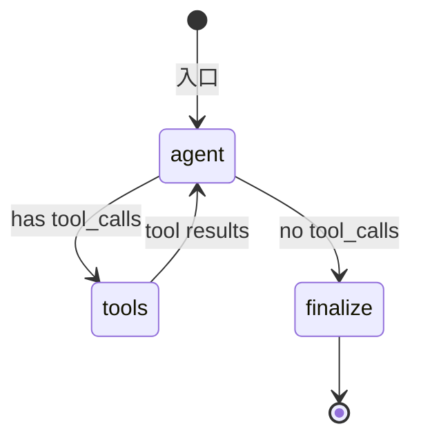
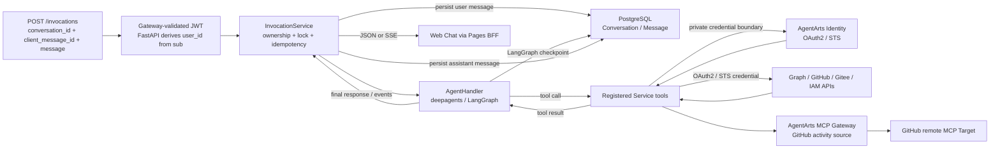
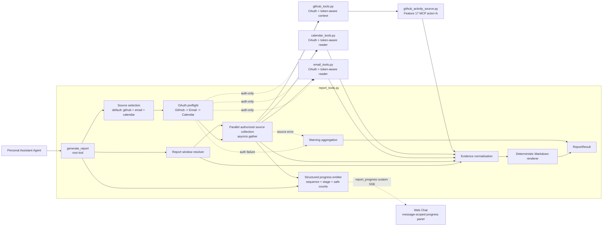
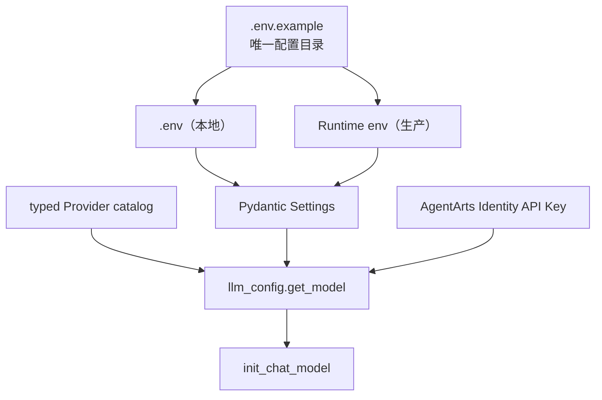

# Personal Assistant — 总体架构设计

> 状态：当前实现基线 | 最后核对：2026-09-23 | 基于 AgentArts 平台

---

## 1. 架构总览

### 1.1 整体架构

图类型：**Container / Deployment Diagram（容器 / 部署图）**。用于说明当前已实现的数据与调用路径。


```mermaid
flowchart TB
    subgraph Browser["Browser"]
        User["用户"]
        WebChat["Web Chat<br/>React + assistant-ui"]
        User --> WebChat
    end

    Entra["Microsoft Entra ID<br/>Inbound OIDC"]
    Pages["Cloudflare Pages<br/>静态站点 + Pages Functions BFF<br/>/invocations, /api/conversations/*"]

    subgraph Runtime["AgentArts Runtime · cn-southwest-2"]
        Gateway["AgentArts Gateway<br/>CUSTOM_JWT ownership · PREFIX_MATCH"]
        subgraph Service["FastAPI container · port 8080"]
            Routes["HTTP routes<br/>/ping · /invocations<br/>/api/conversations/*<br/>M365 Calendar OAuth callback · Playground"]
            Invocation["InvocationService<br/>message persistence · locking · SSE"]
            Agent["AgentHandler<br/>deepagents + LangGraph"]
            Tools["Registered tools<br/>GitHub · Gitee · Email · Calendar<br/>IAM · Report · optional GitHub activity"]
        end
        Identity["AgentArts Identity<br/>JWT-bound WAT · OAuth2 · STS"]
        MCP["AgentArts MCP Gateway<br/>GitHub activity source"]
    end

    DB["Huawei Cloud RDS PostgreSQL 17<br/>Conversation / Message + LangGraph checkpoint"]
    Graph["Microsoft Graph<br/>Email + Calendar"]
    GitHub["GitHub API"]
    Gitee["Gitee API"]
    IAM["Huawei Cloud IAM API"]
    GitHubMCP["GitHub remote MCP Target"]

    WebChat -->|"MSAL login / ID token"| Entra
    WebChat -->|"same-origin JSON / SSE"| Pages
    Pages -->|"Bearer JWT + resolved Runtime Session"| Gateway
    Gateway -->|"validated request + Runtime WAT"| Routes
    Routes --> Invocation
    Invocation -->|"Conversation / Message reads and writes"| DB
    Invocation --> Agent
    Agent -->|"LangGraph thread checkpoint"| DB
    Agent --> Tools
    Tools -->|"credential/token request"| Identity
    Identity -->|"token / STS credential"| Tools
    Tools -->|"OAuth2 token"| Graph
    Tools -->|"OAuth2 token"| GitHub
    Tools -->|"OAuth2 token"| Gitee
    Tools -->|"STS credential"| IAM
    Tools --> MCP
    MCP -->|"IAM-signed MCP requests"| GitHubMCP

```

**架构层级**：

| 层 | 负责 | 详细文档 |
|----|------|----------|
| **客户端** | Web Chat（React + assistant-ui）；Entra ID 登录 | `frontend_architecture.md` |
| **Edge / BFF** | Cloudflare Pages 静态站点和 Pages Functions；same-origin API proxy、Runtime Session cookie | [`external-systems/cloudflare/pages.md`](external-systems/cloudflare/pages.md) |
| **API Gateway** | AgentArts Gateway 校验 CUSTOM_JWT、Runtime 路由并注入 workload access token；`PREFIX_MATCH` | `external-systems/agentarts.md` §9 |
| **后端（容器）** | FastAPI、InvocationService、deepagents/LangGraph、已注册工具 | `backend_architecture.md` |
| **持久化** | PostgreSQL Conversation/Message 与 LangGraph Checkpoint；Runtime Session 只用于路由 | `session-state-management.md` |
| **平台集成** | 当前使用 AgentArts Identity 和 GitHub activity MCP Gateway；未接入 Memory / Sandbox | `external-systems/agentarts.md` |

### 1.2 技术选型

| 层级 | 选型 | 说明 |
|------|------|------|
| **Web 框架** | FastAPI | 统一管理所有路由，替代 AgentArtsRuntimeApp。详见 [ADR-004](ADR/ADR-004-fastapi-over-agentarts-runtime-app.md) |
| **Agent 编排** | deepagents (LangChain) | 使用 `create_deep_agent` 执行模型 / Tool loop，并接入 LangGraph Checkpointer；不代表项目启用了可选 Memory、Sandbox 或 skills 能力。详见 [ADR-009](ADR/ADR-009-deepagents.md) |
| **Conversation State** | PostgreSQL + LangGraph Checkpoint | 业务状态 keyed by `conversation_id`，Checkpoint 使用 `thread_id=user_id:conversation_id`；与 Runtime Session 解耦。详见 [session-state-management.md](session-state-management.md) |
| **LLM** | typed Settings + internal Provider catalog | `.env.example` 是唯一配置目录；Pydantic Settings 校验 Runtime 参数，credential 由 AgentArts Identity 提供。详见 ADR-011 |
| **Runtime** | AgentArts Runtime | 容器化部署，ARM64 架构，cn-southwest-2 区域。详见 [ADR-003](ADR/ADR-003-agentarts-platform.md) |
| **Memory** | 未接入 | 当前没有跨 Conversation 长期 Memory 调用；只有 Conversation 持久化和 LangGraph Checkpoint |
| **Identity** | AgentArts Gateway + Identity SDK | Inbound 使用 CUSTOM_JWT；Outbound 实际使用 OAuth2 User Federation、GitHub MCP / IAM 的 STS |
| **MCP** | AgentArts MCP Gateway | 仅用于 GitHub 工程活动 data source；Service 注册自己的 typed tools，不直接暴露 remote MCP 原子工具 |
| **可观测** | OTEL (AgentArts 内置) + stdout structured logging | Tracing + Metrics；Service 使用统一 Uvicorn log config 输出 JSON 并关联 request/session/trace context，见 [ADR-018](ADR/ADR-018-service-structured-logging.md) |
| **Container** | Docker (linux/arm64) | Python 3.12+ |

---

## 2. 前端与后端

架构采用**前后端分离**设计。详细设计见独立文档：

| 文档 | 内容 |
|------|------|
| [`api.md`](api.md) | Web Chat、Cloudflare Pages Function、AgentArts Gateway 与 FastAPI 的 API path 及映射关系 |
| `frontend_architecture.md` | 当前 Web Chat、Pages Functions BFF、登录与 SSE；飞书直连和 OfficeClaw 属于 roadmap |
| [`auth/inbound-auth-lifecycle.md`](auth/inbound-auth-lifecycle.md) | Web Chat Inbound Auth lifecycle：MSAL、Zustand、ID Token、silent refresh、AuthGuard 与 Landing/Chat gate |
| [`auth/feature-15-calendar-oauth2-architecture.md`](auth/feature-15-calendar-oauth2-architecture.md) | Feature 15 Calendar OAuth2 full flow：AuthCard、Service-owned callback、state-scoped UI status、`UserIdentifier` 参数约束 |
| `backend_architecture.md` | FastAPI 路由设计、Agent 处理逻辑、LangGraph 编排、AgentArts SDK 集成、项目结构 |
| [`devops/test/test-strategy.md`](devops/test/test-strategy.md) | 测试分层、目录归属、E2E 边界和 CI/CD 门禁策略 |

### 2.1 前后端关系

图类型：**Component Diagram（组件图）**。用于说明当前 Web Chat 的请求链路。


```mermaid
flowchart LR
    WebChat["Web Chat<br/>React + MSAL"] --> Pages["Cloudflare Pages Functions<br/>same-origin BFF"]
    Pages -->|"Authorization + Runtime Session"| Gateway["AgentArts Gateway<br/>CUSTOM_JWT"]
    Gateway --> Service["FastAPI :8080"]
    Service --> Agent["AgentHandler"]
```

**核心原则**：当前只有 Web Chat 是产品客户端；Pages Functions 负责代理，不承载 Agent 逻辑。Agent 推理、已实现的 Tool 调用和会话状态管理在 Service。飞书直连与 OfficeClaw 尚无可用 adapter / client，也没有连入后端。

---

## 3. 认证流详解

图类型：**Sequence Diagram（时序图）**。用于说明 Web 登录、BFF 代理、Gateway 身份校验、Service 持久化和 outbound 工具调用。


```mermaid
sequenceDiagram
    actor User as 用户
    participant Entra as Microsoft Entra ID
    participant Client as Web Chat
    participant Pages as Cloudflare Pages BFF
    participant GW as AgentArts Gateway
    participant API as FastAPI Service
    participant DB as PostgreSQL
    participant Agent as AgentHandler
    participant Tool as Registered Service Tool
    participant ID as AgentArts Identity
    participant Ext as External API
    participant MCP as AgentArts MCP Gateway / GitHub Target

    User->>Client: 登录
    Client->>Entra: MSAL OIDC redirect
    Entra-->>Client: ID Token
    User->>Client: 发送消息
    Client->>Pages: same-origin Invocation + Bearer ID Token
    Pages->>Pages: 创建 / 读取 HttpOnly Runtime Session cookie
    Pages->>GW: 转发 Bearer Token + 覆盖 Runtime Session header
    GW->>GW: 校验 CUSTOM_JWT；路由到 Runtime
    GW->>API: 转发 Authorization 并注入 Runtime WAT
    API->>API: 从已验证 JWT sub 派生 user_id
    API->>DB: 校验 Conversation ownership；写入 User Message
    API->>Agent: 执行 sync invocation 或 SSE stream
    Agent->>Tool: 调用已注册工具
    Tool->>ID: 获取 provider-scoped OAuth2 / STS credential
    ID-->>Tool: 注入短期 access token / STS credential
    Tool->>Ext: 请求已授权的 Graph / GitHub / Gitee / IAM API
    Ext-->>Tool: API response
    opt GitHub MCP activity / Report source
        Tool->>MCP: typed GitHub activity query
        MCP-->>Tool: activity result / warning
    end
    Agent->>DB: LangGraph Checkpointer 保存 thread state
    Tool-->>Agent: 工具结果
    Agent-->>API: 最终答复与 stream events
    API->>DB: 写入 Assistant Message
    API-->>Pages: JSON 或 SSE
    Pages-->>Client: same-origin JSON 或 SSE
    Client-->>User: 展示答复
```

---

## 4. Identity 设计

### 4.1 Inbound — 用户认证到 Agent

AgentArts 平台支持多种 Inbound authorizer，但 Personal Assistant 当前 production contract
固定为 CUSTOM_JWT：FastAPI ownership 必须从 Gateway 已验证并转发的 JWT `sub` 派生。

Runtime 的 CUSTOM_JWT 使用 Microsoft Entra v2 discovery document；`allowed_audience` 配置为
Web Chat 的 Entra client ID，当前 `allowed_clients` 和 `allowed_scopes` 为空。实际值以
[`personal-assistant-service/.agentarts_config.yaml`](../../personal-assistant-service/.agentarts_config.yaml)
为准。Gateway 认证通过后，Service 从 Bearer token 的 `sub` 建立 Conversation ownership。

| 认证方式 | 平台能力 | Personal Assistant 当前状态 |
|----------|----------|-----------------------------|
| **IAM** | 华为云内部用户（Console / CLI） | 不兼容当前 JWT `sub` ownership contract |
| **Custom JWT** | 自有 IdP 用户登录（当前为 Microsoft Entra ID） | `/invocations` 当前支持的用户身份与 ownership 路径 |
| **API Key** | AgentArts authorizer 可配置 API Key | 配置中虽有开发 key，但 `/invocations` 仍要求 Bearer JWT；不是当前 Web Chat 或 Service 的兼容 Inbound flow |

> 推荐生产环境使用 **Custom JWT** 方式，通过 Microsoft Entra ID 或自有 OIDC IdP 提供用户认证。

**Gateway 身份与 Workload token**：Gateway 校验 CUSTOM_JWT 并转发原始 Authorization；
FastAPI 从已验证 token 的 `sub` 派生 canonical `user_id`，不信任 caller User header。
Gateway 注入的 `X-HW-AgentGateway-Workload-Access-Token` 用于容器访问 Identity Service。
详见 [backend_architecture.md §2.3](backend_architecture.md#23-agentarts-gateway-header-注入)。

**OAuth2 鉴权 URL 呈现**：当 `@require_access_token` 的 `on_auth_url` callback 触发时，tool 通过 LangGraph `get_stream_writer()` 将 `auth_required` custom event 写入 SSE stream，Web Chat 使用 provider-scoped Auth Card 直接呈现，不依赖 LLM 转述。授权凭据可用后发送 `auth_complete`，仅更新匹配的 pending Card。详见 [backend_architecture.md §5.2.1](backend_architecture.md#521-oauth2-鉴权-url-呈现out-of-band-消息投递) 和 [frontend_architecture.md §2.1.4](frontend_architecture.md#214-sse-事件协议)。

**GitHub MCP activity source**：Feature 17 新增的 GitHub MCP data source
使用 AgentArts MCP Gateway 和 GitHub remote MCP 读取 GitHub 工程活动。
它通过 `github-mcp-gateway` STS Provider 获取临时 IAM 凭据，Target 出站使用
平台侧托管的 GitHub PAT。该 source 支持 commit、Pull Request、Issue、review、
comment；review/comment 详情需要所属 PR/Issue number。Service 保留四个
`github_mcp_*` internal source functions 且不将其注册为 Agent Tool；Agent 只看到
`github_search_activity` 和 `github_get_activity_detail`，所有返回结果固定包含
`identity_scope="platform"`。Report 是特殊内部消费者：它先用当前 Web Chat 用户的
GitHub OAuth `/user` 确认 `subject_login=A`，全分页枚举
`repository_scope=oauth_accessible`，再把 `actor=A` 和仓库 allowlist 传给 internal
source；此时 MCP 仅表示 `data_access_identity=platform_mcp`，不作为 Report 主体身份。
只有 `GITHUB_MCP_ENABLED` 与 `GITHUB_ACTIVITY_TOOLS_ENABLED` 同时为 `true` 时才注册
两个 Agent-facing Tool。该能力不暴露 remote MCP 原子工具。详见
[backend_architecture.md §5.2.0](backend_architecture.md#520-github-mcp-activity-data-source)。

### 4.2 Outbound — Service 调用外部服务的凭据路径

当前代码中使用的 Outbound credential 路径如下。它们与平台 SDK 可支持的其他模式区分开来：

| 模式 | Auth Flow | 用途 | 典型场景 |
|------|-----------|------|----------|
| **OAuth2 User Federation** | `USER_FEDERATION` | 按当前用户授权访问外部 API | GitHub、Gitee、Microsoft Graph Email / Calendar |
| **STS Token** | Identity STS provider | Service 以受限 agency 凭证调用云 API | Huawei Cloud IAM 用户只读查询 |
| **MCP Gateway + STS** | AgentArts MCP Gateway | 调用平台配置的 GitHub activity data source | GitHub 工程活动查询及详情 |
| **M2M API Key** | — | 当前没有已注册的业务工具 | 企业 CRM / OA 等属于未来扩展，不是当前能力 |

#### 4.2.1 当前集成与凭据边界

| Provider / 集成 | 使用位置 | 凭据用途 |
|----------------|----------|----------|
| `github-provider` | GitHub 用户仓库、文件、代码搜索和 star 工具；Report 主体身份识别 | 当前 Web Chat 用户的 GitHub OAuth2 token |
| Gitee provider（默认 `gitee-provider`） | 列出当前用户可访问的 Gitee 仓库 | 当前 Web Chat 用户的 Gitee OAuth2 token |
| `m365-email-provider` | Microsoft Graph 邮件工具 | 当前用户授权的 Graph token |
| `m365-calendar-provider` | Microsoft Graph 日历工具 | 当前用户授权的 Graph token；OAuth callback 由 Service 完成 |
| `iam-users-readonly` | Huawei Cloud IAM V5 用户只读查询 | AgentArts Identity 签发的受限 STS credential |
| `github-mcp-gateway` | GitHub activity MCP data source | AgentArts MCP Gateway 的 STS / IAM 请求签名 |
| `LLM_CREDENTIAL_PROVIDER`（默认 `DEEPSEEK_API_KEY`） | LLM Provider | AgentArts Identity 中保存的模型 API Key |

实际工具通过 private authorized boundary 使用 SDK credential decorator；public tool schema
不暴露 access token、STS credential 或签名 header。详细约定见
[ADR-016](ADR/ADR-016-secretless-credential-injection.md) 和
[Outbound OAuth2 Scope 设计规范](auth/outbound-oauth2-scope-design.md)。

企业内部 CRM / OA API Key、通用 OBS/RDS 工具等当前没有对应 Service tool，不能视为已交付的
Outbound 集成。

---

## 5. Chat Agent 设计

> 详细实现见 `backend_architecture.md` #3、#4。

### 5.1 deepagents 编排

Service 通过 `create_deep_agent` 构造 Agent，将当前注册的工具和 LangGraph Checkpointer
传入 deepagents，并由其运行模型与工具循环：

```python
from deepagents import create_deep_agent

agent = create_deep_agent(
    model=model,
    system_prompt=SYSTEM_PROMPT,
    tools=self.tools,
    checkpointer=self.checkpointer,
)
```

deepagents 底层是 LangGraph，内置 ReAct 循环：

图类型：**State Diagram（状态图）**。用于说明 Agent 的模型与工具执行循环。


```mermaid
stateDiagram-v2
    [*] --> agent: 入口
    agent --> tools: has tool_calls
    agent --> finalize: no tool_calls
    tools --> agent: tool results
    finalize --> [*]
```

当前实现边界：

- Agent 使用 `SYSTEM_PROMPT` 和 `build_tools()`；工具集合由 Service 当前代码与 GitHub MCP 配置开关决定。
- Agent 支持 sync invocation 和 LangGraph `messages` / `custom` stream；Web Chat 消费 SSE。
- 本项目没有注册 Memory 或 Sandbox，也没有在 Service 中实现独立的 SKILL.md 加载、自动摘要工作流；不把这些 deepagents 或 AgentArts 的可选能力当作当前产品能力。

### 5.2 FastAPI 入口（替代 AgentArtsRuntimeApp）

Production container 由 Uvicorn 以 `app.main:app` 启动，使用标准 FastAPI 路由，不使用
`AgentArtsRuntimeApp` 或 `@app.entrypoint`。当前主要路由如下：

| 路由 | 用途 |
|-------|------|
| `GET /ping` | Runtime health check |
| `POST /invocations` | JSON invocation 或 SSE streaming；校验 Gateway JWT、Conversation ownership、message ID 并调用 Agent |
| `/api/conversations/*` | Conversation / Message 查询、创建、更新、删除、取消 invocation |
| `GET /auth/oauth2/callback/m365-calendar` | AgentArts Microsoft 365 Calendar OAuth2 callback |
| `/invocations/playground/*` | Chainlit 调试 Playground |

AgentArts Gateway 配置 `PREFIX_MATCH`，以支持 `/invocations` 及其下游子路径。Cloudflare
Pages Functions 提供 Web Chat 使用的 same-origin proxy；不支持把飞书或 OfficeClaw 直接
接入这些路由。详见 [backend_architecture.md §2](backend_architecture.md#2-路由设计) 与
[api.md](api.md)。

### 5.3 Agent 数据流

图类型：**Data Flow Diagram（数据流图）**。用于说明 InvocationService、Agent 与 Tool 数据流。


```mermaid
flowchart LR
    Request["POST /invocations<br/>conversation_id + client_message_id + message"] --> Identity["Gateway-validated JWT<br/>FastAPI derives user_id from sub"]
    Identity --> Invoke["InvocationService<br/>ownership + lock + idempotency"]
    Invoke -->|"persist user message"| DB["PostgreSQL<br/>Conversation / Message"]
    Invoke --> Agent["AgentHandler<br/>deepagents / LangGraph"]
    Agent -->|"tool call"| Tools["Registered Service tools"]
    Tools -->|"private credential boundary"| Credentials["AgentArts Identity<br/>OAuth2 / STS"]
    Credentials --> Tools
    Tools -->|"OAuth2 / STS credential"| External["Graph / GitHub / Gitee / IAM APIs"]
    Tools --> MCP["AgentArts MCP Gateway<br/>GitHub activity source"]
    MCP --> GitHubMCP["GitHub remote MCP Target"]
    External --> Tools
    Tools -->|"tool result"| Agent
    Agent -->|"LangGraph checkpoint"| DB
    Agent -->|"final response / events"| Invoke
    Invoke -->|"persist assistant message"| DB
    Invoke -->|"JSON or SSE"| Response["Web Chat via Pages BFF"]
```

生产中 Conversation / Message 与 LangGraph Checkpoint 共用 PostgreSQL，但属于各自独立的
数据模型。Agent 的 `thread_id` 为 `user_id:conversation_id`；Agent Bundle 按
`LLM_AGENT_BUNDLE_TTL_SECONDS` 复用，刷新 Bundle 不替换共享 Checkpointer。Runtime Session
只作为 AgentArts 路由键，不参与用户数据 ownership。详见
[session-state-management.md](session-state-management.md)。

### 5.4 Report Root Capability

Report 以 `generate_report` 作为 Agent-visible root tool，将“生成报表”意图收敛为
Service 内部的确定性编排。Agent 只选择 root tool 和业务参数，不负责自行串联 Email、
Calendar 或 GitHub activity tools。

图类型：**Component Diagram（组件图）**。用于说明 Report root tool、三个默认 data source
与统一结果契约之间的依赖关系。


```mermaid
flowchart LR
    Agent["Personal Assistant Agent"] --> Report["generate_report<br/>root tool"]

    subgraph Orchestration["report_tools.py"]
        Report --> Window["Report window resolver"]
        Report --> Selection["Source selection<br/>default: github + email + calendar"]
        Selection --> Auth["OAuth preflight<br/>GitHub -> Email -> Calendar"]
        Auth --> Collection["Parallel authorized source collection<br/>asyncio.gather"]
        Window --> Collection
        Report --> Progress["Structured progress emitter<br/>sequence + stage + safe counts"]
        Collection --> Progress
        Window --> Normalize["Evidence normalization"]
        Collection --> Normalize
        Normalize --> Renderer["Deterministic Markdown renderer"]
        Auth -. "auth failure" .-> Warnings["Warning aggregation"]
        Collection -. "source error" .-> Warnings
        Renderer --> Result["ReportResult"]
        Warnings --> Result
    end

    Auth -. "auth-only" .-> Email["email_tools.py<br/>OAuth + token-aware reader"]
    Auth -. "auth-only" .-> Calendar["calendar_tools.py<br/>OAuth + token-aware reader"]
    Auth -. "auth-only" .-> GitHubOAuth["github_tools.py<br/>OAuth + token-aware context"]
    Collection --> Email
    Collection --> Calendar
    Collection --> GitHubOAuth
    GitHubOAuth --> GitHubMCP["github_activity_source.py<br/>Feature 17 MCP actor=A"]
    Email --> Normalize
    Calendar --> Normalize
    GitHubMCP --> Normalize
    Progress -. "report_progress custom SSE" .-> WebProgress["Web Chat<br/>message-scoped progress panel"]
```

编排契约：

- 用户给出单个日期时，将其规范化为 `reference_date` 并锚定对应自然日/周/月；给出
  起止日期时严格使用 `start_at` / `end_at`。显式日期始终优先于当前日期或当前周期。
- `sources` 未传时固定启用 GitHub、Email、Calendar；显式传入时只调用指定 source。
- 已选 source 先按 GitHub、Email、Calendar 的 canonical order 串行完成 OAuth preflight；
  所有授权尝试结束前不执行任何业务数据请求。单项授权失败继续后续 provider，采集阶段
  跳过失败 source。
- 所有授权尝试结束后，已授权 source 使用 `asyncio.gather` 跨 source 并行采集；最终
  evidence、warning、coverage 和 context 仍按用户选择的 source 顺序确定性合并。
- Email source 复用现有 async functions，默认读取 `inbox` 和 `sentitems`，并在
  Report 层按规范化时间窗口过滤。
- GitHub auth-only gate 仅取得内部 token；所有授权尝试结束后，GitHub collector 才解析
  `subject_login=A` 并全分页枚举 A 可访问仓库作为 `repository_scope=oauth_accessible`，
  随后直接调用 Feature 17 typed internal source contract，传入 `actor=A` 与仓库 allowlist，不经过 Agent-facing
  `github_search_activity`，也不回退到 platform actor / repository discovery。
- GitHub MCP credential 只表示 `data_access_identity=platform_mcp` 的读取通道。
  Report 对外主体始终是 OAuth 账号 A；选中活动全局最多 100 条，并尽量补充 detail。
- 三个 source 的失败互不传播；失败 source 产生脱敏 warning 和 coverage 状态，其他
  source 的 evidence 仍进入结果。
- `ReportEvidence[]` 经过稳定排序和分组后由 deterministic renderer 生成 Markdown；
  tool 内不发起额外 LLM 调用。
- `generate_report` 在 renderer 完成后通过 LangGraph custom stream 发送 `report_ready`，
  Web Chat 将原始 Markdown artifact 按 assistant message 保存到 runtime store，并在报告
  正文下方显示下载卡；支持原生“另存为”和标准 `.md` fallback。
- 长耗时采集通过结构化 `report_progress` custom SSE 持续上报 stage、status 和非负安全
  计数。Web Chat 按 assistant message 保存 global/source snapshot，拒绝倒退 sequence；
  `report_ready` 或 stream 终止后以 terminal tombstone 防止迟到进度复活。进度面板位于
  Auth Card 下方的普通文档流中，不进入正文或 Conversation history。
- Web Chat 对同一 assistant message 使用有序 Auth Card 列表；GitHub、Email、Calendar
  授权卡在正常文档流中并存，状态更新、单卡关闭和下载卡都不覆盖既有授权 UI。
- Report artifact 暂不进入 Conversation history；专用卡只随实时 SSE 生命周期存在。
  Infra 无新增组件，GitHub MCP Gateway / Target 继续复用 Feature 17 的平台配置。

## 6. LLM Provider 配置

> 详细设计见 [ADR-011](ADR/ADR-011-multi-llm-provider.md)。

### 6.1 唯一用户配置入口

Service 的所有可配置项从 `.env.example` 发现。本地复制为 `.env`，生产环境由
AgentArts Runtime 或 CI/CD 注入同名环境变量。`app/settings.py` 使用 Pydantic
Settings 进行类型转换、约束校验和 fail-fast；它是内部代码，不是第二配置入口。

LLM canonical settings 包括 `LLM_PROVIDER`、`LLM_MODEL`、
`LLM_CREDENTIAL_PROVIDER`、`LLM_AGENT_BUNDLE_TTL_SECONDS`、可选
`LLM_BASE_URL` 和 timeout 参数。

### 6.2 Provider metadata 与 Secret

- `app/provider_catalog.py`：随代码 release 的 typed、非敏感 Provider metadata
- `app/llm_config.py`：组合 Settings 与 catalog，暴露 `get_model()`
- AgentArts Identity：保存并注入真实 API Key

`LLM_CREDENTIAL_PROVIDER` 只是 Identity provider name，不是 Secret value。
Service 不从环境变量读取 LLM API Key。

### 6.3 配置加载逻辑

图类型：**Flowchart（流程图）**。用于说明 typed Settings 的配置来源与消费方。


```mermaid
flowchart TD
    Entry[".env.example<br/>唯一配置目录"] --> Local[".env（本地）"]
    Entry --> Runtime["Runtime env（生产）"]
    Local --> Settings["Pydantic Settings"]
    Runtime --> Settings
    Catalog["typed Provider catalog"] --> Resolve["llm_config.get_model"]
    Settings --> Resolve
    Identity["AgentArts Identity API Key"] --> Resolve
    Resolve --> Model["init_chat_model"]
```

环境变量优先于 `.env`，`.env` 优先于字段默认值。Provider 未知、URL 非法或
Persistence 配置冲突时，Service 在 startup 阶段失败。

---

## 7. Memory 与未接入的平台能力

**跨 Conversation 长期 Memory 当前未实现。** Service 没有 Memory client、Memory route 或
Memory credential/configuration，也没有把消息写入 AgentArts Memory。当前持久化仅包括：

- 用户可见的 Conversation / Message 记录；
- 由 LangGraph Checkpointer 保存的单 Conversation 对话状态。

AgentArts Memory 可作为后续能力评估，但其 Space、Session、记忆抽取与检索方案不属于当前
production architecture。AgentArts Sandbox 同样未由 Service 调用或向用户暴露。

---

> Backend 部署见
> [agentarts-deploy-runbook.md](devops/agentarts-deploy-runbook.md)；Frontend
> Cloudflare deployment 见
> [cloudflare/pages.md](external-systems/cloudflare/pages.md)。

## 8. 部署配置

### 8.1 运行时与依赖

| 边界 | 当前实现 |
|------|----------|
| AgentArts Runtime | `personal-assistant-service/.agentarts_config.yaml`；ARM64、HTTP port `8080`、`PREFIX_MATCH`、PUBLIC network、CUSTOM_JWT、平台可观测性 |
| Container command | Dockerfile 启动 `python3 -m uvicorn app.main:app --host 0.0.0.0 --port 8080` |
| Runtime configuration | `.env.example` 是 Service 配置目录；生产环境通过 AgentArts Runtime / CI 注入同名变量 |
| Secret / identity | LLM key、用户 OAuth 和 STS 凭据由 AgentArts Identity 管理；不放进镜像或应用配置文件 |
| Database | Production 使用 Huawei Cloud RDS PostgreSQL 17；`POSTGRES_DSN` 要求 TLS。Conversation API 和 invocation 在数据库不可用时不可用 |
| Web Chat | 独立部署到 Cloudflare Pages；Pages Functions 代理 Invocation / Conversation / OAuth callback 请求 |
| Infrastructure | OpenTofu 管理 RDS、网络规则、EIP 和相关 Agent Identity helper；不管理 Pages 资源 |

精确配置以 Service `.agentarts_config.yaml`、Dockerfile、`.env.example` 和
[AgentArts deployment runbook](devops/agentarts-deploy-runbook.md) 为准。AgentArts 配置中
存在开发 API Key authorizer 项，但当前 `/invocations` 会要求 Gateway 验证后的 Bearer JWT
并从 JWT `sub` 推导用户身份；API Key 不是当前 Web Chat 的可用认证替代路径。

### 8.2 本地运行与部署

本地 Service：

```bash
cd personal-assistant-service
uv sync
uv run uvicorn app.main:app --host 0.0.0.0 --port 8080 --reload --log-config config/logging.dev.yaml
```

生产后端从 repository root 构建 ARM64 image，再按 runbook 在
`personal-assistant-service/` 执行 `agentarts launch`。Web Chat 的 build / Pages 部署由
Client 项目的 GitHub Actions 处理；部署细节分别见
[AgentArts deployment runbook](devops/agentarts-deploy-runbook.md) 和
[Cloudflare Pages 文档](external-systems/cloudflare/pages.md)。

---

## 9. 当前项目关键文件结构

```
personal-assistant/
├── personal-assistant-client/       # React Web Chat + Cloudflare Pages Functions
├── personal-assistant-service/      # FastAPI Runtime service
│   ├── app/
│   │   ├── main.py                  # FastAPI routes / lifecycle
│   │   ├── auth.py                  # Gateway JWT / workload-token context
│   │   ├── settings.py              # Typed runtime settings
│   │   ├── llm_config.py            # Provider catalog + Identity credential
│   │   ├── invocations/             # JSON / SSE invocation execution
│   │   ├── conversations/            # Conversation API / PostgreSQL store
│   │   ├── agent_handler.py          # deepagents / LangGraph Checkpointer
│   │   ├── database.py               # PostgreSQL connection pools
│   │   ├── identity.py               # Identity integration helpers
│   │   ├── oauth2_state.py           # Calendar OAuth state validation
│   │   ├── mcp/                      # GitHub MCP Gateway typed source
│   │   └── tools/                    # GitHub, Gitee, Email, Calendar, IAM, Report
│   ├── .agentarts_config.yaml        # AgentArts Runtime declaration
│   ├── Dockerfile                    # Uvicorn container
│   └── .env.example                  # Service configuration catalog
├── personal-assistant-infra/         # OpenTofu / Huawei Cloud infrastructure
├── personal-assistant-e2e/           # Service + Client end-to-end tests
└── personal-assistant-meta/          # Specifications, architecture, ADRs, issues
```

没有 `feishu_adapter.py`、OfficeClaw client、`memory.py`、`internal_tools.py` 或 `cloud_tools.py`；不要根据 roadmap 文档树推断这些模块已经存在。

---

## 10. 当前 Inbound / Outbound 认证矩阵

| 用户身份 | Inbound 方式 | Outbound 目标 | Outbound 方式 | Auth Flow |
|----------|-------------|---------------|---------------|-----------|
| Web Chat 用户 | Microsoft Entra ID Bearer JWT，经 AgentArts Gateway `CUSTOM_JWT` 验证 | Microsoft Graph Email / Calendar | AgentArts Identity OAuth2 User Federation | 用户委托 |
| Web Chat 用户 | 同上 | GitHub API / Gitee API | AgentArts Identity OAuth2 User Federation | 用户委托 |
| Agent workload | AgentArts Gateway 注入 WAT；Outbound 由对应 Identity provider 授权 | Huawei Cloud IAM V5 用户列表 | Identity STS | 受限 agency |
| Agent workload | AgentArts Runtime + `github-mcp-gateway` provider | AgentArts MCP Gateway → GitHub MCP Target | STS / IAM signing；Target 托管 GitHub credential | 平台 data source |
| Web Chat 用户 | 当前没有非 JWT 的受支持 ownership 路径 | 飞书直连、OfficeClaw | 尚无 channel identity adapter / client | Roadmap |

AgentArts 配置中的开发 API Key authorizer 不改变 Service 的 JWT ownership contract；
`/invocations` 当前要求 Bearer JWT，因此不能把 API Key、飞书签名或 OfficeClaw 身份
描述为已经支持的 Inbound 用户认证方式。

---

## 11. 参考文档

| 文档 | 路径 |
|------|------|
| **Microsoft Entra ID (OIDC) 配置** | `architecture/external-systems/azure/microsoft-entra-id-setup.md` |
| **测试分层与 E2E 策略** | `architecture/devops/test/test-strategy.md` |
| **前端架构** | `architecture/frontend_architecture.md` |
| **后端架构** | `architecture/backend_architecture.md` |
| **Cloudflare Pages 运维** | `architecture/external-systems/cloudflare/pages.md` |
| AgentArts 平台参考 | `architecture/external-systems/agentarts.md` |
| AgentCore 对比参考 | `architecture/external-systems/agentcore.md` |
| Identity SDK 文档 | `https://support.huaweicloud.com/highcode-agentarts/agentarts_10_044.html` |
| Runtime 部署文档 | `https://support.huaweicloud.com/highcode-agentarts/agentarts_10_028.html` |
| 认证鉴权 | `https://support.huaweicloud.com/highcode-agentarts/agentarts_10_047.html` |
| SDK 快速开始 | `https://support.huaweicloud.com/highcode-agentarts/agentarts_10_040.html` |
