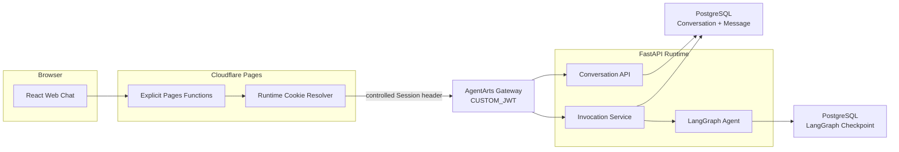
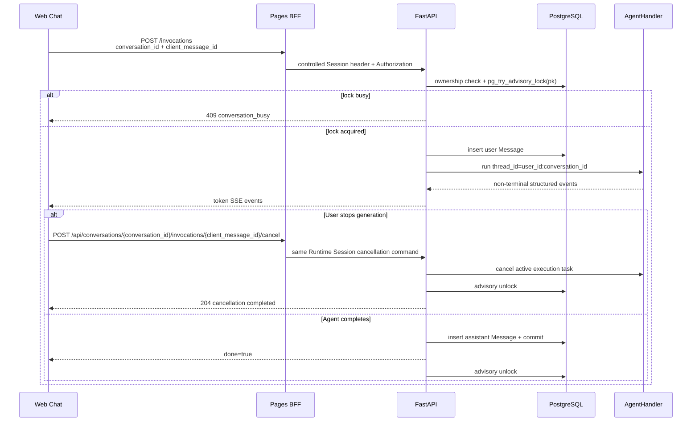

# Personal Assistant — Session 与 Conversation 状态管理架构

> 状态：Active v2 | 更新时间：2026-07-20 | 基线：Feature 14

本文定义 Web Chat 中 Runtime Session、Conversation、LangGraph thread 与长期 Memory 的
职责边界。核心原则是：平台路由生命周期不能成为用户业务数据生命周期。

## 1. 状态模型

系统使用三类相互独立的 ID：

| ID | Owner | 作用 | 保存位置 | 是否是用户身份 |
|----|-------|------|----------|----------------|
| `runtime_session_id` | Cloudflare Pages BFF | AgentArts Runtime 逻辑路由键 | `pa_runtime_session` HttpOnly session Cookie | 否 |
| `conversation_id` | FastAPI Service | 用户可见 Conversation identity | PostgreSQL `conversations.id` | 否 |
| `thread_id=user_id:conversation_id` | FastAPI Service | LangGraph Checkpoint namespace | PostgreSQL Checkpointer | 否 |

`user_id` 单独来自 AgentArts Gateway 已验证并转发的 JWT `sub`。浏览器提交的 Runtime
Session header、User header、Conversation UUID 都不能决定 ownership。

必须保持以下不变量：

1. 一个 Runtime Session 可以承载多个 Conversation。
2. 同一个 Conversation 可以从多个浏览器的不同 Runtime Session 访问。
3. Runtime instance 被平台回收不删除 Conversation 或 Message。
4. Conversation 删除不要求停止 Runtime Session，但必须删除业务 Message 与 Checkpoint。
5. Runtime ID 不进入业务 JSON、DOM state、OAuth signed state 或 PostgreSQL 业务表。

## 2. 组件边界

图类型：**Component Diagram（组件图）**。用于说明各层对状态的 ownership。


```mermaid
flowchart LR
    subgraph Browser["Browser"]
        UI["React Web Chat"]
    end

    subgraph Edge["Cloudflare Pages"]
        Routes["Explicit Pages Functions"]
        Resolver["Runtime Cookie Resolver"]
    end

    Gateway["AgentArts Gateway<br/>CUSTOM_JWT"]

    subgraph Service["FastAPI Runtime"]
        ConversationAPI["Conversation API"]
        Invocation["Invocation Service"]
        Agent["LangGraph Agent"]
    end

    DB["PostgreSQL<br/>Conversation + Message"]
    Checkpoint["PostgreSQL<br/>LangGraph Checkpoint"]

    UI --> Routes
    Routes --> Resolver
    Resolver -->|"controlled Session header"| Gateway
    Gateway --> ConversationAPI
    Gateway --> Invocation
    ConversationAPI --> DB
    Invocation --> DB
    Invocation --> Agent
    Agent --> Checkpoint
```

| 组件 | 负责 | 不负责 |
|------|------|--------|
| React Client | 选中 Conversation、展示列表和历史、消费 SSE | 生成/读取 Runtime ID、业务授权、Message 写入真相 |
| Cloudflare BFF | same-origin proxy、Runtime Cookie、header allowlist/overwrite、SSE pass-through | JWT 验证、数据库、Conversation ownership |
| AgentArts Gateway | JWT 验证、Runtime routing | Conversation ownership、Message persistence |
| FastAPI | 从可信 JWT 派生用户、CRUD、并发控制、Agent 编排 | 保存浏览器 Runtime ID |
| PostgreSQL | Conversation、Message、Checkpoint | Runtime ready/TTL 镜像 |

## 3. Runtime Session

### 3.1 Cookie contract

```http
Set-Cookie: pa_runtime_session=<uuid-v4>; Path=/; HttpOnly; Secure; SameSite=Lax
```

- 使用 `crypto.randomUUID()` 生成 UUID v4。
- Cookie 不设置 `Expires`、`Max-Age` 或 `Domain`，随 browser session 生命周期结束。
- production 必须使用 `Secure`；只有显式 `PA_ENV=local` 的 HTTP preview 可省略。
- BFF 不把浏览器原始 `Cookie` header 转发给 Gateway。
- BFF 丢弃 caller 提供的 `x-hw-agentarts-session-id` 和
  `X-HW-AgentGateway-User-Id`，只注入 resolver 得到的 Session ID。
- logout/account switch 通过 `POST /auth/logout` 使 Runtime Cookie 与 OAuth callback
  context cookies 过期。

Runtime Session 是稳定逻辑 routing key，不是物理 container identity。平台回收底层 instance
后可按同一 key 重建；该行为仍需在部署环境完成回收后复用 probe。应用不维护
`runtime_session_leases`、`ready` 或 `expires_at` 镜像。

### 3.2 Application-level warm-up

进入 Chat 时，Client 立即请求 `GET /api/conversations`。这是产品必需的数据加载，同时会
经过 Gateway 并按需启动 Runtime。系统不新增 no-op/readiness endpoint，不调用
`sessions-start`，也不显示 `warming/ready/degraded`。

是否降低首条消息延迟必须由部署后的 fresh-cookie 两组 benchmark 证明；在 p50/p95 采样
完成前，不承诺 warm-up latency 收益。

### 3.3 Checkpointer connection recovery

Runtime Session ID、FastAPI 进程生命周期和 PostgreSQL Checkpointer connection 是三个
独立边界。RDS/PostgreSQL 可能在 Runtime 进程仍存活时关闭 AsyncPostgresSaver 持有的
idle connection；这不代表 Runtime Session 或 Conversation 已失效。

Service 检测到明确的 psycopg idle/closed connection error 时，会在复用原 Runtime
Session ID、`user_id`、`conversation_id` 和 `thread_id` 的前提下重新打开 persistent
Checkpointer，并最多重试 Agent 启动前的 Checkpointer read preflight 一次。preflight
成功后才启动 Agent；Agent execution 启动后的 checkpoint、LLM 或 tool error 不触发整轮
retry，避免重复发送邮件等非幂等副作用。平台回收 Runtime 只能作为额外的 operational
recovery，不能替代 Service 自愈。

## 4. Conversation 与 Message

Conversation 是用户可见、可持久化的对话，状态只有 `active` 和 `archived`。Message read
model 只保存 `user` 与 `assistant`，按递增 `sequence` 分页。

图类型：**ER Diagram（实体关系图）**。用于说明业务持久化关系。

```mermaid
erDiagram
    USER ||--o{ CONVERSATION : owns
    CONVERSATION ||--o{ CONVERSATION_MESSAGE : contains

    CONVERSATION {
        bigint pk PK
        uuid id
        text user_id
        text title
        text status
        timestamptz created_at
        timestamptz updated_at
        timestamptz archived_at
    }

    CONVERSATION_MESSAGE {
        bigint sequence PK
        uuid id
        bigint conversation_pk FK
        text role
        jsonb content
        uuid client_message_id
        uuid reply_to_message_id
        timestamptz created_at
    }
```

所有读写都同时过滤 `user_id + conversation_id`。相同 `client_message_id` 在一个
Conversation 内唯一；assistant 的 `reply_to_message_id` 唯一，防止重复持久化答案。

## 5. Invocation 与并发

图类型：**Sequence Diagram（时序图）**。用于说明 commit-before-done 与 Advisory Lock。


```mermaid
sequenceDiagram
    participant UI as Web Chat
    participant BFF as Pages BFF
    participant API as FastAPI
    participant DB as PostgreSQL
    participant Agent as AgentHandler

    UI->>BFF: POST /invocations<br/>conversation_id + client_message_id
    BFF->>API: controlled Session header + Authorization
    API->>DB: ownership check + pg_try_advisory_lock(pk)
    alt lock busy
        API-->>UI: 409 conversation_busy
    else lock acquired
        API->>DB: insert user Message
        API->>Agent: run thread_id=user_id:conversation_id
        Agent-->>API: non-terminal structured events
        API-->>UI: token SSE events
        alt User stops generation
            UI->>BFF: POST /api/conversations/{conversation_id}/invocations/{client_message_id}/cancel
            BFF->>API: same Runtime Session cancellation command
            API->>Agent: cancel active execution task
            API->>DB: advisory unlock
            API-->>UI: 204 cancellation completed
        else Agent completes
            API->>DB: insert assistant Message + commit
            API-->>UI: done=true
            API->>DB: advisory unlock
        end
    end
```

- Invocation 与 Delete 使用同一个 PostgreSQL session-level Advisory Lock key。
- LLM/SSE 期间持有 lock connection，但不持有数据库 transaction。
- `409 duplicate_message` 不重跑 Agent；Client 重新读取该 Conversation history。
- `409 invocation_cancelled` 表示 cancellation command 抢先到达，迟到的原 Invocation
  在进入 Message persistence 和 Conversation lock 前终止。
- Client、BFF、Service 都不自动重试 `POST /invocations`。
- Transport disconnect 只作为 best-effort；Client Stop 必须发送幂等
  `POST /api/conversations/{conversation_id}/invocations/{client_message_id}/cancel`。
  Service registry 在 `prepare()` 前 reserve
  `user_id + conversation_id + client_message_id`；抢先到达的 cancellation 保存 120 秒
  tombstone，迟到 Invocation 命中后直接返回 `409 invocation_cancelled`。已 reserve 或运行的
  execution 取消后等待 lock 释放再返回 204。Client cancellation 使用 15 秒 timeout，首次
  Stop 最多执行两次 cancel 请求；最终失败后状态保留在 per-Conversation barrier，并显示
  `Retry stop`，由用户使用同一 `client_message_id` 重试。204 前不显示 Send，也不发送新的
  Invocation；输入草稿与 New Conversation 不受影响。相同 Runtime Session header 保证命令
  路由到发起任务的 Runtime；若任务已结束或不存在，仍幂等返回 204。
- `AgentHandler` 只产生非 terminal event；Invocation Service 独占 HTTP/SSE terminal。
- sync JSON 与 SSE 共用同一个 prepare、lock、idempotency 和 Message persistence core。

## 6. Hydration 与切换

Client 使用 assistant-ui `useRemoteThreadListRuntime`：

- `remoteId` 与 `externalId` 都等于 `conversation_id`。
- New Chat 先进入不带 `conversation_id` 的本地 draft，不写 PostgreSQL，也不在 sidebar
  中加入空 item；首次发送前调用 `initialize()` 创建 Conversation。完整生命周期见
  [ADR-020](ADR/ADR-020-lazy-conversation-creation.md)。
- Chat adapter 在 run 时等待 `threadListItem.initialize()`，不能把 assistant-ui local thread
  ID 当作 `conversation_id`。
- 每个 thread 的 history adapter 调用 Message API，并保持 `append()` no-op；只有
  Invocation Service 写 Message。
- history 加载期间显示 skeleton，不显示错误的空 welcome state。
- edit、regenerate 和 branch UI 被禁用，因为 Feature 14 只定义线性 Message semantics。

## 7. 永久删除

删除流程：校验 ownership，取得 Conversation lock，删除 `conversations` row，依靠
`ON DELETE CASCADE` 删除 Message，再调用 Checkpointer `adelete_thread()`。业务 row 已删但
Checkpoint 清理失败时返回错误；重复 Delete 会重试 `user_id:conversation_id` 的 Checkpoint
清理，因此操作可恢复且业务数据不会重新可见。

Feature 14 不实现 Trash、retention、purge worker 或 soft delete。

## 8. OAuth callback compatibility

授权开始时 BFF 把 `Authorization` 与 resolver Runtime Session snapshot 写入 callback-only
HttpOnly cookies。主 `pa_runtime_session` 后续轮换不改变这次 callback 的 routing snapshot。

新 signed state 只绑定 `user_id`、provider、nonce 与 expiry，不写 Runtime Session ID；legacy
state 中的 `session_id` 只为兼容解析后忽略。`oauth2_callback_states.session_id` 为 nullable，
新 row 不再写入该字段。

## 9. Local 与 production

| 场景 | Runtime Session 来源 | 用户身份来源 | 持久化 |
|------|----------------------|--------------|--------|
| Vite dev | dev proxy 注入固定 local-only Session header | dev proxy synthetic JWT `sub` | PostgreSQL |
| Wrangler local | `PA_ENV=local` Runtime Cookie resolver | inbound Bearer JWT `sub` | PostgreSQL |
| Production | Secure HttpOnly Runtime Cookie resolver | Gateway 已验证并转发的 JWT `sub` | PostgreSQL |

Vite fixture 不能进入 production build；真实 Cookie/header overwrite 必须通过 Wrangler Pages
Functions 测试。

## 10. 与长期 Memory 的关系

Conversation/Checkpoint 是短期对话连续性；跨 Conversation semantic Memory 是独立能力。
Memory 不能替代 Message history，Runtime Session 也不能作为 Memory namespace。未来 Memory
写入必须以可信 `user_id` 为隔离边界，并明确用户可见性、删除和 retention contract。

## 11. 风险与部署门禁

| 项目 | 当前状态 |
|------|----------|
| PostgreSQL schema、CRUD、lock、SSE、delete | 本地 integration/full-stack 已通过 |
| Gateway custom GET/POST/PATCH/DELETE 与 Session header | G1 deployment probe pending |
| Runtime instance 回收后同 ID 复用 | deployment validation pending |
| direct vs list-first p50/p95 | deployment measurement pending |

## 12. Four-Question Gate

| 问题 | 结论 |
|------|------|
| Is it best practice? | Yes。routing、identity 与业务数据分离，server-side ownership，真实 DB lock。 |
| Is it industry standard? | Yes。thin BFF、Gateway auth、PostgreSQL、Alembic、HttpOnly Cookie。 |
| Is it conventional? | Yes。普通 CRUD、SSE、keyset pagination 与 advisory lock。 |
| Is it modern? | Yes。Web Crypto、typed adapters、async psycopg 与 durable Checkpointer。 |

## 13. 参考

- [`api.md`](./api.md)
- [`cloud-service/cloudflare/pages.md`](./cloud-service/cloudflare/pages.md)
- [`auth/feature-15-calendar-oauth2-architecture.md`](./auth/feature-15-calendar-oauth2-architecture.md)
- [`../issues/features/feature-14-multi-session-runtime-prewarm/issue.md`](../issues/features/feature-14-multi-session-runtime-prewarm/issue.md)
