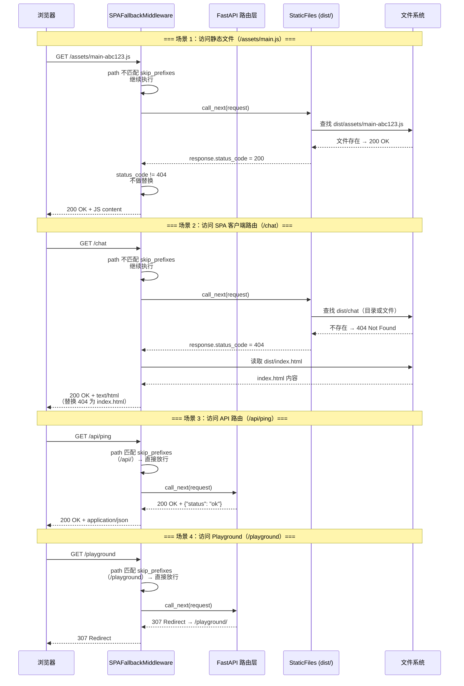
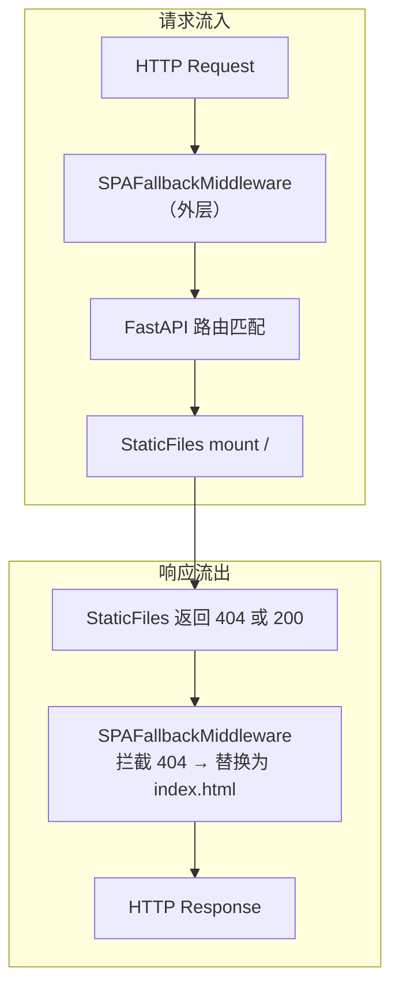

# Implementation Plan: Bug 2 — SPA Fallback Not Working

## 0. Issue Evaluation

| 维度 | 结果 | 说明 |
|------|------|------|
| Staleness | ✅ | Issue 发现于 2026-06-08（今日），引用的架构文档（`overall_architecture.md`、`backend_architecture.md`、`frontend_architecture.md`）均存在且内容匹配；`main.py` 中引用的行号（118-121）经核实正确 |
| Feasibility | ✅ | 实现路径明确：新增 `SPAFallbackMiddleware`（基于 Starlette `BaseHTTPMiddleware`），在 `StaticFiles` 返回 404 时以 `index.html` 替换响应。不违反任何 Accepted ADR，与 ADR-004（FastAPI 替代 AgentArtsRuntimeApp）完全兼容——middleware 是 FastAPI/Starlette 标准扩展机制 |
| Completeness | ✅ | Issue 包含完整的症状描述（curl 复现证据）、环境信息（Starlette 1.2.1）、预期/实际行为对比表、两种方案的 5 维度对比分析、最终决策及理由、完整实施要点（含代码示例和测试清单） |
| Impact Scope | ✅ | 影响范围清晰：Service 侧新增 1 个文件 + 修改 `main.py` ~5 行 + 新增 4 个单元测试；Client 侧零改动；E2E 侧移除 3 处 `@pytest.mark.xfail` 标记。无跨领域破坏性变更 |

**判定：ACCEPT** → 继续编写 Implementation Plan。

---

## 1. Issue Summary

- **类别**：Bug
- **问题**：Starlette 1.2.1 的 `StaticFiles(html=True)` 不提供根级 SPA fallback。访问客户端路由（`/chat`、`/settings` 等）返回 404 而非 `index.html`。
- **根因**：`html=True` 仅支持目录级 fallback（如 `/chat/` → `dist/chat/index.html`），不支持根级 fallback 到 `dist/index.html`。
- **修复方案**：采用 **Middleware 拦截 404** 方案——新增 `SPAFallbackMiddleware`，在 `StaticFiles` 返回 404 时将响应替换为 `index.html`。不参与路由匹配，不与 `StaticFiles` 职责冲突。
- **相关架构文档**：
  - `personal-assistant-meta/architecture/backend_architecture.md` §2 — 路由设计
  - `personal-assistant-meta/architecture/frontend_architecture.md` §6.2 Phase 1 — 同容器 serve 方案
  - `personal-assistant-meta/architecture/overall_architecture.md` §1.2 — 技术选型

---

## 2. API Changes

**无 API 接口变更。** 此修复在 HTTP 中间件层操作，不涉及 FastAPI 路由定义、Pydantic schema 或 OpenAPI spec 变更。`/api/*` 和 `/playground` 路由行为完全不变（middleware 跳过这些 prefix）。

---

## 3. Service Tasks

### 3.1 新建文件：`personal-assistant-service/app/spa_middleware.py`

创建一个新模块，包含 `SPAFallbackMiddleware` 类：

| 项目 | 内容 |
|------|------|
| 文件路径 | `personal-assistant-service/app/spa_middleware.py` |
| 类名 | `SPAFallbackMiddleware(BaseHTTPMiddleware)` |
| 依赖 | `pathlib.Path`、`starlette.middleware.base.BaseHTTPMiddleware`、`starlette.responses.FileResponse` |
| 构造函数参数 | `app`（ASGI app）、`static_dir: Path`（dist 目录路径）、`skip_prefixes: tuple`（默认 `("/api/", "/playground")`） |
| 核心逻辑 | `dispatch()` 方法：若 request URL path 匹配 `skip_prefixes` 则放行（`await call_next(request)`）；否则先 `await call_next(request)` 获取响应，若 `response.status_code == 404` 则读取 `static_dir / "index.html"` 并返回 `FileResponse` |

**路径遍历安全**：middleware 始终读取固定路径 `STATIC_DIR / "index.html"`，不将用户输入拼接到文件路径中。

**`skip_prefixes` 设计说明**：
- `"/api/"` — 带 trailing slash，匹配所有 `/api/*` 路由，但不匹配单纯的 `/api`（系统中无此路由）
- `"/playground"` — **不加 trailing slash**，同时匹配 `/playground`（redirect 到 `/playground/`）和 `/playground/xxx`（Chainlit 内部路由），防止 SPA fallback 吞掉 playground 路径。若需要更精确的 playground 路径保护，后续可改为 `("/api/", "/playground/", "/playground")`

### 3.2 修改文件：`personal-assistant-service/app/main.py`

三处改动，共计 ~5 行：

| 序号 | 位置 | 操作 | 说明 |
|------|------|------|------|
| 1 | 第 118-121 行 | **删除** | 删除关于 `html=True` 启用 SPA fallback 的错误注释块（4 行）。该注释描述的 SPA fallback 语义 Starlette 从未实现 |
| 2 | 第 130 行 | **修改** | `StaticFiles(directory=str(STATIC_DIR), html=True)` → `StaticFiles(directory=str(STATIC_DIR))`，移除 `html=True` 参数。SPA fallback 职责由 middleware 接管 |
| 3 | 第 128 行后（`if STATIC_DIR.is_dir()` 块末尾） | **新增** | 在 `app.mount("/", StaticFiles(...))` 之后新增两行：```python\nfrom app.spa_middleware import SPAFallbackMiddleware\napp.add_middleware(SPAFallbackMiddleware, static_dir=STATIC_DIR)``` |

**关键注意事项**：
- `from app.spa_middleware import SPAFallbackMiddleware` 应放在文件顶部 import 区域（第 15 行附近），与其他 `from app.*` import 保持一致
- `app.add_middleware()` 必须在 `app.mount()` **之后**调用。Starlette 的 middleware 栈是洋葱模型，外层 middleware 包裹内层——如果在 mount 之前 `add_middleware`，middleware 不会包裹已 mount 的 `StaticFiles` handler
- 确认 `STATIC_DIR` 变量在调用 `add_middleware` 时已定义（它确实在 mount 之前就已定义，第 123-126 行）

### 3.3 任务依赖顺序

```
1. 创建 app/spa_middleware.py（独立模块，无依赖）
2. 修改 app/main.py：
   a. 添加 import
   b. 删除错误注释（第 118-121 行）
   c. 移除 html=True 参数
   d. 添加 app.add_middleware() 调用
```

---

## 4. Client Tasks

**无 Client 侧改动。** 客户端路由（`/chat`、`/settings` 等）由 `@assistant-ui/react` 的 client-side router 处理，前端代码无需任何变更。修复后这些路由在直接访问和浏览器刷新时都能正确获得 `index.html`。

TypeScript 类型无需重新生成（API 接口未变）。

---

## 5. Test Requirements

### 5.1 Service 单元测试（`personal-assistant-service/tests/test_main.py`）

在文件末尾新增一个 `TestSPAFallbackMiddleware` 类，包含 4 个测试用例：

| 测试用例 | 方法名 | 验证点 |
|----------|--------|--------|
| **SPA fallback 正常返回 index.html** | `test_spa_fallback_serves_index_html` | `GET /chat` → 200，`Content-Type: text/html`，body 包含 `"Personal Assistant"` 和 `'id="root"'` |
| **API 路由不被 fallback 拦截** | `test_api_routes_bypass_fallback` | `GET /api/ping` → 200，返回 `{"status": "ok"}`（JSON 而非 HTML） |
| **Playground 路由不被 fallback 拦截** | `test_playground_bypasses_fallback` | `GET /playground` → 307 redirect（或 200，视 Chainlit mount 状态），但**不能**返回 index.html 内容 |
| **dist 不存在时 404 正常传递** | `test_404_passthrough_when_no_index_html` | 模拟 `STATIC_DIR / "index.html"` 不存在，`GET /chat` → 404（不 crash） |

**测试用例实现要点**：
- 使用现有的 `client` fixture（`httpx.ASGITransport` 直连 FastAPI app，无需启动真实服务）
- 测试 `SPAFallbackMiddleware` 时需确保 `dist/index.html` 存在（当前 mono-repo 环境下 `personal-assistant-client/dist/` 若已 build 则天然满足；若未 build，测试文件头部的 conftest fixture 应确保其存在，或在 middleware 测试中 mock `index.exists()`）
- 第 4 个测试（404 passthrough）需要 `unittest.mock.patch` 模拟 `Path.exists()` 返回 `False`，或临时移除 dist 目录的 mount

### 5.2 E2E 回归测试（`personal-assistant-e2e/tests/regression/test_bug_2_spa_fallback_not_working.py`）

移除两处 `@pytest.mark.xfail` 标记：

| 行号范围 | 测试方法 | 操作 |
|----------|----------|------|
| 第 62-65 行 | `test_chat_route_serves_index_html` | 移除 `@pytest.mark.xfail(...)` 装饰器及其 reason 注释 |
| 第 74-76 行 | `test_settings_route_serves_index_html` | 移除 `@pytest.mark.xfail(...)` 装饰器及其 reason 注释 |

移除后这两个测试预期全部 PASS（200 状态码 + HTML 内容验证）。

### 5.3 E2E 功能测试（`personal-assistant-e2e/tests/features/test_feature_1_1_web_chat.py`）

移除一处 `@pytest.mark.xfail` 标记：

| 行号范围 | 测试方法 | 操作 |
|----------|----------|------|
| 第 796-799 行 | `test_spa_fallback_serves_index_html` | 移除 `@pytest.mark.xfail(reason="...", strict=True)` 装饰器及其 reason 注释 |

移除后 `strict=True` 不再阻止测试通过。如果修复生效，该测试将正常 PASS 而非 XPASS。

### 5.4 测试执行顺序

```
1. Service unit tests (test_main.py) — 验证 middleware 逻辑正确性
2. E2E regression tests (test_bug_2_spa_fallback_not_working.py) — 验证完整链路
3. E2E feature tests (test_feature_1_1_web_chat.py) — 验证 SPA fallback 不破坏其他功能
```

---

## 6. Mermaid Diagrams

### 6.1 SPA Fallback Middleware 请求处理流



### 6.2 Middleware 洋葱模型位置



---

## 7. 受影响文件汇总

| 目录 | 文件 | 操作 | 行数估计 |
|------|------|------|----------|
| `personal-assistant-service/app/` | `spa_middleware.py` | **新建** | ~18 行 |
| `personal-assistant-service/app/` | `main.py` | **修改**（删除 4 行注释 + 去除 1 个参数 + 新增 2 行 import/middleware 注册） | ~5 行净变化 |
| `personal-assistant-service/tests/` | `test_main.py` | **新增** 1 个 test class + 4 个测试方法 | ~60 行 |
| `personal-assistant-e2e/tests/regression/` | `test_bug_2_spa_fallback_not_working.py` | **修改**（移除 2 个 `@pytest.mark.xfail` 装饰器） | ~6 行减少 |
| `personal-assistant-e2e/tests/features/` | `test_feature_1_1_web_chat.py` | **修改**（移除 1 个 `@pytest.mark.xfail` 装饰器） | ~4 行减少 |

---

## 8. 架构/规格文档更新评估

| 文档 | 是否需要更新 | 理由 |
|------|-------------|------|
| `architecture/backend_architecture.md` | ❌ 不需要 | 该文档描述的是路由概念设计（`/ping`、`/chat/stream` 等），不涉及 StaticFiles mount 的具体实现参数。SPA fallback 是实现细节，不影响架构层级 |
| `architecture/frontend_architecture.md` §6.2 | ❌ 不需要 | Phase 1 描述为 "FastAPI 通过 `StaticFiles` mount Vite build 产物" — 修复后仍然是 `StaticFiles` mount，只是 fallback 机制从 `html=True` 变为 middleware。架构描述正确性不变 |
| `specs/overall_specifications.md` | ❌ 不需要 | Bug 修复不改变功能规格——规格书从未承诺 "`html=True` 实现 SPA fallback"，它承诺的是 "SPA 路由可用"，修复后满足规格 |
| ADR 文档 | ❌ 不需要 | 无新增 ADR。此修复不涉及架构决策，是实现层面的 bug 修复 |

---

## 9. 风险与注意事项

| 风险 | 等级 | 缓解措施 |
|------|------|----------|
| `add_middleware` 调用顺序错误（在 mount 之前）导致 middleware 不生效 | 🟡 低 | 在 plan 中明确标注必须在 `app.mount()` 之后调用。Service 单元测试 `test_spa_fallback_serves_index_html` 直接验证 middleware 是否生效 |
| `skip_prefixes` 不精确导致 playground 路径被 SPA fallback 吞掉 | 🟡 低 | 使用 `"/playground"`（无 trailing slash）同时匹配 `/playground` 和 `/playground/xxx`。单元测试 `test_playground_bypasses_fallback` 验证此行为 |
| `index.html` 不存在时 middleware 返回原始 404（不引发异常） | 🟢 极低 | `index.exists()` 检查确保仅在文件存在时替换。测试 `test_404_passthrough_when_no_index_html` 覆盖此路径 |
| Starlette `BaseHTTPMiddleware` 在流式响应（SSE）中可能消费响应体 | 🟢 极低 | middleware 仅在 `status_code == 404` 时替换响应；SSE 响应（`/api/chat/stream`）状态码为 200，完全不被接触。且 API 路由 prefix `/api/` 在 `skip_prefixes` 中，middleware 直接放行不读取响应体 |

---

## 10. 实施步骤（按顺序）

1. **Service-Dev** 创建 `personal-assistant-service/app/spa_middleware.py`（参考 issue.md 第 153-187 行的代码示例）
2. **Service-Dev** 修改 `personal-assistant-service/app/main.py`：
   - 删除第 118-121 行错误注释
   - 移除 `StaticFiles(...)` 中的 `html=True` 参数
   - 添加 `from app.spa_middleware import SPAFallbackMiddleware` import
   - 在 `app.mount("/", StaticFiles(...))` 之后添加 `app.add_middleware(SPAFallbackMiddleware, static_dir=STATIC_DIR)`
3. **Service-Tester** 在 `personal-assistant-service/tests/test_main.py` 中新增 `TestSPAFallbackMiddleware` 类（4 个测试用例），运行 `pytest personal-assistant-service/tests/test_main.py -v` 确认全部通过
4. **E2E-Tester** 移除 `test_bug_2_spa_fallback_not_working.py` 和 `test_feature_1_1_web_chat.py` 中的 `@pytest.mark.xfail` 标记，运行 E2E 回归测试确认 SPA fallback 生效
