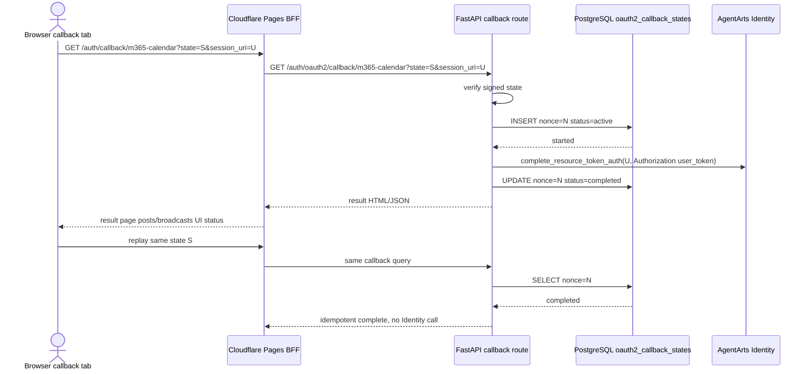

# Bug 20: OAuth2 callback state nonce replay protection 未跨实例生效

## 现象

Calendar OAuth2 callback flow 已经引入 signed `state`，并在 state claims 中包含
`nonce` 与 `exp`。旧实现只在进程内标记 used nonce，同一个有效 `state` 在 TTL
窗口内可能被重复提交到 callback complete 路径；如果请求落到不同 Runtime
instance，Service 仍可能再次调用
`IdentityClient.complete_resource_token_auth(...)`。

## 根因

1. `verify_oauth2_state(...)` 只验证 state 的完整性、时效性和主体绑定，不负责跨实例
   nonce 消费。
2. 旧的 replay guard 是 in-memory store，只能覆盖单进程。
3. 前端 tab 曾参与 complete 编排，导致同一个 callback envelope 可能被多个 tab
   同时处理，放大了 replay / concurrent complete 风险。

## 已实施方案

本 bug 与 Bug 21 一起由 backend/BFF callback 收敛方案修复：

- Microsoft OAuth redirect URL 指向
  `GET /auth/callback/m365-calendar` Cloudflare Pages Function。
- Pages Function 作为 BFF，不转发浏览器 `Authorization` / `Cookie`，只 server-side
  转发 callback query、可选 service `Authorization` 和
  `OAUTH2_CALLBACK_BFF_SECRET`。
- Service 内部 route `GET /auth/oauth2/callback/m365-calendar` 校验 signed state，
  调用 `complete_resource_token_auth(...)`，并返回 callback result HTML/JSON。
- Replay / concurrent state 挪到共享持久层：
  - production 使用 PostgreSQL `oauth2_callback_states`；
  - 本地未配置 `POSTGRES_DSN` 时继续使用 in-memory fallback。
- callback 状态有明确语义：
  - first writer: `started`，可调用 Identity complete；
  - duplicate while running: `active`，返回 pending，不再次调用 Identity；
  - duplicate after success: `completed`，返回 idempotent success。

## 验收标准

- [x] 首次合法 callback 仍可成功完成 OAuth2 complete。
- [x] 同一 `state` 在 TTL 内重复提交时，不会再次触发新的
      `IdentityClient.complete_resource_token_auth(...)` 调用。
- [x] 重复 callback 返回受控结果：completed replay 为 idempotent success，
      active duplicate 为 pending。
- [x] 既有 invalid signature、expired state、provider mismatch 的 403/failed
      行为保持不变。
- [x] Service regression tests 覆盖 success、completed replay、active duplicate、
      invalid state、OAuth provider error、Identity permission error、BFF secret。

## Affected Specs / Architecture Docs

| 文档 | 影响 |
|------|------|
| `personal-assistant-meta/architecture/auth/feature-15-calendar-oauth2-architecture.md` | 记录 BFF callback、Service-owned complete、PostgreSQL replay store |
| `personal-assistant-meta/architecture/backend_architecture.md` | 补充 callback route 的 BFF / replay / idempotency 语义 |
| `personal-assistant-meta/architecture/cloud-service/cloudflare/pages.md` | 新增 `/auth/callback/m365-calendar` Pages Function |
| `personal-assistant-meta/architecture/devops/local-development.md` | 记录 local Vite fallback 与 production BFF 差异 |

## 参考实现

| 文件 | 关联点 |
|------|--------|
| `personal-assistant-service/app/oauth2_callback_store.py` | PostgreSQL / in-memory callback state store |
| `personal-assistant-service/app/oauth2_state.py` | signed state create / verify 与 local fallback helpers |
| `personal-assistant-service/app/main.py` | `GET /auth/oauth2/callback/m365-calendar` backend-owned callback |
| `personal-assistant-client/functions/auth/callback/m365-calendar.js` | Cloudflare Pages BFF callback |
| `personal-assistant-service/tests/test_oauth2_callback.py` | replay regression tests |
| `personal-assistant-client/functions/invocations.test.js` | BFF proxy tests |
