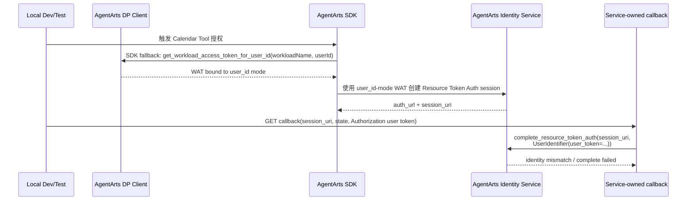

# Bug 22: Calendar OAuth2 本地 WAT identity mode 与 complete UserIdentifier 不匹配

> Reopened / refined: Bug 21 已修复 legacy complete endpoint 与 production callback
> 主流程问题，但本 issue 仍用于追踪 **local development / test** 下的 AgentArts
> workload access token identity mode 与 callback complete `UserIdentifier` 不一致问题。
> 当前入口是 Service-owned callback
> `/invocations/auth/oauth2/callback/m365-calendar`，不是已移除的
> `POST /invocations/auth/oauth2/complete`。

## 现象

Feature 15 Calendar OAuth2 线上使用正常，但本地 local test / manual test 失败。
核心原因不是“创建 auth session”本身，而是 **获取 AgentArts workload access token
时使用的 user identity mode** 与 callback complete 使用的 `UserIdentifier` 不一致。

AgentArts 有两种 user-scoped WAT 获取方式：

```python
dp_client.get_workload_access_token_for_jwt(workloadName, userToken)   # JWT mode
dp_client.get_workload_access_token_for_user_id(workloadName, userId)  # user_id mode
```

线上 remote 环境中，AgentArts Gateway 代替业务服务执行 JWT mode，并通过
`X-HW-AgentGateway-Workload-Access-Token` 注入 WAT；此时 callback complete 使用
`UserIdentifier(user_token=...)` 是正确的。

当前本地 local 环境没有 Gateway 代取 WAT，AgentArts SDK fallback 会自动使用
`user_id` mode 创建 workload identity / WAT；但 Service-owned callback 仍固定使用：

```python
client.complete_resource_token_auth(
    session_uri=callback.session_uri,
    user_identifier=UserIdentifier(user_token=user_token),
)
```

于是本地形成 `user_id WAT -> user_token complete` 的交叉组合，Calendar OAuth2
complete 无法稳定完成。

## 影响

- Feature 15 的 local integration / manual test 不能可靠跑通。
- 本地开发者容易误判为 Microsoft OAuth2、AgentArts provider 配置或 callback relay
  问题。
- 本地测试无法覆盖真实的 complete success path，削弱后续修复 Bug 21 的信心。
- 如果测试 fixture 只 mock `user_token` success，会掩盖本地 runtime 与 AgentArts
  Identity Service 的真实身份绑定差异。

## 复现线索

1. 在本地启动 Service 与 Client。
2. 使用本地 dev header / local identity 配置触发 Calendar OAuth2 授权。
3. 触发 Calendar tool，观察本地 SDK fallback 是否通过
   `get_workload_access_token_for_user_id(workloadName, userId)` 获取 WAT。
4. 完成浏览器授权后，Microsoft redirect 到 Service-owned callback：
   `/invocations/auth/oauth2/callback/m365-calendar`。
5. 观察 callback complete 是否仍固定使用：

   ```python
   UserIdentifier(user_token=user_token)
   ```

6. 如果本地 WAT 是通过 `user_id` mode 获取，但 complete 阶段传 `user_token`，
   AgentArts Identity 会看到 identity mismatch。

## 当前行为



## 根因假设

Feature 15 架构文档已经强调 `UserIdentifier` 的 `user_id` 与 `user_token` 互斥，并倾向
生产 Gateway JWT 路径使用 `user_token`。但本地 dev/test 没有生产 Gateway 注入的同源
身份上下文：

- remote production：AgentArts Gateway 代业务服务执行 JWT mode WAT 获取，相当于
  `get_workload_access_token_for_jwt(workloadName, userToken)`，并把 WAT 注入 Runtime；
- local development：当前 SDK fallback 自动执行 user_id mode WAT 获取，即
  `get_workload_access_token_for_user_id(workloadName, userId)`；
- 当前 Service-owned callback 固定从 `Authorization` header 提取 `user_token` 并传
  `UserIdentifier(user_token=...)`；
- 因此 local 路径形成 `user_id WAT -> user_token complete` 的不一致组合。

正确约束应为：

| WAT identity mode | WAT 来源 | Callback Complete |
|-------------------|----------|-------------------|
| JWT mode | Gateway 注入，或显式 `get_workload_access_token_for_jwt(workloadName, userToken)` | `UserIdentifier(user_token=user_token)` |
| user_id mode | 本地显式 `get_workload_access_token_for_user_id(workloadName, userId)` | `UserIdentifier(user_id=user_id)` |

## 预期行为

- Calendar OAuth2 full flow 线上线下都使用 JWT identity mode。
- Production Gateway 路径继续使用 Gateway 注入的 JWT-mode WAT +
  `UserIdentifier(user_token=...)`。
- Local full-flow 路径不再依赖 SDK 自动 user_id fallback；Service 在没有 Gateway WAT
  时主动用 inbound `Authorization` user token 调
  `get_workload_access_token_for_jwt(workloadName, userToken)`，并写入
  `AgentArtsRuntimeContext`。
- Callback complete 不做 local 特判，继续固定使用
  `UserIdentifier(user_token=user_token)`。
- 本地 React callback fallback 也必须把同一用户的 inbound `Authorization` user token
  带回 Service-owned callback；不能再以“只带 `Accept` header”的请求冒充完整授权流程。
- 本地 Calendar OAuth2 full flow 如果缺少真实 inbound `Authorization` user token，应
  提前明确失败，提示启用本地 Entra 登录；不要静默回退到 user_id mode。
- 错误日志应打印 WAT source / identity mode（不打印 token 明文），例如
  `gateway_wat` / `local_jwt_wat` / `missing_user_token`。

## Solution Design

### 1. Candidate comparison

| 方案 | 做法 | 优点 | 问题 | 结论 |
|------|------|------|------|------|
| A. Local complete 改用 `user_id` | local 继续使用 SDK fallback 的 user_id-mode WAT，callback complete 在 local 改为 `UserIdentifier(user_id=...)` | 能兼容当前 Dev Mode / mock user id；本地改动小 | 线上线下 identity model 分叉；需要 `PA_LOCATION`、`PA_STAGE`、`AGENTARTS_USER_IDENTITY_MODE` 或类似配置；callback 需要 local 特判；local full-flow 不够像 production | 不选为主方案 |
| B. Local 主动使用 JWT-mode WAT | local 从 inbound `Authorization` 提取 user token，主动调用 `get_workload_access_token_for_jwt(workloadName, userToken)`；callback 继续 `UserIdentifier(user_token=...)` | 线上线下 identity model 一致；callback 无需特判；更接近 production；不需要新增环境矩阵配置 | local full-flow 必须启用真实 Entra 登录，不能只靠 mock user id | **选为主方案** |
| C. 双模式可配置 | 增加 `PA_LOCATION`、`PA_STAGE`、`AGENTARTS_USER_IDENTITY_MODE`，同时支持 jwt / user_id | 灵活，可覆盖多种调试方式 | 配置和 guardrail 复杂；容易形成错误组合；为一个 OAuth2 full-flow bug 引入过多长期表面积 | 暂不采用 |

选择 B 的核心原因：**把 local 修成像 production，而不是让 callback 兼容 local**。
Calendar OAuth2 full flow 的价值在于验证真实 User Federation / Token Vault 行为；如果
local 走 user_id mode，虽然能跑通，但测到的是另一条 identity path。

### 2. Selected solution

Calendar OAuth2 full flow 统一采用 JWT identity：

| 环境 | WAT 来源 | Callback Complete | 要求 |
|------|----------|-------------------|------|
| Remote AgentArts Runtime | AgentArts Gateway 注入 `X-HW-AgentGateway-Workload-Access-Token`，等价于 JWT mode | `UserIdentifier(user_token=user_token)` | Cloudflare BFF / Gateway context 恢复原 inbound `Authorization` |
| Local dev / manual test | Service 主动调用 `get_workload_access_token_for_jwt(workloadName, userToken)` 并写入 `AgentArtsRuntimeContext` | `UserIdentifier(user_token=user_token)` | 本地前端启用 Entra 登录；`/invocations` 与本地 callback fallback 都向 Service 发送真实 `Authorization: Bearer <id_token>` |
| Unit / contract tests | mock DP client / Identity client | assert `UserIdentifier(user_token=...)` | 不依赖真实 Microsoft 或 AgentArts token |

本 issue 不新增以下配置：

| 配置 | 结论 | 原因 |
|------|------|------|
| `PA_LOCATION` | 不需要 | 不再按 local / remote 切换 complete identity |
| `PA_STAGE` | 不需要 | 该 bug 不需要资源阶段判断 |
| `OAUTH2_COMPLETE_USER_IDENTIFIER_STRATEGY` | 不需要 | complete 永远使用 `user_token` |
| `AGENTARTS_USER_IDENTITY_MODE` | 不需要 | Calendar OAuth2 full flow 永远使用 JWT identity |

### 3. Service implementation shape

本节里的“WAT 准备”只表示：把 AgentArts Gateway 已注入的 Workload Access Token
放入 `AgentArtsRuntimeContext`；如果本地没有 Gateway WAT，则由 Service 用 inbound
user token 换取 JWT-mode WAT 后再放入 `AgentArtsRuntimeContext`。Browser 不保存、
生成或传输 WAT。

在 `app/auth.py` 或相邻 helper 中扩展 WAT 准备逻辑。注意不要让普通本地
Dev Mode 对话因为缺少 `Authorization` 直接失败；只有 Calendar OAuth2 full flow
需要 JWT-mode WAT 时才提前明确失败：

```python
def ensure_jwt_mode_workload_access_token(
    request: Request,
    *,
    required: bool,
) -> str | None:
    gateway_token = request.headers.get(ACCESS_TOKEN_HEADER, "").strip()
    if gateway_token:
        AgentArtsRuntimeContext.set_workload_access_token(gateway_token)
        return gateway_token

    try:
        user_token = extract_authorization_user_token(request)
    except HTTPException:
        AgentArtsRuntimeContext.set_workload_access_token(None)
        if required:
            raise HTTPException(
                status_code=401,
                detail="Local Calendar OAuth2 requires an Authorization user token",
            )
        return None

    workload_token = dp_client.get_workload_access_token_for_jwt(
        workloadName,
        user_token,
    )
    AgentArtsRuntimeContext.set_workload_access_token(workload_token)
    return workload_token
```

实现前需要先把 AgentArts SDK 接入点钉死，避免在业务代码里散落 SDK 细节：

- 新增一个窄 helper（例如 `app/agentarts_wat.py`，或放在 `app/auth.py` 中但保持可
  mock），只暴露“用 user token 换 JWT-mode WAT”的函数。
- 该 helper 内部再调用 AgentArts DP client 的
  `get_workload_access_token_for_jwt(workloadName, userToken)`。实现时必须核对
  `agentarts-sdk` 当前版本的 import path、client 构造方式和返回值结构。
- `workloadName` 不能硬编码在 route / tool 中。优先使用 SDK / Runtime 已有的
  workload name 来源；如 SDK 无法提供，再以 `personal-assistant-service/.agentarts_config.yaml`
  中 `agents.<default_agent>.base.name` 对应的 runtime workload name 为准，并把读取方式
  集中在同一个 helper 里。
- 单元测试 patch 项目内 helper，不直接依赖 AgentArts SDK 真实网络调用。

落点：

- `/invocations` 可 best-effort 执行 JWT-mode WAT 准备：有 Gateway WAT 时使用
  Gateway WAT；无 Gateway WAT 但有 `Authorization` 时换取 local JWT-mode WAT；两者都
  没有时保持普通 Dev Mode 能力，但 Calendar OAuth2 full flow 不能被视为可验证。
- Calendar tool / OAuth2 auth-required 路径需要在 SDK 可能 fallback 到 user_id mode
  之前确认已有 JWT-mode WAT；如果没有，应提前明确失败，而不是让
  `@require_access_token` 触发 SDK user_id fallback。
- `/auth/oauth2/callback/m365-calendar` 在调用
  `complete_resource_token_auth` 前，应至少确认 callback 请求携带同一用户的
  `Authorization` user token；如果 AgentArts SDK 的 complete 调用也依赖
  RuntimeContext WAT，则同样调用上面的 WAT 准备 helper。
- 如果没有 Gateway WAT 且没有 `Authorization` user token，Calendar OAuth2 full flow
  应提前明确失败，提示本地需要启用真实 Entra 登录；不要自动调用
  `get_workload_access_token_for_user_id`。

Callback complete 保持当前主线：

```python
user_token = extract_authorization_user_token(request)
client.complete_resource_token_auth(
    session_uri=callback.session_uri,
    user_identifier=UserIdentifier(user_token=user_token),
)
```

### 4. Local development impact

本方案要求本地 Calendar OAuth2 full flow 使用真实登录，而不是纯 Dev Mode：

- `personal-assistant-client/.env` 需要配置 `VITE_ENTRA_CLIENT_ID` 和
  `VITE_ENTRA_TENANT_ID`，让本地前端拿到 inbound id token。
- 本地 `/invocations` 请求需要携带 `Authorization: Bearer <id_token>`。
- 本地 callback relay / fallback 也需要把同一用户的 `Authorization` 带回 Service-owned
  callback。当前 React fallback 只发送 `Accept: application/json`，需要改为从本地
  MSAL 登录状态静默获取 id token 并附加 `Authorization: Bearer <id_token>`；若拿不到，
  页面应显示“本地日历授权需要先登录 Microsoft”，而不是继续调用后端。
- 生产 Cloudflare Pages BFF 仍使用 callback-only HttpOnly cookies 恢复
  `Authorization`；React fallback 只服务 Vite local dev，不替代生产 BFF。
- 纯 mock header (`X-HW-AgentGateway-User-Id: dev-user`) 仍可用于不涉及 Calendar
  OAuth2 full flow 的轻量本地开发，但不作为 Calendar full-flow 验证路径。

### 5. Security and testing guardrails

- 不允许 complete 失败后 fallback 到 `UserIdentifier(user_id=...)`。identity mismatch
  应暴露为本地 auth / WAT 准备问题。
- 不允许 browser 保存、生成或传输 WAT；local 由 Service 使用 inbound user token
  server-side 换取 JWT-mode WAT。
- 允许本地 React fallback 发送 inbound user token（`Authorization: Bearer <id_token>`），
  但仍不允许发送 WAT、Microsoft Graph access token 或其他第三方 resource token。
- 不同时传 `user_id` 与 `user_token`，AgentArts Identity 会返回
  `AgentIdentityTokenVault.1015`。
- 日志记录 WAT source / identity mode，例如 `gateway_wat`、`local_jwt_wat`、
  `missing_authorization_user_token`；不记录完整 JWT、WAT、OAuth2 code 或 third-party
  access token。

### 6. Design review

整体方案可行，关键设计点是统一 Calendar OAuth2 full flow 的 identity model：
remote 与 local 都走 JWT mode，callback complete 始终使用 `user_token`。这比为
local 添加 `user_id` 特判更少配置、更少分支，也更能代表 production 行为。

需要在 implementation 中特别注意三点：

- local WAT 准备必须发生在 SDK 可能 fallback 到 user_id mode 之前。
- callback request 必须恢复或携带同一个 inbound user token，否则 complete 仍应失败。
- Dev Mode mock user id 不能被误认为 Calendar OAuth2 full-flow 成功路径。

### 7. Four-Question Gate

| 问题 | 结论 | 检查结果 |
|------|------|----------|
| Is it best practice? | Yes | 统一线上线下身份模型、缺失 user token 时提前明确失败、避免 callback fallback，符合显式认证和安全失败原则。 |
| Is it industry standard? | Yes | 云端由 Gateway 注入可信 workload token，本地服务端使用用户 JWT 换取等价 WAT，是云 runtime 本地调试常见的 production-parity 做法。 |
| Is it conventional? | Yes | 新成员只需要理解“Calendar OAuth2 full flow 始终用 JWT identity”；不需要理解额外 location/stage strategy matrix。 |
| Is it modern? | Yes | 保持 OAuth callback 服务端完成、Managed Token Vault / Gateway WAT 注入、本地 server-side token exchange，避免 browser 持有 WAT、implicit flow 或隐式猜测身份策略。 |

## 修复范围

### In Scope

- 梳理 Feature 15 Calendar OAuth2 WAT 获取阶段与 callback complete 阶段各自使用的
  identity mode。
- 为 local dev/test 定义明确的 JWT-mode WAT 获取策略：
  `get_workload_access_token_for_jwt(workloadName, userToken)`。
- 明确 DP client 和 `workloadName` 的项目内 helper 落点，避免 route / tool 直接依赖
  SDK 细节或硬编码 workload name。
- 防止 local Calendar full-flow 使用 SDK user_id fallback 后，再用 `user_token`
  complete。
- 保持 callback complete 固定使用 `UserIdentifier(user_token=...)`。
- 修改本地 React callback fallback：完整 Calendar local full-flow 必须带回同一用户
  `Authorization`，不能继续以无 Authorization 的 JSON fallback 作为成功路径。
- 不引入 `PA_LOCATION`、`PA_STAGE`、`OAUTH2_COMPLETE_USER_IDENTIFIER_STRATEGY` 或
  `AGENTARTS_USER_IDENTITY_MODE` 等策略配置。
- 增加 regression tests 覆盖：
  - Gateway WAT present 时直接使用 injected WAT；
  - local 无 Gateway WAT 但有 `Authorization` 时调用
    `get_workload_access_token_for_jwt`；
  - Calendar OAuth2 需要 WAT 但 local 缺少 `Authorization` 时提前明确失败，不走
    user_id fallback；
  - 本地 React callback fallback 获取并转发 `Authorization`；获取不到 token 时显示
    local login-required 失败状态，不调用后端 complete；
  - callback complete 继续传 `UserIdentifier(user_token=...)`。
- 如架构文档当前只描述 production `user_token` 路径，补充 local JWT-mode WAT 约束。

### Out of Scope

- 修改 Microsoft Entra App scope 或 redirect URI。
- 在浏览器保存、生成或传输 AgentArts workload token。
- 把所有工具统一迁移到同一种 User Federation complete strategy。
- 为 Calendar OAuth2 full flow 增加 user_id-mode fallback 或策略配置。
- 在本 issue 中解决 Bug 21 的生产偶发跨 tab / stale callback 问题，除非排查证明同根。

## 验收标准

- [ ] Feature 15 local Calendar OAuth2 test 可以稳定通过，或明确由可重复的 mock /
      contract test 替代真实 complete。
- [ ] 本地无 Gateway WAT 且存在 `Authorization` user token 时，Service 使用
      `get_workload_access_token_for_jwt(workloadName, userToken)` 获取 WAT。
- [ ] 本地缺少 `Authorization` user token 时，Calendar OAuth2 full flow 提前明确失败，
      不调用 `get_workload_access_token_for_user_id` fallback。
- [ ] 本地 React callback fallback 向 Service-owned callback 转发
      `Authorization: Bearer <id_token>`；缺少 id token 时不调用后端 complete。
- [ ] Production Gateway JWT 路径继续使用 Gateway 注入 WAT +
      `UserIdentifier(user_token=...)`，不回退为浏览器可伪造的 user id。
- [ ] Callback complete 线上线下都使用 `UserIdentifier(user_token=...)`。
- [ ] 如果 `complete_resource_token_auth` 需要 RuntimeContext WAT，callback 路径也使用
      同一 WAT 准备 helper；如果不需要，需用 contract test 或 SDK 行为验证记录该结论。
- [ ] Service 日志包含 WAT source / identity mode 与 AgentArts
      request_id，但不泄露 token。
- [ ] `uv run pytest tests/test_oauth2_callback.py tests/test_main.py` 通过。
- [ ] `npm run test -- M365CalendarCallbackPage invocations` 或等价前端测试通过。

## Affected Specs / Architecture Docs

| 文档 | 影响 |
|------|------|
| `personal-assistant-meta/architecture/auth/feature-15-calendar-oauth2-architecture.md` | 补充 local JWT-mode WAT 与 production Gateway WAT 的一致策略 |
| `personal-assistant-meta/issues/features/resolved/feature-15-calendar-agentarts-full-oauth2/plan.md` | 对账实现计划中的 local fallback / WAT 假设 |
| `personal-assistant-meta/issues/bugs/bug-21-calendar-oauth2-complete-session-identity-mismatch/issue.md` | 关联生产 identity mismatch 排查，但保持独立修复入口 |

## 参考实现 / 排查入口

| 路径 | 关联点 |
|------|--------|
| `personal-assistant-service/app/main.py` | 当前 Service-owned callback 的 `complete_resource_token_auth` 调用 |
| `personal-assistant-service/app/auth.py` | `extract_authorization_user_token`、`extract_gateway_user_id`、`ensure_jwt_mode_workload_access_token`；需要支持 local JWT-mode WAT 准备 |
| `personal-assistant-service/app/agentarts_wat.py`（建议新增） | 封装 DP client、`workloadName` 解析和 `get_workload_access_token_for_jwt` 调用，供 Service route / Calendar boundary mock |
| `personal-assistant-service/tests/test_oauth2_callback.py` | Service-owned callback 当前断言 production-like user_token path |
| `personal-assistant-client/src/components/auth/M365CalendarCallbackPage.tsx` | 当前本地 React fallback 只带 `Accept`；需要恢复/获取并转发 inbound `Authorization` |
| `personal-assistant-client/functions/auth/callback/m365-calendar.js` | 生产 BFF callback cookie 恢复路径，作为 local fallback 对齐目标 |
| `personal-assistant-meta/architecture/auth/feature-15-calendar-oauth2-architecture.md` | `UserIdentifier` 参数约束和 production path 说明 |
