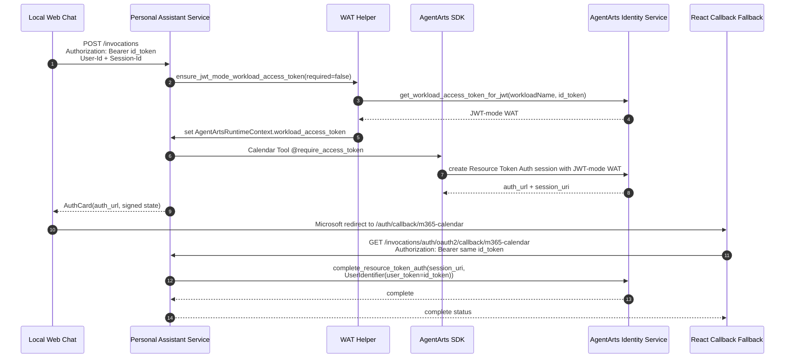

# Bug 22 Implementation Plan: Calendar OAuth2 本地 JWT-mode WAT 对齐

> 版本：v1.0 | 状态：Draft | Issue: [`issue.md`](./issue.md)
>
> 目标：修复 local development / manual test 下 Calendar OAuth2 full flow
> 使用 user_id-mode WAT 创建授权 session、却用 `UserIdentifier(user_token=...)`
> 完成 callback 的身份不一致问题。

---

## Executive Summary

本修复不改变 production callback 主流程：线上继续依赖 AgentArts Gateway 注入
JWT-mode Workload Access Token，Service-owned callback 继续使用
`UserIdentifier(user_token=...)` 完成 `complete_resource_token_auth`。

本修复只把本地完整 Calendar OAuth2 流程拉齐到 production identity model：

- 本地 `/invocations` 若没有 Gateway WAT，但有真实
  `Authorization: Bearer <id_token>`，Service 主动换取 JWT-mode WAT 并放入
  `AgentArtsRuntimeContext`。
- Calendar Tool 在进入 AgentArts SDK `@require_access_token` 前确认当前请求已有
  JWT-mode WAT；没有真实用户 token 时提前返回清晰错误，不让 SDK 走 user_id fallback。
- 本地 React callback fallback 在调用 Service-owned callback 时也必须带回同一用户的
  `Authorization`，不能继续用只带 `Accept` 的请求模拟完整授权。
- callback complete 不新增 local/user_id 特判，始终只传 `UserIdentifier(user_token=...)`。

**核心原则**：local 像 production，而不是 production callback 兼容 local。

---

## Target Flow



---

## File Change Matrix

| 子系统 | 文件 | 操作 | 说明 |
|--------|------|------|------|
| Service | `app/agentarts_wat.py` | 新增 | 建议新增窄 helper，封装 DP client、`workloadName` 解析和 JWT-mode WAT 获取 |
| Service | `app/auth.py` | 修改 | 将现有 Gateway WAT 提取扩展为统一 WAT 准备入口，保留普通 Dev Mode best-effort 行为 |
| Service | `app/main.py` | 修改 | `/invocations` 设置 WAT source；callback complete 前确认同一用户 `Authorization`，必要时复用 WAT helper |
| Service | `app/tools/calendar_tools.py` | 修改 | Calendar Tool 进入 `@require_access_token` 前检查 JWT-mode WAT 可用性，缺失时返回清晰本地登录错误 |
| Service Tests | `tests/test_auth.py` | 修改 | 覆盖 Gateway WAT、local JWT-mode WAT、缺少 Authorization 的 best-effort / required 行为 |
| Service Tests | `tests/test_main.py` | 修改 | 覆盖 `/invocations` WAT source 和 callback complete identity 不变 |
| Service Tests | `tests/test_oauth2_callback.py` | 修改 | 覆盖 callback 始终 `UserIdentifier(user_token=...)`，以及缺少 Authorization 时失败 |
| Client | `src/components/auth/M365CalendarCallbackPage.tsx` | 修改 | 本地 fallback 静默获取 id token 并附加 `Authorization`；拿不到 token 时不调用后端 |
| Client Tests | `src/components/auth/M365CalendarCallbackPage.test.tsx` | 修改 | 不再断言 “without Authorization”；新增 token present / missing token 两类测试 |
| Client Tests | `functions/invocations.test.js` | 修改/确认 | 生产 BFF callback cookie 恢复路径不回归 |
| Meta | `architecture/auth/feature-15-calendar-oauth2-architecture.md` | 修改 | 补充 local JWT-mode WAT 与 React fallback Authorization 约束 |
| E2E | `personal-assistant-e2e/` | 新增/修改 | 增加 mock/contract 流程，覆盖本地 JWT identity path |

---

## Service Plan

### 1. SDK 接入点确认

实现前先确认 `agentarts-sdk` 当前版本：

1. DP client 的 import path 和构造方式。
2. `get_workload_access_token_for_jwt(workloadName, userToken)` 的参数名、返回值结构和异常类型。
3. SDK / Runtime 是否已有官方 workload name 获取方式。
4. `complete_resource_token_auth` 是否需要当前 RuntimeContext 中存在 WAT。

若第 4 点确认 callback complete 不依赖 RuntimeContext WAT，记录到测试或注释中；若依赖，
callback 路径也调用同一 WAT helper。

> 实现阶段修改 WAT 准备入口、`calendar_oauth2_callback`、
> Calendar Tool boundary 等 symbol 前，按项目约定先运行 GitNexus impact analysis。

### 2. 新增 WAT Helper

建议新增 `personal-assistant-service/app/agentarts_wat.py`，只暴露项目内稳定接口：

```python
def get_jwt_mode_workload_access_token(user_token: str) -> str:
    """Use inbound user token to exchange a JWT-mode AgentArts WAT."""
```

设计要求：

- DP client、region、credential、`workloadName` 解析都集中在该 helper 内。
- `workloadName` 不在 route / tool 里硬编码。
- 单元测试 patch 项目内 helper，不直接 mock 第三方 SDK 内部层级。
- 日志只记录 source / identity mode / request_id，不记录 token 明文。

`workloadName` 解析优先级：

1. SDK / Runtime 官方来源。
2. 如 SDK 无来源，集中读取 `.agentarts_config.yaml` 的
   `agents.<default_agent>.base.name`。
3. 如仍无法获得，明确失败并提示配置缺失。

### 3. 扩展 WAT 准备入口

在 `app/auth.py` 中使用 `ensure_jwt_mode_workload_access_token(request, *, required)`
作为唯一 WAT 准备入口，合并 Gateway WAT 提取与 local JWT-mode WAT 交换语义：

```python
def ensure_jwt_mode_workload_access_token(
    request: Request,
    *,
    required: bool,
) -> str | None:
    ...
```

行为矩阵：

| Gateway WAT | Authorization | required | 行为 |
|-------------|---------------|----------|------|
| present | any | any | 使用 Gateway WAT，source=`gateway_wat` |
| missing | present | false/true | 用 user token 换 JWT-mode WAT，source=`local_jwt_wat` |
| missing | missing | false | 设置 RuntimeContext WAT 为 `None`，保留普通 Dev Mode |
| missing | missing | true | 返回 401 / clear local auth error，不调用 user_id fallback |

### 4. `/invocations` 接入

`main.py::invocations()` 在设置 user/session context 后调用：

```python
ensure_jwt_mode_workload_access_token(request, required=False)
```

这样普通聊天仍可用 mock user id 轻量开发；只要本地前端有真实 `Authorization`，Calendar
首次授权前就会准备 JWT-mode WAT。

### 5. Calendar Tool Guard

Calendar Tool 是本 bug 的关键边界。每个 public Calendar Tool 进入
`@require_access_token` 包裹函数前，必须确认：

- 当前请求已有 Gateway WAT；或
- 当前请求已有 local JWT-mode WAT；或
- 能通过当前请求的 `Authorization` 准备 JWT-mode WAT。

如果无法满足，返回用户可理解错误，例如：

```text
本地日历授权需要先使用 Microsoft 登录。请配置 VITE_ENTRA_CLIENT_ID / VITE_ENTRA_TENANT_ID 后重新登录。
```

不要调用 `get_workload_access_token_for_user_id`，也不要在 complete 失败后 fallback 到
`UserIdentifier(user_id=...)`。

### 6. Callback Complete 保持不分叉

`calendar_oauth2_callback()` 保持主线：

```python
user_token = extract_authorization_user_token(request)
client.complete_resource_token_auth(
    session_uri=callback.session_uri,
    user_identifier=UserIdentifier(user_token=user_token),
)
```

补充：

- callback 缺少 `Authorization` 时继续失败，并清理 active state。
- 如 SDK complete 需要 WAT，则在 complete 前调用
  `ensure_jwt_mode_workload_access_token(request, required=True)`。
- 不接受 `user_id` complete 策略配置。

---

## Client Plan

### 1. React Callback Fallback 改为携带 Authorization

当前 `M365CalendarCallbackPage.tsx` 的 fallback fetch 只带：

```ts
{ headers: { Accept: "application/json" } }
```

需要改为：

1. 在 callback page 中复用现有 MSAL / auth helper 静默获取 id token。
2. 如果拿到 token，调用后端 callback 时附加：

   ```ts
   {
     headers: {
       Accept: "application/json",
       Authorization: `Bearer ${idToken}`,
     },
   }
   ```

3. 如果拿不到 token，不调用后端 complete，直接展示 local login-required failed state，并通过
   BroadcastChannel / `postMessage` 通知主窗口。

### 2. 生产 BFF 保持不变

`functions/auth/callback/m365-calendar.js` 仍使用 callback-only HttpOnly cookies 恢复
`Authorization`。React fallback 只服务 `npm run dev` / Vite local path，不替代生产 BFF。

### 3. Auth UX

本地 token 缺失时文案要明确区分：

- 不是 Microsoft OAuth 授权失败；
- 不是 AgentArts provider 配置失败；
- 是本地完整 Calendar OAuth2 流程缺少登录态。

建议文案：

```text
本地日历授权需要先登录 Microsoft。请确认已配置 Entra 登录并回到聊天窗口重新发起授权。
```

---

## Meta / Architecture Plan

更新 `personal-assistant-meta/architecture/auth/feature-15-calendar-oauth2-architecture.md`：

- 在端到端图中补充 local JWT-mode WAT 路径。
- 在 Identity 参数章节说明：local / production complete 都使用 `user_token`。
- 在 local dev 章节说明 React fallback 必须带 `Authorization`。
- 明确 `user_id` 只用于 signed state / audit / lightweight Dev Mode，不作为 Calendar
  full-flow complete 策略。

如果实现阶段发现 feature-15 resolved plan 中的 legacy endpoint 描述会误导后续工作，
增加一段对账说明，指出当前入口是 Service-owned callback
`/invocations/auth/oauth2/callback/m365-calendar`。

---

## Test Plan

### Service

运行：

```bash
cd personal-assistant-service
uv run pytest tests/test_auth.py tests/test_main.py tests/test_oauth2_callback.py
uv run ruff check .
uv run ruff format --check .
```

必须覆盖：

- Gateway WAT present：直接写入 RuntimeContext，不调用 local JWT exchange。
- Gateway WAT missing + Authorization present：调用
  `get_workload_access_token_for_jwt(workloadName, userToken)`。
- Gateway WAT missing + Authorization missing + required=false：普通 Dev Mode 仍可用。
- Gateway WAT missing + Authorization missing + Calendar required=true：提前明确失败，不走
  `get_workload_access_token_for_user_id`。
- callback complete 继续传 `UserIdentifier(user_token=...)`，`user_id is None`。
- callback 缺少 Authorization：不调用 Identity complete，清理 active state。

### Client

运行：

```bash
cd personal-assistant-client
npm run test -- M365CalendarCallbackPage invocations
npm run build
```

必须覆盖：

- callback fallback 获取到 id token 时，请求包含 `Authorization: Bearer <id_token>`。
- callback fallback 获取不到 id token 时，不调用后端 callback，展示 local login-required。
- production BFF callback 不转发 browser callback `Authorization`，仍只使用 callback cookie。
- callback success / failed status 继续广播给主窗口。

### E2E / Contract

建议新增 mock contract：

1. 本地 `/invocations` 携带 Authorization，mock DP client 返回 JWT-mode WAT。
2. Calendar Tool 触发 auth URL，确认没有 user_id fallback。
3. React fallback callback 携带同一个 Authorization。
4. Service callback complete 使用 `UserIdentifier(user_token=...)`。

真实 Microsoft / AgentArts flow 可作为 manual staging 验证，不要求 CI 直接访问真实 OAuth。

---

## Rollout Order

1. **SDK spike**：确认 DP client、workloadName、complete 是否需要 RuntimeContext WAT。
2. **Service helper**：新增 WAT helper 与 auth tests。
3. **Service route/tool**：接入 `/invocations`、Calendar Tool guard、callback optional WAT 准备。
4. **Client fallback**：本地 React callback 获取并转发 id token。
5. **Docs**：同步 feature-15 architecture 和 local dev 说明。
6. **Tests**：跑 Service / Client targeted tests。
7. **Manual local flow**：配置本地 Entra 登录，跑完整 Calendar OAuth2 flow。

---

## Risk Register

| 风险 | 严重度 | 缓解 |
|------|:------:|------|
| SDK DP client import path / return value 与 issue 假设不一致 | High | 先做 SDK spike；项目内 helper 隔离第三方 SDK 细节 |
| `workloadName` 来源不明确导致硬编码 | Medium | 集中 helper 解析；优先 SDK 官方来源，其次 `.agentarts_config.yaml` |
| Calendar Tool guard 拿不到 Request 对象 | High | 实现阶段选择可测试的 request-context 传递方式；必要时在 `/invocations` 设置 ContextVar 标记 WAT source |
| React callback page 在 popup 中拿不到 MSAL token | Medium | 获取不到则不调用后端，显示 local login-required；production 仍走 BFF cookies |
| callback complete 实际需要 RuntimeContext WAT | High | SDK spike + contract test；需要则 callback 调同一 WAT helper |
| 为 local 引入 user_id fallback 配置 | High | 明确 out of scope；测试断言不调用 user_id-mode API |
| 普通 Dev Mode 被误伤 | Medium | `/invocations` 使用 `required=false`，仅 Calendar full-flow required=true |

---

## Acceptance Criteria Mapping

| Issue AC | Plan 覆盖 |
|----------|-----------|
| local 有 Authorization 时使用 JWT-mode WAT | Service Plan §2-4, Test Plan Service |
| local 无 Authorization 时 Calendar full-flow 提前明确失败 | Service Plan §5, Client Plan §1, Test Plan |
| Production Gateway path 不回归 | Service Plan §3-4, Client Plan §2 |
| Callback complete 始终 `UserIdentifier(user_token=...)` | Service Plan §6, Test Plan Service |
| React fallback 带回 Authorization | Client Plan §1, Test Plan Client |
| 日志不泄露 token | Service Plan §2, Risk Register |
| targeted tests 通过 | Test Plan |

---

## Implementation Checklist

### Service

- [ ] 确认 AgentArts SDK DP client、`workloadName`、complete WAT 需求。
- [ ] 新增 `app/agentarts_wat.py` 或等价 helper。
- [ ] 扩展 `app/auth.py` 的 WAT 准备入口。
- [ ] `/invocations` best-effort 准备 JWT-mode WAT。
- [ ] Calendar Tool 在 SDK fallback 前确认 JWT-mode WAT。
- [ ] callback complete 继续只用 `UserIdentifier(user_token=...)`。
- [ ] 补齐 `test_auth.py`、`test_main.py`、`test_oauth2_callback.py`。

### Client

- [ ] `M365CalendarCallbackPage.tsx` 静默获取 id token。
- [ ] fallback callback fetch 附加 `Authorization`。
- [ ] 缺少 id token 时不调用后端，展示 local login-required。
- [ ] 更新 `M365CalendarCallbackPage.test.tsx`。
- [ ] 确认 Cloudflare Pages Function callback tests 不回归。

### Meta / E2E

- [ ] 更新 feature-15 architecture local JWT-mode WAT 说明。
- [ ] 增加或更新 E2E / contract test 说明。
- [ ] 本地真实 Entra 登录 manual flow 验证通过。
