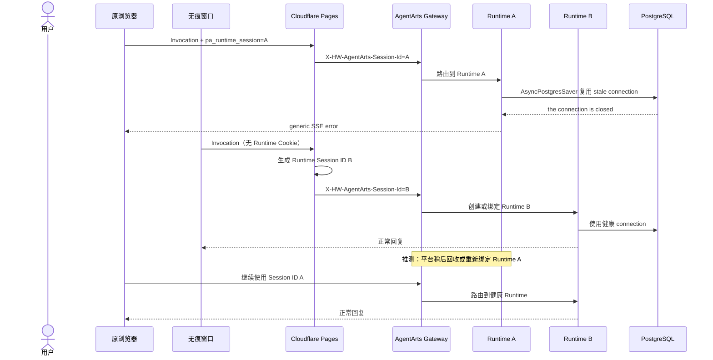

# Bug 24: Feature 14 重构导致 PostgreSQL Checkpointer 自愈回归

## 现象

production 部署 `e734768d` 后，三个用户中有两个可以正常聊天，另一个用户的
Streaming Invocation 连续返回：

```json
{"error":"The assistant could not complete this request.","done":false}
```

该用户改用浏览器无痕模式后可以正常聊天，稍后回到原浏览器也恢复正常。

2026-07-21 09:46 至 09:50（GMT+08:00）的 AgentArts Runtime 日志显示，失败请求已
通过 Inbound JWT/WAT 和 OAuth2 context 准备，但在读取 LangGraph checkpoint 时失败：

```text
InvocationExecution.stream_sse
  -> AgentHandler.handle_stream
  -> AsyncPostgresSaver.aget_tuple
  -> psycopg AsyncConnection.cursor
  -> psycopg.OperationalError: the connection is closed
```

同一 Runtime 在约四分钟内至少三次复用已关闭的 PostgreSQL connection。错误发生在
LLM 和工具调用之前，因此与用户权限、OAuth2 授权和消息内容无关。

## 根因

[Bug 19](../resolved/bug-19-postgres-idle-session-timeout-breaks-chat-session/issue.md)
曾在 `bac12e3` 中为 stale persistent Checkpointer 增加 restart + retry。Feature 14
随后将 `AgentHandler` 迁移到 `conversation_id` 和 structured Agent event；合并
`cec5c5b` 时覆盖了 Bug 19 的恢复逻辑及回归测试。`e734768d` 继承了该回归。

Cloudflare Pages Function 使用 HttpOnly `pa_runtime_session` Cookie 保存
`X-HW-AgentArts-Session-Id`。无痕窗口没有原 Cookie，因此生成新的 Runtime Session ID，
请求被路由到健康 Runtime。结合当前 Cookie 复用逻辑，原浏览器稍后恢复很可能是平台
最终回收或重新绑定了原 Runtime，但现有日志不足以确认具体机制。这类 operational
recovery 只能暂时掩盖问题，Service 本身仍不会修复 stale Checkpointer connection。

图类型：**Sequence Diagram（时序图）**。用于说明同一个用户在不同 Runtime
Session 上出现不同结果，以及平台回收只能临时恢复服务。



## 预期行为

- AgentArts Runtime Session ID 在有效期内继续复用，不因 Checkpointer connection
  失效而轮换。
- Service 首次检测到明确的 PostgreSQL stale/closed connection 错误时，重新打开
  persistent Checkpointer，并使用原 `user_id` 与 `conversation_id` 读取 checkpoint。
- sync 与 Streaming Invocation 在启动 Agent 前执行 Checkpointer read preflight；preflight
  遇到明确的 stale connection error 时可以安全 restart + retry 一次。
- Agent execution 启动后不重试整轮 Agent，避免重复执行 `send_email`、
  `reply_to_email` 等非幂等写工具。
- 平台回收 Runtime 是额外的 operational recovery，不是 Service 正确性的前提。

## 修复范围

### In Scope

- 按当前 `conversation_id` + structured Agent event 架构恢复 Bug 19 的
  Checkpointer preflight restart + retry。
- 仅识别已知的 PostgreSQL idle timeout / closed connection 类错误。
- 对 restart 操作复用 `AgentHandler` 现有 lifecycle lock，避免重复初始化。
- 覆盖 sync/stream preflight recovery，以及 Agent execution 启动后不 retry 的 Service
  regression tests。
- 同步 persistent Checkpointer 自愈相关 architecture 文档。

### Out of Scope

- 更换或清除 `pa_runtime_session` Cookie。
- 为失败请求生成新的 AgentArts Runtime Session ID。
- 修改 RDS `idle_session_timeout` 参数。
- 重写 checkpoint schema 或引入新的数据库连接池框架。
- 对所有 Agent、LLM、工具或网络异常增加通用 retry。
- 修改 Client、Cloudflare Pages 或 AgentArts Gateway API contract。

## 验收标准

- [x] sync 与 Streaming Invocation 在 Agent 启动前遇到可恢复的 Checkpointer connection
      错误后，重启 Checkpointer 并重试 preflight 成功。
- [x] Agent execution 启动后的 Checkpointer connection 错误不触发整轮 retry。
- [x] 即使 Streaming 尚未输出 event，也不会重复执行可能已产生副作用的 Agent。
- [x] 非 Checkpointer connection 错误仍按原有 error path 返回。
- [x] recovery 前后保持相同的 AgentArts Runtime Session ID、`user_id` 和
      `conversation_id`。
- [ ] `uv run ruff check .` 和 `uv run ruff format --check .` 通过。
- [x] `uv run pytest tests/test_agent_handler.py tests/test_checkpointer.py` 通过。
- [ ] production 部署后，同一 Runtime Session 遇到模拟或真实 stale connection 时可在
      单次请求内恢复，不依赖无痕窗口或 Runtime 回收。

## Verification（2026-07-21）

- Service focused：`48 passed`。
- Service full suite：`310 passed, 39 skipped`；`uv run ruff check .` 通过。
- 受影响 Python 文件 `ruff format --check` 通过；全 Service format gate 仍被两个本次未改动的
  既有文件阻断：`scripts/generate_openapi.py`、`tests/test_email_integration.py`。
- E2E：使用临时 PostgreSQL 17 运行 Feature 14 Pages + Service full-stack，`2 passed`；
  E2E Ruff lint/format 通过。
- GitNexus detect changes：8 个 tracked files、37 个 symbols、1 条 affected flow，风险
  `medium`，与 AgentHandler sync/stream recovery 范围一致。

## Follow-up safety correction（2026-07-21）

PR #19 合入后的 review 发现：“尚未输出 event”不能证明 Agent 尚未产生副作用；写工具可能
已经成功，随后才在 checkpoint persistence 阶段抛出 `OperationalError`。因此 recovery
边界收紧为 Agent execution 前的 Checkpointer read preflight。Agent 开始执行后即使出现
相同错误也不重跑整轮 Agent。

Follow-up verification：

- Service focused：`49 passed`。
- Service full suite：`311 passed, 39 skipped`；Ruff lint 通过。
- 受影响 Python 文件 Ruff format 通过；全 Service format 仍被两个既有无关文件阻断。
- Feature 14 Pages + Service + 临时 PostgreSQL 17 full-stack：`2 passed`。
- E2E Ruff lint/format 通过。

## Affected Specs / Architecture Docs

| 文档 | 影响 |
|------|------|
| `architecture/backend_architecture.md` | 记录 persistent Checkpointer preflight restart + retry |
| `architecture/session-state-management.md` | 明确 Runtime Session、Conversation 与数据库 connection 生命周期相互独立 |
| `architecture/devops/test/test-strategy.md` | 恢复 stale Checkpointer regression coverage |

## 参考实现与证据

| 位置 | 关联点 |
|------|--------|
| `bac12e3` | Bug 19 原始 restart + retry 实现 |
| `cec5c5b` | Feature 14 合并后恢复逻辑被覆盖 |
| `e734768d` | 发生 production incident 的部署版本 |
| `personal-assistant-service/app/agent_handler.py` | Checkpointer 生命周期及 preflight retry boundary |
| `personal-assistant-service/tests/test_agent_handler.py` | recovery regression tests |
| `personal-assistant-client/functions/_shared/runtime-session.js` | Runtime Session Cookie 生成与复用 |
