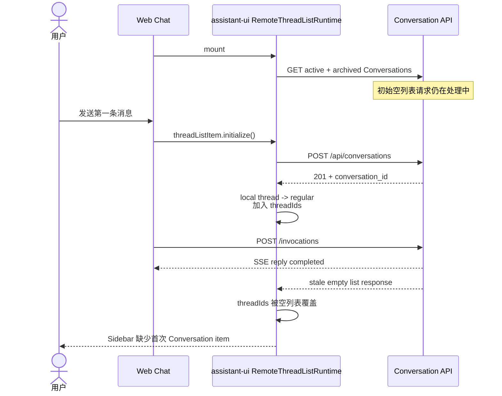

# Bug 25: 首次聊天创建的 Conversation 未出现在 Sidebar

## 现象

没有任何 Conversation 历史的用户首次进入 Web Chat 并发送消息时，聊天请求与 Agent
回复均可正常完成，但左侧 Sidebar 不会出现本次 Conversation。用户点击 New
Conversation 并发送第二轮聊天后，新的历史条目可以正常出现，后续操作通常也恢复正常。

刷新页面后，首次 Conversation 通常会从 Service 重新加载并出现，因此当前证据表明这是
Client thread list 状态丢失，不是 Conversation 或 Message 数据丢失。

## 复现步骤

1. 使用没有任何 Conversation 历史的新用户登录 Web Chat。
2. 页面打开后立即发送第一条消息，等待 Agent 回复完成。
3. 观察左侧 Sidebar：本次 Conversation 没有对应 item。
4. 点击 New Conversation，并发送第二条消息。
5. 观察 Sidebar：第二个 Conversation 可以创建历史 item。
6. 刷新页面，核对 Service 中已持久化的 Conversation 是否重新出现。

## 已确认根因

基于 commit `e734768d22b7212053c8a0bd3e98cae08b9e2b71` 与锁定的
`@assistant-ui/react 0.14.22`，首次页面加载存在以下竞态：

1. `useRemoteThreadListRuntime` mount 后启动初始 `list()`；Client 并行查询 active 与
   archived Conversation。
2. 初始列表尚未返回时，首次发送触发 `threadListItem.initialize()`，Client 调用
   `POST /api/conversations` 并成功取得 `conversation_id`。
3. assistant-ui 先将初始化后的 local thread 加入 `threadIds`，Sidebar 短暂具备渲染该
   item 的状态。
4. 较早发出的初始空列表随后返回；assistant-ui 使用该 stale response 的空
   `threadIds` 替换当前列表状态，刚初始化的 item 被移出 Sidebar。
5. Conversation 与 Message 已在 Service/PostgreSQL 中持久化；丢失的是 Client 当前
   runtime 中的列表成员状态。

图类型：**Sequence Diagram（时序图）**。用于说明初始空列表响应覆盖首次 lazy
initialization 的完成顺序。

## 修复前证据与测试缺口

- 使用实际锁定版本构造了确定性 race：让 `initialize()` 先完成，再释放初始空
  `list()`；观察到 thread count 从 `1` 回退为 `0`。
- 现有 Client 相关单元测试验证了 `initialize()` API 映射，但没有覆盖 `list()` 与
  `initialize()` 的并发完成顺序。
- Feature 14 Browser E2E 在 `page.goto(..., wait_until="networkidle")` 后才发送第一条
  消息，确保初始 list 已完成，因此屏蔽了真实竞态窗口。

## 预期行为

- 新用户首次发送成功后，对应 Conversation 必须立即且持续出现在 Sidebar。
- 初始 list 无论在 lazy initialization 前或后完成，都不得移除已初始化的 Conversation。
- Sidebar 中同一 `conversation_id` 只能出现一次，且 local thread 到 remote thread 的映射
  必须保持一致。
- 首次 Conversation 应正常生成标题、可选择，并在刷新前后显示一致。
- 保持 Lazy Creation：仅点击 New Conversation 而不发送消息时，不创建空的 durable
  Conversation。

## 修复范围

### In Scope

- 修复 Client 初始 conversation list hydration 与首次 lazy initialization 的同步竞态。
- 保证 stale list response 不能覆盖并发完成的 thread initialization。
- 保证修复不会产生 local ID / remote ID 双重映射或重复 Sidebar item。
- 增加 Client 确定性 race regression test。
- 增加 Browser E2E：延迟初始 list，在其完成前发送第一条消息。

### Out of Scope

- 修改 Service Conversation CRUD、Message 持久化或 PostgreSQL schema。
- 将 Lazy Creation 改为点击 New Conversation 时立即持久化。
- 修改 Cloudflare Pages Conversation proxy route 或 AgentArts Runtime Session 协议。
- 顺带重构 Conversation Sidebar 的视觉样式或其他 CRUD 交互。

## 实现约束

- Implementation Plan 应优先消除初始 `list()` 与首次 `initialize()` 的并发提交窗口，或为
  list response 引入可证明正确的 stale-result protection。
- 不应仅在 `initialize()` 后无条件 reload；必须验证 assistant-ui 对 local ID、remote ID、
  selected thread 和 title generation 的映射不会被拆成两个 runtime item。
- list 加载失败时不得永久阻塞用户发送消息；错误态与 retry 行为应保持现有产品 contract。

## 实现

- 保留原有无状态 `RemoteThreadListAdapter` 业务方法，通过 factory 为每个
  `RuntimeProvider` mount 创建独立 wrapper。
- wrapper 捕获首次非分页 `list()` 的 settle Promise；`initialize()` 在创建 durable
  Conversation 前等待该 Promise，避免 bootstrap snapshot 与首次 mutation 并发提交。
- list 成功或失败都会释放 barrier；失败时保留现有 Sidebar error/retry，同时允许首次
  Conversation 继续创建。
- 不执行 initialize 后 reload，不修改 assistant-ui 内部状态，也不引入额外依赖。
- Follow-up：`initialize()` 会等待调用时正在进行的 full-list（包括 Retry）；每次
  full-list 最多等待 15 秒，超时向 Sidebar 返回可重试错误并放行 Conversation 创建，
  迟到响应不再提交给 assistant-ui runtime。

## 验收标准

- [x] 新用户首次发送完成后，Sidebar 出现且保留对应 Conversation item。
- [x] 初始空 list 在 `initialize()` 之后返回时，不会将 thread count 从 `1` 回退为 `0`。
- [x] list 先完成、initialize 后完成的正常路径无回归。
- [x] 同一 `conversation_id` 不产生重复 item 或分裂的 local/remote runtime mapping。
- [x] 首次 Conversation 标题生成、切换、刷新与历史加载正常。
- [x] 仅点击 New Conversation 且不发送时，仍不创建 durable Conversation。
- [x] Client unit tests 与 production build 通过。
- [x] Browser E2E 使用 delayed initial list 覆盖首次发送竞态并通过。

## Affected Specs / Architecture Docs

| 文档 | 影响 |
|------|------|
| `architecture/frontend_architecture.md` | 现有 Lazy Creation contract 不变；仅当实现改变 hydration sequencing contract 时更新 |
| `architecture/devops/test/test-strategy.md` | 现有 Browser regression 分层适用，无需改变测试策略 contract |
| `issues/features/feature-14-multi-session-runtime-prewarm/plan.md` | Lazy Creation 决策不变，Bug 25 issue 记录 stale list race 的实现约束 |

## 参考实现

| 文件 | 关联点 |
|------|--------|
| `personal-assistant-client/src/components/RuntimeProvider.tsx` | 首次 Invocation 前解析或初始化 `conversation_id` |
| `personal-assistant-client/src/lib/conversations/runtime.tsx` | RemoteThreadListAdapter 的 `list()`、`initialize()` 与 title generation |
| `personal-assistant-client/src/components/chat/ConversationSidebar.tsx` | 通过 `threads.threadIds` 渲染 active Conversation items |
| `personal-assistant-client/src/components/RuntimeProvider.test.tsx` | 验证每个 Provider mount 创建独立 adapter，并保持 initialize 接线 |
| `personal-assistant-client/src/lib/conversations/runtime-race.test.tsx` | 使用真实 assistant-ui runtime 覆盖 empty list / initialize race |
| `personal-assistant-e2e/tests/browser/test_feature_14_multi_conversation.py` | 使用 Browser fetch gate 覆盖 delayed initial list 首次发送场景 |

## Verification（2026-07-21）

- Client：`170 passed`；production build passed。
- Targeted runtime：adapter ordering、list failure fallback 与真实 assistant-ui empty-list
  race 共 `8 passed`。
- Browser E2E：Feature 14 正常 CRUD 场景与 Bug 25 delayed initial list regression
  共 `2 passed`。
- Follow-up targeted tests：覆盖 initial failure -> Retry -> send、永不 settle 的
  full-list timeout 和 stale completion，共 `9 passed`。
- E2E：Ruff lint passed；`14 files already formatted`。
- 修复仅涉及 Client adapter lifecycle 与测试；Service、BFF、API、PostgreSQL schema 和
  Lazy Creation 产品 contract 均未修改。
