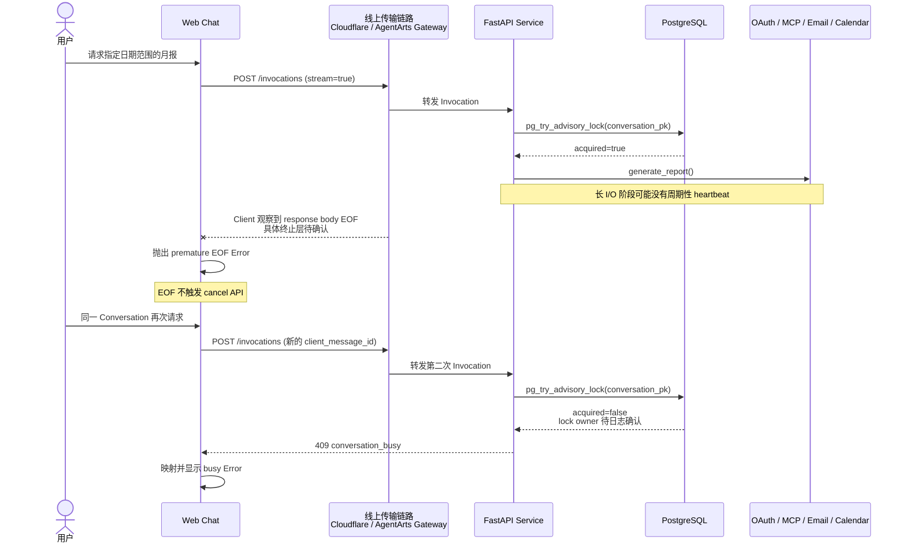

# Bug 27: Feature-18 在线上提前断流并使 Conversation 保持 busy

## 现象

线上部署后使用 Feature-18 `generate_report` 生成报表时，Web Chat 在报告完成前显示：

```text
The chat stream ended before a completion event.
```

用户随后在同一个 Conversation 再次请求月报，Web Chat 显示：

```text
This conversation is already processing a message. Try again when it finishes.
```

本地开发环境正常。线上实验记录了以下顺序：

1. 请求“写个月报，时间范围 2026.6.23-2026.7.23”，Chat 流在没有完成事件时结束。
2. 在同一个 Conversation 请求“写个月报，时间范围 2026.7.20-2026.7.29”。
3. 第二次请求收到 `conversation_busy` 对应的前端错误。

第二个错误是关键相关证据：第一次请求的浏览器响应已经结束，而第二次请求未取得同一
Conversation 的 PostgreSQL advisory lock。这个时间顺序强烈支持“第一次 Invocation
仍在运行或尚未完成 lock cleanup”的推断，但在取得同一 correlation ID 的 Service/DB
日志前，不能确认第二次请求遇到的 lock owner 一定属于第一次 Invocation。


## 定位结论

### 已确认的代码事实与定位边界

这不是 DeepAgents、LangGraph 或 MCP SDK 生成的错误文案，而是项目自己的 Client 对两种
异常状态的映射。

| 现象 | 代码来源 | 能够证明的事实 |
|------|----------|----------------|
| `The chat stream ended before a completion event.` | [chat-adapter.ts:104](../../../../personal-assistant-client/src/lib/chat-adapter.ts#L104) | `ReadableStream` 已结束，但 Client 没有解析到 `done: true` |
| `This conversation is already processing...` | [chat-api-client.ts:96](../../../../personal-assistant-client/src/lib/chat/chat-api-client.ts#L96) | 第二次请求收到了 `409` 且错误码为 `conversation_busy` |
| `conversation_busy` | [main.py:541](../../../../personal-assistant-service/app/main.py#L541) | `InvocationService.prepare()` 未取得 Conversation lock |
| PostgreSQL lock conflict | [locks.py:38](../../../../personal-assistant-service/app/conversations/locks.py#L38) | `pg_try_advisory_lock(conversation_pk)` 在第二次请求时返回 false |

代码能够确认的应用层缺口是 **premature EOF 路径没有启动 Invocation reconciliation**：

1. Service 仅在 Agent 流正常结束、回复非空且 assistant message 持久化成功后发送
   `done: true`（[service.py:116](../../../../personal-assistant-service/app/invocations/service.py#L116)）。
2. Feature-18 在 OAuth、MCP Search/Detail、Email 和 Calendar I/O 期间可能形成较长的
   无业务 SSE 输出窗口；当前没有独立于 Agent event 的周期性 heartbeat。
3. Client 在 `done: true` 前观察到 response body EOF，因此抛出 premature EOF 错误；
   当前证据不能确定是谁主动关闭了哪一段连接。
4. Client 只在 assistant-ui 的 `AbortSignal` 被触发时调用 cancel API
   （[chat-adapter.ts:52](../../../../personal-assistant-client/src/lib/chat-adapter.ts#L52)）；
   clean EOF 且缺少 `done: true` 的路径只抛错，不会取消或查询后端 Invocation。
5. 缺少 reconciliation 意味着第一次 Invocation 可以继续存活到浏览器流结束之后。
   本次实验紧接着收到 `409 conversation_busy`，强烈支持该路径已经发生，但仍需日志
   确认第二次请求遇到的 lock owner。

这部分代码结论不依赖“究竟由哪个平台节点主动断流”。截图与时间顺序强烈支持浏览器流
和后端 Invocation 尚未同时收敛，但不能单独证明二者的因果关系，也不能证明
AgentArts Gateway、Cloudflare、Runtime 重启或其他网络节点中的哪一个最先终止了流。
因此，**premature EOF 路径缺少 reconciliation 已确认；具体外部触发器和 lock owner
尚未确认**。

图类型：**Sequence Diagram（时序图）**。用于说明线上 premature EOF 与随后
`conversation_busy` 的已观测顺序，以及尚未确定的传输终止边界和 lock owner。



### Feature-18 为什么更容易暴露该缺陷

- [`generate_report`](../../../../personal-assistant-service/app/tools/report_tools.py#L1015)
  默认依次采集 GitHub、Email、Calendar；GitHub Search 的 cursor round 也按顺序执行，
  因此一次报告会累加多个远程 I/O 阶段。
- GitHub Detail 最多处理 100 个 event pipeline；
  [`github_mcp_get_details`](../../../../personal-assistant-service/app/mcp/github_activity_source.py#L1998)
  在同一个 Detail session 内以最多 5 路并发执行，但一个 pipeline 仍可能发起多个 MCP
  tool call。
- [`github_mcp_timeout_seconds=30`](../../../../personal-assistant-service/app/settings.py#L56)
  被传给 MCP transport 的
  [`sse_read_timeout`](../../../../personal-assistant-service/app/mcp/gateway_client.py#L330)，
  不是整份 Report、单个数据源或整个 Detail 阶段的总 deadline。
- Agent stream 只在 Agent/Tool 产生业务事件时向外发送数据。OAuth 等待或远程 Tool
  长时间没有事件时，当前 Invocation SSE 没有独立 heartbeat。

这些事实解释了 Feature-18 为什么比普通聊天和单次 Feature-17 tool call 更容易出现长
静默窗口，但不能单独证明线上使用的是 idle timeout。

### 尚未确认的 premature EOF 触发器

| 候选触发器 | 当前证据边界 | 必须取得的证据 |
|------------|--------------|----------------|
| AgentArts Gateway / APIG 的 idle、stream 或总 backend timeout | Feature-18 允许长静默窗口，但尚无线上静默时长、平台错误码或阈值，当前不能给候选机制排序 | 对比 Pages 与直连 Gateway；检查日志是否出现 [`AgentArts.02001038`](https://support.huaweicloud.com/usermanual-agentarts0/agentarts_05_0228.html)；执行 30/45/60/90 秒静默与 heartbeat 对照实验 |
| Cloudflare response stream 断开 | Pages proxy 原样转发 upstream body，代码没有应用级 timeout；仍可能记录上游或客户端断开 | Cloudflare Tail 的 outcome、wall time、上游状态以及最后写出的字节时间 |
| Runtime/ASGI task 被取消、实例重启或进程异常 | Service 的 `CancelledError` 路径不会发送 terminal event；截图没有 Service completion log | 同一 correlation ID 的 Runtime 生命周期、exception、restart 与 `Invocation completed status` 日志 |
| terminal SSE 被截断、缺少换行或 JSON 损坏 | Client parser 会忽略 malformed JSON，EOF 时也不消费 residual buffer | 保存原始 SSE bytes、响应 `Content-Type`、最后一个完整 event 和 decoder residual |
| Tool 已完成后的 LLM、assistant message 持久化或传输失败 | `done: true` 只在回复持久化成功后发送 | 记录最后一个业务 event；若已出现 `report_ready`，优先检查 post-tool LLM、数据库 commit 和后续传输 |

仓库内的 [AgentArts API 参考](../../../architecture/external-systems/huaweicloud/agentarts-api-pdf.pdf)
未给出当前托管 Gateway 的具体流式 timeout 阈值，不能用通用 APIG 默认值替代生产配置。
[通用 APIG 配置文档](https://support.huaweicloud.com/usermanual-apig/apig_03_0039.html)
中的 backend timeout 与 SSE strategy 只能用于设计排查实验，不能证明当前托管 Runtime 的
实际配置。[Cloudflare Worker limits](https://developers.cloudflare.com/workers/platform/limits/)
也不支持“连接保持时固定 60 秒 wall-time 上限”的结论。即使线上日志出现
`AgentArts.02001038`，它也只能确认流式接口执行超时，不能单独定位到 Gateway/APIG
中的具体终止节点。

### 取消语义的部署边界

现有 [`InvocationRegistry`](../../../../personal-assistant-service/app/invocations/registry.py#L35)
是 FastAPI 进程内字典。[cancel route](../../../../personal-assistant-service/app/conversations/routes.py#L162)
无论 `registry.cancel()` 是否找到并取消 active execution，都会返回 `204`。因此：

- 只有 cancel 命中原进程、registry 找到 active execution、`registry.cancel()` 返回
  `True` 且 `execution.close()` 完成时，内部状态才能证明 Conversation lock 已释放；
  当前 route 丢弃这个布尔结果，外部只能看到 `204`。
- 多实例、滚动部署或路由未保持实例亲和时，cancel 可能落到另一个进程；该进程只记录
  pending cancellation 并仍返回 `204`，不能证明原进程的 execution 或 advisory lock
  已结束。

Bug 27 不能仅通过“premature EOF 后调用现有 cancel 并等待 `204`”判定恢复成功。实现前
必须验证同一 Runtime Session 的 invocation/cancel 实例亲和性；若平台不提供可依赖的
contract，则需要持久化的跨实例 cancellation/status 协调，或其他能够确认原 Invocation
已进入 terminal state 的机制。


## 预期行为

- Feature-18 使用用户指定日期范围完成报告，并最终发送 `done: true`。
- 任意长 Tool 调用期间，Invocation transport 保持可观测且活跃，不依赖 Tool 自己输出
  progress event。
- 如果 Client 在 `done: true` 前收到 EOF，应使用原 `client_message_id` 收敛后端
  Invocation；在取得可验证的 terminal/lock-released 结果前，禁止同一 Conversation
  再次发送。未验证实例亲和性时，单独收到现有 `204` 不算充分确认。
- 内部总 deadline 超时时，在连接仍可用时发送结构化 error SSE；外部连接已经断开时，
  Client 显示可恢复错误和 correlation ID，而不是把后端执行留在未知状态。
- 真正并行发送到同一 Conversation 时仍返回 `conversation_busy`，不得移除现有并发保护。
- Feature-17 的独立 GitHub MCP tools 和 session 语义保持可用，不因 Feature-18 修复回归。

## 修复方案（按优先级排序）

| 优先级 | 方案 | 原因 / 依据 | 风险 |
|--------|------|-------------|------|
| P0 | 在 Invocation SSE 层增加通用 heartbeat，而不是只在 `generate_report` 内写 progress | 覆盖 Feature-18 及所有长 Tool；能够验证并缓解 idle timeout，但不能绕过总执行 timeout | 中 |
| P0 | Client 在 premature EOF 后启动 reconciliation；Service 提供可验证的 cancelled/already-finished 状态，并明确单实例亲和或跨实例协调 contract | 直接修复“前端已失败、后端仍持锁、重试 busy”的生命周期缺口；不能把当前无条件 `204` 当作充分证明 | 高 |
| P0 | 增加 request ID、最后事件、source/search/detail phase、session/tool-call 数与 completion status 指标 | 先区分总 timeout、idle timeout、网络截断和后端卡住，避免继续凭估算定位 | 低 |
| P1 | 为 Report、Source、Search cursor 和 Detail 增加分层总 budget；内部超时返回结构化 warning/error | 单次 MCP 30 秒 timeout 不是总预算，当前一次报告可无界累加 | 中 |
| P1 | 核实 AgentArts 托管 Gateway 的流式 timeout/SSE 配置，并按官方能力调整 | heartbeat 对总 backend timeout 无效，必须确认平台 contract | 中 |
| P2 | 在不改变 Feature-17 公共 tool contract 的前提下评估 Report-scoped MCP session 复用、Detail 数量上限和数据源并行 | 降低暴露窗口，但不是 premature EOF 生命周期缺口的替代修复 | 中 |

heartbeat 不需要引入第三方库，可使用标准 SSE comment/event。恢复流程可复用已有 cancel
endpoint、cancellation barrier 和 PostgreSQL Conversation lock，但 cancellation 的跨实例
终态确认不能继续只依赖当前进程内 registry 和无条件 `204`。

## Implementation Plan

### Service

- 在 `InvocationExecution.stream_sse()` 或其上层 transport wrapper 中泵送 Agent event，
  在等待下一业务事件时周期性发送 SSE heartbeat。
- 保证正常完成仍只有一个 terminal `done: true`；内部 exception/timeout 发送结构化 error。
- 为 report source、GitHub cursor round、Detail batch、MCP session/list_tools/tool call 增加
  duration 与 count metrics，并携带 Invocation correlation ID。
- 引入明确的 Report 总 budget 和阶段 budget；确保 timeout/cancel 的 `finally` 路径释放
  advisory lock 并注销 Invocation registry。
- 明确 cancel response 的状态语义，不再把“当前进程未找到 execution”与“原 Invocation
  已结束”都折叠为无法区分的成功确认。
- 验证 AgentArts 是否保证同一 Runtime Session 的路由亲和；若不能保证，使用 PostgreSQL
  等共享状态记录 cancellation request 和 Invocation terminal state，使执行实例能够观察
  cancel，并让 Client 查询确认。

### Client

- 区分正常 terminal、SSE error、用户 Abort 和 premature EOF。
- premature EOF 时使用原 `conversation_id + client_message_id` 启动 reconciliation；取得
  可验证的 terminal 结果前保持 cancellation barrier，失败时复用 Bug 26 的
  `cancel_failed` / retry 交互。
- 校验流式响应 Content-Type，并在 EOF 时处理 decoder 尾部与完整 residual SSE frame；
  malformed/truncated frame 记录诊断信息，不静默吞掉。
- 用户可见错误使用稳定中文文案并附 correlation ID，避免直接暴露内部英文 fallback。

### Infra / Platform

- 核对 AgentArts Runtime/Gateway 的总调用 timeout、stream timeout、SSE strategy 与日志字段。
- 核对同一 `x-hw-agentarts-session-id` 的多个请求是否有实例亲和保证，并在 production
  deployment probe 中验证，而不是从“逻辑 Session 路由键”推导物理实例亲和。
- 核对 Cloudflare Worker 的 request outcome、wall time、CPU time 和上游断开原因；不把 CPU
  time 与 wall time 混为一谈。

### E2E

- 增加 production-like proxy 测试：Agent 阻塞超过 heartbeat interval 时连接保持活跃并
  最终收到 `done: true`。
- 增加强制 premature EOF 测试：Client 启动第一次 Invocation 的 reconciliation；取得
  terminal/lock-released 确认前保持 barrier，确认后同一 Conversation 可以再次发送。
- 增加多实例测试：第一次 Invocation 与 reconciliation 请求落到不同 Service 实例时，
  仍能取消或确认原 Invocation，并在确认后释放 Conversation lock。
- 保留真正并行 Invocation 返回 `409 conversation_busy` 的回归测试。
- 覆盖 GitHub-only、Email-only、Calendar-only、三源组合、指定日期范围和最大 Detail
  数据量。
- 运行 Feature-17 GitHub MCP regression，确认其独立调用能力未受影响。

## 验收标准

- [ ] 线上 Web Chat 使用显式日期范围生成日/周/月报，报告内容与下载功能正常。
- [ ] Agent 静默至少 3 个 heartbeat interval 时，原始 SSE 按约定间隔持续收到 heartbeat；
      解除阻塞后收到唯一 `done: true`。
- [ ] 每次成功 Invocation 都能在原始 SSE 中观察到唯一 `done: true`。
- [ ] 强制截断 SSE 后，Client 会收敛原 Invocation；同一 Conversation 的下一次请求不再
      因前一轮遗留 lock 返回 `conversation_busy`。
- [ ] 在两个 Service 实例间交叉发送 Invocation 与 reconciliation 请求时，若共享状态为
      `pending/unknown`，Client 保持 barrier；只有共享 terminal 状态确认后才允许下一次
      Invocation，不会因另一个实例返回无条件 `204` 而提前解除 barrier。
- [ ] cancel 失败时禁止同一 Conversation 直接重试，并提供有限重试和可恢复 UI。
- [ ] 真正的并发请求仍稳定返回 `409 conversation_busy`。
- [ ] 日志能够按 request ID 关联 Client、Cloudflare、AgentArts、Service 和 MCP phases。
- [ ] 已确认具体 timeout 类型和阈值，或以实验排除 timeout；Issue 不再保留无证据的
      30-60 秒 idle 假设。
- [ ] Client tests/build、Service Ruff/pytest、E2E Ruff/pytest 通过。
- [ ] Feature-17 GitHub MCP tests 通过。

## Affected Specs / Architecture Docs

| 文档 | 影响 |
|------|------|
| `architecture/frontend_architecture.md` | 补充 premature EOF、cancel reconciliation 与错误展示 contract |
| `architecture/backend_architecture.md` | 修正 cancel `204` 的单实例边界，并定义跨实例 terminal confirmation contract |
| `architecture/session-state-management.md` | 明确 Client stream、Service Invocation、registry 和 PostgreSQL lock 的跨端生命周期 |
| `architecture/devops/test/test-strategy.md` | 增加长 SSE、heartbeat、强制 EOF 与 busy recovery 测试 |
| `architecture/devops/troubleshooting/feature-17-mcp-performance-analysis.md` | 增加 production phase/session/tool-call metrics，区分估算与实测 |
| `issues/features/backlog/feature-18-report-root-capability/plan.md` | 补充 Report 总 budget、可观测性和 Feature-17 regression 约束 |

## 受影响文件

| 文件 | 关联点 |
|------|--------|
| `personal-assistant-client/src/lib/chat-adapter.ts` | premature EOF 检测与 cancel reconciliation |
| `personal-assistant-client/src/lib/chat/chat-api-client.ts` | `conversation_busy` 映射、Content-Type 与 correlation ID |
| `personal-assistant-client/src/lib/chat/sse-parser.ts` | decoder 尾部、residual frame 与 malformed event 诊断 |
| `personal-assistant-client/src/lib/chat/cancellation-coordinator.ts` | premature EOF cancellation barrier/retry |
| `personal-assistant-service/app/invocations/service.py` | heartbeat、terminal event、timeout/cancel cleanup |
| `personal-assistant-service/app/invocations/registry.py` | 进程内 cancellation 的状态语义与跨实例边界 |
| `personal-assistant-service/app/conversations/routes.py` | cancel response 的可验证 outcome contract |
| `personal-assistant-service/app/main.py` | StreamingResponse wrapper、completion metrics 与 registry cleanup |
| `personal-assistant-service/app/tools/report_tools.py` | Report/source budget 与 phase metrics |
| `personal-assistant-service/app/mcp/github_activity_source.py` | Search/Detail metrics 与可选 Report-scoped session 接线 |
| `personal-assistant-service/app/mcp/gateway_client.py` | MCP session/tool-call metrics 与 timeout 语义 |
| `personal-assistant-service/tests/integration/test_invocations.py` | heartbeat、cancel、lock release 与 true concurrency regression |
| `personal-assistant-e2e/tests/` | production-like proxy、forced EOF 和 Feature-17/18 回归 |
