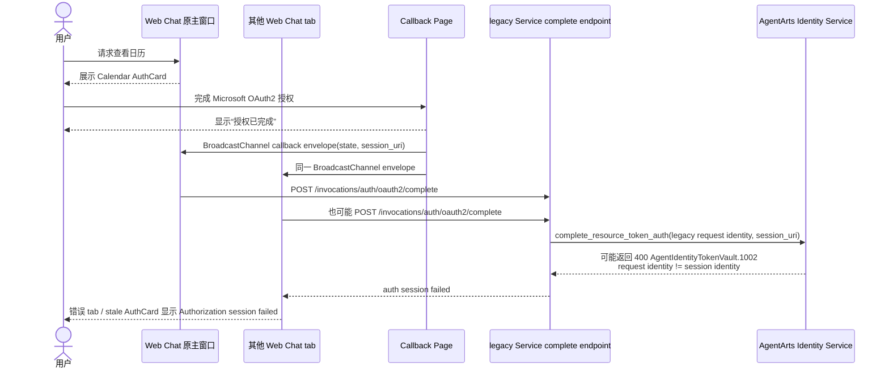
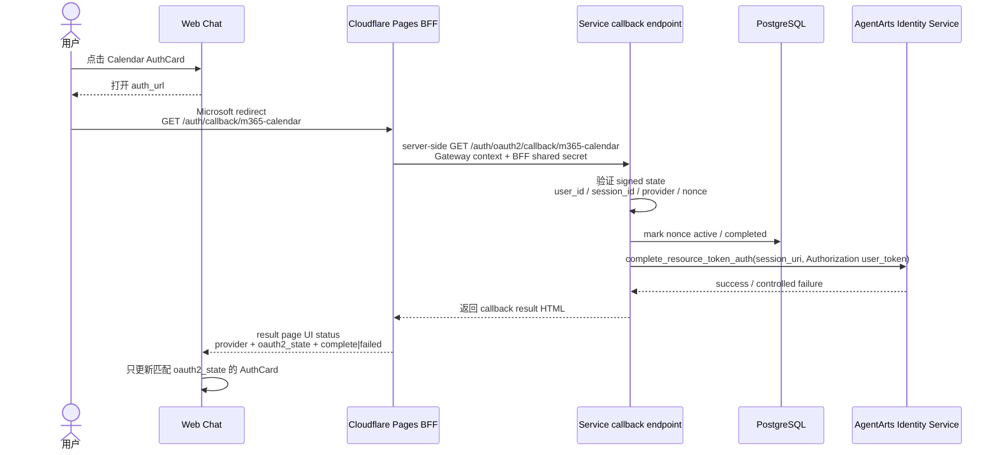

# Bug 21: Calendar OAuth2 complete 偶发 session identity mismatch

> 2026-06-28 implementation note：已采用 architectural fix。Calendar OAuth2
> completion 从多个 Web Chat tab 迁移到 Cloudflare Pages BFF + Service-owned
> callback。OAuth provider 先落到 `/auth/callback/m365-calendar` Pages Function；
> BFF server-side 转发 callback query 到 Service；通过 callback-only HttpOnly
> context cookies 恢复用户 Authorization / session / user headers，并可注入 shared
> secret。Web Chat 只接收 state-scoped UI status，不再调用 legacy
> `POST /invocations/auth/oauth2/complete`，callback 也不再依赖 MSAL
> `localStorage` token cache。

## 现象

Feature 15 Calendar OAuth2 授权流程中，用户在前端授权页面看到绿色成功提示：

> 日历授权已完成，可以关闭此窗口并重试刚才的问题。

但回到 Web Chat 主页面后，聊天页同时出现授权失败提示：

```text
Authorization session failed. The user may have denied access or the session expired.
```

Service 端日志显示 AgentArts Identity Token Vault 在
`complete_resource_token_auth` 阶段返回 400：

```text
2026-06-28T12:29:02.628+00:00 [WARNING] app:
Calendar OAuth2 complete failed
provider=m365-calendar-provider
user_id=JiVQK-iNU4PcnLxBpkFu_oQmC8mWpYTDMNq8LYQDPxc
error_type=ClientRequestException
error=ClientRequestException - {
  status_code:400,
  request_id:e22477bb697ff87f0cdd30c0feda6584,
  error_code:AgentIdentityTokenVault.1002,
  error_msg:The identity in the request does not match the session identity information,
  encoded_authorization_message:None
}
```

该问题为偶发，不是稳定复现。用户体感是“授权页面已经成功，但聊天页认为授权 session
失败或过期”。

## 影响

- 用户无法稳定完成 Calendar Tool 的 Microsoft 365 授权。
- UI 状态出现冲突：callback 页面显示 success，主聊天页显示 failure。
- Calendar Tool 后续重试可能仍无法读取日历，破坏 feature-15 的授权完成闭环。
- 错误文案把 identity mismatch 归因成用户拒绝授权或 session 过期，排障信息不准确。

## 复现线索

该 bug 的关键复现条件：浏览器中必须同时打开多个 Web Chat tab。单 tab 情况下，
callback envelope 只会被原聊天页处理，暂未观察到同类 identity mismatch。

1. 在 Web Chat 中发送日历查询，例如“查看今日 calendar”。
2. 保持至少另一个 Web Chat tab 打开，且该 tab 也会监听 calendar OAuth
   `BroadcastChannel`。
3. 点击 Calendar AuthCard 进入 Microsoft / AgentArts OAuth2 授权页。
4. 完成授权后，callback 页面显示授权成功。
5. 回到主聊天窗口，观察 AuthCard / system message 是否出现
   `Authorization session failed...`。
6. 检查 Service 日志是否存在
   `AgentIdentityTokenVault.1002` 与
   `The identity in the request does not match the session identity information`。

## 已确认排查发现

- Calendar callback 与聊天页之间使用全局 `BroadcastChannel`
  `m365-calendar-auth` 通信；所有同源 Web Chat tab 都会收到同一条
  `m365-calendar-auth-request`。
- `personal-assistant-client/src/App.tsx` 中每个非 callback tab 都会监听该 channel，
  收到 request 后调用 `completeOAuth2Auth()`，因此一次 callback 可能触发多个 chat tab
  同时 POST `/invocations/auth/oauth2/complete`。
- `personal-assistant-service/app/oauth2_state.py` 的 state 绑定了 `user_id`、
  `session_id`、provider 和 nonce；legacy complete endpoint 验证了 `user_id` 与
  provider，但客户端 cross-tab 分发仍可能让非发起授权的 tab 使用自己的当前
  id token / session context 发起 complete。
- 这解释了偶发现象：正确 tab 或 callback 页面可能已经得到 success，但另一个 tab
  抢先或重复处理同一 callback，并在 AgentArts Identity
  `complete_resource_token_auth` 阶段触发
  `AgentIdentityTokenVault.1002`。
- 架构修复方向：不应让 Web Chat tab 执行 OAuth2 complete。Calendar OAuth2 callback
  应直接 redirect 到 Cloudflare Pages BFF callback，由 BFF server-side 转发到
  Service-owned callback endpoint；后端验证 signed state、调用
  `complete_resource_token_auth`、用 PostgreSQL 记录 replay 状态，然后返回 callback
  result page。
  Web Chat 只接收 result page 通过 BroadcastChannel 发出的 UI status，并按
  `oauth2_state` 更新匹配 AuthCard。

## 旧行为（已移除）



## 目标行为



## 修复决策

- Service callback endpoint 使用 signed state 中的 trusted `user_id` / `session_id`
  做 state 绑定和 replay control，但 complete 阶段向 AgentArts Identity 传入
  callback context cookies 恢复的 `Authorization` user token，避免
  `user_id` strategy 与平台创建 session 时的 user-token identity 不一致。
- 主聊天窗口 callback coordinator 降级为 UI status observer；Web Chat tab 不承担
  complete 业务逻辑。
- 多个 Web Chat tab 可共享 `m365-calendar-auth` BroadcastChannel，但 channel 上只传播
  complete 后的 UI status，不传播需要任一 tab 执行业务 complete 的 envelope。
- Cloudflare Pages BFF 不把 callback 请求中的浏览器 Authorization / Cookie 原样透传给
  upstream；通过 Gateway 时使用 `/invocations` 阶段写入的短时 callback-only
  HttpOnly context cookies 恢复 `Authorization`、`x-hw-agentarts-session-id` 和
  `X-HW-AgentGateway-User-Id`。
- callback result page 只有在后端 complete 已完成 / 失败后，才展示最终状态。
- replay / duplicate callback 状态写入 PostgreSQL；本地未配置数据库时才使用进程内
  fallback。
- Bug 20 的 replay / duplicate callback 场景由同一套 store 语义覆盖。

## 预期行为

- callback result page 只有在 Service callback endpoint 完成真实 complete 后，才展示
  最终“授权完成”状态。
- Service 调用 `complete_resource_token_auth` 时使用 callback context 恢复的
  `Authorization` user token，必须与创建 AgentArts OAuth2 session 的 identity 一致。
- 如果 AgentArts 返回 `AgentIdentityTokenVault.1002`，前端应展示准确、可恢复的错误，
  不应误导为用户拒绝授权或普通 session 过期。
- 重复 callback、旧 callback、跨 tab callback 应被识别并返回受控结果，不应污染当前
  AuthCard 状态。
- Web Chat tab 不调用 complete endpoint；非匹配 `oauth2_state` 的 AuthCard 即使收到
  BroadcastChannel status，也不能被更新。

## 修复范围

### In Scope

- 排查并修复 Calendar OAuth2 complete flow 中 identity / session binding 偶发错配。
- 对 callback 页面与主窗口 AuthCard 的成功/失败状态建立一致语义。
- 将 Calendar OAuth2 主流程迁移为 Cloudflare Pages BFF + Service-owned callback：
  `/auth/callback/m365-calendar` Pages Function + backend callback API。
- 将 replay / duplicate callback 状态从进程内 dict 升级为 production PostgreSQL 表。
- AuthCard 事件携带 `oauth2_state`；callback result status 也携带同一 state，前端只做
  UI 状态匹配。
- 增加结构化日志，至少能关联：
  - provider；
  - server-bound user_id；
  - state nonce / pending auth id；
  - session_uri hash；
  - AgentArts request_id；
  - complete result。
- 增加 Service / Client / E2E regression tests，覆盖 identity mismatch、stale callback
  和 duplicate callback 的用户可见状态。
- 增加 Client regression test，覆盖 state 不匹配的 callback status 不会污染当前
  AuthCard。

### Out of Scope

- 重做整个 AgentArts OAuth2 架构。
- 修改 Microsoft Entra App 的权限范围，除非排查证明 provider 配置是根因。
- 在浏览器保存 Microsoft access token 或平台 token。
- 将非 Calendar 工具迁移到 complete flow。

## 验收标准

- [x] Calendar OAuth2 callback 成功时，callback 页面与 Web Chat 主窗口状态一致。
- [x] `complete_resource_token_auth` 不再因项目侧 identity/session 错配偶发返回
      `AgentIdentityTokenVault.1002`。
- [x] 真实 `AgentIdentityTokenVault.1002` 场景有明确日志与用户可恢复提示。
- [x] stale / duplicate callback 不会把当前 AuthCard 标记为失败。
- [x] 多 Web Chat tab 场景中，没有 tab 会执行 complete；只有 `oauth2_state` 匹配的
      AuthCard 会更新 UI 状态。
- [x] production replay / duplicate callback 使用 PostgreSQL shared state；local dev
      未配置 `POSTGRES_DSN` 时才使用进程内 fallback。
- [x] 相关 Service tests、Client tests 通过。
- [ ] E2E regression 通过。

## Affected Specs / Architecture Docs

| 文档 | 影响 |
|------|------|
| `personal-assistant-meta/issues/features/feature-15-calendar-agentarts-full-oauth2/issue.md` | 历史设计记录；当前 Bug 21 覆盖 Service-owned callback 修正 |
| `personal-assistant-meta/issues/features/feature-15-calendar-agentarts-full-oauth2/plan.md` | 历史实施计划；legacy complete API 已被本 bug supersede |
| `personal-assistant-meta/architecture/auth/feature-15-calendar-oauth2-architecture.md` | 从 frontend relay 更新为 BFF + Service-owned callback |
| `personal-assistant-meta/architecture/backend_architecture.md` | 同步 Service-owned callback route 与 backend completion 语义 |
| `personal-assistant-infra/agent_identity.tf` | Agent Identity OAuth2 return URL allowlist 必须指向 Service-owned callback |

## 参考实现 / 排查入口

| 路径 | 关联点 |
|------|--------|
| `personal-assistant-service/app/main.py` | `/auth/oauth2/callback/m365-calendar` Service-owned callback endpoint |
| `personal-assistant-service/app/oauth2_state.py` | signed state、pending auth、nonce / replay guard |
| `personal-assistant-service/app/oauth2_callback_store.py` | PostgreSQL-backed callback replay / idempotency state |
| `personal-assistant-service/app/tools/calendar_tools.py` | Calendar Tool 与 AgentArts Identity SDK provider 使用 |
| `personal-assistant-client/functions/auth/callback/m365-calendar.js` | Cloudflare Pages BFF callback |
| `personal-assistant-client/src/` | AuthCard、callback status observer、本地 fallback callback page |
| `personal-assistant-infra/agent_identity.tf` | Production return URL allowlist |
| `personal-assistant-e2e/tests/` | Calendar OAuth2 授权回归测试 |
