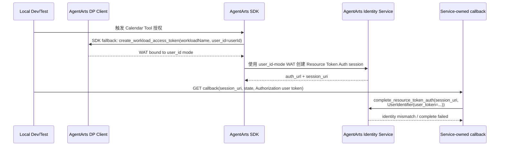

# Bug 22: Calendar OAuth2 本地 WAT identity mode 与 complete UserIdentifier 不匹配

> Reopened / refined: Bug 21 已修复 legacy complete endpoint 与 production callback
> 主流程问题，但本 issue 仍用于追踪 **local development / test** 下的 AgentArts
> workload access token identity mode 与 callback complete `UserIdentifier` 不一致问题。
> 当前入口是 Service-owned callback
> `/invocations/auth/oauth2/callback/m365-calendar`，不是已移除的
> `POST /invocations/auth/oauth2/complete`。

> 2026-07-06 重新评估：原实现假设 `agent-personal-assistant` 可以在本地通过
> `create_workload_access_token(..., user_token=...)` 主动 mint JWT-mode WAT。
> 真实验证证明该假设不成立。`agent-personal-assistant` 是
> `created_by=SERVICE service.AgentNetwork` 的 service-created Workload Identity；
> 它可通过 list/get 与 Console 看见，但主动 WAT exchange 对它稳定返回
> `404 AgentIdentityDirectoryService.1002 workload identity not found`。Bug 22
> 因此重新打开，需要新的 local WAT exchange 方案。

> 2026-07-07 重新评估 local callback relay：本地 full OAuth2 不能再以
> `npm run dev` 的 Vite-only fallback 作为主验证路径。Calendar callback 需要
> Cloudflare Pages Function 读取前一次 `/invocations` 写入的短时 HttpOnly cookie，
> 再 server-side 转发到 Service callback 并恢复 `Authorization` / session / user
> headers。新的 local full-flow 主路径是 `wrangler pages dev`，即本地版
> Cloudflare Pages；Vite dev 只保留为普通聊天/UI 快速开发路径。

## 现象

Feature 15 Calendar OAuth2 线上使用正常，但本地 local test / manual test 失败。
核心原因不是“创建 auth session”本身，而是 **获取 AgentArts workload access token
时使用的 user identity mode** 与 callback complete 使用的 `UserIdentifier` 不一致。

AgentArts 有两种 user-scoped WAT 获取方式：

```python
client.create_workload_access_token(workloadName, user_token=userToken)  # JWT mode
client.create_workload_access_token(workloadName, user_id=userId)        # user_id mode
```

当前 `agentarts.sdk.IdentityClient` 对外暴露的是
`create_workload_access_token(workload_name, user_token=None, user_id=None)`。传入
`user_token` 时，SDK 内部才调用 Huawei SDK 的
`create_workload_access_token_for_jwt` endpoint wrapper；不要在 Service 代码中引用
不存在的 `get_workload_access_token_for_jwt` public method。

线上 remote 环境中，AgentArts Gateway 代替业务服务执行 JWT mode，并通过
`X-HW-AgentGateway-Workload-Access-Token` 注入 WAT；此时 callback complete 使用
`UserIdentifier(user_token=...)` 是正确的。

当前本地 local 环境没有 Gateway 代取 WAT，AgentArts SDK fallback 会自动使用
`user_id` mode 创建 workload identity / WAT；但 Service-owned callback 仍固定使用：

```python
client.complete_resource_token_auth(
    session_uri=callback.session_uri,
    user_identifier=UserIdentifier(user_token=user_token),
)
```

于是本地形成 `user_id WAT -> user_token complete` 的交叉组合，Calendar OAuth2
complete 无法稳定完成。

## 影响

- Feature 15 的 local integration / manual test 不能可靠跑通。
- 本地开发者容易误判为 Microsoft OAuth2、AgentArts provider 配置或 callback relay
  问题。
- 本地测试无法覆盖真实的 complete success path，削弱后续修复 Bug 21 的信心。
- 如果测试 fixture 只 mock `user_token` success，会掩盖本地 runtime 与 AgentArts
  Identity Service 的真实身份绑定差异。

## 复现线索

1. 在本地启动 Service 与 Client。
2. 使用本地 dev header / local identity 配置触发 Calendar OAuth2 授权。
3. 触发 Calendar tool，观察本地 SDK fallback 是否通过
   `create_workload_access_token(workloadName, user_id=userId)` 获取 WAT。
4. 完成浏览器授权后，Microsoft redirect 到 Service-owned callback：
   `/invocations/auth/oauth2/callback/m365-calendar`。
5. 观察 callback complete 是否仍固定使用：

   ```python
   UserIdentifier(user_token=user_token)
   ```

6. 如果本地 WAT 是通过 `user_id` mode 获取，但 complete 阶段传 `user_token`，
   AgentArts Identity 会看到 identity mismatch。

## 当前行为



## 根因 / First Principles

Resource Token Auth session 的核心不变量是：

> **创建 auth session 时使用的 user identity binding，必须与 callback complete
> 时传入的 `UserIdentifier` 一致。**

Bug 22 因此不是“如何判断线上 / 本地”，也不是“callback 时该读哪个 Cookie”，而是
Service 必须在 `@require_access_token` 创建 Resource Token Auth session 之前，确保
当前 Runtime Context 中的 WAT 已经绑定到预期 identity mode。

Feature 15 架构文档已经强调 `UserIdentifier` 的 `user_id` 与 `user_token` 互斥，并倾向
生产 Gateway JWT 路径使用 `user_token`。但本地 dev/test 没有生产 Gateway 注入的同源
身份上下文：

- remote production：AgentArts Gateway 代业务服务执行 JWT mode WAT 获取，相当于
  `create_workload_access_token(workloadName, user_token=userToken)`，并把 WAT 注入
  Runtime；
- local development：当前 SDK fallback 自动执行 user_id mode WAT 获取，即
  `create_workload_access_token(workloadName, user_id=userId)`；
- 当前 Service-owned callback 固定从 `Authorization` header 提取 `user_token` 并传
  `UserIdentifier(user_token=...)`；
- 因此 local 路径形成 `user_id WAT -> user_token complete` 的不一致组合。

第一性约束应为：

| WAT identity mode | WAT 来源 | Callback Complete |
|-------------------|----------|-------------------|
| JWT mode | Gateway 注入，或显式 `create_workload_access_token(workloadName, user_token=userToken)` | `UserIdentifier(user_token=user_token)` |
| user_id mode | 本地显式 `create_workload_access_token(workloadName, user_id=userId)` | `UserIdentifier(user_id=user_id)` |

本项目的 Calendar OAuth2 full flow 应选择其中一条长期主线，而不是把 callback
实现写成 local / remote 双轨。否则本地跑通的 full flow 不再代表 production-like
User Federation / Token Vault 行为。

## 预期行为

- Calendar OAuth2 full flow 线上线下都使用 JWT identity mode。
- Production Gateway 路径继续使用 Gateway 注入的 JWT-mode WAT +
  `UserIdentifier(user_token=...)`。
- Local full-flow 路径不再依赖 SDK 自动 user_id fallback；Service 在没有 Gateway WAT
  时主动用 inbound `Authorization` user token 调
  `create_workload_access_token(workloadName, user_token=userToken)`，并写入
  `AgentArtsRuntimeContext`。但本地 `workloadName` **不能** 使用
  service-created `agent-personal-assistant`，必须指向 customer-owned
  `CUSTOM_JWT` Workload Identity。
- Callback complete 不做 local 特判，继续固定使用
  `UserIdentifier(user_token=user_token)`。
- 本地 Calendar OAuth2 full flow 如果缺少真实 inbound `Authorization` user token，应
  fail-fast，提示启用本地 Entra 登录；不要静默回退到 user_id mode。
- 错误日志应打印 WAT source / identity mode（不打印 token 明文），例如
  `gateway_wat` / `local_jwt_wat` / `missing_user_token`。

## Solution Design

### 1. Candidate comparison

> 2026-07-06 update：下面原方案 B 的方向“local 使用 JWT-mode WAT”仍然正确，
> 但其前提“直接使用 `agent-personal-assistant` mint WAT”已被实验证伪。新的主方案是
> E：创建 customer-owned `CUSTOM_JWT` Workload Identity 专用于 local/manual WAT
> exchange；production Gateway path 继续使用 service-created identity 与 Gateway 注入
> WAT。

| 方案 | 做法 | 优点 | 问题 | 结论 |
|------|------|------|------|------|
| A. Local complete 改用 `user_id` | local 继续使用 SDK fallback 的 user_id-mode WAT，callback complete 在 local 改为 `UserIdentifier(user_id=...)` | 能兼容当前 Dev Mode / mock user id；本地改动小 | 线上线下 identity model 分叉；需要 `PA_LOCATION`、`PA_STAGE`、`AGENTARTS_USER_IDENTITY_MODE` 或类似配置；callback 需要 local 特判；local full-flow 不够像 production | 不选为主方案 |
| B. Local 主动使用 JWT-mode WAT（原版） | local 从 inbound `Authorization` 提取 user token，主动调用 `create_workload_access_token(settings.agent_identity_workload_name, user_token=userToken)`；callback 继续 `UserIdentifier(user_token=...)`；原计划 workload identity name 与 production 统一为 `agent-personal-assistant` | 线上线下 identity model 一致；callback 无需特判；更接近 production | 已验证 `agent-personal-assistant` 是 service-created identity，主动 WAT exchange 稳定 404；变量名 `AGENT_IDENTITY_WORKLOAD_NAME` 也过于泛化，无法区分 service-created 与 customer-owned workload | 方向保留，直接使用 `agent-personal-assistant` 的实现废弃 |
| C. 双模式可配置 | 增加 `PA_LOCATION`、`PA_STAGE`、`AGENTARTS_USER_IDENTITY_MODE`，同时支持 jwt / user_id | 灵活，可覆盖多种调试方式 | 配置和 guardrail 复杂；容易形成错误组合；为一个 OAuth2 full-flow bug 引入过多长期表面积 | 暂不采用 |
| D. Cookie 记录环境 / WAT source | `/invocations` 根据是否存在 Gateway WAT header 写 Cookie，callback 读取后选择 `user_token` 或 `user_id` complete | 能把一次 `/invocations` 的运行时信号带到 OAuth callback | Cookie 只能桥接 redirect 状态，不能改变 auth session 创建时已经选择的 WAT identity mode；会把 callback 变成 local / remote 双轨；Vite dev 与 Pages Functions dev 形态不同，Cookie 可用性不稳定；不应让浏览器持有 identity strategy 的决策权 | 不采用 |
| E. Customer-owned local JWT Workload Identity | 新建一个 customer-owned `CUSTOM_JWT` Workload Identity，配置同样的 Microsoft Entra discovery URL 与 allowed audience；local/manual test 的 `AGENT_IDENTITY_LOCAL_JWT_WORKLOAD_NAME` 指向它；production Gateway path 继续用 Gateway 注入 WAT | 保留 JWT identity model；避开 service-created identity 的 WAT exchange 限制；本地完整流程仍接近 production；实现不需要 callback 双轨 | 需要额外云端资源和 bootstrap helper；必须文档化该 workload 与 Runtime service-created workload 的区别 | **新的主方案** |
| F. Local Pages Functions dev callback relay | 本地 full OAuth2 使用 `wrangler pages dev` 跑 Cloudflare Pages Functions；`/auth/callback/m365-calendar` 由 Pages Function 读取 HttpOnly callback cookie 后转发到本地 Service；Vite dev 不再作为 full-flow 主验证路径 | 本地 callback 与 production BFF 代码一致；无需在 React callback 页面依赖 `useAuthStore` 或手写 Authorization fallback；能验证真实 cookie relay | 本地启动命令比 Vite dev 多一步 build / Wrangler；需要显式设置 `OAUTH2_CALENDAR_CALLBACK_URL=http://localhost:5173/auth/callback/m365-calendar` | **作为 E 的 local callback relay 主路径采用** |

选择 E 的核心原因：**保留 JWT identity model，但不要把 service-created Runtime
Workload Identity 当成本地 SDK 主动 mint WAT 的对象**。Calendar OAuth2 full flow 的价值
在于验证真实 User Federation / Token Vault 行为；如果 local 走 user_id mode，虽然能跑通，
但测到的是另一条 identity path。customer-owned local JWT workload 是当前已知最小的
production-like 本地验证路径。

### 2. Selected solution

Calendar OAuth2 full flow 仍统一采用 JWT identity，但 local/manual test 使用
customer-owned `CUSTOM_JWT` workload identity 主动 mint WAT，并通过 local
Cloudflare Pages Functions dev 恢复 callback headers：

| 环境 | WAT 来源 | Callback Complete | 要求 |
|------|----------|-------------------|------|
| Remote AgentArts Runtime | AgentArts Gateway 注入 `X-HW-AgentGateway-Workload-Access-Token`，等价于 JWT mode | `UserIdentifier(user_token=user_token)` | Cloudflare BFF / Gateway context 恢复原 inbound `Authorization` |
| Local dev / manual test | Service 主动调用 `create_workload_access_token(settings.agent_identity_local_jwt_workload_name, user_token=userToken)` 并写入 `AgentArtsRuntimeContext`；`settings.agent_identity_local_jwt_workload_name` 必须指向 customer-owned `CUSTOM_JWT` workload | `UserIdentifier(user_token=user_token)` | 本地前端启用 Entra 登录；使用 `npm run pages:dev:local` 跑 local Pages Functions；`OAUTH2_CALENDAR_CALLBACK_URL` 指向 `http://localhost:5173/auth/callback/m365-calendar`；本地需先 bootstrap customer-owned workload |
| Unit / contract tests | mock DP client / Identity client | assert `UserIdentifier(user_token=...)` | 不依赖真实 Microsoft 或 AgentArts token |

本 issue 确认新增 / 标准化以下配置：

| 配置 | 默认值 | 原因 |
|------|--------|------|
| `AGENT_IDENTITY_LOCAL_JWT_WORKLOAD_NAME` / `Settings.agent_identity_local_jwt_workload_name` | `pa-local-jwt-workload`；local/manual test 可显式覆盖到其他 customer-owned workload | 名称明确限定为 local JWT WAT exchange，不会与 production service-created `agent-personal-assistant` 混淆；本地 JWT-mode WAT exchange 必须使用 customer-owned `CUSTOM_JWT` Workload Identity |

注意：`agent-personal-assistant` 是 AgentArts / AgentNetwork 为 Runtime 创建的
service-owned Workload Identity，不是 customer-owned local WAT exchange identity。它也不是
`.agentarts_config.yaml` 中的 Runtime agent name `personal-assistant`。实现时不允许用
Runtime agent name 替代 Workload Identity name，也不应把完整 URN 传给
`workload_name`；该参数只接受短名称 `^[a-zA-Z0-9_-]{1,56}$`。

本 issue 不新增以下策略配置：

| 配置 | 结论 | 原因 |
|------|------|------|
| `PA_LOCATION` | 不需要 | 不再按 local / remote 切换 complete identity |
| `PA_STAGE` | 不需要 | 该 bug 不需要资源阶段判断 |
| `OAUTH2_COMPLETE_USER_IDENTIFIER_STRATEGY` | 不需要 | complete 永远使用 `user_token` |
| `AGENTARTS_USER_IDENTITY_MODE` | 不需要 | Calendar OAuth2 full flow 永远使用 JWT identity |

### 3. Service implementation shape

在 `app/auth.py` 或相邻 helper 中扩展 JWT-mode WAT 准备逻辑。注意不要让普通本地
Dev Mode 对话因为缺少 `Authorization` 直接失败；只有 Calendar OAuth2 full flow
需要 JWT-mode WAT 时才 fail-fast：

```python
def ensure_jwt_workload_access_token(
    request: Request,
    *,
    required: bool,
) -> str | None:
    settings = get_settings()
    gateway_token = request.headers.get(ACCESS_TOKEN_HEADER, "").strip()
    if gateway_token:
        AgentArtsRuntimeContext.set_workload_access_token(gateway_token)
        logger.info("JWT-mode WAT ready source=gateway_wat identity_mode=jwt")
        return gateway_token

    try:
        user_token = extract_authorization_user_token(request)
    except HTTPException:
        AgentArtsRuntimeContext.set_workload_access_token(None)
        logger.info(
            "JWT-mode WAT unavailable source=missing_user_token "
            "identity_mode=jwt required=%s",
            required,
        )
        if required:
            raise HTTPException(
                status_code=401,
                detail="Local Calendar OAuth2 requires an Authorization user token",
            )
        return None

    workload_token = identity_client.create_workload_access_token(
        settings.agent_identity_local_jwt_workload_name,
        user_token=user_token,
    )
    AgentArtsRuntimeContext.set_workload_access_token(workload_token)
    logger.info("JWT-mode WAT ready source=local_jwt_wat identity_mode=jwt")
    return workload_token
```

落点：

- `/invocations` 可 best-effort 执行 JWT-mode WAT preparation：有 Gateway WAT 时使用
  Gateway WAT；无 Gateway WAT 但有 `Authorization` 时换取 local JWT-mode WAT；两者都
  没有时保持普通 Dev Mode 能力，但 Calendar OAuth2 full flow 不能被视为可验证。
- Calendar tool / OAuth2 auth-required 路径需要在 SDK 可能 fallback 到 user_id mode
  之前确认已有 JWT-mode WAT；如果没有，应 fail-fast，而不是让
  `@require_access_token` 触发 SDK user_id fallback。
- `/auth/oauth2/callback/m365-calendar` 在调用
  `complete_resource_token_auth` 前也应确保本地 callback 请求拥有同一 JWT-mode WAT，
  或确认 SDK complete 调用能使用当前 request 中的 JWT-mode context。
- 如果没有 Gateway WAT 且没有 `Authorization` user token，Calendar OAuth2 full flow
  应 fail-fast，提示本地需要启用真实 Entra 登录；不要自动调用
  `create_workload_access_token(..., user_id=...)`。

命名上避免使用容易产生歧义的 `hydrate` / `render`。推荐使用
`ensure_jwt_workload_access_token`：它表达的是“在 SDK 创建 auth session 前，确保
Runtime Context 中已有 JWT-bound WAT”。

Callback complete 保持当前主线：

```python
user_token = extract_authorization_user_token(request)
client.complete_resource_token_auth(
    session_uri=callback.session_uri,
    user_identifier=UserIdentifier(user_token=user_token),
)
```

### 4. Local development impact

本方案要求本地 Calendar OAuth2 full flow 使用真实登录，而不是纯 Dev Mode：

- `personal-assistant-client/.env` 需要配置 `VITE_ENTRA_CLIENT_ID` 和
  `VITE_ENTRA_TENANT_ID`，让本地前端完成 Entra 登录，并取得 inbound
  Microsoft Entra ID token。
- `personal-assistant-infra` 需要提供 bootstrap / verification helper，创建或验证
  customer-owned `CUSTOM_JWT` local workload。默认 workload name 为
  `pa-local-jwt-workload`，也可通过 `AGENT_IDENTITY_LOCAL_JWT_WORKLOAD_NAME`
  覆盖。
- 本地 `/invocations` 请求需要携带
  `Authorization: Bearer <Microsoft Entra id_token>`。
- 本地 Calendar OAuth2 full flow 应使用 local Cloudflare Pages Functions dev
  作为 callback relay，而不是 Vite-only React fallback：

  ```bash
  cd personal-assistant-client
  npm run pages:dev:local
  ```

  对应 Service `.env`：

  ```env
  OAUTH2_CALENDAR_CALLBACK_URL=http://localhost:5173/auth/callback/m365-calendar
  ```

  `pages:dev:local` 将 `/invocations` 和
  `/auth/callback/m365-calendar` 分别转发到本地 Service 的
  `/invocations` 与 `/auth/oauth2/callback/m365-calendar`，复用
  production Pages Function 的 HttpOnly cookie relay。
- 纯 mock header (`X-HW-AgentGateway-User-Id: dev-user`) 仍可用于不涉及 Calendar
  OAuth2 full flow 的轻量本地开发，但不作为 Calendar full-flow 验证路径。

### 5. Security and testing guardrails

- 不允许 complete 失败后 fallback 到 `UserIdentifier(user_id=...)`。identity mismatch
  应暴露为本地 auth / WAT preparation 问题。
- 不允许在本地 WAT exchange 中使用 `agent-personal-assistant` 作为主动 mint 目标；
  该 identity 只能通过 production Gateway 注入 WAT 间接使用。
- 不允许 browser 保存、生成或传输 WAT；local 由 Service 使用 inbound user token
  server-side 换取 JWT-mode WAT。
- Cookie 继续只作为 OAuth redirect 的 callback context bridge：保存短时
  `Authorization` / session / user header snapshot，供 BFF 在 callback 时恢复受控
  upstream headers。Cookie 不保存 WAT、不保存 `wat_source`，也不决定 complete
  strategy。
- 不在 React callback page 中依赖 `useAuthStore`、MSAL cache 或浏览器端手写
  Authorization fallback 来完成 full flow；本地 full-flow callback 应经过
  Pages Function BFF，与 production 走同一段 callback relay 代码。
- 不同时传 `user_id` 与 `user_token`，AgentArts Identity 会返回
  `AgentIdentityTokenVault.1015`。
- 日志记录 WAT source / identity mode，例如 `gateway_wat`、`local_jwt_wat`、
  `missing_authorization_user_token`；不记录完整 JWT、WAT、OAuth2 code 或 third-party
  access token。

### 6. Design review

整体方案可行，关键设计点是统一 Calendar OAuth2 full flow 的 identity model：
remote 与 local 都走 JWT mode，callback complete 始终使用 `user_token`。这比为
local 添加 `user_id` 特判更少配置、更少分支，也更能代表 production 行为。

需要在 implementation 中特别注意三点：

- JWT-mode WAT preparation 必须发生在 SDK 可能 fallback 到 user_id mode 之前。
- callback request 必须通过 Pages Function BFF 恢复同一个 inbound user token，否则
  complete 仍应失败。
- Dev Mode mock user id 不能被误认为 Calendar OAuth2 full-flow 成功路径。

### 7. Four-Question Gate

| 问题 | 结论 | 检查结果 |
|------|------|----------|
| Is it best practice? | Yes | 统一线上线下身份模型、fail-fast 缺失 user token、避免 callback fallback，符合显式认证和安全失败原则。 |
| Is it industry standard? | Yes | 云端由 Gateway 注入可信 workload token，本地服务端使用用户 JWT 换取等价 WAT，是云 runtime 本地调试常见的 production-parity 做法。 |
| Is it conventional? | Yes | 新成员只需要理解“Calendar OAuth2 full flow 始终用 JWT identity”；不需要理解额外 location/stage strategy matrix，也不需要通过 Cookie 推断 complete 策略。 |
| Is it modern? | Yes | 保持 OAuth callback 服务端完成、Managed Token Vault / Gateway WAT 注入、本地 server-side token exchange，避免 browser 持有 WAT、implicit flow 或隐式猜测身份策略。 |

## 修复范围

### In Scope

- 梳理 Feature 15 Calendar OAuth2 WAT 获取阶段与 callback complete 阶段各自使用的
  identity mode。
- 为 local dev/test 定义明确的 JWT-mode WAT 获取策略：
  `create_workload_access_token(settings.agent_identity_local_jwt_workload_name, user_token=userToken)`。
- 新增 / 标准化 `AGENT_IDENTITY_LOCAL_JWT_WORKLOAD_NAME`，本地指向 customer-owned
  `CUSTOM_JWT` Workload Identity；不再默认假设 `agent-personal-assistant` 可用于本地
  主动 WAT exchange。
- 在 `personal-assistant-infra/scripts` 中提供 customer-owned local JWT workload 的
  bootstrap / verify helper，或至少提供可重复手工创建步骤。
- 防止 local Calendar full-flow 使用 SDK user_id fallback 后，再用 `user_token`
  complete。
- 将 local Calendar OAuth2 full-flow 验证路径切到 local Pages Functions dev：
  `npm run pages:dev:local`。Vite dev 只用于普通聊天/UI 开发，不作为 full-flow
  callback relay 验证路径。
- 保持 callback complete 固定使用 `UserIdentifier(user_token=...)`。
- 不引入 `PA_LOCATION`、`PA_STAGE`、`OAUTH2_COMPLETE_USER_IDENTIFIER_STRATEGY` 或
  `AGENTARTS_USER_IDENTITY_MODE` 等策略配置。
- 增加 regression tests 覆盖：
  - Gateway WAT present 时直接使用 injected WAT；
  - local 无 Gateway WAT 但有 `Authorization` 时调用
    `create_workload_access_token(..., user_token=...)`；
  - local 缺少 `Authorization` 时 fail-fast，不走 user_id fallback；
  - callback complete 继续传 `UserIdentifier(user_token=...)`。
- 如架构文档当前只描述 production `user_token` 路径，补充 local JWT-mode WAT 约束。

### Out of Scope

- 修改 Microsoft Entra App scope 或 redirect URI。
- 在浏览器保存、生成或传输 AgentArts workload token。
- 把所有工具统一迁移到同一种 User Federation complete strategy。
- 为 Calendar OAuth2 full flow 增加 user_id-mode fallback 或策略配置。
- 在本 issue 中解决 Bug 21 的生产偶发跨 tab / stale callback 问题，除非排查证明同根。

## 验收标准

- [ ] Feature 15 local Calendar OAuth2 test 可以稳定通过，或明确由可重复的 mock /
      contract test 替代真实 complete。
- [ ] `Settings.agent_identity_local_jwt_workload_name` /
      `AGENT_IDENTITY_LOCAL_JWT_WORKLOAD_NAME` 在本地
      指向 customer-owned `CUSTOM_JWT` workload；本地 WAT exchange 不使用
      service-created `agent-personal-assistant`，也不使用 Runtime agent name
      `personal-assistant`。
- [ ] 本地无 Gateway WAT 且存在 `Authorization` user token 时，Service 使用
      `create_workload_access_token(settings.agent_identity_local_jwt_workload_name, user_token=userToken)`
      获取 WAT。
- [ ] 本地缺少 `Authorization` user token 时，Calendar OAuth2 full flow fail-fast，
      不调用 `create_workload_access_token(..., user_id=...)` fallback。
- [ ] Production Gateway JWT 路径继续使用 Gateway 注入 WAT +
      `UserIdentifier(user_token=...)`，不回退为浏览器可伪造的 user id。
- [ ] Callback complete 线上线下都使用 `UserIdentifier(user_token=...)`。
- [ ] Local full-flow 使用 `npm run pages:dev:local` 跑 Cloudflare Pages Functions，
      callback 经 `/auth/callback/m365-calendar` BFF relay 转发到本地 Service。
- [ ] Service 日志包含诊断用 WAT source / identity mode 与 AgentArts
      request_id，但不泄露 token。
- [ ] `uv run pytest tests/test_oauth2_callback.py tests/test_main.py` 通过。

## Affected Specs / Architecture Docs

| 文档 | 影响 |
|------|------|
| `personal-assistant-meta/architecture/auth/feature-15-calendar-oauth2-architecture.md` | 补充 local JWT-mode WAT 与 production Gateway WAT 的一致策略 |
| `personal-assistant-meta/issues/features/resolved/feature-15-calendar-agentarts-full-oauth2/plan.md` | 对账实现计划中的 local fallback / WAT 假设 |
| `personal-assistant-meta/issues/bugs/bug-21-calendar-oauth2-complete-session-identity-mismatch/issue.md` | 关联生产 identity mismatch 排查，但保持独立修复入口 |

## 参考实现 / 排查入口

| 路径 | 关联点 |
|------|--------|
| `personal-assistant-service/app/main.py` | 当前 Service-owned callback 的 `complete_resource_token_auth` 调用 |
| `personal-assistant-service/app/auth.py` | `extract_authorization_user_token`、`extract_gateway_user_id`、`extract_workload_access_token`；需要支持 local JWT-mode WAT preparation / `ensure_jwt_workload_access_token` |
| `personal-assistant-service/app/settings.py` | 新增 / 标准化 `agent_identity_local_jwt_workload_name`，默认 `pa-local-jwt-workload`；local/manual test 必须指向 customer-owned `CUSTOM_JWT` workload，不能默认使用 service-created `agent-personal-assistant` |
| `personal-assistant-infra/agent_identity.tf` | 当前只管理 service-created `agent-personal-assistant` 的 OAuth2 return URL allowlist；不能作为 local WAT exchange resource |
| `personal-assistant-infra/scripts/` | 需要新增 / 完善 customer-owned local JWT workload bootstrap 与 WAT exchange verification helper |
| `personal-assistant-service/tests/test_oauth2_callback.py` | Service-owned callback 当前断言 production-like user_token path |
| `personal-assistant-meta/architecture/auth/feature-15-calendar-oauth2-architecture.md` | `UserIdentifier` 参数约束和 production path 说明 |
