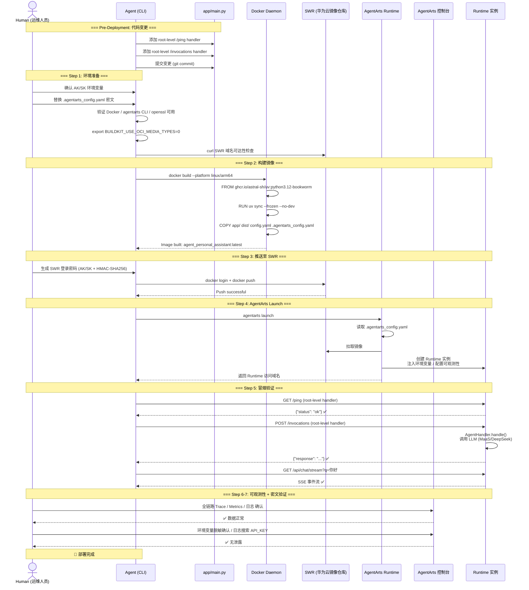

# Plan: Chore 1 — 首次部署至 AgentArts Runtime 生产环境

> 本 Plan 是**运维操作手册（Operational Runbook）**为主，包含一个**阻塞性代码变更**（§2.4 — 添加 AgentArts 平台要求的 root-level handlers）。其余步骤为部署操作，无代码修改。

---

## 0. Issue Evaluation

| 维度 | 结果 | 说明 |
|------|------|------|
| Staleness | ✅ | 所有引用的架构文档（`cicd.md`、`agentarts.md`、`overall_architecture.md`）均存在且内容匹配当前设计；Dockerfile 和 `.agentarts_config.yaml` 与当前代码状态一致 |
| Feasibility | ✅ | 部署路径明确：Docker build → SWR push → agentarts launch → smoke test。ADR-004 明确确认 FastAPI 兼容 `agentarts launch`。无 ADR 冲突 |
| Completeness | ✅ | Issue 包含完整的任务拆解、pitfalls、参考文档。凭据类前提条件已标注为需人工确认 |
| Impact Scope | ✅ | 一个阻塞性代码变更（添加 root-level `/ping` `/invocations` handlers）+ 运维操作。影响对象：`app/main.py`、Docker 镜像、SWR 仓库、AgentArts Runtime 实例、环境变量配置 |

**判定：ACCEPT**

---

## 1. Issue Summary

- **类型**：Chore（运维部署）
- **目标**：将 Personal Assistant 服务首次部署到 AgentArts Runtime（`cn-southwest-2`），打通 容器构建 → SWR 推送 → Runtime 启动 → 冒烟验证 的完整链路
- **参考架构**：
  - `architecture/devops/cicd.md` — Layer 1 AgentArts 部署策略
  - `architecture/cloud-service/agentarts.md` — AgentArts 平台参考
  - `architecture/ADR/ADR-004-fastapi-over-agentarts-runtime-app.md` — FastAPI 替代 AgentArtsRuntimeApp 的决策
- **关键文件**：
  - `personal-assistant-service/Dockerfile` — 生产镜像构建
  - `personal-assistant-service/.agentarts_config.yaml` — AgentArts Runtime 声明式配置

---

## 2. Prerequisites Checklist

部署前必须逐项确认。按执行角色分为 **Agent 可验证** 和 **人工需提供** 两类。

### 2.1 Agent 可验证（文件/环境存在性）

| # | 检查项 | 验证命令 | 预期结果 |
|---|--------|---------|---------|
| P1 | 工作目录 | `pwd` | 项目根目录（包含 `personal-assistant-service/`） |
| P2 | Dockerfile 存在 | `ls personal-assistant-service/Dockerfile` | 文件存在 |
| P3 | .agentarts_config.yaml 存在 | `ls personal-assistant-service/.agentarts_config.yaml` | 文件存在 |
| P4 | config.yaml 存在 | `ls personal-assistant-service/config.yaml` | 文件存在 |
| P5 | client dist 目录 | `ls personal-assistant-client/dist/index.html` | 文件存在（需预先 `npm run build`） |
| P6 | Docker 已安装 | `docker version` | 输出版本信息，无错误 |
| P7 | Docker 支持 buildx | `docker buildx version` | 输出版本信息 |
| P8 | agentarts CLI 已安装 | `agentarts --version` | 输出版本号 |
| P9 | uv.lock 存在 | `ls personal-assistant-service/uv.lock` | 文件存在 |
| P10 | openssl 已安装 | `openssl version` | 输出版本信息（SWR 密码生成依赖） |
| P11 | SWR 域名可达 | `curl -s -o /dev/null -w '%{http_code}' https://swr.cn-southwest-2.myhuaweicloud.com` | 200 或 401（可达） |

### 2.2 人工需提供（凭据/密钥）

| # | 检查项 | 说明 | 获取方式 |
|---|--------|------|---------|
| H1 | 华为云 AK/SK | `HUAWEICLOUD_SDK_AK` / `HUAWEICLOUD_SDK_SK` 环境变量 | 华为云控制台 → IAM → 我的凭证 |
| H2 | MaaS API Key | `.agentarts_config.yaml` 中 `MAAS_API_KEY` 和 `MODEL_API_KEY` 的值 | MaaS 控制台 → 模型部署 → API Key 管理 |
| H3 | DeepSeek API Key | `.agentarts_config.yaml` 中 `DEEPSEEK_API_KEY` 的值 | DeepSeek 官方控制台 |
| H4 | SWR 登录凭据 | Docker login 使用 AK/SK 生成临时密码 | 详见 Step 3.3 |
| H5 | IAM 子账号权限 | 需 SWR FullAccess 权限（若使用子账号） | IAM 控制台 → 用户组 → 授权 |

### 2.3 环境变量密文替换

`.agentarts_config.yaml` 中以下三处为占位符，部署前**必须替换为真实值**：

```yaml
# 🔴 部署前必须替换
environment_variables:
  - key: MAAS_API_KEY
    value: "<MaaS API Key>"        # ← 替换为真实 MaaS API Key
  - key: DEEPSEEK_API_KEY
    value: "<DeepSeek 官方 API Key>" # ← 替换为真实 DeepSeek API Key
  - key: MODEL_API_KEY
    value: "<your-maas-api-key>"    # ← 替换为真实 MaaS API Key（与 MAAS_API_KEY 通常相同）
```

> **安全提醒**：替换后的 `.agentarts_config.yaml` **切勿提交到 Git**。建议使用 `git update-index --assume-unchanged` 或在 `.gitignore` 中排除。

---

## 2.4 Pre-Deployment Code Change（阻塞性前置）

> ⚠️ **此变更必须在 `docker build` 之前完成并提交。** 不完成此变更，部署后 AgentArts 平台的健康检查和调用入口将返回 HTML 而非 JSON，导致 Runtime 启动失败或提示 "Unhealthy"。

### 问题

当前 `app/main.py` 中 AgentArts 平台所需的端点注册在 `/api/` 前缀下：

| AgentArts 期望 | 当前注册 | 行为 |
|----------------|---------|------|
| `GET /ping` | `@app.get("/api/ping")` | `/ping` 无匹配路由 → SPA fallback 返回 `index.html` ❌ |
| `POST /invocations` | `@app.post("/api/invocations")` | `/invocations` 无匹配路由 → SPA fallback 返回 `index.html` ❌ |

**ADR-004** 明确要求："必须保留 `/ping`（返回 `{"status": "ok"}`）和 `/invocations`（接受 JSON payload），确保 AgentArts 平台兼容"。AgentArts Runtime 在 `:8080` 端口调用这两个 **root-level** 端点，不经过任何 `/api/` 前缀。

### 修复方案

在 `app/main.py` 中添加 root-level 路由，放在 `@app.get("/api/ping")` 和 `@app.post("/api/invocations")` **之后、StaticFiles mount 之前**。

**文件**：`personal-assistant-service/app/main.py`

**插入位置**：在行 68（`return {"response": result}` 之后）和行 71（`@app.get("/api/chat/stream")` 之前）之间插入以下代码：

```python
# === AgentArts Runtime 兼容端点（root-level）===
# AgentArts 平台通过 GET /ping 做健康检查、POST /invocations 做 Agent 调用。
# 这些端点必须在 root 路径下（无 /api/ 前缀），因为平台不经过 API 网关前缀。
# 它们与 /api/ping 和 /api/invocations 功能等价，但位置必须在 StaticFiles mount
# 之前注册，避免被 SPA fallback 拦截。


@app.get("/ping", include_in_schema=False)
async def ping_root():
    """Health check endpoint for AgentArts Runtime (root-level)."""
    return {"status": "ok"}


@app.post("/invocations", include_in_schema=False)
async def invocations_root(request: Request):
    """Synchronous agent invocation endpoint for AgentArts Runtime (root-level)."""
    body = await request.json()
    message = body.get("message", "")
    user_id = request.headers.get("X-AgentArts-User-Id", "anonymous")
    session_id = request.headers.get("X-AgentArts-Session-Id")

    if not message:
        raise HTTPException(status_code=400, detail="message is required")

    handler: AgentHandler = request.app.state.agent_handler
    result = await handler.handle(
        message=message,
        user_id=user_id,
        session_id=session_id,
    )

    return {"response": result}
```

### 验证

修改后，本地验证：

```bash
# 在 personal-assistant-service/ 目录下启动（需要先配置好 env）
uv run uvicorn app.main:app --port 8080 &

# 验证 root-level 端点
curl -s http://localhost:8080/ping
# 期望：{"status": "ok"}

curl -s -X POST http://localhost:8080/invocations \
  -H "Content-Type: application/json" \
  -d '{"message": "hello"}'
# 期望：{"response": "..."}

# 确认原有 /api/ 端点仍然正常
curl -s http://localhost:8080/api/ping
# 期望：{"status": "ok"}

kill %1
```

### 设计说明

- `include_in_schema=False`：避免在 OpenAPI 文档中重复暴露（`/api/ping` 和 `/api/invocations` 已在 schema 中）
- 两个 root-level handler 是独立的 FastAPI 路由，**不是 redirect 或 proxy**：直接处理请求，性能无差异
- 由于这两个路由在 `@app.get("/api/ping")` 之后注册、但在 `app.mount("/", StaticFiles...)` 之前，路由优先级正确：`/api/*` > `/ping` + `/invocations` > 静态文件

---

### Step 1 — 前置环境准备

**执行角色**：Human + Agent 协作

```bash
# 1.1 进入项目根目录
cd /path/to/tidy-eagle

# 1.2 确认客户端已构建
ls personal-assistant-client/dist/index.html
# 如果不存在，先执行构建：
# cd personal-assistant-client && npm run build && cd ..

# 1.3 确认 §2.4 的代码变更已完成并提交
grep -n "async def ping_root" personal-assistant-service/app/main.py
# 期望输出：行号 + 函数定义（确认 root-level handlers 已添加）

# 1.4 设置 OCI 兼容性环境变量（Docker 27+ 必需）
export BUILDKIT_USE_OCI_MEDIA_TYPES=0

# 1.5 验证 Docker 可用
docker version
docker buildx version

# 1.6 验证 agentarts CLI 已安装
agentarts --version
# 如未安装：pip install agentarts-sdk

# 1.7 验证 openssl 可用（SWR 密码生成依赖）
openssl version

# 1.8 验证 SWR 域名可达
curl -s -o /dev/null -w '%{http_code}' https://swr.cn-southwest-2.myhuaweicloud.com
# 期望输出：200 或 401（可达）

# 1.9 设置华为云认证
export HUAWEICLOUD_SDK_AK="<your-ak>"
export HUAWEICLOUD_SDK_SK="<your-sk>"
echo $HUAWEICLOUD_SDK_AK  # 确认已设置
```

### Step 2 — 构建 ARM64 Docker 镜像

**执行角色**：Agent（需 Human 确认 ARM64 环境可用）

```bash
# 2.1 确认当前机器架构
uname -m
# 期望输出：aarch64（ARM64 原生）或 x86_64（需 buildx + QEMU）

# 2.2 构建镜像
# 如果在 ARM64 原生机器上：
docker build --platform linux/arm64 \
  -f personal-assistant-service/Dockerfile \
  -t swr.cn-southwest-2.myhuaweicloud.com/personal-assistant-org/agent_personal_assistant:latest \
  .

# 如果在 X86 机器上，使用 buildx + QEMU：
# docker buildx create --use --name arm64-builder
# docker buildx build --platform linux/arm64 \
#   --load \
#   -f personal-assistant-service/Dockerfile \
#   -t swr.cn-southwest-2.myhuaweicloud.com/personal-assistant-org/agent_personal_assistant:latest \
#   .

# 2.3 验证镜像构建成功
docker images | grep agent_personal_assistant
# 期望输出：包含 swr.cn-southwest-2.myhuaweicloud.com/personal-assistant-org/agent_personal_assistant
```

**构建失败常见原因**：

| 症状 | 原因 | 解决方案 |
|------|------|---------|
| `COPY personal-assistant-client/dist/` 失败 | 客户端未构建 | 执行 `npm run build` |
| `uv sync` 失败 | uv.lock 过期或网络不通 | 确认 `uv.lock` 存在且依赖可解析 |
| `exec format error` | 在 X86 机器上未使用 buildx | 使用 `docker buildx build --platform linux/arm64` |
| 构建极慢 (>10min) | X86 QEMU 模拟 ARM64 | 正常现象；考虑使用 ARM64 CI runner |

### Step 3 — 推送镜像至 SWR

**执行角色**：Human（需提供 AK/SK 生成 SWR 密码）

```bash
# 3.1 生成 SWR 临时登录密码
# 格式：cn-southwest-2@<AK>
# 密码通过以下命令生成（macOS + Linux 兼容）：
SWR_PASSWORD=$(printf "$HUAWEICLOUD_SDK_AK" | openssl dgst -binary -sha256 -hmac "$HUAWEICLOUD_SDK_SK" | od -An -vtx1 | tr -d ' \n')
echo "SWR 密码: $SWR_PASSWORD"

# 3.2 登录 SWR
docker login swr.cn-southwest-2.myhuaweicloud.com \
  -u "cn-southwest-2@$HUAWEICLOUD_SDK_AK" \
  -p "$SWR_PASSWORD"

# 3.3 推送镜像
docker push swr.cn-southwest-2.myhuaweicloud.com/personal-assistant-org/agent_personal_assistant:latest
```

**推送失败常见原因**：

| 症状 | 原因 | 解决方案 |
|------|------|---------|
| `unauthorized` | AK/SK 错误或密码生成有误 | 重新检查 AK/SK；确认密码生成命令的 shell 兼容性（zsh vs bash） |
| `denied: Permission denied` | IAM 子账号缺少 SWR 权限 | 在 IAM 控制台为用户/用户组添加 SWR FullAccess |
| `manifest unknown` | 组织或仓库不存在 | 确认 `organization_auto_create: true` 和 `repository_auto_create: true`；或手动在 SWR 控制台创建 |

### Step 4 — AgentArts Launch 部署

**执行角色**：Human（需控制台确认）+ Agent（执行 CLI）

```bash
# 4.1 确认工作目录为 personal-assistant-service/
cd personal-assistant-service

# 4.2 确认 .agentarts_config.yaml 中的环境变量已替换为真实值
grep -E "MAAS_API_KEY|DEEPSEEK_API_KEY|MODEL_API_KEY" .agentarts_config.yaml
# 确认所有 value 字段不是 "<...>" 占位符

# 4.3 执行部署
agentarts launch
```

**`agentarts launch` 执行流程**：

1. 读取 `.agentarts_config.yaml`
2. 如果 SWR 组织/仓库不存在且 `auto_create: true`，自动创建
3. 基于 `artifact_source.url` 拉取已有镜像（或基于配置构建新镜像）
4. 根据 `runtime` 配置创建 Runtime 实例（端口 8080、网络模式 PUBLIC、环境变量注入）
5. 配置可观测性（Tracing/Metrics/Logs）
6. 返回 Runtime 访问域名

**部署后验证**：

```bash
# 4.4 记录控制台输出的 Runtime 域名
# 示例：https://xxx.agentarts.cn-southwest-2.myhuaweicloud.com

# 4.5 在 AgentArts 控制台确认
# 访问 https://console.huaweicloud.com/agentarts/
# → 智能体运行时 → 确认实例状态为「运行中」
```

### Step 5 — 冒烟验证

**执行角色**：Agent

```bash
# 替换为实际 Runtime 域名
RUNTIME_DOMAIN="<runtime-domain-from-launch-output>"

# 5.1 健康检查（root-level /ping — 由 §2.4 新增的 handler 提供）
curl -s "$RUNTIME_DOMAIN/ping"
# 期望输出：{"status": "ok"}

# 5.2 同步对话调用（root-level /invocations — 由 §2.4 新增的 handler 提供）
# 注意：当前代码使用 X-AgentArts-User-Id header 识别用户，不依赖 Authorization header。
# 如果 AgentArts 的 IAM authorizer 在网关层注入该 header，则无需手动传递。
curl -s -X POST "$RUNTIME_DOMAIN/invocations" \
  -H "Content-Type: application/json" \
  -d '{"message": "你好，请简单介绍一下你自己"}'
# 期望输出：{"response": "..."}(包含有效回复内容)

# 5.3 SSE 流式对话（Web Chat 需要 — 使用 /api/ 前缀路由）
curl -N -s "$RUNTIME_DOMAIN/api/chat/stream?q=你好" \
  -H "Accept: text/event-stream"
# 期望输出：data: {...} SSE 事件流

# 5.4 确认 /api/ 前缀路由仍然正常
curl -s "$RUNTIME_DOMAIN/api/ping"
# 期望输出：{"status": "ok"}
```

**冒烟验证判定标准**：

| 测试 | 通过条件 | 失败处理 |
|------|---------|---------|
| `/ping` (root-level) | 返回 `{"status": "ok"}`，HTTP 200 | 检查 §2.4 代码变更是否已应用；查看 AgentArts 控制台日志 |
| `/invocations` (root-level) | 返回 `{"response": "..."}`，HTTP 200 | 检查 MODEL_API_KEY 是否正确，查看 Trace 定位错误 |
| `/api/chat/stream` | SSE 事件流正常推送 | 检查 Web Chat 依赖的前端资源是否正确挂载 |
| `/api/ping` | 返回 `{"status": "ok"}` | 检查 FastAPI 路由注册 |

### Step 6 — 可观测性确认

**执行角色**：Human（需控制台操作）

在 AgentArts 控制台依次确认：

1. **全链路 Trace**：控制台 → 观测 → 全链路 Trace → 筛选最近 15 分钟 → 确认有 Step 5 产生的 Trace 记录
2. **Metrics**：控制台 → 观测 → 指标监控 → 确认 QPS、延迟、错误率等面板有数据
3. **日志**：控制台 → 观测 → 日志 → 确认可查看容器 stdout/stderr 输出（特别是 uvicorn 的启动日志和请求日志）

### Step 7 — 环境变量密文验证

**执行角色**：Human（需控制台检查）

1. 在 AgentArts 控制台 → 运行时详情 → 环境变量 → 确认 `MAAS_API_KEY`、`DEEPSEEK_API_KEY`、`MODEL_API_KEY` 均为 `******` 脱敏显示
2. 在日志页面搜索 `MAAS_API_KEY`、`DEEPSEEK_API_KEY`，确认**无明文泄露**
3. 确认 `agentarts launch` 的控制台输出中不包含明文密钥

---

## 4. Rollback Plan

若部署后冒烟验证连续失败且无法快速修复，按以下步骤回滚。

### 4.1 回滚步骤

```bash
# 1. 在 AgentArts 控制台停止 Runtime 实例
# 控制台 → 智能体运行时 → 选择实例 → 停止
# ⚠️ 注意：Runtime 实例停止可能需要数秒到数分钟。
#    等待控制台显示状态为「已停止」后再确认回滚完成。

# 2. （可选）删除 SWR 镜像标签
# docker rmi swr.cn-southwest-2.myhuaweicloud.com/personal-assistant-org/agent_personal_assistant:latest
```

### 4.2 回滚决策矩阵

| 失败场景 | 是否回滚 | 处理方式 |
|---------|---------|---------|
| `/ping` (root-level) 返回非 200 或超时 | ✅ 回滚 | 检查 §2.4 代码变更是否已应用，查看容器启动日志 |
| `/invocations` (root-level) 返回 5xx | ⚠️ 先诊断 | 可能是 API Key 配置错误或 §2.4 代码变更缺失；更新环境变量后重启 |
| `/invocations` (root-level) 返回 HTML（SPA fallback） | ✅ 回滚 | §2.4 代码变更未应用；回滚后应用变更再重新部署 |
| `/invocations` 返回 4xx | ❌ 不回滚 | 参数错误，修正请求即可 |
| Trace/Metrics/Logs 无数据 | ❌ 不回滚 | 可观测性配置问题，不影响服务功能；在控制台修正配置 |

### 4.3 恢复部署

修复问题后，从 Step 2 开始重新执行（Docker 镜像可跳过重新构建，直接 push + launch）。

---

## 5. Pitfalls & Troubleshooting

### 5.1 ARM64 架构

- **问题**：AgentArts Runtime 仅支持 `linux/arm64`。X86 机器直接 `docker build` 生成的镜像无法在 Runtime 运行。
- **症状**：`agentarts launch` 后容器 CrashLoopBackOff，日志显示 `exec format error`
- **解决**：使用 `docker buildx build --platform linux/arm64 --load`。本地需安装 QEMU：
  ```bash
  docker run --rm --privileged multiarch/qemu-user-static --reset -p yes
  ```

### 5.2 OCI Media Types (Docker 27+)

- **问题**：Docker 27+ 默认生成 OCI 格式镜像 (`application/vnd.oci.image.config.v1+json`)，SWR 不支持
- **症状**：`docker push` 成功，但 `agentarts launch` 时 SWR 无法解析镜像
- **解决**：
  ```bash
  export BUILDKIT_USE_OCI_MEDIA_TYPES=0
  ```
  设置后**重新构建并推送**镜像。

### 5.3 IAM 子账号权限

- **问题**：使用 IAM 子账号的 AK/SK 操作 SWR 时权限不足
- **症状**：`docker push` 返回 `denied: Permission denied`
- **解决**：在 IAM 控制台为子账号所在用户组添加 `SWR FullAccess` 策略

### 5.4 SWR 登录密码生成（zsh 兼容性）

- **问题**：SWR 密码生成命令在 zsh 下可能输出格式异常
- **解决**：使用以下 zsh 兼容版本：
  ```zsh
  SWR_PASSWORD=$(printf "$HUAWEICLOUD_SDK_AK" | openssl dgst -binary -sha256 -hmac "$HUAWEICLOUD_SDK_SK" | od -An -vtx1 | tr -d ' \n')
  ```

### 5.5 entrypoint 配置不一致

- **现状**：`.agentarts_config.yaml` 中 `entrypoint: "agent:app"`，但项目不存在 `agent.py`。实际入口为 `app.main:app`（由 Dockerfile CMD 指定）
- **影响**：采用手动 `docker build` + `docker push` + `agentarts launch` 流程，Dockerfile CMD 覆盖 entrypoint 声明，**当前部署不受影响**
- **建议**：部署成功后，将 `entrypoint` 更新为 `"app.main:app"` 以消除配置不一致，避免未来 `agentarts launch` 内置构建流程出错。此项可作为后续 cleanup PR 处理

### 5.6 客户端静态资源缺失

- **问题**：Dockerfile 中 `COPY personal-assistant-client/dist/ ./dist/`，若 dist 目录不存在则构建失败
- **解决**：
  ```bash
  cd personal-assistant-client && npm run build && cd ..
  ```

### 5.7 网络模式

- **当前配置**：`network_mode: PUBLIC` → Runtime 可通过公网域名访问
- **注意**：若后续需要 VPC 内网访问（如飞书 Webhook 回调），需改为 `network_mode: PRIVATE` 并配置 VPC

### 5.8 Authorization Header — 与 Issue 原始描述的差异

- **问题**：Issue 的 smoke test 示例包含 `-H "Authorization: Bearer <api-key>"`，但当前代码中 `/invocations` handler 不检查 `Authorization` header，而是从 `X-AgentArts-User-Id` header 获取用户标识
- **说明**：当前设计假设 AgentArts IAM authorizer 在网关层完成认证并注入 `X-AgentArts-User-Id` header。如果平台配置了 IAM 鉴权，网关会自动处理；如果未配置，`anonymous` 作为默认 user_id 回退
- **影响**：Plan 的 smoke test 不包含 `Authorization` header，与当前代码行为一致。若后续启用 IAM 鉴权，需在 AgentArts 控制台配置 API Key 并在请求中添加 `Authorization` header

### 5.9 `MODEL_API_KEY` 环境变量冗余

- **现状**：`.agentarts_config.yaml` 中声明了 `MAAS_API_KEY`、`DEEPSEEK_API_KEY` 和 `MODEL_API_KEY` 三个环境变量，但 `config.yaml`（LLM Provider 配置）中：
  - `maas` provider 使用 `api_key_env: MAAS_API_KEY`
  - `deepseek` provider 使用 `api_key_env: DEEPSEEK_API_KEY`
  - **`MODEL_API_KEY` 未被任何 provider 引用**
- **判断**：`MODEL_API_KEY` 很可能是引入 ADR-011 多 Provider 架构前的遗留配置，属于冗余环境变量
- **建议**：部署时可保留（无害），但标记为 §8 后续 cleanup 项，确认无引用后移除

### 5.10 `artifact_source.commands` 冗余

- **现状**：`.agentarts_config.yaml` 中 `artifact_source.commands: ["uv sync --frozen --no-dev"]` 与 Dockerfile 第 9 行的 `RUN uv sync --frozen --no-dev` 重复
- **说明**：`artifact_source.commands` 是 `agentarts launch` 在拉取 `artifact_source.url` 的镜像后额外执行的命令。由于 Dockerfile 构建阶段已完成依赖安装，此处的 `uv sync` 是冗余操作
- **影响**：不影响功能（幂等操作），但会略微延长 Runtime 启动时间
- **建议**：标记为 §8 后续 cleanup 项，确认当前部署流程仅依赖 Dockerfile 后移除

---

## 6. Sequence Diagram



---

## 7. Verification Checklist (Final)

部署完成后逐项勾选：

- [ ] `GET /ping` 返回 `{"status": "ok"}`（root-level，AgentArts 健康检查）
- [ ] `POST /invocations` 返回有效 AI 回复（root-level，AgentArts 调用入口）
- [ ] `GET /api/ping` 返回 `{"status": "ok"}`（`/api/` 前缀路由兼容性）
- [ ] `GET /api/chat/stream?q=...` SSE 流正常
- [ ] AgentArts 控制台 Runtime 状态 = 运行中
- [ ] 全链路 Trace 有数据
- [ ] Metrics 面板有数据
- [ ] 日志页面可查看容器输出（uvicorn 启动日志、请求日志）
- [ ] 环境变量密文不泄露（控制台显示 `******`，日志无明文）
- [ ] `.agentarts_config.yaml` 中无明文占位符残留
- [ ] §2.4 代码变更已提交（`ping_root` / `invocations_root` handlers 存在）

---

## 8. Post-Deployment Cleanup (后续任务)

以下为部署成功后的非阻塞 cleanup 任务，可作为独立 issue：

1. **修正 entrypoint 声明**：将 `.agentarts_config.yaml` 中 `entrypoint: "agent:app"` 更新为 `"app.main:app"`（或移除，因为 Dockerfile CMD 已覆盖）
2. **移除冗余环境变量**：确认 `MODEL_API_KEY` 无引用后从 `.agentarts_config.yaml` 中移除（见 §5.9）
3. **移除冗余 artifact_source.commands**：确认部署流程仅依赖 Dockerfile 构建后，移除 `.agentarts_config.yaml` 中 `artifact_source.commands` 块（见 §5.10）
4. **安全加固**：确认 `.agentarts_config.yaml` 不会因 git 操作泄露；考虑使用 CI/CD secret 管理环境变量
5. **自动化**：在 CI pipeline 中集成 docker build → push → launch → smoke 流程（参考 `cicd.md` §2.2）
