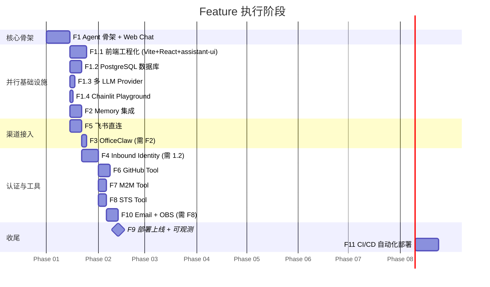

# Features

Personal Assistant 开发计划，15 个 Feature（含 1 个基础设施前置 Feature + 14 个 Phase Feature）。

渠道策略：Web Chat → 飞书 → OfficeClaw。用浏览器快速验证 Agent 核心能力，再接入企业内部 IM 和微信。

## 概览

| Feature | 内容 | 核心交付 | 依赖 | 状态 |
|---------|------|----------|------|------|
| [1](feature-1-agent-skeleton.md) | Agent 骨架 + Web Chat | 浏览器完成流式对话（单 HTML） | 无 | backlog |
| [1.1](feature-1.1-web-chat-frontend/issue.md) | Web Chat 前端工程化 | Vite + React + TypeScript + Tailwind + assistant-ui（替换单 HTML） | Feature 1 | backlog |
| [1.2](feature-1.2-database-setup/issue.md) | PostgreSQL 数据库集成 | 持久化基础设施（Docker Compose + SQLAlchemy + 表结构） | Feature 1 | backlog |
| [1.3](feature-1.3-multi-llm-provider/issue.md) | 多 LLM Provider 可配置 | `config.yaml` + `llm_config.py` | Feature 1 | backlog |
| [1.4](feature-1.4-chainlit-playground/issue.md) | Chainlit Playground 调试工具 | 同容器 `/playground` Chainlit UI，挂接 agent_handler | Feature 1 | backlog |
| [2](feature-2-memory.md) | Memory 集成 | 跨 Session 记忆（Web Chat 验证） | Feature 1 | backlog |
| [3](feature-3-officeclaw.md) | OfficeClaw 渠道 | 飞书/微信多渠道覆盖（零代码） | Feature 1, 2 | backlog |
| [4](feature-4-inbound-identity.md) | Inbound Identity (OAuth) | Microsoft Entra ID OAuth + JWT + API Key | Feature 1, 2, 1.2 | backlog |
| [5](feature-5-feishu-channel.md) | 飞书渠道 | 飞书 @Bot 完成对话 | Feature 1 | backlog |
| [6](feature-6-github-tool.md) | GitHub Tool (User Federation) | Agent 代用户查 GitHub Issues | Feature 1, 2, 4, 1.2 | backlog |
| [7](feature-7-m2m-tool.md) | 内部 API Tool (M2M) | Agent 调企业内部 API | Feature 1, 4, 1.2 | backlog |
| [8](feature-8-sts-tool.md) | 云资源 Tool (STS) | Agent 访问 OBS 等云资源 | Feature 1, 4, 1.2 | backlog |
| [9](feature-9-deployment.md) | 部署上线 + 可观测 | 生产环境 + 三渠道验证 | Feature 1-8, 1.1, 1.2, 10 | backlog |
| [10](feature-10-outbound-email-obs/issue.md) | Outbound Email + OBS（AgentArts Python SDK） | 邮件处理（Microsoft Graph）+ OBS 文件查询（STS） | Feature 1, 2, 4, 1.2, 8 | backlog |
| [11](feature-11-github-workflow-terraform-deploy/issue.md) | GitHub Workflow + Terraform 自动化部署 | CI/CD 流水线（GitHub Actions + CDKTF + docker buildx），Client（OBS+CDN）+ Service（AgentArts）自动部署 | Feature 1, 1.1, 1.2, 9 | backlog |

## 依赖关系

```mermaid
flowchart TD
    F1["Feature 1: Agent + Web Chat"] --> F1_1["Feature 1.1: 前端工程化"]
    F1 --> F1_2["Feature 1.2: PostgreSQL"]
    F1 --> F1_3["Feature 1.3: 多 LLM Provider"]
    F1 --> F1_4["Feature 1.4: Chainlit Playground"]
    F1_2 --> F4["Feature 4: Inbound Identity"]
    F1 --> F2["Feature 2: Memory"]
    F1 --> F3["Feature 3: OfficeClaw"]
    F2 --> F3
    F1 --> F4
    F2 --> F4
    F1 --> F5["Feature 5: 飞书"]
    F1 --> F6["Feature 6: GitHub Tool"]
    F2 --> F6
    F4 --> F6
    F4 --> F7["Feature 7: M2M Tool"]
    F4 --> F8["Feature 8: STS Tool"]
    F8 --> F10["Feature 10: Email + OBS"]
    F4 --> F10
    F2 --> F10
    F3 --> F9["Feature 9: 部署上线"]
    F5 --> F9
    F6 --> F9
    F7 --> F9
    F8 --> F9
    F10 --> F9
    F1_1 --> F11[\"Feature 11: CI/CD 自动化部署\"]
    F9 --> F11
```

## 渠道上线顺序

```
Feature 1: Web Chat  ← 第一条渠道，浏览器直接验证 Agent
Feature 5: 飞书      ← 第二条渠道，企业内部 IM 接入
Feature 3: OfficeClaw ← 最后，零代码加微信覆盖
```

## 阶段推进



> F1.1 和 F1.2 在 F1 完成后即可并行推进，互不阻塞。F2、F5 也可同步进行。瓶颈在 F1.2 → F4 链路上（因 F4 依赖 1.2 的表结构，F6-8 又依赖 F4）。F10 在 F8（STS 基础设施）完成后开始，复用 F8 的 STS Provider。F3 是纯配置工作，放在 Memory 之后做是因为需要验证跨渠道 Memory。

## 相关文档

| 文档 | 路径 |
|------|------|
| 总体功能规格 | `../specs/overall_specifications.md` |
| 架构设计 | `../architecture/overall_architecture.md` |
| ADR | `../architecture/ADR/README.md` |
| DevOps | `../architecture/devops/` |
| 领域词典 | `../specs/dictionary.md` |
