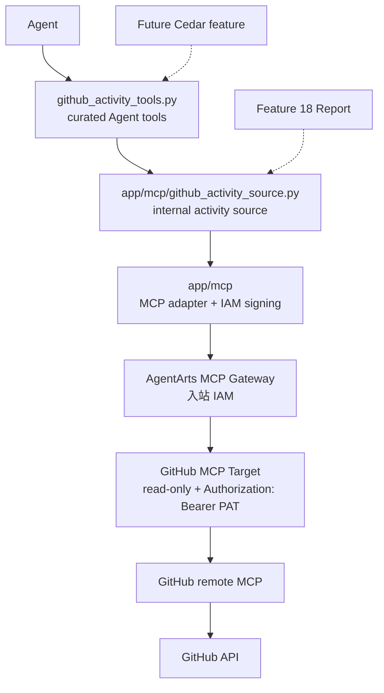

# Feature 17: GitHub MCP Activity Data Source and Tools

本 Feature 先落地 **AgentArts MCP Gateway + GitHub activity data source + curated Agent tools**。目标是跑通 Personal Assistant 通过 AgentArts MCP Gateway 访问 GitHub 官方 remote MCP 的平台接入、凭据边界、read-only Target 配置和 Service 内部 source contract，并提供 Agent 可直接调用的只读 GitHub 工程活动查询能力。

Agent 只看到面向业务语义封装的 `github_search_activity` 和 `github_get_activity_detail`，不会看到 GitHub MCP 的 raw 原子工具或 transport-level `github_mcp_*` functions。内部 source contract 为 Feature 18 Report root capability 预留复用边界；现在建立 Agent-visible tool surface，则是为未来 AgentArts MCP Gateway Cedar feature 做准备。

Implementation Plan 见 [plan.md](./plan.md)。

## 背景

Personal Assistant 需要引入 AgentArts MCP Gateway 作为外部 MCP Server 的平台入口。当前最适合首个 MCP 场景的是 GitHub 工程活动数据：

- 现有 GitHub local tools 偏仓库浏览、文件读取、代码搜索和 star；
- 日报 / 周报 / 月报后续需要 GitHub activity timeline；
- 用户也需要在非报表场景直接查询指定仓库和时间窗口内的工程活动；
- 先独立验证 MCP Gateway，可把平台接入风险从 Report 产品能力中拆出来。

本 Feature 解决“GitHub 工程活动数据源是否可稳定接入和独立调用”。用户可见的 `generate_report` root tool 仍放到 Feature 18；未来 Cedar feature 在本 Feature 建立的 Agent-visible tool boundary 上继续演进。

图类型：**Component Diagram（组件图）**。用于说明 GitHub MCP data source 的系统边界。



## 目标

- 在 AgentArts 控制台手动创建 `gateway-github-mcp` 与 `target-github-mcp`。
- GitHub Target 指向 GitHub remote MCP read-only endpoint：`https://api.githubcopilot.com/mcp/readonly`。
- Target 出站认证配置为 `Authorization: Bearer <GitHub PAT>`。
- Service 使用 WAT → AgentArts Identity STS provider → 临时 IAM 凭据，对 MCP Gateway 请求做 IAM 签名。
- Service 新增稳定的 GitHub activity source contract，输出统一 `GitHubActivityResult` / `GitHubActivityEvent`。
- 注册 curated、read-only 的 `github_search_activity` 和 `github_get_activity_detail` Agent tools。
- 内部 source contract 可被 Feature 18 直接复用；Agent-visible tool boundary 为未来 AgentArts MCP Gateway Cedar feature 做准备。
- 不让 GitHub PAT、WAT、STS、IAM 签名材料进入 LLM prompt、tool schema、SSE、日志或业务数据库。

## 范围

### 包含

- `app/mcp/` 轻量配置封装：
  - Gateway URL；
  - IAM signing；
  - timeout；
  - capability check；
  - 错误映射。
- `app/mcp/github_activity_source.py` 内部 source functions：
  - `github_mcp_resolve_identity`；
  - `github_mcp_list_repositories`；
  - `github_mcp_search_activity`；
  - `github_mcp_get_detail`。
- `app/tools/github_activity_tools.py` Agent-facing facade：
  - `github_search_activity`；
  - `github_get_activity_detail`；
  - `GITHUB_ACTIVITY_TOOLS`，仅在 `GITHUB_MCP_ENABLED=true` 且
    `GITHUB_ACTIVITY_TOOLS_ENABLED=true` 时注册到 `build_tools()`。
- `GitHubActivityQuery`、`GitHubActivityResult`、`GitHubActivityEvent` 和 typed warning 数据结构。
- typed settings：
  - `GITHUB_MCP_ENABLED`；
  - `GITHUB_ACTIVITY_TOOLS_ENABLED`；
  - `GITHUB_MCP_GATEWAY_URL`；
  - `GITHUB_MCP_AUTH_MODE=iam`；
  - `GITHUB_MCP_STS_PROVIDER_NAME`；
  - `GITHUB_MCP_TIMEOUT_SECONDS`。
- 单元测试、集成测试和 staging smoke test 覆盖 Gateway / Target / credential boundary。

### 不包含

- 不新增 `generate_report`。
- 不实现日报 / 周报 / 月报生成。
- 不实现未来 AgentArts MCP Gateway Cedar feature。
- 不迁移 Email / Calendar tools。
- 不迁移现有 GitHub repository browsing tools。
- 不把 `github_mcp_*` functions 或 GitHub remote MCP 原子工具注册给 Agent。
- 不提供通用 raw MCP passthrough。
- 不实现 GitHub 写操作。
- 不代表 Web Chat 当前登录用户查询 GitHub。

## 身份与权限边界

GitHub MCP data source 使用 **personal assistant agent 平台身份**，不代表 Web Chat 当前登录用户。

- `target-github-mcp` 中的 GitHub PAT 是平台侧凭证；
- GitHub MCP Server 看到的 `me` 是 PAT 所属 GitHub 账号 / platform GitHub account；
- `actor = platform` 表示该平台账号；
- Agent-facing tool description 和 result 必须明确 `identity_scope = platform`，不得使用“当前用户的 GitHub 活动”等误导表述；
- 如未来需要“当前用户自己的 GitHub 活动”，应作为单独的 user-delegated GitHub data source 设计。

Service 调 AgentArts MCP Gateway 的生产认证路径为：

```text
X-HW-AgentGateway-Workload-Access-Token
  -> AgentArtsRuntimeContext
  -> AgentArts Identity STS provider
  -> temporary IAM credentials
  -> HuaweiCloud API signing SDK
  -> AgentArts MCP Gateway
```

本地开发沿用已有 `.agent_identity.json` / customer-owned local workload fallback。长期 AK/SK 只允许用于本地 CLI / helper smoke test，不作为 Service 默认运行路径。

## 验收标准

### AC1：Gateway / Target 配置可执行

- [ ] `gateway-github-mcp` 入站认证使用 IAM。
- [ ] `target-github-mcp` 指向 `https://api.githubcopilot.com/mcp/readonly`。
- [ ] Target 出站 header 为 `Authorization: Bearer <GitHub PAT>`。
- [ ] PAT 使用 fine-grained read-only 权限，并限制到报表需要读取的 repository。

### AC2：Service 能调用 GitHub MCP data source

- [ ] `github_mcp_resolve_identity` 返回 platform GitHub account。
- [ ] `github_mcp_list_repositories` 返回平台账号可见仓库。
- [ ] `github_mcp_search_activity` 能按时间窗口、repository、`actor = platform` 和 event type 查询活动。
- [ ] `github_mcp_get_detail` 能展开 commit / PR / issue 详情。

### AC3：Agent 能调用 curated GitHub activity tools

- [ ] `build_tools()` 仅在 `GITHUB_MCP_ENABLED=true` 且
  `GITHUB_ACTIVITY_TOOLS_ENABLED=true` 时注册 `github_search_activity` 和
  `github_get_activity_detail`。
- [ ] `GITHUB_MCP_ENABLED=false` 时不注册 GitHub activity tools，即使
  `GITHUB_ACTIVITY_TOOLS_ENABLED=true`。
- [ ] `GITHUB_ACTIVITY_TOOLS_ENABLED=false` 时只保留 internal source，不注册
  GitHub activity tools。
- [ ] 用户可以直接查询指定 repository 和时间窗口内的 commits、PR、issues、reviews / comments。
- [ ] Agent-facing schema 不暴露 `github_mcp_*` functions、raw MCP tool name 或 transport 参数。
- [ ] tool result 明确 `identity_scope = platform`。

### AC4：凭据边界安全

- [ ] Agent-facing tool schema 不包含 `access_token`、`api_key`、`secret`、PAT、AK/SK 或 STS 字段。
- [ ] GitHub PAT 不进入 Service settings、tool result、SSE、日志、LLM-visible error 或业务数据库。
- [ ] WAT / STS / IAM signing header 不进入日志或 LLM-visible error。

### AC5：失败可诊断且可降级

- [ ] Gateway unavailable 映射为 GitHub source unavailable。
- [ ] WAT 缺失、STS provider 缺失、STS 兑换失败、IAM 401 / 403 均映射为 typed warning。
- [ ] Target 出站 401 优先指向 `Authorization` header name、`Bearer` prefix 和 PAT 值排查。
- [ ] Target 出站 403 优先指向 PAT repo 范围和只读权限排查。

### AC6：Agent tool 与内部 source 边界清晰

- [ ] 不注册 `generate_report`。
- [ ] 只注册 `github_search_activity` 和 `github_get_activity_detail` curated tools。
- [ ] `build_tools()` 不包含任何 `github_mcp_*` function 或 GitHub remote MCP 原子工具。
- [ ] Feature 18 直接依赖内部 source contract，不通过 Agent tool object 调用数据源。
- [ ] curated Agent-visible tool boundary 可供未来 AgentArts MCP Gateway Cedar feature 延续使用。
- [ ] GitHub repository browsing、文件读取、代码搜索、star 仍走现有 local tools。

## 依赖

- Feature 6：现有 GitHub repository browsing tools 与 User Federation 语义作为对照边界。
- Chore 5：Runtime 从 Gateway header 提取 `X-HW-AgentGateway-Workload-Access-Token`。
- AgentArts MCP Gateway 控制台能力：创建 Gateway / Target、配置 IAM 入站、配置 API Key 出站 header。
- AgentArts Identity STS provider：用于 Service 以临时 IAM 凭据签名调用 Gateway。

## 参考

- [plan.md](./plan.md)
- [backend_architecture.md §2.3 AgentArts Gateway Header 注入](../../../../architecture/backend_architecture.md#23-agentarts-gateway-header-注入)
- [cloud-service/huaweicloud/agent-identity.md](../../../../architecture/cloud-service/huaweicloud/agent-identity.md)
- [ADR-016: Secretless Credential Injection via AgentArts Identity](../../../../architecture/ADR/ADR-016-secretless-credential-injection.md)
