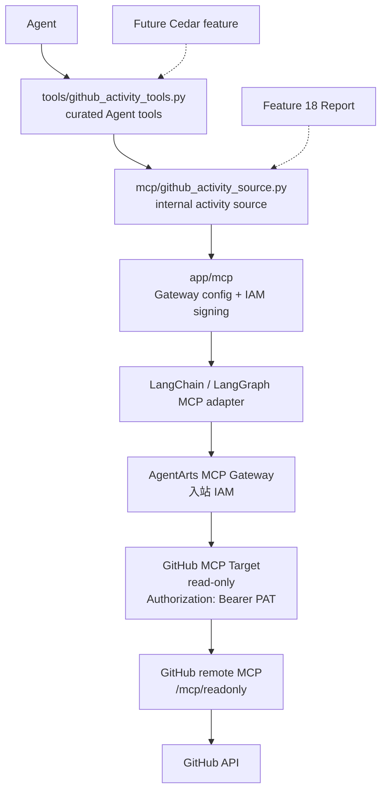

# Feature 17：GitHub MCP Activity Data Source and Tools Implementation Plan

> 状态：Draft  
> 日期：2026-07-17
> 范围：通过 AgentArts MCP Gateway 接入 GitHub 官方 remote MCP，新增 Service 内部 GitHub activity data source 和 curated Agent-visible tools；不新增 Report root capability。

## 1. 概要

本 Feature 实现 **GitHub MCP activity data source 和 curated Agent-visible tools**。它的目标是验证并固化 AgentArts MCP Gateway 的接入方式、凭据链路、Target read-only 配置、GitHub MCP 原子工具映射和统一事件模型，同时让 Agent 可以直接查询 GitHub 工程活动。

本 Feature 不新增报表能力，也不注册 `generate_report`。Service 将 transport-level `github_mcp_*` source functions 与 Agent-facing facade 分层：Agent 只看到 `github_search_activity` 和 `github_get_activity_detail`。Feature 18 直接复用内部 source contract；现在建立 Agent-visible tool surface，则是为未来 AgentArts MCP Gateway Cedar feature 做准备。

设计目标：

- 使用 AgentArts MCP Gateway 连接 GitHub 官方 remote MCP。
- GitHub Target 使用 read-only endpoint 和最小 PAT 权限。
- Service 通过 WAT → STS provider → 临时 IAM 凭据调用 Gateway，不在 Runtime 配置长期 AK/SK。
- 在 `app/mcp/github_activity_source.py` 封装内部 source contract，输出
  `GitHubActivityResult` / `GitHubActivityEvent`。
- 在 `app/tools/github_activity_tools.py` 提供 curated、read-only 的 Agent-facing tools。
- 为 Feature 18 保持稳定、可 mock 的 data source boundary，并为未来 AgentArts MCP Gateway Cedar feature 建立明确的 Agent-visible tool boundary。
- 对 401 / 403 / 429 / Gateway unavailable 等错误做 typed warning 映射。

## 2. 架构边界

图类型：**Component Diagram（组件图）**。用于说明本 Feature 的组件边界。



### 2.1 不做 Report

本 Feature 的输出是 GitHub 工程活动数据源，不是用户可见的报表能力。

```text
本 Feature 新增 Agent-visible tools:
  github_search_activity(...)
  github_get_activity_detail(...)

本 Feature 新增 internal source:
  github_mcp_resolve_identity(...)
  github_mcp_list_repositories(...)
  github_mcp_search_activity(...)
  github_mcp_get_detail(...)

后续 Feature 18 才新增:
  generate_report(...)
```

`github_search_activity` 等 curated tools 直接服务“查询本周仓库工程活动”等非报表意图。Report 意图仍由 Feature 18 的 `generate_report` 统一处理。现在定义稳定的 Agent-visible tool boundary，也是为未来 AgentArts MCP Gateway Cedar feature 做准备；本 Feature 不预设 Cedar 的具体实现。

### 2.2 不替代现有 GitHub local tools

当前 GitHub local tools 继续负责 repository browsing、目录、文件读取、代码搜索和 star。GitHub MCP data source 只补齐 activity timeline。

| 能力 | 本 Feature 处理方式 |
|---|---|
| commits / PR / issue / review / comment activity | 新增 GitHub MCP activity source |
| 直接查询指定 repository / 时间窗口的工程活动 | 新增 curated GitHub activity tools |
| 仓库目录 / 文件读取 / 代码搜索 / star | 继续使用现有 GitHub local tools |
| GitHub 写操作 | 不实现 |
| user-delegated GitHub activity | 不实现，后续单独设计 |

## 3. AgentArts MCP Gateway 配置

`gateway-github-mcp` 与 `target-github-mcp` 在华为云 AgentArts 控制台手动创建和维护。本 Feature 不通过代码创建 / 更新 Gateway 或 Target。

### 3.1 Gateway 入站

| 配置项 | 值 |
|---|---|
| Gateway name | `gateway-github-mcp` |
| 协议类型 | MCP |
| 入站认证 | IAM |
| 网络模式 | 按当前 AgentArts Runtime / Gateway 可达性配置 |

### 3.2 GitHub Target 出站

| 配置项 | 值 |
|---|---|
| Target name | `target-github-mcp` |
| Target URL | `https://api.githubcopilot.com/mcp/readonly` |
| Transport | Streamable HTTP |
| 出站认证类型 | API Key |
| 注入位置 | Header / 请求头 |
| Header name / 参数名称 | `Authorization` |
| Prefix / 前缀 | `Bearer` |
| Secret value / API Key 值 | `<GitHub PAT>` |
| 实际出站 header | `Authorization: Bearer <GitHub PAT>` |

若 AgentArts Target 支持自定义 header，额外配置：

| Header | 值 | 用途 |
|---|---|---|
| `X-MCP-Readonly` | `true` | 明确只读模式 |
| `X-MCP-Toolsets` | `repos,issues,pull_requests` | 限制到工程活动所需 toolsets |

GitHub PAT 优先使用 fine-grained PAT，并限制到本项目需要读取的 repository；权限只授予 Metadata read、Contents read、Issues read、Pull requests read 等只读权限。若只能使用 classic PAT，必须在 staging 配置中明确权限范围和 demo 边界。

## 4. Gateway 入站 IAM 签名凭据路径

图类型：**Data Flow / Trust Boundary Diagram（数据流 / 信任边界图）**。用于说明 Service 调 Gateway 的凭据流。

```mermaid
flowchart LR
    Request["Web Chat request"] --> Runtime["AgentArts Runtime"]
    Runtime -->|"inject header"| WAT["X-HW-AgentGateway-Workload-Access-Token"]
    WAT --> Context["AgentArtsRuntimeContext"]
    Context --> Identity["AgentArts Identity<br/>STS provider"]
    Identity --> STS["Temporary IAM credentials"]
    STS --> Signer["HuaweiCloud API signing SDK"]
    Signer --> Gateway["AgentArts MCP Gateway"]
```



Production Runtime：

- Web Chat 请求进入 Service 时，AgentArts Gateway 已向 Runtime 容器注入 `X-HW-AgentGateway-Workload-Access-Token`。
- `main.py` 按现有架构将该 header 写入 `AgentArtsRuntimeContext`。
- GitHub MCP source 通过 AgentArts Identity STS provider 获取临时 IAM 凭据。
- Service 使用华为云 API signing SDK 对调用 `GITHUB_MCP_GATEWAY_URL` 的 HTTP 请求签名。

本地开发：

- 没有 `X-HW-AgentGateway-Workload-Access-Token` header 时，沿用现有 SDK fallback。
- SDK 从 `.agent_identity.json` / customer-owned local workload 获取 WAT，再向 AgentArts Identity 换取 STS 临时凭据。
- 真实连云调试前，先按 `personal-assistant-meta/architecture/cloud-service/huaweicloud/agent-identity.md` 创建或验证 `pa-local-jwt-workload`。

禁止事项：

- 不把长期 AK/SK 放进 `.agentarts_config.yaml`、`.env`、tool schema、日志或 LLM-visible error。
- 若手动 smoke test 需要 `HUAWEICLOUD_SDK_AK` / `HUAWEICLOUD_SDK_SK`，仅限本地 CLI / helper script 使用，不作为 Service 默认运行路径。

## 5. Service 侧变更

### 5.1 新增配置

新增 typed settings：

| Setting | 说明 |
|---|---|
| `GITHUB_MCP_ENABLED` | 是否启用 GitHub MCP data source |
| `GITHUB_ACTIVITY_TOOLS_ENABLED` | 是否向 Agent 暴露两个 curated GitHub activity tools |
| `GITHUB_MCP_GATEWAY_URL` | 已创建 Gateway 的 MCP endpoint |
| `GITHUB_MCP_AUTH_MODE` | 首期固定为 `iam` |
| `GITHUB_MCP_STS_PROVIDER_NAME` | 用于获取临时 IAM 凭据的 AgentArts Identity STS provider |
| `GITHUB_MCP_TIMEOUT_SECONDS` | Gateway / MCP 调用 timeout |

### 5.2 新增 `app/mcp/`

`app/mcp/` 只做薄封装：

- 读取 GitHub MCP settings；
- 构造 MCP adapter client；
- 注入 IAM signed headers；
- 执行 `tools/list` capability check；
- 统一 timeout / retry / error mapping；
- 过滤 credential，不让 token、PAT、AK/SK、签名 header 进入日志和 tool result。

Service 连接 AgentArts MCP Gateway 时优先评估 `langchain-mcp-adapters`。项目内不自实现 MCP 协议。

### 5.3 新增 `app/mcp/github_activity_source.py`

内部 source functions：

| Function | 职责 |
|---|---|
| `github_mcp_resolve_identity` | 调 `get_me`，解析 platform GitHub account |
| `github_mcp_list_repositories` | 搜索 / 枚举平台账号可见仓库，隐藏归档或不可访问仓库 |
| `github_mcp_search_activity` | 按时间窗口、repository、actor、event type 聚合 commits / PR / issues / reviews / comments |
| `github_mcp_get_detail` | 对 commit / PR / issue 拉取详情、评论、review、文件变更和统计信息 |

这些 functions 是 transport-aware 的 Service internal source，不使用 `@tool` 装饰器、不导出任何 `*_TOOLS` 集合，也不加入 `build_tools()`。Feature 18、Agent-facing facade 和其他内部编排代码均直接调用这层 contract。

### 5.4 新增 `app/tools/github_activity_tools.py`

Agent-facing facade：

| Tool | 职责 |
|---|---|
| `github_search_activity` | 查询指定 repository、时间窗口和 event types 的工程活动 |
| `github_get_activity_detail` | 展开单条 commit / PR / issue activity 的详情 |

本模块导出 `GITHUB_ACTIVITY_TOOLS`。仅当 `GITHUB_MCP_ENABLED=true` 且
`GITHUB_ACTIVITY_TOOLS_ENABLED=true` 时，`build_tools()` 才注册该集合。facade
只负责 LLM-friendly 参数校验、调用 internal source 和安全序列化，不包含 MCP
transport、IAM signing 或数据聚合实现。

以下边界必须由代码和测试共同保证：

- `build_tools()` 只注册 curated domain tools，不注册任何 `github_mcp_*` function。
- GitHub remote MCP 的 `get_me`、`list_commits`、`pull_request_read` 等原子工具不直接暴露给 Agent。
- tool description 和 result 明确数据来自 platform GitHub account，使用 `identity_scope = platform`。
- `GITHUB_MCP_ENABLED=false` 时不注册 `GITHUB_ACTIVITY_TOOLS`，即使
  `GITHUB_ACTIVITY_TOOLS_ENABLED=true`。
- `GITHUB_ACTIVITY_TOOLS_ENABLED=false` 时只保留 internal source，不注册
  `GITHUB_ACTIVITY_TOOLS`。

## 6. 数据模型

`GitHubActivityQuery` 封装时间窗口、repository、event types、limit / cursor 等查询条件；`GitHubActivityResult` 封装 `events`、`warnings`、`next_cursor` 和固定为 `platform` 的 `identity_scope`。Feature 18 依赖这些 typed models，不解析 Agent tool 的序列化结果。

`GitHubActivityEvent`：

| 字段 | 说明 |
|---|---|
| `provider` | 固定为 `github`，保留字段用于后续扩展其他代码平台 |
| `event_type` | `commit`、`pull_request`、`issue`、`review`、`comment` |
| `repository` | 仓库 full name |
| `external_id` | 第三方平台 ID / number / sha |
| `title` | 活动标题 |
| `url` | 原始平台链接 |
| `actor` | 活动发起人 |
| `state` | open / closed / merged 等 |
| `created_at` / `updated_at` | 时间戳 |
| `summary` | 面向后续报表的短摘要 |
| `metrics` | additions、deletions、changed_files、comment_count 等可选指标 |

`github_mcp_search_activity` 输入示例：

```json
{
  "start_at": "2026-07-01T00:00:00+08:00",
  "end_at": "2026-07-08T23:59:59+08:00",
  "timezone": "Asia/Shanghai",
  "provider": "github",
  "repositories": ["git-malu/personal-assistant"],
  "actor": "platform",
  "event_types": ["commit", "pull_request", "issue", "review", "comment"],
  "limit": 100,
  "cursor": null
}
```

## 7. 官方 MCP 原子工具映射

官方 GitHub MCP Server 暴露 GitHub API 级别的原子工具；Service 通过 source wrapper 做聚合和归一化。

| GitHub activity source function | 调用的官方 GitHub MCP 原子工具 | 聚合职责 |
|---|---|---|
| `github_mcp_resolve_identity` | `get_me` | 获取 GitHub MCP Target 平台授权身份，用于 `actor = platform` 和活动归因 |
| `github_mcp_list_repositories` | `search_repositories`，以及 runtime `tools/list` 中可用的 repository listing 工具 | 根据关键词、更新时间和权限范围筛选候选仓库 |
| `github_mcp_search_activity` | commits: `list_commits` / `get_commit`；pull requests: `list_pull_requests` / `search_pull_requests` / `pull_request_read`；issues: `list_issues` / `search_issues` / `issue_read`；actions 可选：`actions_list` / `actions_get` | 按时间窗口、仓库、actor、event type 聚合活动 |
| `github_mcp_get_detail` | `get_commit`、`pull_request_read`、`issue_read`，以及 runtime 中可用的 comments / reviews / files 相关只读工具 | 对单条活动拉取详情 |

`github_mcp_search_activity` 聚合流程：

1. 将 `start_at` / `end_at` 按 `timezone` 归一化为 UTC 时间窗口。
2. 调用 `github_mcp_resolve_identity` 解析 GitHub MCP Target 平台授权身份；当 `actor = "platform"` 时，用该 login 过滤 commits、PR、issues、reviews 和 comments。
3. 如果没有指定 `repositories`，先调用 `github_mcp_list_repositories` 获取候选仓库。
4. 按 `event_types` 分批调用官方 MCP 原子工具；每类数据独立分页。
5. 对列表结果先做轻量过滤；只有需要展开时，才调用 detail tools。
6. 将不同原始对象映射为统一 `GitHubActivityEvent`。

## 8. 测试计划

### 8.1 单元测试

- Agent-facing tool schema 不包含 `access_token`、`api_key`、`secret`、PAT、AK/SK、STS 或 MCP transport 字段。
- `github_search_activity` / `github_get_activity_detail` 正确转换输入并复用 internal source。
- tool result 包含 `identity_scope = platform`，且不把 platform account 表述为当前用户身份。
- `github_mcp_search_activity` 正确处理：
  - 时间窗口；
  - provider 固定为 `github`；
  - repository filter；
  - actor = `platform`；
  - event type filter；
  - limit / cursor。
- GitHub mock 覆盖 commits、pull requests、issues、reviews、comments、分页、401、403、429。

### 8.2 集成测试

- `GITHUB_MCP_ENABLED=true` 时，Service 可以初始化 GitHub MCP source。
- `GITHUB_MCP_ENABLED=true` 且 `GITHUB_ACTIVITY_TOOLS_ENABLED=true` 时，
  `build_tools()` 包含 `github_search_activity` 和 `github_get_activity_detail`。
- `GITHUB_MCP_ENABLED=false` 时，`build_tools()` 不包含 GitHub activity tools，
  即使 exposure switch 为 `true`。
- `GITHUB_ACTIVITY_TOOLS_ENABLED=false` 时，`build_tools()` 不包含 GitHub
  activity tools，但 internal source 仍由 `GITHUB_MCP_ENABLED` 控制。
- `build_tools()` 不包含任何 `github_mcp_*` function 或 GitHub remote MCP 原子工具。
- GitHub MCP source 启动检查确认 Gateway Target 使用 read-only endpoint 或 `X-MCP-Readonly: true`。
- 不提供通用 raw MCP tool passthrough。
- Gateway unavailable 降级为 unavailable warning。
- `GITHUB_MCP_AUTH_MODE=iam` 时，缺少 `GITHUB_MCP_STS_PROVIDER_NAME`、STS 兑换失败或 IAM 签名返回 401 / 403，均映射为 typed warning。

### 8.3 E2E / Staging 验证

- Production Runtime 请求路径能从 `X-HW-AgentGateway-Workload-Access-Token` 进入 `AgentArtsRuntimeContext`，并通过 `GITHUB_MCP_STS_PROVIDER_NAME` 换取临时 IAM 凭据完成 Gateway 调用。
- Gateway Target 指向 `https://api.githubcopilot.com/mcp/readonly`，或等效配置 `X-MCP-Readonly: true`。
- Gateway Target 注入 `Authorization: Bearer <GitHub PAT>`，PAT 使用只读最小权限。
- `github_mcp_search_activity` 能返回 staging repository 的 commits / PR / issues。
- Agent 可以通过 `github_search_activity` 直接查询 staging repository 的工程活动。
- token、PAT、AK/SK、STS、签名 header 不进入 SSE、日志、tool result 或 LLM-visible error。

## 9. 预期项目文件目录

```text
personal-assistant/
├── personal-assistant-meta/
│   ├── issues/features/backlog/feature-17-github-mcp-data-source/
│   │   ├── issue.md
│   │   └── plan.md
│   ├── specs/
│   │   ├── overall_specifications.md   # 修改：登记 GitHub MCP activity data source
│   │   └── dictionary.md               # 修改：补充 GitHubActivityEvent / GitHub MCP 术语
│   └── architecture/
│       ├── overall_architecture.md      # 修改：登记 AgentArts MCP Gateway data source
│       └── backend_architecture.md      # 修改：补充 app/mcp 与 GitHub MCP source
└── personal-assistant-service/
    ├── app/
    │   ├── mcp/
    │   │   ├── __init__.py
    │   │   ├── gateway_client.py
    │   │   └── github_activity_source.py # 4 个 internal source functions
    │   ├── tools/
    │   │   ├── __init__.py             # 修改：条件注册 GITHUB_ACTIVITY_TOOLS
    │   │   └── github_activity_tools.py # curated Agent-facing facade
    │   └── settings.py                  # 修改：新增 GitHub MCP typed settings
    └── tests/
        ├── test_github_activity_source.py
        ├── test_github_activity_tools.py
        └── test_mcp_gateway_auth.py
```

## 10. 完成后交付给后续 Feature 的边界

### 10.1 Feature 18 internal source contract

Feature 18 只依赖以下稳定 internal source contract：

- `github_mcp_search_activity(GitHubActivityQuery) -> GitHubActivityResult`；
- `github_mcp_get_detail(GitHubActivityRef) -> GitHubActivityDetail`；
- source unavailable / partial failure 以 typed warning 表达；
- GitHub MCP source 不泄露 credential；
- `actor = platform` 表示 PAT / platform GitHub account。

Agent-facing `github_search_activity` / `github_get_activity_detail` 是 internal source 的消费者，但不属于 Feature 18 的依赖契约。其他 Service 内部编排也可以复用 source contract，而不耦合 LangChain tool schema。

### 10.2 未来 AgentArts MCP Gateway Cedar feature 准备

本 Feature 提前建立以下 Agent-visible tool boundary，供未来 Cedar feature 延续：

- Agent 只看到 curated `github_search_activity` / `github_get_activity_detail`，不看到 raw MCP 原子工具；
- tool schema 不包含 credential 或 MCP transport 参数；
- tool result 明确 `identity_scope = platform`；
- `GITHUB_MCP_ENABLED` 控制 internal source，`GITHUB_ACTIVITY_TOOLS_ENABLED`
  控制 Agent exposure；只有两者同时为 `true` 才注册 tools。

本 Feature 只准备稳定的 tool exposure boundary，不实现或推测 Cedar 的具体行为。
