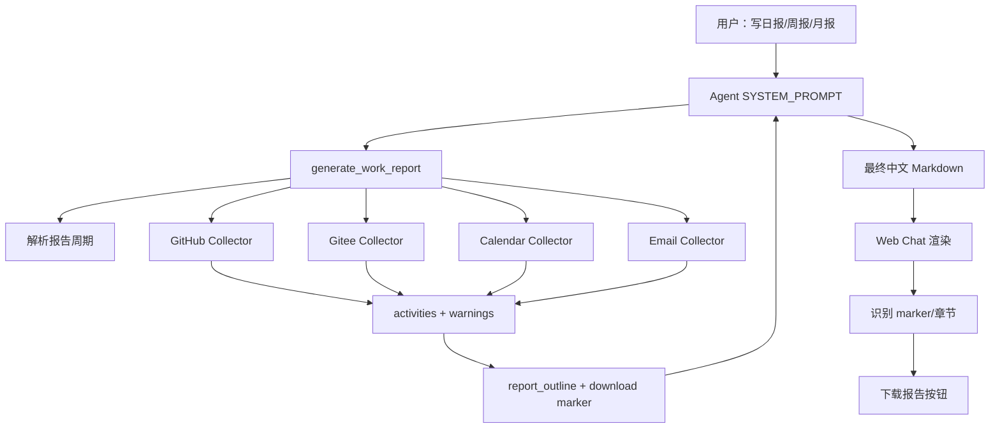
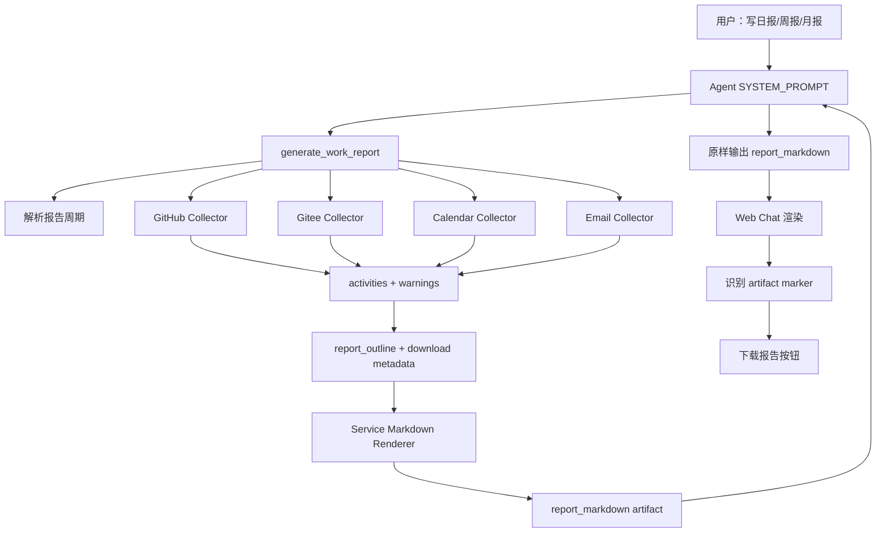
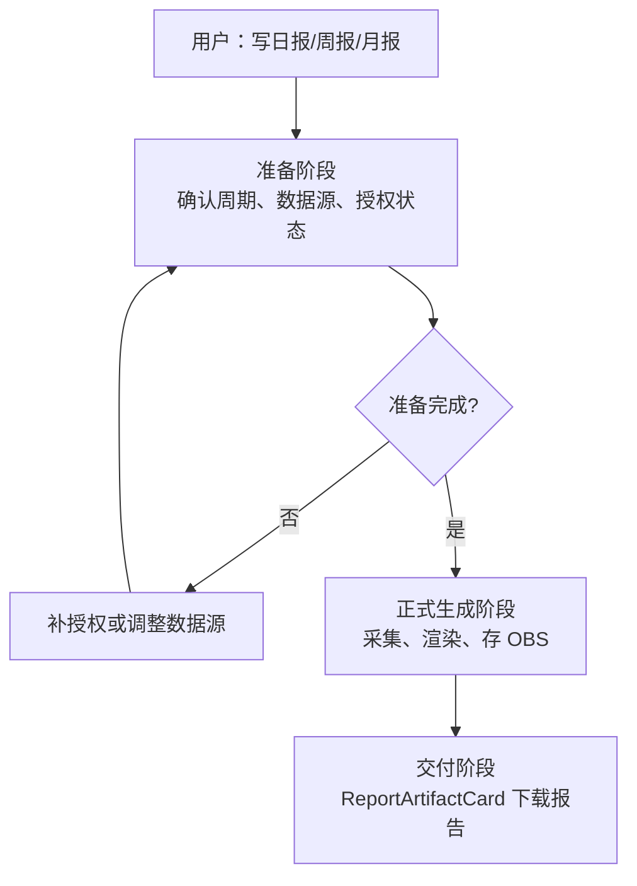

# 工作报告功能

当前 Personal Assistant 已支持 GitHub、Gitee、Microsoft 365 Calendar、Microsoft 365 Email 等工具操作，但缺少一个统一的工作报告生成能力。

## 1. 功能目标

工作报告功能用于在 Web Chat 中根据用户已授权的数据源生成个人工作报告：

- 日报：`daily`
- 周报：`weekly`
- 月报：`monthly`

**报告数据来源包括：**

- GitHub
- Gitee
- Microsoft 365 Calendar
- Microsoft 365 Email

**报告内容章节示例：**

```md
# 本周周报

## 概览

- 报告周期：2026-06-29 至 2026-07-06（不含结束日，Asia/Shanghai）。
- 本期共采集 GitHub 8 条、Gitee 2 条、Calendar 5 条、Email 10 条。

## 完成事项

- [github/commit] owner/repo 完成报告工具注册

## 代码与交付

...

## 会议与沟通

...

## 风险/阻塞

...

## 下一步计划

...

## 数据来源与缺口

...
```

报告生成工具有三个候选方案：

三个方案的主要区别在于**“报告正文由谁来写、授权准备何时发生、报告文件是否成为一等 artifact”**。

**方案一：Agent 写报告。** Service 负责收集并整理 GitHub、Gitee、日历、邮件中的工作素材，生成 evidence 和报告提纲；Agent 再像助理一样，根据这些素材写出最终中文日报、周报或月报。用户看到的报告会更自然，也更容易根据对话上下文调整表达。

**方案二：Service 写报告。** Service 在收集完数据后，直接按照固定模板生成完整 `report_markdown`；Agent 只负责把这份报告原样展示给用户。用户看到的报告格式会更稳定，但表达更模板化，后续想调整语气或改写内容时灵活性较弱。

**方案三：准备阶段 + Service 生成 OBS artifact。** Agent 先和用户确认报告周期与数据源；Service 检查所选数据源授权状态，未授权时先引导用户完成授权。只有用户选择的数据源全部 ready 后，Service 才采集数据、生成 Markdown，并上传为私有 OBS artifact。前端收到结构化 artifact metadata 后，在聊天窗口展示可下载的报告文件卡片。

三种方案都通过前端提供下载保存能力。方案一和方案二的报告保存按钮应作为报告消息的专用操作区展示在报告正文下方，避免在用户阅读报告前打断正文内容；方案三则通过 `ReportArtifactCard` 展示结构化文件下载入口。

## 2. 总体架构

本 issue 对比三个候选方案。原始设计选择方案一：Service 返回 evidence 和 outline，由 Agent 渲染最终报告；方案二是备选方案：Service 直接渲染完整 `report_markdown`，Agent 原样交付。方案三是在 review 阶段新增的候选方案，强调“准备阶段”和“正式生成阶段”分离，并把报告作为结构化 artifact 管理。

### 2.1 方案一：Agent 渲染报告（主方案）



### 2.2 方案二：Service 直接渲染报告



方案二的关键差异是：报告正文由 Service 的 Markdown 渲染生成，`generate_work_report` 返回完整 `report_markdown`；Agent 不再基于 evidence 自由组织正文，而是按 prompt 原样输出内容。

### 2.3 方案三：准备阶段 + OBS Artifact（新增评估方案）



方案三的关键差异是：报告生成前必须先完成数据源选择和授权准备。第一阶段推荐使用 Authorization Preflight + 一个聚合型 `ReportPreparationCard`：Service 先检查已选 source 的授权状态，前端在一个准备面板里展示 ready / missing source；正式生成阶段的各 source collector 仍保留单 source auth gate 作为兜底。不推荐在一个大 tool 上堆多个 `@require_access_token`。正式生成阶段不再依赖前端解析 Markdown marker，而是由 Service 返回结构化 `report_artifact`，前端用专用 artifact card 展示下载入口。详细设计见 [`plan3/artifact-workflow-design.md`](plan3/artifact-workflow-design.md)。

## 3. 方案对比与选择依据

本特性有三个候选方案：

- **方案一：Agent 渲染报告**。Service 的 `generate_work_report` 负责采集活动 evidence、生成 `report_outline` 和下载 marker，Agent 根据 evidence 输出最终中文 Markdown 报告。
- **方案二：Service 直接渲染报告**。Service 的 `generate_work_report` 不只返回 evidence 和 outline，还直接生成完整 `report_markdown`，Agent 主要负责原样交付。
- **方案三：准备阶段 + OBS Artifact**。Agent 先确认数据源；Service 先完成授权准备，再生成确定性 Markdown artifact 并存储到 OBS，前端按结构化 artifact metadata 渲染文件卡片。

### 3.1 核心技术差异

| 维度 | 方案一：Agent 渲染报告 | 方案二：Service 直接渲染报告 | 方案三：准备阶段 + OBS Artifact |
|---|---|---|---|
| 报告正文生成者 | Agent 根据 evidence 生成 | Service 根据确定性模板生成 | Service 生成 canonical Markdown；Agent 负责意图、解释和后续改写 |
| Agent 责任 | 调工具、理解 evidence、撰写报告 | 调工具、原样交付报告 | 确认周期和数据源，解释授权状态，触发 prepare / generate |
| Service 责任 | 采集、归一化、生成 outline 和下载 marker | 采集、归一化、生成 outline、下载 marker 和完整 Markdown | 授权 preflight、采集、限流、渲染、上传 OBS、返回 artifact metadata |
| 输出稳定性 | 依赖 LLM 遵守 prompt | 更稳定，可测试性更强 | 最稳定；下载文件不依赖 LLM 保留 marker |
| 授权体验 | 生成过程中遇到缺授权 source 后降级 | 生成过程中遇到缺授权 source 后降级 | 生成前先完成用户选择的数据源授权 |
| 表达灵活性 | 高，适合结合上下文组织自然语言 | 中等，容易模板化 | artifact 稳定；可在聊天中额外提供自然语言摘要或改写 |
| 后端复杂度 | 中等 | 更高，需要维护中文报告 renderer | 最高，需要 OBS artifact、metadata、下载鉴权和清理 |
| 幻觉风险 | 通过 evidence、prompt 和 warnings 约束降低 | 更低，因为正文由模板生成 | 更低，报告文件由确定性 renderer 生成，Agent 不直接拼接下载正文 |

### 3.2 前端 UX 差异

| 维度 | 方案一 UX | 方案二 UX | 方案三 UX |
|---|---|---|---|
| 报告识别 | marker 优先，章节 fallback 较重要 | marker 是主协议，fallback 仅作为兼容策略 | 结构化 `report_artifact` 是主协议 |
| 授权准备 | 可能在生成中途出现 AuthCard | 可能在生成中途出现 AuthCard | 先展示数据源选择和授权准备面板 |
| 报告正文稳定性 | 依赖 Agent 输出格式 | Service renderer 保证固定格式 | OBS 中的 Markdown artifact 稳定 |
| 下载文件内容 | 保存 Agent 最终消息 | 保存 Service 渲染的报告内容 | 下载私有 OBS artifact 或经后端鉴权转发的文件 |
| 错误反馈 | 以保存成功、取消为主 | 更适合增加失败态和重试 | 支持生成失败、上传失败、链接过期和重新生成 |
| 前端职责 | 需要兼容 Agent 输出波动 | 更像报告查看器 | 更像 artifact viewer，展示文件状态、过期时间和下载入口 |

### 3.3 方案二的优点与缺点

方案二优点：

- 报告格式稳定，可通过 unit tests 精确断言。
- Agent 幻觉风险更低。
- 下载 marker 和正文结构由同一个 Service renderer 保证。
- 前端 fallback 识别压力更小，因为 Markdown 格式更可控。

方案二缺点：

- Service 需要承担自然语言模板维护成本。
- 报告表达不如 LLM 灵活，容易显得模板化。
- 后端需要处理更多中文文案、排序、去重和摘要策略。
- 如果未来要个性化语气或根据上下文补充计划，Service 模板会变复杂。

### 3.4 原始选择结果

本 issue 原始设计选择 **方案一：Agent 渲染报告** 作为当前实现方案，方案二保留为对比方案和后续备选。方案三加入后，需要重新确认 Feature 17 的 v1 目标：是快速验证 Agent 基于多源 evidence 写报告，还是交付可授权、可下载、可追踪的工作报告 artifact。

原始选择方案一的原因：

- Personal Assistant 的报告是对话式工作总结，用户更关心自然、可读、能结合上下文的表达，而不是固定模板填空。
- Service 已经返回结构化 evidence、warnings、source counts 和固定 outline，可以通过 prompt 约束 Agent 不编造内容。
- 方案一的 Service 复杂度更低，不需要在后端维护一套中文 Markdown 渲染。
- 方案一更容易后续扩展到“请写得正式一点”“帮我压缩成三点”“面向老板改写”等对话式需求。
- 前端下载能力可以通过稳定 marker 支持，不要求 Service 直接生成完整报告正文。

原始设计不选择方案二作为 v1 主方案的原因：

- Service renderer 会把自然语言组织逻辑固化到后端，后续个性化表达和上下文改写成本更高。
- 工作报告不是严格结构化报表，过强模板化会降低个人助理的对话体验。
- 方案二虽然输出更稳定，但会显著增加后端报告模板、中文措辞和边界场景维护成本。

方案二适合对报告格式稳定性、审计性和可测试性要求更高的场景。如果后续产品更重视“每次报告格式一致、证据严格可追踪”，可以重新评估方案二；如果更重视“报告像真人写的总结”，方案一更合适。

### 3.5 方案三的优点与缺点

方案三优点：

- 授权体验清晰：用户先确认使用哪些数据源，再逐项授权；正式生成阶段不再突然跳过 source。
- 下载协议清晰：前端不解析 Markdown 注释，不依赖 Agent 保留 marker。
- 报告文件可跨设备、可重新下载，并能设置过期清理策略。
- OBS artifact 与后续会议纪要、邮件草稿、表格导出等 Agent 生成物模式一致。
- 更符合“事实由 Service 管、表达由 Agent 管”的边界。

方案三缺点：

- 需要新增 OBS bucket / object key 规范 / 生命周期清理。
- 需要新增 artifact metadata、下载鉴权或短期签名 URL。
- 前端需要新增 `ArtifactCard` / `ReportArtifactCard`，并支持准备阶段的多 source 授权状态。
- 实现范围比方案一、方案二更大，不适合只做一次前端本地下载的轻量 MVP。

### 3.6 新增评估结论

方案三是更完整、更产品化的设计，但也引入更多基础设施和权限表面积。若 Feature 17 的 v1 目标是交付“可靠的工作报告 artifact”，建议选择方案三；若 v1 目标只是快速验证“Agent 能根据多源 evidence 写报告”，方案一仍可作为轻量原型。无论选择哪种 v1，都不建议把未授权 source 静默跳过作为默认行为；至少应先让用户确认数据源选择和授权状态。

> 说明：下方 §4 保留当前 PR 原始轻量 v1 的授权验收标准。如果产品决定把 v1 切换为方案三，应同步调整 §4：从“非阻塞、部分可用”改为“先确认数据源，再完成已选 source 授权，最后生成 artifact”。

## 4. v1 授权体验与验收标准

### 4.1 产品决策

当前 PR 原始 v1 采用**非阻塞、部分可用**的授权体验：

- 报告生成会尝试采集默认数据源：GitHub、Gitee、Microsoft 365 Calendar、Microsoft 365 Email。
- 遇到未授权 source 时，底层 OAuth 工具会触发对应 provider 的 `auth_required` 事件，前端通过 AuthCard 展示授权入口。
- 授权失败的 source，不阻塞报告生成，但必须写入报告的“数据来源与缺口”章节，避免用户误以为所有数据源都已成功采集。

### 4.2 当前实现约束

当前前端授权卡片实现存在单 messageId 单卡限制：如果多个 source 都未授权，在授权完成时，后授权的 UI 会覆盖先前授权完成的 UI，用户界面上可能只看到最后一个 provider 的授权入口。

### 4.3 Acceptance Criteria

当前 PR 原始 v1 授权体验必须满足以下验收标准：

- 当用户请求生成日报、周报或月报时，系统会尝试采集默认 source，而不是预先阻塞要求用户完成所有授权。
- 任一 source 未授权时，系统必须触发该 source 对应 provider 的授权流程。
- 任一 source 授权失败时，本轮报告仍应基于其他已授权 source 生成可用的部分报告。
- 所有因授权失败而跳过的 source，必须写入“数据来源与缺口”章节。
- v1 不要求同一 assistant message 下多 AuthCard 并存；多 provider 授权入口聚合或多卡片展示作为后续 UX 增强项。

### 4.4 后续改进方向

- 支持同一 assistant message 下多个 AuthCard 并存。
- 将多个 provider 授权请求合并为一个“待授权数据源列表”。
- 在报告下载卡片或报告顶部增加“本次已采集 / 授权失败 source”摘要。
- 授权完成后提供“重新生成报告”快捷操作。

