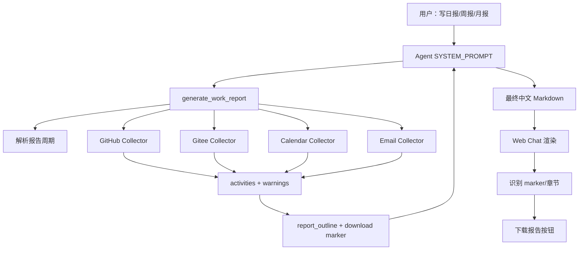
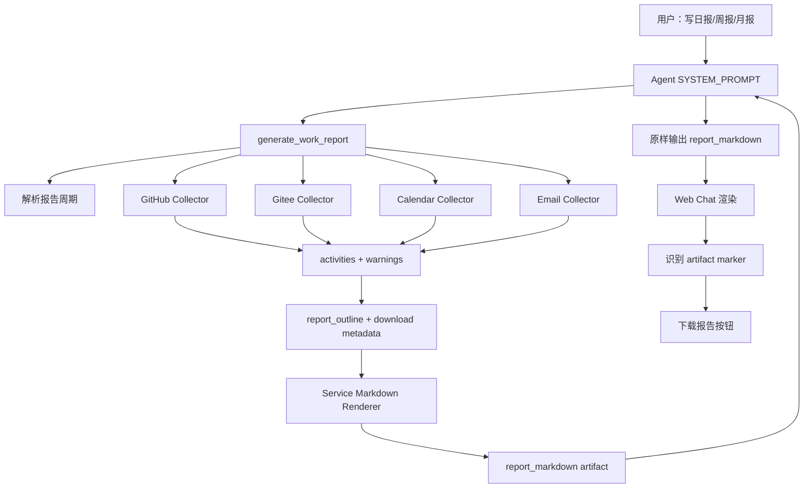

# 工作报告功能

当前 Personal Assistant 已支持 GitHub、Gitee、Microsoft 365 Calendar、Microsoft 365 Email 等工具操作，但缺少一个统一的工作报告生成能力。

## 1. 功能目标

工作报告功能用于在 Web Chat 中根据用户已授权的数据源生成个人工作报告：

- 日报：`daily`
- 周报：`weekly`
- 月报：`monthly`

**报告数据来源包括：**

- GitHub
- Gitee
- Microsoft 365 Calendar
- Microsoft 365 Email

**报告内容章节示例：**

```md
# 本周周报

## 概览

- 报告周期：2026-06-29 至 2026-07-06（不含结束日，Asia/Shanghai）。
- 本期共采集 GitHub 8 条、Gitee 2 条、Calendar 5 条、Email 10 条。

## 完成事项

- [github/commit] owner/repo 完成报告工具注册

## 代码与交付

...

## 会议与沟通

...

## 风险/阻塞

...

## 下一步计划

...

## 数据来源与缺口

...
```

报告生成工具有两个候选方案：

两个方案的主要区别在于**“报告正文由谁来写”**。

**方案一：Agent 写报告。** Service 负责收集并整理 GitHub、Gitee、日历、邮件中的工作素材，生成 evidence 和报告提纲；Agent 再像助理一样，根据这些素材写出最终中文日报、周报或月报。用户看到的报告会更自然，也更容易根据对话上下文调整表达。

**方案二：Service 写报告。** Service 在收集完数据后，直接按照固定模板生成完整 `report_markdown`；Agent 只负责把这份报告原样展示给用户。用户看到的报告格式会更稳定，但表达更模板化，后续想调整语气或改写内容时灵活性较弱。

两种方案都通过前端提供下载保存能力。

## 2. 总体架构

本 issue 对比两个候选方案。**方案一是当前选择的实现方向**：Service 返回 evidence 和 outline，由 Agent 渲染最终报告；方案二是备选方案：Service 直接渲染完整 `report_markdown`，Agent 原样交付。

### 2.1 方案一：Agent 渲染报告（主方案）



### 2.2 方案二：Service 直接渲染报告



方案二的关键差异是：报告正文由 Service 的 Markdown 渲染生成，`generate_work_report` 返回完整 `report_markdown`；Agent 不再基于 evidence 自由组织正文，而是按 prompt 原样输出内容。

## 3. 方案对比与选择依据

本特性有两个候选方案：

- **方案一：Agent 渲染报告**。Service 的 `generate_work_report` 负责采集活动 evidence、生成 `report_outline` 和下载 marker，Agent 根据 evidence 输出最终中文 Markdown 报告。
- **方案二：Service 直接渲染报告**。Service 的 `generate_work_report` 不只返回 evidence 和 outline，还直接生成完整 `report_markdown`，Agent 主要负责原样交付。

### 3.1 核心技术差异

| 维度 | 方案一：Agent 渲染报告 | 方案二：Service 直接渲染报告 |
|---|---|---|
| 报告正文生成者 | Agent 根据 evidence 生成 | Service 根据确定性模板生成 |
| Agent 责任 | 调工具、理解 evidence、撰写报告 | 调工具、原样交付报告 |
| Service 责任 | 采集、归一化、生成 outline 和下载 marker | 采集、归一化、生成 outline、下载 marker 和完整 Markdown |
| 输出稳定性 | 依赖 LLM 遵守 prompt | 更稳定，可测试性更强 |
| 表达灵活性 | 高，适合结合上下文组织自然语言 | 中等，容易模板化 |
| 后端复杂度 | 中等 | 更高，需要维护中文报告 renderer |
| 幻觉风险 | 通过 evidence、prompt 和 warnings 约束降低 | 更低，因为正文由模板生成 |

### 3.2 前端 UX 差异

| 维度 | 方案一 UX | 方案二 UX |
|---|---|---|
| 报告识别 | marker 优先，章节 fallback 较重要 | marker 是主协议，fallback 仅作为兼容策略 |
| 报告正文稳定性 | 依赖 Agent 输出格式 | Service renderer 保证固定格式 |
| 下载文件内容 | 保存 Agent 最终消息 | 保存 Service 渲染的报告内容 |
| 错误反馈 | 以保存成功、取消为主 | 更适合增加失败态和重试 |
| 前端职责 | 需要兼容 Agent 输出波动 | 更像报告查看器 |

### 3.3 方案二的优点与缺点

方案二优点：

- 报告格式稳定，可通过 unit tests 精确断言。
- Agent 幻觉风险更低。
- 下载 marker 和正文结构由同一个 Service renderer 保证。
- 前端 fallback 识别压力更小，因为 Markdown 格式更可控。

方案二缺点：

- Service 需要承担自然语言模板维护成本。
- 报告表达不如 LLM 灵活，容易显得模板化。
- 后端需要处理更多中文文案、排序、去重和摘要策略。
- 如果未来要个性化语气或根据上下文补充计划，Service 模板会变复杂。

### 3.4 选择结果

本 issue 选择 **方案一：Agent 渲染报告** 作为当前实现方案，方案二保留为对比方案和后续备选。

选择方案一的原因：

- Personal Assistant 的报告是对话式工作总结，用户更关心自然、可读、能结合上下文的表达，而不是固定模板填空。
- Service 已经返回结构化 evidence、warnings、source counts 和固定 outline，可以通过 prompt 约束 Agent 不编造内容。
- 方案一的 Service 复杂度更低，不需要在后端维护一套中文 Markdown 渲染。
- 方案一更容易后续扩展到“请写得正式一点”“帮我压缩成三点”“面向老板改写”等对话式需求。
- 前端下载能力可以通过稳定 marker 支持，不要求 Service 直接生成完整报告正文。

不选择方案二作为 v1 主方案的原因：

- Service renderer 会把自然语言组织逻辑固化到后端，后续个性化表达和上下文改写成本更高。
- 工作报告不是严格结构化报表，过强模板化会降低个人助理的对话体验。
- 方案二虽然输出更稳定，但会显著增加后端报告模板、中文措辞和边界场景维护成本。

方案二适合对报告格式稳定性、审计性和可测试性要求更高的场景。如果后续产品更重视“每次报告格式一致、证据严格可追踪”，可以重新评估方案二；如果更重视“报告像真人写的总结”，方案一更合适。

