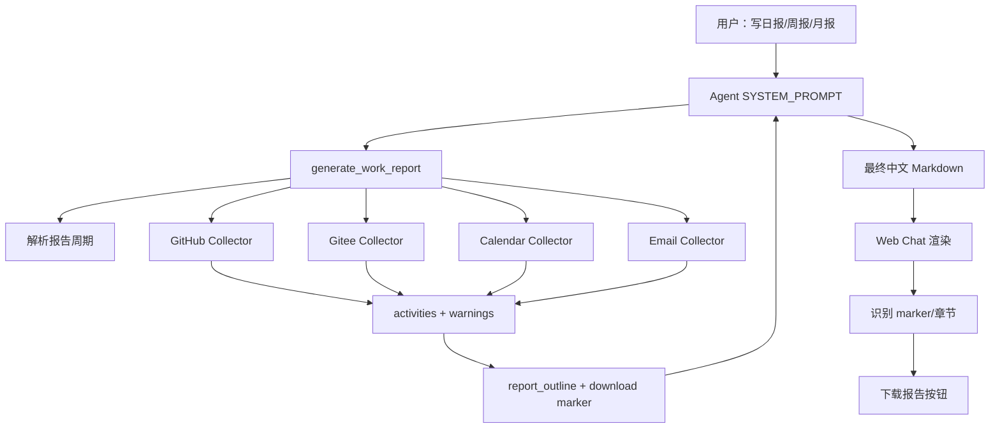

# 工作报告功能设计文档

当前 Personal Assistant 已支持 GitHub、Gitee、Microsoft 365 Calendar、Microsoft 365 Email 等工具操作，但缺少一个统一的工作报告生成能力。

## 1. 功能目标

工作报告功能用于在 Web Chat 中根据用户已授权的数据源生成个人工作报告：

- 日报：`daily`
- 周报：`weekly`
- 月报：`monthly`

报告数据来源包括：

- GitHub
- Gitee
- Microsoft 365 Calendar
- Microsoft 365 Email

后端工具只返回结构化 evidence 与报告提纲，最终中文 Markdown 报告由 Agent 根据 `SYSTEM_PROMPT` 渲染，并提供下载保存功能。

## 2. 相关文件

| 模块 | 文件 | 作用 |
|---|---|---|
| 后端 Report Tool | `personal-assistant-service/app/tools/report_tools.py` | 核心报告生成工具 |
| 后端工具注册 | `personal-assistant-service/app/tools/__init__.py` | 注册 `REPORT_TOOLS` 到 `build_tools()` |
| Agent Prompt | `personal-assistant-service/app/agent_handler.py` | 指导 Agent 调用 report tool 并按模板输出 |
| Email helper | `personal-assistant-service/app/tools/email_tools.py` | 提供内部时间范围邮件读取 |
| 前端下载识别 | `personal-assistant-client/src/lib/work-report-download.ts` | 解析 marker、保存 Markdown |
| 前端下载按钮 | `personal-assistant-client/src/components/chat/WorkReportDownloadButton.tsx` | 渲染“下载报告”按钮 |
| 消息渲染 | `personal-assistant-client/src/components/assistant-ui/thread.tsx` | 将下载按钮接入 assistant 消息 |

## 3. 总体架构



## 4. 后端工具接口

核心工具为：

```python
generate_work_report(
    report_type: Literal["daily", "weekly", "monthly"],
    anchor_date: str | None = None,
    github_repositories: list[str] | None = None,
    gitee_repositories: list[str] | None = None,
    include_sources: list[Literal["github", "gitee", "calendar", "email"]] | None = None,
    max_items_per_source: int = 50,
) -> dict[str, Any]
```

返回结构：

```python
{
    "ok": True,
    "period": {...},
    "activities": [...],
    "source_counts": {...},
    "warnings": [...],
    "report_outline": {...},
}
```

失败场景：

- `report_type` 非法或 `anchor_date` 格式非法：返回 `{"ok": False, "error": "..."}`
- `include_sources` 包含未知来源：返回 `{"ok": False, "error": "Unsupported report sources: ..."}`

## 5. 报告周期解析

由 `resolve_report_period()` 负责：

| 类型 | 时间范围 |
|---|---|
| `daily` | 当天 00:00 到次日 00:00 |
| `weekly` | 所在周一 00:00 到下周一 00:00 |
| `monthly` | 所在自然月 1 日 00:00 到下月 1 日 00:00 |

时区来自 `Settings.graph_timezone`，默认 `Asia/Shanghai`。

`monthly` 支持 `YYYY-MM`，其他类型主要使用 `YYYY-MM-DD`。

## 6. Activity 数据模型

报告功能内部用来统一表示一条工作活动的数据结构。所有来源会被归一化为统一 activity：

```python
{
    "source": "github" | "gitee" | "calendar" | "email",
    "kind": "commit" | "pull_request" | "issue" | "meeting" | "email_sent" | "email_received",
    "title": str,
    "occurred_at": str | None,
    "confidence": "explicit" | "inferred",
    "summary": str,
    "repository": str | None,
    "url": str | None,
    "actor": str | None,
    "status": str | None,
    "metadata": dict,
}
```

语义约定：

- `explicit`：代码提交、PR、issue、已发送邮件等明确行为
- `inferred`：日历会议、收件箱邮件等只能推断参与或沟通的行为

## 7. 数据采集设计

### GitHub

流程：

1. 调用 `/user` 获取当前用户 login。
2. 如果未指定仓库，调用 `/user/repos` 获取近期仓库。
3. 对每个仓库读取 commits：
   - `/repos/{owner}/{repo}/commits`
   - 使用 `since`、`until`、`author=login`
4. 搜索 PR 和 issue：
   - `/search/issues`
   - query 使用 `type:pr` / `type:issue`
   - 使用 `involves:{login}` 和 `updated:start..end`

过滤策略：

- commit 按 author 和时间范围过滤
- PR/issue 按 involves 和 updated 时间过滤
- repository 可由参数限制

### Gitee

流程：

1. 使用 Gitee OAuth 委托 token。
2. 调用 `/user` 获取当前用户。
3. 如果未指定仓库，调用 `/user/repos`。
4. 对每个仓库读取：
   - commits
   - pulls
   - issues

用户匹配方式：

- 基于当前用户的 `login`、`name`、`email`、`id` 建立 aliases
- commit 匹配 author
- PR/issue 匹配 user、assignee、assignees、tester、testers

### Calendar

复用 `calendar_tools.list_calendar_events()`：

- 使用 Graph `calendarView`
- 时间范围来自报告周期
- 读取字段包括 subject、start、end、organizer、attendees、location、bodyPreview、webLink
- 归一化为 `kind="meeting"`
- `confidence="inferred"`

如果 Graph 返回 `@odata.nextLink`，记录 `has_more` warning。

### Email

新增内部 helper：`list_emails_in_time_range()`。

读取范围：

- `sentitems`
- `inbox`

读取字段：

- subject
- from
- toRecipients
- receivedDateTime
- sentDateTime
- isRead
- importance
- bodyPreview
- webLink

隐私策略：

- 不读取完整正文
- 只读取 `bodyPreview`
- 不暴露为 Agent 可直接调用的 public tool，仅供 report tool 内部使用

语义：

- sentitems -> `email_sent`，`confidence="explicit"`
- inbox -> `email_received`，`confidence="inferred"`

## 8. Outline 与 Markdown 模板

`build_report_outline()` 固定返回 7 个章节：

1. 概览
2. 完成事项
3. 代码与交付
4. 会议与沟通
5. 风险/阻塞
6. 下一步计划
7. 数据来源与缺口

分类逻辑：

- `代码与交付`：GitHub / Gitee activities
- `会议与沟通`：Calendar / Email activities
- `完成事项`：explicit 且 kind 属于 commit、pull_request、issue、email_sent
- `风险/阻塞`：标题、摘要或状态命中风险关键词

Agent prompt 明确要求：

- 必须调用 `generate_work_report`
- 不得凭空编造未采集到的工作
- inferred 内容要用“可能/参与/沟通”等措辞
- 授权缺失或接口失败必须写入“数据来源与缺口”

## 9. 下载按钮协议

后端在 `report_outline.download` 中返回下载元数据：

```json
{
  "format": "markdown",
  "content_type": "text/markdown;charset=utf-8",
  "suggested_filename": "work-report-daily-2026-06-30.md",
  "marker": "<!-- personal-assistant-work-report {\"type\":\"daily\",\"filename\":\"work-report-daily-2026-06-30.md\"} -->"
}
```

文件名规则：

| 类型 | 文件名 |
|---|---|
| 日报 | `work-report-daily-YYYY-MM-DD.md` |
| 周报 | `work-report-weekly-YYYY-MM-DD_YYYY-MM-DD.md` |
| 月报 | `work-report-monthly-YYYY-MM.md` |

Agent 必须把 `marker` 原样输出为最终 Markdown 第一行。

## 10. 前端下载实现

前端识别逻辑在 `work-report-download.ts`：

1. 优先解析不可见 HTML 注释 marker。
2. 如果 marker 缺失，则 fallback 检测 7 个固定 Markdown 标题。
3. 解析成功后返回：
   - `type`
   - `filename`

保存逻辑：

- 优先使用 `window.showSaveFilePicker`
- 用户可选择保存目录和文件名
- 浏览器不支持时 fallback 到 `<a download>`
- 保存内容会调用 `stripWorkReportMarker()` 移除不可见 marker
- 用户取消系统保存框时不触发 fallback 下载

## 11. 下载按钮 UI

`WorkReportDownloadButton` 的视觉风格与 `AuthCard` 对齐：

- 蓝色浅底卡片
- 左侧文件图标
- 文案：“报告已生成，可保存为 Markdown 文件。”
- 右侧蓝色实心按钮：“下载报告”
- 保存成功后切换为绿色完成态：“已下载”

按钮组件通过 assistant-ui 读取消息 text parts：

```ts
s.message.parts
  .filter((part) => part.type === "text")
  .map((part) => part.text)
  .join("")
```

点击时使用：

```ts
aui.message().getCopyText()
```

确保下载内容与用户可复制的报告正文一致。
