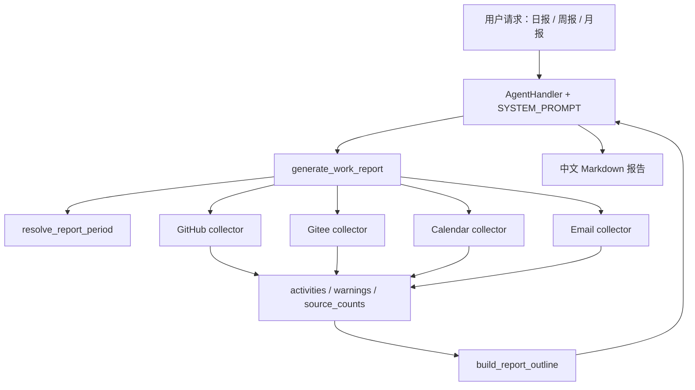
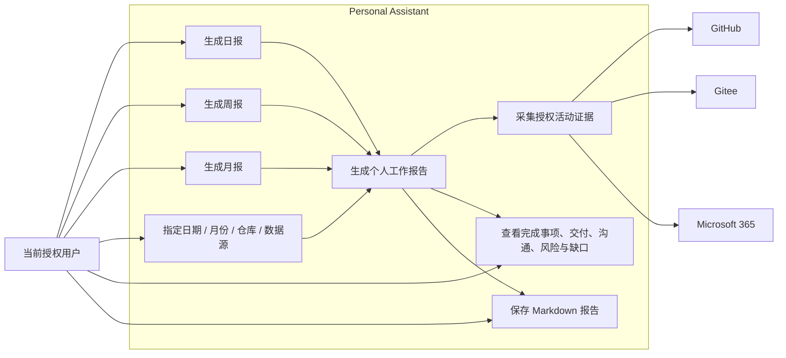
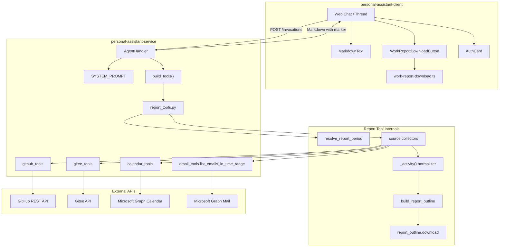
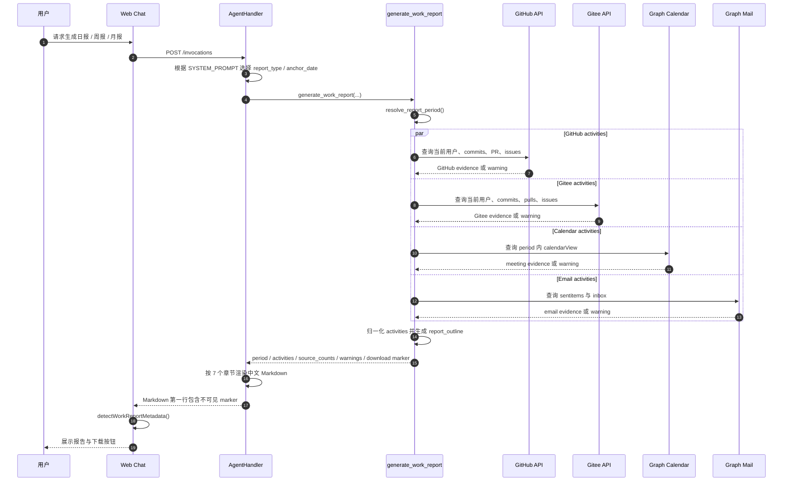
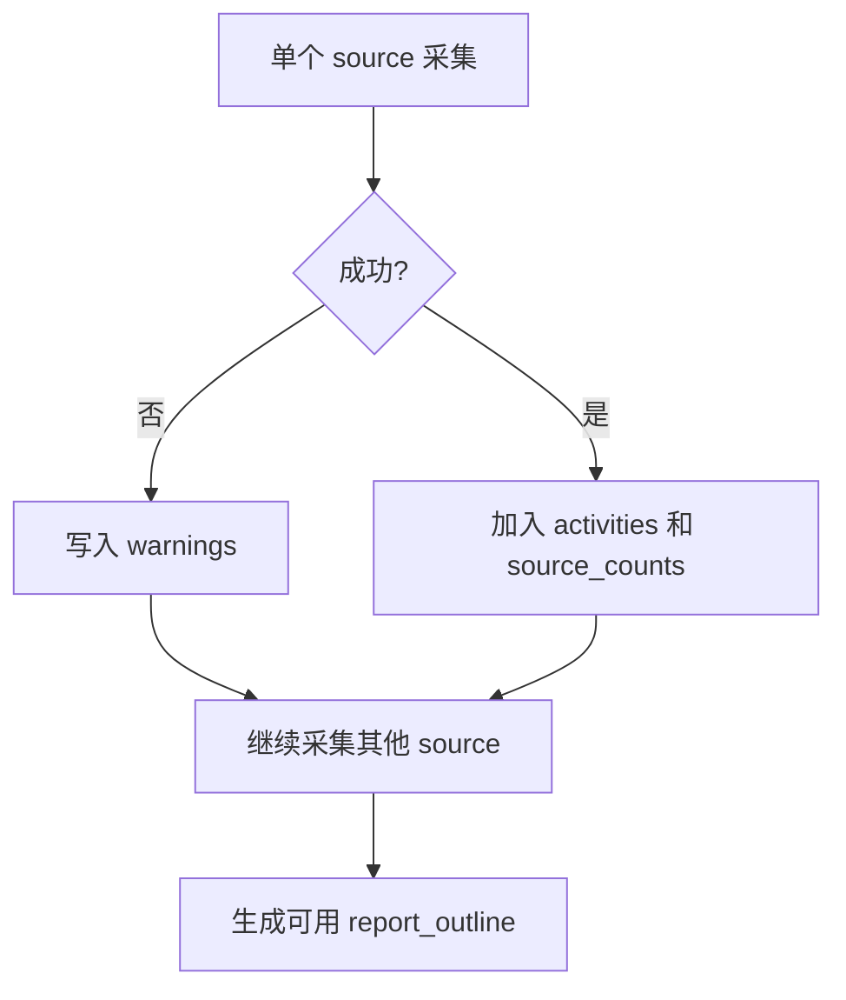

# 工作报告功能技术设计

本文档介绍方案1的后端设计，聚焦 Service、Agent、数据采集、结构化返回和前后端下载协议。

## 1. 目标与范围

工作报告功能用于在 Web Chat 中根据当前授权用户的活动数据生成个人工作报告：

- 日报：`daily`
- 周报：`weekly`
- 月报：`monthly`

v1 范围：

- 新增高层工具 `generate_work_report`
- 聚合 GitHub、Gitee、Microsoft 365 Calendar、Microsoft 365 Email 活动
- 返回结构化 evidence、source counts、warnings 和固定报告提纲
- 由 Agent 根据 evidence 输出中文 Markdown 报告
- 通过稳定 marker 与前端约定下载能力

## 2. 架构概览

### 2.1 高层数据流



核心边界：

- Service 工具负责采集、归一化和给出报告提纲。
- Agent 负责自然语言组织，不允许编造未采集到的工作。
- 前端只根据最终 Markdown 中的不可见 marker 渲染下载能力。

### 2.2 用例图



用例边界：

- 用户只面向“生成/阅读/下载报告”这些用例。
- GitHub、Gitee、Microsoft 365 是外部数据提供方，不直接生成报告。
- `Scope` 代表可选参数能力，例如指定基准日期、仓库等。

### 2.3 组件图



组件边界：

- `report_tools.py` 是聚合工具层，不直接处理 UI。
- `email_tools.list_emails_in_time_range` 是内部 helper，不注册为独立 Agent tool。
- `DownloadMeta` 是 Service 与 Client 的稳定协议，不需要新增 HTTP route。
- 前端下载按钮只消费最终 Markdown 文本，不直接调用 report tool。

### 2.4 时序图



## 3. 工具接口

`generate_work_report` 的公开接口固定为：

```python
generate_work_report(
    report_type: Literal["daily", "weekly", "monthly"],
    anchor_date: str | None = None,
    github_repositories: list[str] | None = None,
    gitee_repositories: list[str] | None = None,
    include_sources: list[Literal["github", "gitee", "calendar", "email"]] | None = None,
    max_items_per_source: int = 50,
) -> dict[str, Any]
```

参数语义：

| 参数 | 说明 |
|---|---|
| `report_type` | 报告类型，支持 `daily`、`weekly`、`monthly` |
| `anchor_date` | 报告锚点日期；日报/周报使用 `YYYY-MM-DD`，月报可使用 `YYYY-MM` |
| `github_repositories` | 可选 GitHub 仓库白名单，格式为 `owner/repo` |
| `gitee_repositories` | 可选 Gitee 仓库白名单，格式为 `owner/repo` |
| `include_sources` | 可选数据源白名单；默认采集 GitHub、Gitee、Calendar、Email |
| `max_items_per_source` | 每个数据源最多采集条数，内部限制在 1 到 100 |

成功返回：

```python
{
    "ok": True,
    "period": {...},
    "activities": [...],
    "source_counts": {...},
    "warnings": [...],
    "report_outline": {...},
}
```

失败返回：

```python
{
    "ok": False,
    "error": "..."
}
```

## 4. 报告周期解析

`resolve_report_period()` 根据 `report_type`、`anchor_date` 和 `Settings.graph_timezone` 生成报告周期。

| 类型 | 周期规则 |
|---|---|
| `daily` | 当天 00:00 到次日 00:00 |
| `weekly` | 所在周一 00:00 到下周一 00:00 |
| `monthly` | 所在自然月 1 日 00:00 到下月 1 日 00:00 |

周期字段：

```python
{
    "report_type": "daily",
    "timezone": "Asia/Shanghai",
    "start": "2026-06-30T00:00:00+08:00",
    "end": "2026-07-01T00:00:00+08:00",
    "start_date": "2026-06-30",
    "end_date_exclusive": "2026-07-01",
    "end_date_inclusive": "2026-06-30",
}
```

设计理由：

- 使用半开区间 `[start, end)` 避免边界重复统计。
- 使用 `graph_timezone` 与 Calendar / Email 的 Graph 查询语义保持一致。
- 周报以周一作为开始日，符合中文工作周语境。

## 5. Activity 结构约定

当前实现没有真实存在的 `Activity` 类、dataclass 或 Pydantic model。

这里的 Activity 是报告内部统一表示一条工作活动的 `dict[str, Any]` 结构约定，由 `_activity()` 工厂函数创建，各 collector 返回 `list[dict[str, Any]]`。

统一结构：

```python
{
    "source": "github" | "gitee" | "calendar" | "email",
    "kind": "commit" | "pull_request" | "issue" | "meeting" | "email_sent" | "email_received",
    "title": str,
    "occurred_at": str | None,
    "confidence": "explicit" | "inferred",
    "summary": str,
    "repository": str | None,
    "url": str | None,
    "actor": str | None,
    "status": str | None,
    "metadata": dict,
}
```

字段说明：

| 字段 | 说明 |
|---|---|
| `source` | 原始数据源 |
| `kind` | 活动类型 |
| `title` | 报告中可展示的短标题 |
| `occurred_at` | 活动发生或更新时间 |
| `confidence` | `explicit` 表示明确证据，`inferred` 表示推断证据 |
| `summary` | 简短摘要或 bodyPreview |
| `repository` | 代码活动关联仓库 |
| `url` | 原始活动链接 |
| `actor` | 行为人或组织者 |
| `status` | 状态，例如 open、closed、committed、importance |
| `metadata` | source-specific 辅助字段 |

真实存在的强类型：

- `ReportPeriod`：报告周期 dataclass
- `SourceResult`：单个数据源采集结果 dataclass

## 6. 数据源采集

### 6.1 GitHub

采集流程：

1. 调用 `/user` 获取当前用户 login。
2. 如未传入仓库列表，调用 `/user/repos` 获取当前用户可见仓库。
3. 对每个仓库调用 commits API，使用 `since`、`until` 和 `author=login` 过滤。
4. 使用 `/search/issues` 搜索 PR 和 issue，query 包含：
   - `type:pr` 或 `type:issue`
   - `involves:{login}`
   - `updated:start..end`
   - 可选 `repo:owner/repo`

输出活动：

- `commit`
- `pull_request`
- `issue`

错误处理：

- 授权缺失时返回 warning 并跳过 GitHub。
- 单仓库 commits 查询失败只记录该仓库 warning，不中断其他数据源。

### 6.2 Gitee

采集流程：

1. 通过 `require_access_token` 获取 Gitee OAuth token。
2. 调用 `/user` 获取当前用户信息。
3. 使用 `login`、`name`、`email`、`id` 建立 aliases。
4. 如未传入仓库列表，调用 `/user/repos` 获取仓库。
5. 对每个仓库采集 commits、pulls、issues。

用户过滤：

- commit 通过 author 匹配 aliases。
- PR/issue 通过 user、assignee、assignees、tester、testers 匹配 aliases。

输出活动：

- `commit`
- `pull_request`
- `issue`

错误处理：

- 端点不可用、scope 不足或单仓库失败时记录 warning。
- 不阻塞其他 source 的报告生成。

### 6.3 Calendar

复用 `calendar_tools.list_calendar_events()`。

Graph 查询字段：

- subject
- start
- end
- location
- organizer
- attendees
- isOnlineMeeting
- onlineMeetingUrl
- webLink
- bodyPreview

输出活动：

- `meeting`
- `confidence="inferred"`

设计约束：

- Calendar 内容可能包含隐私信息，只读取报告周期内必要字段。
- 如果返回 `@odata.nextLink`，记录“仍有更多事件未采集”的 warning。

### 6.4 Email

复用内部 helper `list_emails_in_time_range()`。

读取文件夹：

- `sentitems`
- `inbox`

读取字段：

- subject
- from
- toRecipients
- receivedDateTime
- sentDateTime
- isRead
- importance
- bodyPreview
- webLink

输出活动：

- sentitems -> `email_sent`，`confidence="explicit"`
- inbox -> `email_received`，`confidence="inferred"`

隐私约束：

- 不拉取完整正文。
- 只使用 `bodyPreview`。
- helper 不注册到 `EMAIL_TOOLS`，仅供 report tool 内部调用。

## 7. 报告提纲生成

`build_report_outline()` 输出固定 7 个章节：

1. 概览
2. 完成事项
3. 代码与交付
4. 会议与沟通
5. 风险/阻塞
6. 下一步计划
7. 数据来源与缺口

分类规则：

| 章节 | 数据来源 |
|---|---|
| 概览 | period、source_counts、总活动数 |
| 完成事项 | explicit 的 commit、pull_request、issue、email_sent |
| 代码与交付 | GitHub、Gitee activities |
| 会议与沟通 | Calendar、Email activities |
| 风险/阻塞 | title、summary、status 命中风险关键词的 activities |
| 下一步计划 | v1 版本不做强推断，默认提示结合上下文补充 |
| 数据来源与缺口 | warnings 或所有 source 采集成功说明 |

Agent 必须基于 `activities` 和 `report_outline` 输出报告，不得编造未采集到的工作。

## 8. 下载协议

Service 不直接生成文件，也不新增下载 route。下载能力通过 Markdown 第一行不可见 marker 与前端约定完成。

`report_outline.download`：

```json
{
  "format": "markdown",
  "content_type": "text/markdown;charset=utf-8",
  "suggested_filename": "work-report-daily-2026-06-30.md",
  "marker": "<!-- personal-assistant-work-report {\"type\":\"daily\",\"filename\":\"work-report-daily-2026-06-30.md\"} -->"
}
```

文件名规则：

| 类型 | 文件名 |
|---|---|
| 日报 | `work-report-daily-YYYY-MM-DD.md` |
| 周报 | `work-report-weekly-YYYY-MM-DD_YYYY-MM-DD.md` |
| 月报 | `work-report-monthly-YYYY-MM.md` |

Agent 渲染要求：

- 最终 Markdown 第一行必须原样输出 `report_outline.download.marker`。
- 不翻译、不改写、不生成 Markdown 链接。
- marker 只供前端识别，不作为用户可见内容。

## 9. Agent Prompt 约束

`SYSTEM_PROMPT` 中需要包含工作报告规则：

- 用户请求“日报”“周报”“月报”“工作总结”“本周进展”时优先调用 `generate_work_report`。
- 根据用户表达映射 `report_type`。
- 用户给出日期或月份时传入 `anchor_date`。
- 最终回复按 7 个固定章节输出。
- 对 `confidence=inferred` 的内容使用“可能”“参与”“沟通”等措辞。
- 未授权、接口失败或采集不足必须写入“数据来源与缺口”。
- marker 必须作为最终 Markdown 第一行原样输出。

## 10. 错误处理与降级



原则：

- 单个 source 授权缺失会触发对应 provider 的授权流程，但不阻塞整体报告。
- 单个 source API 失败不阻塞整体报告。
- 未采集到活动时仍返回可用 outline，并在概览中说明。
- 未知 `include_sources` 属于调用参数错误，直接返回 `ok=False`。

### 10.1 v1 授权体验决策

当前实现中，`generate_work_report` 默认按 `github`、`gitee`、`calendar`、`email` 采集 source。各 collector 在调用底层工具时会复用现有 `require_access_token` 授权流程：

- GitHub 通过 `github_tools._github_request` 触发 GitHub provider 授权。
- Gitee 通过 `_gitee_report_request` 触发 Gitee provider 授权。
- Calendar 通过 `calendar_tools.list_calendar_events` 触发 Microsoft 365 Calendar provider 授权。
- Email 通过 `email_tools.list_emails_in_time_range` 间接调用 `_m365_email_request`，触发 Microsoft 365 Email provider 授权。

v1 产品决策是**不等待所有 source 授权成功完成后再生成报告**：

- 未授权 source 会触发 `auth_required`。
- 授权失败的source会跳过。
- 所有授权失败的 source 都必须进入 `warnings`，并由 `report_outline.sections` 中的“数据来源与缺口”章节展示。

这保证用户在首次使用时仍能获得部分报告，同时清楚知道哪些数据源因授权失败而没有进入本次报告。

### 10.2 多 provider 授权入口限制

默认全源采集时，多个 source 可能在同一轮 `generate_work_report` 中连续触发 `auth_required`。后端会逐个 collector 处理并累计 warnings，但前端当前 AuthCard store 只能在同一 assistant message 下展示一张授权卡。

因此，Service 不应依赖 AuthCard 作为唯一缺口说明渠道。`warnings` 和“数据来源与缺口”章节是 v1 的完整授权缺口说明来源。

## 11. 隐私与安全

- 只总结当前授权用户相关活动，不生成团队全量项目报告。
- Email 默认只读取 subject、sender/recipient、time、importance、bodyPreview。
- Calendar 仅读取报告周期内事件摘要字段。
- 不新增后端下载 route，避免引入新的文件存储和访问控制面。
- 不自动发送邮件，不绕过现有 `send_email` Guard。
- OAuth 授权仍复用现有 AuthCard / callback page 带外呈现。

## 12. 测试计划

Service tests：

- `resolve_report_period` 的 daily / weekly / monthly 边界。
- `anchor_date` 非法输入。
- GitHub / Gitee collector 的用户过滤、时间过滤、limit。
- Calendar collector 的 `has_more` warning。
- Email collector 的 sentitems / inbox、隐私字段、部分授权 warning。
- `generate_work_report` 在全部授权、部分授权缺失、单 source 失败时均返回可用结构。
- 多个 source 未授权时，`warnings` 包含每个被跳过 source，报告 outline 的“数据来源与缺口”能够完整展示这些缺口。
- `report_outline.download` 包含格式、content type、文件名和 marker。
- `build_tools()` 注册 `generate_work_report`。
- `SYSTEM_PROMPT` 包含工作报告和 marker 输出约束。

## 13. 后续演进

- 将 Activity 结构从 `dict[str, Any]` 升级为 `TypedDict` 或 Pydantic model。
- 对 GitHub/Gitee activities 增加稳定去重 key。
- 对 source collectors 做并发采集，并保留 warnings 的可读顺序。
- 支持用户指定“只总结代码活动”或“只总结会议沟通”。
- 后续如需发邮件，可复用现有 `send_email` Guard，不应在 v1 自动发送。
