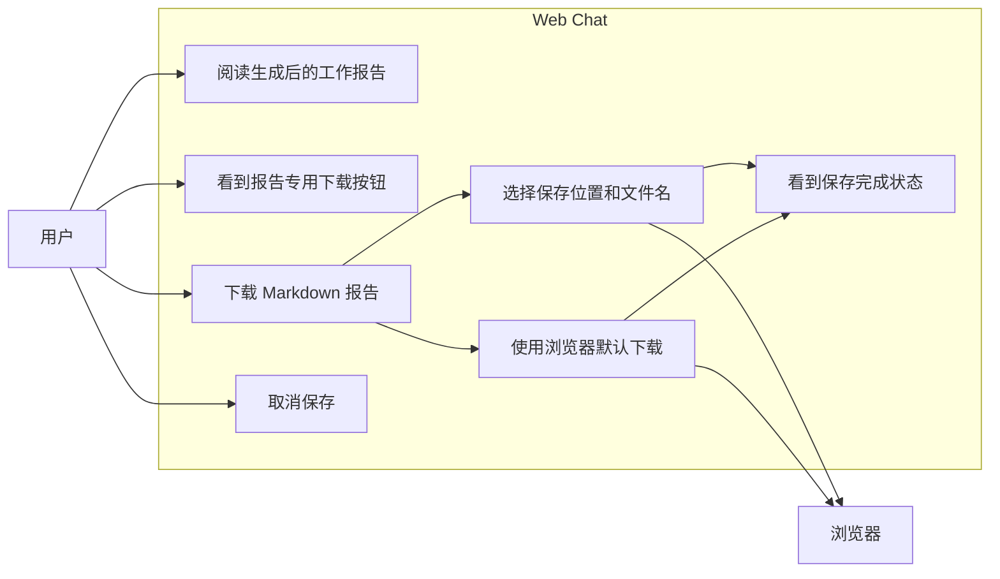
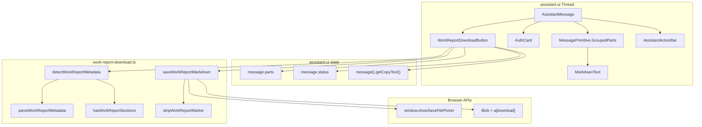
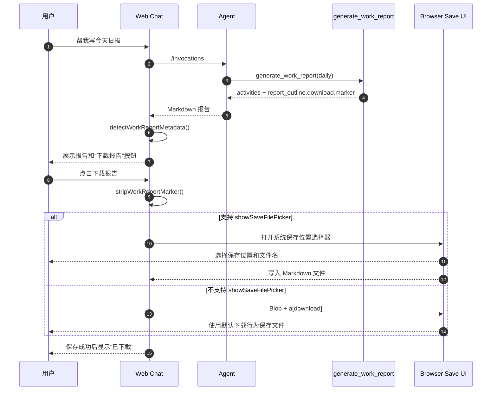
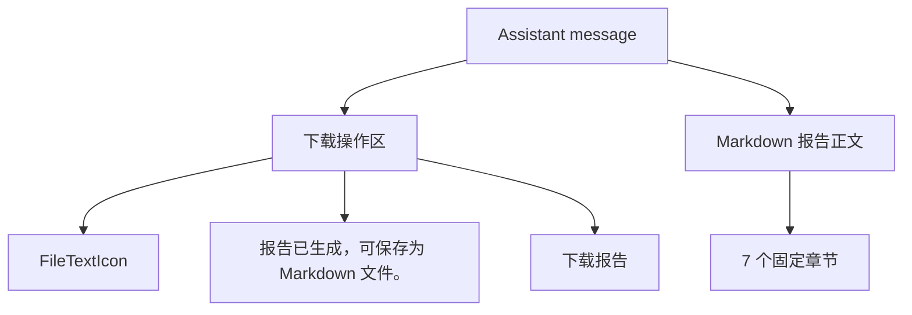
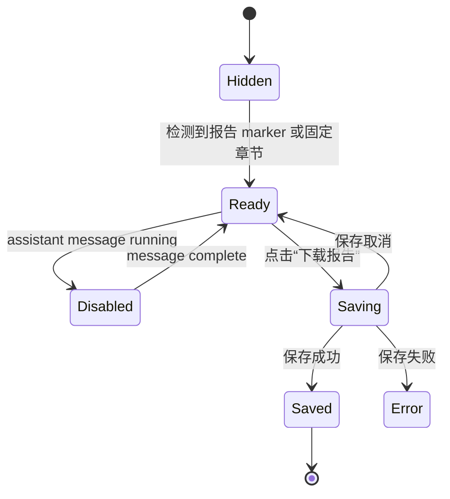

# 工作报告前端设计

本文档介绍方案1的前端设计，专门描述 Web Chat 中报告展示、下载按钮、保存流程、状态反馈和可访问性。

## 1. UX 目标

工作报告生成后，用户需要能直接在对话中完成两件事：

1. 阅读 Agent 输出的日报、周报或月报。
2. 将报告保存为本地 Markdown 文件，并选择自己想保存的位置。

设计目标：

- 下载能力必须出现在报告消息附近，用户不需要去通用 action bar 中寻找。
- 下载按钮视觉上与现有授权卡片一致，降低学习成本。
- 保存内容应是用户看到的报告正文。
- 浏览器能力不足时仍可通过普通下载 fallback 完成保存。
- 普通 assistant 消息不显示报告下载按钮。

## 2. 交互流程

本节从前端视角描述报告展示与下载保存体验。

### 2.1 用例图



用例边界：

- 用户关注的是“读报告”和“保存报告”，不需要理解 marker、tool call 或 source collector。
- 浏览器保存位置选择依赖 `showSaveFilePicker`；不支持时退回默认下载。
- 取消保存是正常用户行为，不应触发额外下载。

### 2.2 组件图



组件边界：

- `WorkReportDownloadButton` 只负责报告消息内的专用下载入口。
- `work-report-download.ts` 负责 marker 解析、fallback 识别和保存实现。
- `AssistantActionBar` 的通用导出能力保留，不替代报告专用下载按钮。
- `AuthCard` 与下载按钮使用相似视觉语言，但分别处理授权和保存两个不同任务。

### 2.3 时序图



## 3. 显示规则

报告下载按钮只在 assistant 报告消息中显示。`WorkReportDownloadButton` 挂载在 assistant message 渲染区域内，并从 assistant-ui 的 text parts 中拼接当前消息文本：

```ts
s.message.parts
  .filter((part) => part.type === "text")
  .map((part) => part.text)
  .join("")
```

按钮是否显示由 `detectWorkReportMetadata()` 决定。只要检测到有效报告 metadata，组件就渲染下载区域。

**显示条件一：**消息开头包含合法 marker。

```md
<!-- personal-assistant-work-report {"type":"daily","filename":"work-report-daily-2026-06-30.md"} -->
```

marker 规则：

- 允许 marker 前面存在空白字符。
- marker 必须是 `personal-assistant-work-report` HTML 注释。
- 注释中必须包含可解析的 JSON。
- `type` 必须是 `daily`、`weekly` 或 `monthly`。
- `filename` 必须是字符串，必须以 `.md` 结尾。
- `filename` 只能包含英文字母、数字、点、下划线、空格和连字符。

**显示条件二：**marker 缺失，但消息包含完整固定章节。

fallback 识别要求消息同时包含以下 7 个 Markdown 标题：

- 概览
- 完成事项
- 代码与交付
- 会议与沟通
- 风险/阻塞
- 下一步计划
- 数据来源与缺口

fallback 标题规则：

- 标题必须使用 Markdown heading，支持 `#`、`##`、`###`。
- 标题文本必须与固定章节名精确匹配。
- 7 个章节必须全部存在，缺少任意一个都不显示按钮。
- 当前实现不识别 `**概览**`、`概览：`、`一、概览` 这类非 heading 或带编号/冒号的写法。
- fallback 报告类型通过消息前 5 行推断：包含“月报”则为 `monthly`，包含“周报”则为 `weekly`，否则默认为 `daily`。

不显示条件：

- 普通 assistant 回复。
- 用户消息。
- marker 非法，例如 type 不在 `daily/weekly/monthly` 中，或 filename 不是 `.md`。
- marker 中的 filename 包含不允许的字符。
- fallback 章节不完整，或章节不是 `#` 到 `###` 的 Markdown heading。

运行中状态：

- 如果 assistant message 已经包含可识别的报告 metadata，即使消息状态仍是 `running`，下载区域也会显示。
- `running` 时按钮处于 disabled 状态，避免在报告尚未输出完成时保存半截内容。
- 消息完成后按钮恢复可点击。

## 4. 信息架构

报告消息在视觉上由两部分组成：

1. 下载操作区
2. Markdown 报告正文

推荐布局：



位置要求：

- 下载操作区应位于报告正文下方。
- AuthCard 和下载操作区同时出现时，AuthCard 代表授权流程，下载操作区代表已生成报告后的保存动作，两者不应混淆。

## 5. 视觉设计

下载按钮区域应对齐现有 `AuthCard` 的视觉语言：

- 容器：浅蓝背景、蓝色边框、圆角、内边距。
- 图标：左侧 `FileTextIcon`，颜色使用蓝色 token。
- 文案：中间说明“报告已生成，可保存为 Markdown 文件。”
- 操作：右侧蓝色实心按钮“下载报告”，带 `DownloadIcon`。
- 成功态：绿色背景和绿色实心状态标签“已下载”。

视觉意图：

- 和 GitHub/Gitee/Calendar/Email 授权卡片保持一致，用户能理解这是一个系统级辅助操作。
- 不把下载伪装成 Markdown 链接，避免与报告内容混淆。
- 按钮尺寸保持紧凑，适合聊天消息内部使用。

## 6. 交互状态



状态说明：

| 状态 | UI |
|---|---|
| Hidden | 不渲染下载区域 |
| Ready | 显示蓝色卡片和“下载报告”按钮 |
| Disabled | Agent 仍在输出时禁用按钮 |
| Saving | 按钮文案变为“保存中”，防止重复点击 |
| Saved | 切换为绿色完成态，显示“报告已保存为 Markdown 文件。”和“已下载” |
| Error | 当前实现可抛出错误；后续可补充显式错误提示 |

用户取消保存：

- 如果用户在系统保存选择器中取消，不应触发 fallback 重复下载。
- UI 应回到可点击状态。

## 7. 下载行为

点击“下载报告”后：

1. 获取当前 assistant 消息的可复制文本。
2. 移除不可见 marker。
3. 创建 `text/markdown;charset=utf-8` Blob。
4. 优先调用 `window.showSaveFilePicker`：
   - 使用 `suggested_filename`
   - 文件类型限制为 Markdown `.md`
   - 用户可以选择目录和文件名
5. 如果浏览器不支持 `showSaveFilePicker`：
   - fallback 到 `<a download>`
   - 使用浏览器默认下载行为

保存内容要求：

- 只保存用户可见的 Markdown 报告正文。
- 不保存 `<!-- personal-assistant-work-report ... -->` marker。
- 保留 Markdown 标题、列表和链接。

## 8. 文件名策略

优先使用 marker 中的 filename。

标准文件名：

| 报告类型 | 示例 |
|---|---|
| 日报 | `work-report-daily-2026-06-30.md` |
| 周报 | `work-report-weekly-2026-06-29_2026-07-05.md` |
| 月报 | `work-report-monthly-2026-06.md` |

fallback 文件名：

- marker 缺失但章节完整时，可使用当前日期生成通用文件名。
- 后续可优化为根据标题中的“日报/周报/月报”生成更准确的文件名。

安全约束：

- filename 必须以 `.md` 结尾。
- filename 只允许安全字符，避免路径注入或非法文件名。

## 9. Marker 与 fallback 识别

主识别方式：

```md
<!-- personal-assistant-work-report {"type":"daily","filename":"work-report-daily-2026-06-30.md"} -->
```

识别规则：

- marker 可以有前导空白。
- JSON 中必须包含合法 `type` 和 `filename`。
- marker 是不可见 HTML 注释，不应作为报告正文展示。

fallback 识别方式：

- 当 Agent 未输出 marker 时，检查 7 个固定 Markdown 标题。
- 当前 fallback 适合 `#`、`##`、`###` 标题形式。
- 后续可扩展支持 `**概览**`、`概览：`、`一、概览` 等形式。

## 10. 与现有功能的关系

### AuthCard

下载按钮视觉上参考 AuthCard，但语义不同：

- AuthCard：处理第三方授权，按钮是“点击授权”。
- WorkReportDownloadButton：处理报告保存，按钮是“下载报告”。

一致性要求：

- 卡片颜色、边框、圆角、按钮高度与 AuthCard 保持一致。
- 成功态使用绿色，与授权完成态一致。

### Action Bar

现有 assistant action bar 的通用导出能力应保留。

区别：

- Action bar 是所有消息的通用操作。
- 下载报告按钮是报告消息的专用操作，使用报告专属文件名，并剥离内部 marker。

## 11. 可访问性

要求：

- 下载按钮使用真实 `<button>`。
- 按钮有 `aria-label="下载报告"`。
- saving / disabled 状态使用 `disabled` 属性。
- 图标仅作辅助，不替代文本。
- 成功态必须有文本说明，不只依赖颜色。

键盘体验：

- 用户可以通过 Tab 聚焦按钮。
- Enter / Space 可触发下载。
- 保存中禁用按钮，避免重复触发。

## 12. 边界场景

| 场景 | 预期行为 |
|---|---|
| Agent 输出合法 marker | 显示下载按钮，使用 marker filename |
| Agent 未输出 marker 但 7 个章节完整 | 显示下载按钮，使用 fallback filename |
| 普通消息只有“概览”一个标题 | 不显示下载按钮 |
| marker JSON 非法 | 不显示下载按钮 |
| filename 不以 `.md` 结尾 | 不显示下载按钮 |
| 浏览器支持 `showSaveFilePicker` | 弹出系统保存位置选择器 |
| 浏览器不支持 `showSaveFilePicker` | 使用 `<a download>` fallback |
| 用户取消保存 | 不触发 fallback，不显示成功态 |
| 保存成功 | 显示绿色完成态 |

## 13. 测试计划

Client helper tests：

- 合法 marker 能解析出 type 和 filename。
- 非报告消息返回 null。
- marker 缺失但 7 个章节完整时 fallback 成功。
- 保存内容会剥离 marker。
- 支持 `showSaveFilePicker` 时调用系统保存流程。
- 不支持 `showSaveFilePicker` 时 fallback 到 Blob download。
- 用户取消保存时不重复触发 fallback。

Component tests：

- 普通 assistant 消息不渲染按钮。
- 报告消息渲染“下载报告”按钮。
- running 状态禁用按钮。
- 点击按钮时用建议文件名保存当前报告内容。
- 保存成功后切换到绿色完成态。

## 14. 后续优化

- 增加保存失败的可见错误提示。
- 扩展 fallback 标题识别，兼容更多中文标题写法。
- fallback 文件名按报告标题推断 daily / weekly / monthly。
- 允许用户选择 Markdown 以外格式，但 v1 不引入 PDF / Word。
