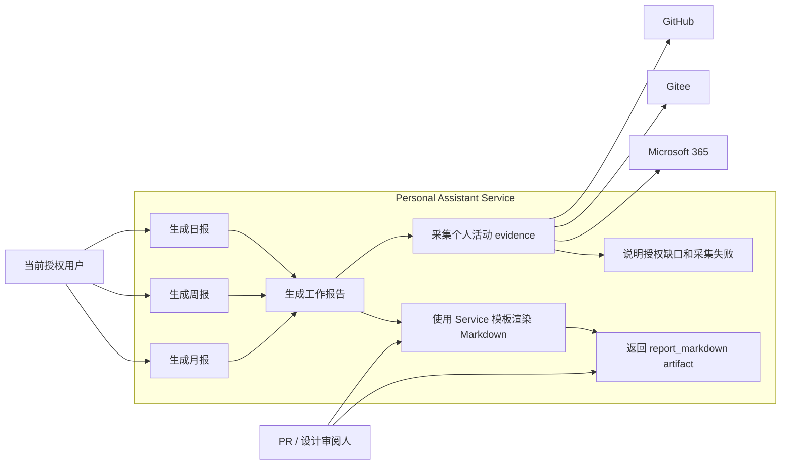
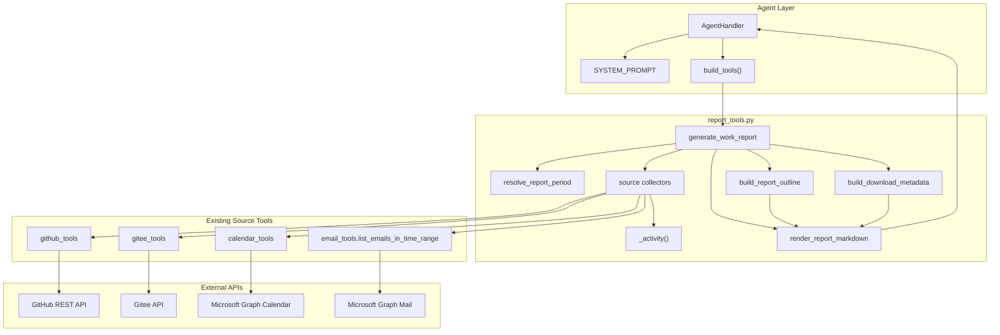
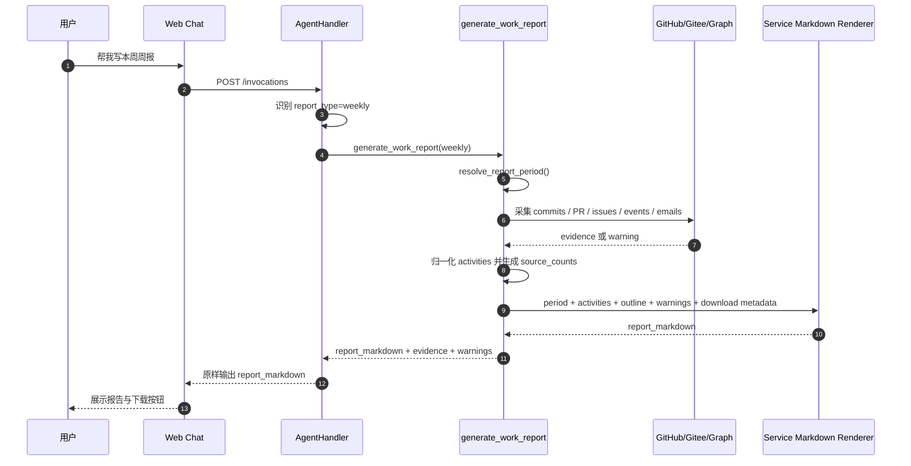
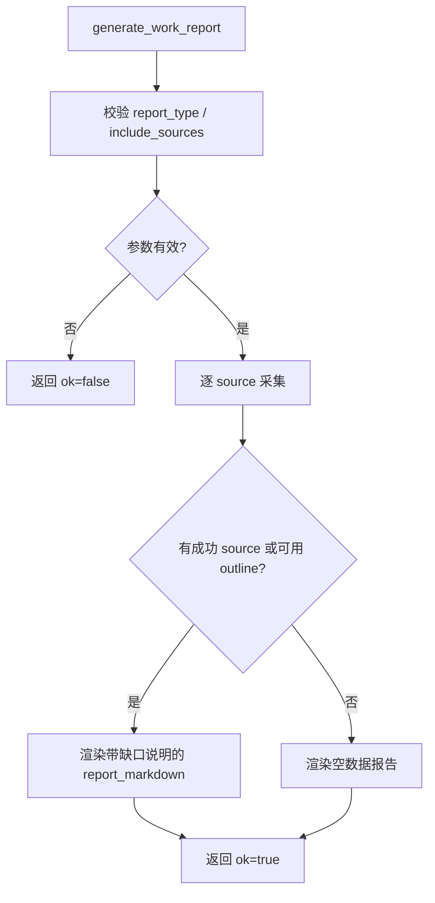

# 方案二：Service 直接渲染工作报告技术设计

本文档描述工作报告功能的方案2。方案二的核心思路是：`generate_work_report` 不只返回 evidence 和 outline，而是在 Service 层直接生成最终 Markdown 报告，Agent 主要负责调用工具和把工具返回的报告原样交付给用户。

## 1. 方案定位

方案二将报告生成拆成两个阶段：

1. Service 采集 GitHub、Gitee、Calendar、Email 活动并归一化为 evidence。
2. Service 使用确定性模板直接渲染完整中文 Markdown 报告。

## 2. 目标与范围

目标：

- 保留 `generate_work_report` 作为唯一高层工具。
- Service 直接返回 `report_markdown`，其中包含完整 7 章节中文报告。
- Service 仍返回结构化 evidence，便于调试、测试和后续扩展。
- Agent 不再自由改写报告正文，只负责展示工具生成的 Markdown。
- 前端仍通过 marker 识别报告消息并提供下载按钮。

非目标：

- 不新增 HTTP route。
- 不修改 `/invocations` request/response schema。
- 不引入 PDF / Word 导出。
- 不自动发送邮件。
- 不在前端重新组织报告正文。

## 3. 用例图



用例边界：

- 用户仍只感知“生成报告”和“下载报告”。
- 审阅人关注的是报告格式、内容约束和可测试性。
- 外部系统只提供活动数据，不参与报告正文生成。

## 4. 组件图



组件职责：

- `generate_work_report`：统一入口，负责参数校验、source 调度和返回结构。
- `build_report_outline`：继续生成结构化章节数据，作为 renderer 的输入。
- `render_report_markdown`：方案二新增的后端渲染器，负责生成最终 Markdown。
- `build_download_metadata`：生成 marker、content type 和建议文件名。
- `SYSTEM_PROMPT`：从“按 evidence 写报告”调整为“调用工具后原样输出 `report_markdown`”。

## 5. 时序图



关键点：

- Agent 不再负责组织章节和措辞。
- Service renderer 必须保证报告正文包含固定 7 个章节。
- 下载 marker 由 Service renderer 写在 Markdown 第一行。

## 6. 工具返回结构

方案二中 `generate_work_report` 可以保持原参数不变，但返回结构增加 `report_markdown`：

```python
{
    "ok": True,
    "period": {...},
    "activities": [...],
    "source_counts": {...},
    "warnings": [...],
    "report_outline": {...},
    "report_markdown": "<!-- personal-assistant-work-report ... -->\n# 本周周报\n..."
}
```

返回字段说明：

| 字段 | 说明 |
|---|---|
| `period` | 报告周期 |
| `activities` | 归一化工作活动 evidence |
| `source_counts` | 各 source 采集数量 |
| `warnings` | 授权缺失、采集失败、数据截断等说明 |
| `report_outline` | 结构化章节提纲 |
| `report_markdown` | Service 直接生成的最终中文 Markdown 报告 |

失败返回仍为：

```python
{
    "ok": False,
    "error": "..."
}
```

## 7. Service Markdown Renderer

方案二新增后端渲染器 `render_report_markdown()`。

输入：

- `period`
- `activities`
- `source_counts`
- `warnings`
- `report_outline`
- `download_metadata`

输出：

- 完整 Markdown 字符串
- 第一行必须是 marker
- 后续正文包含报告标题和 7 个固定章节

建议输出结构：

```md
<!-- personal-assistant-work-report {"type":"weekly","filename":"work-report-weekly-2026-06-29_2026-07-05.md"} -->
# 本周周报

## 概览

- 报告周期：2026-06-29 至 2026-07-06（不含结束日，Asia/Shanghai）。
- 本期共采集 GitHub 8 条、Gitee 2 条、Calendar 5 条、Email 10 条。

## 完成事项

- [github/commit] owner/repo 完成报告工具注册

## 代码与交付

...

## 会议与沟通

...

## 风险/阻塞

...

## 下一步计划

...

## 数据来源与缺口

...
```

## 8. 内容生成规则

Renderer 必须遵守以下规则：

- 不生成 evidence 中不存在的完成事项。
- `confidence="explicit"` 的活动可以写成明确完成或提交。
- `confidence="inferred"` 的活动必须使用“可能参与”“围绕某主题沟通”“从日程/邮件推断”等措辞。
- 空章节不能编造内容，应写“未从已授权数据中识别到...”。
- warnings 必须进入“数据来源与缺口”章节。
- 每个章节条目数量应有限制，避免超长报告。
- 所有字符串进入报告前应做截断和 Markdown 安全处理。

## 9. Agent Prompt 约束

方案二下 `SYSTEM_PROMPT` 的职责应改为：

- 当用户请求日报/周报/月报时调用 `generate_work_report`。
- 如果工具返回 `ok=false`，向用户解释错误。
- 如果工具返回 `report_markdown`，最终回复必须原样输出该字段。
- 不要改写 `report_markdown`。
- 不要删除第一行 marker。
- 不要补充工具未返回的工作内容。

示例约束：

```text
当 generate_work_report 返回 report_markdown 时，最终回复必须原样输出 report_markdown。
不要翻译、改写、压缩或重排报告正文。
```

## 10. 错误处理与降级



降级原则：

- 某个 source 未授权会触发对应 provider 的授权流程，但不阻塞 renderer。
- 某个 source 失败不阻塞 renderer。
- 所有 source 都无数据时也返回完整报告，但概览和缺口章节必须说明。
- Renderer 失败属于 Service 内部错误，应返回 `ok=false` 或 warning，并避免 Agent 自行编造。

### 10.1 v1 授权体验决策

方案二与方案一共享同一套 source collector 和 OAuth 授权链路。默认全源采集时，GitHub、Gitee、Calendar、Email 任一 source 未授权都会触发对应 provider 的 `auth_required` 事件。

v1 不要求用户先完成所有 provider 成功授权后再生成报告：

- 未授权成功的 source 在本轮采集中写入 warnings。
- Service Markdown renderer 必须把 warnings 写入“数据来源与缺口”章节。
- 已授权 source 仍参与本轮 `report_markdown` 渲染。
- 如果多个 source 均未授权成功，报告正文必须列出所有未授权成功的 source。

前端当前同一 assistant message 下只展示一张 AuthCard，因此 Service renderer 不能依赖 AuthCard 作为唯一缺口说明渠道。

## 11. 测试计划

Service tests：

- `render_report_markdown` 第一行包含合法 marker。
- 7 个固定章节始终存在。
- explicit / inferred 措辞规则正确。
- warnings 写入“数据来源与缺口”。
- 空数据时仍生成完整报告。
- 多个 source 未授权时，`report_markdown` 的“数据来源与缺口”列出所有被跳过 source。
- 特殊字符、超长 subject、commit message 被安全截断。
- Agent prompt 包含“原样输出 report_markdown”约束。
