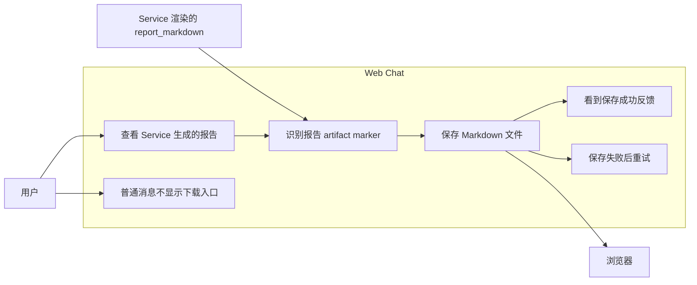
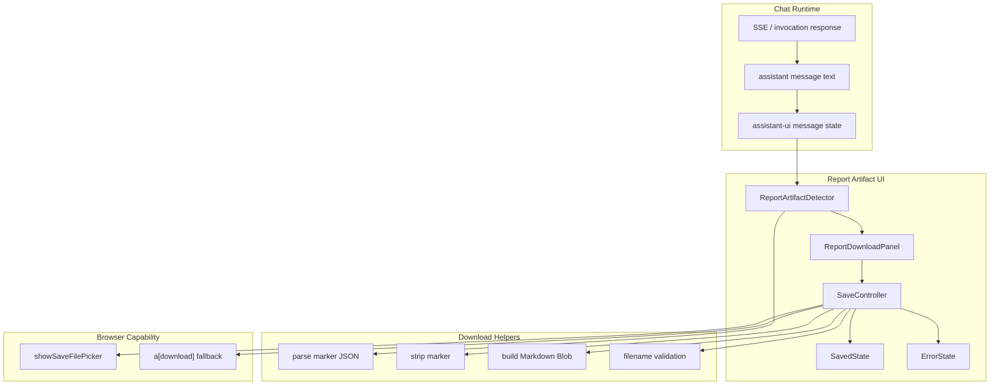
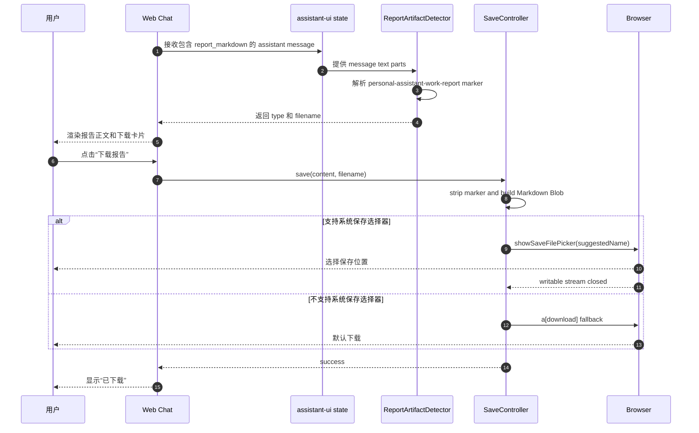
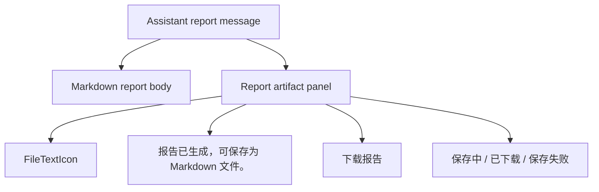
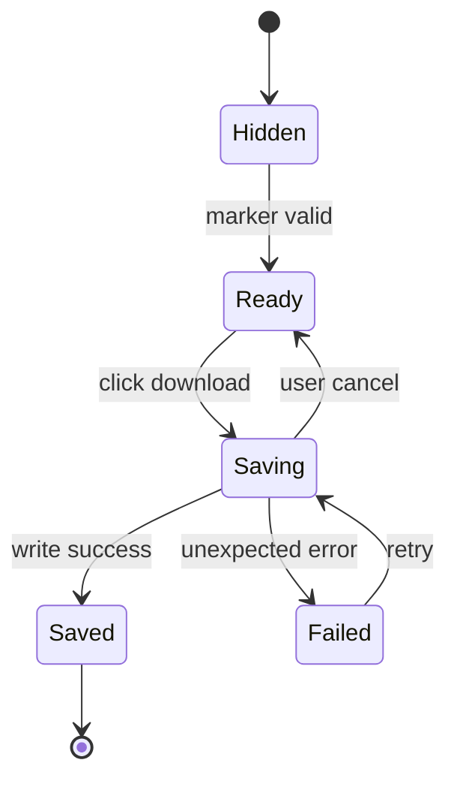

# 方案二：前端报告内容展示与下载 UX 设计

本文档描述工作报告功能方案2的前端设计。方案二假设 Service 已经直接生成完整 `report_markdown`，Agent 只负责原样输出该 Markdown。前端的重点从“容错识别 Agent 生成内容”转向“稳定识别 Service 渲染的报告并提供下载保存”。

## 1. UX 定位

方案二下，用户体验目标保持不变：

1. 用户在 Web Chat 中阅读日报、周报或月报。
2. 用户点击报告专用按钮，将 Markdown 报告保存到本地。

变化点：

- 报告正文由 Service 确定性生成，章节和 marker 更稳定。
- 前端可以更强依赖 marker，而不是依赖自然语言 fallback。

## 2. 用例图

用例边界：

- 用户无需知道报告由 Service 渲染。
- Service 通过 marker 把“这条消息是报告 artifact”的事实传递给前端。
- 普通消息仍走 assistant-ui 默认展示和 action bar。

## 3. 组件图

组件职责：

- `ReportArtifactDetector`：识别 Service 生成的 marker。
- `ReportDownloadPanel`：展示报告专用下载卡片。
- `SaveController`：处理保存、取消、失败和成功状态。
- `MarkerParser`：只解析稳定 marker，不承担复杂内容推断。
- `FilenamePolicy`：保证建议文件名安全。

## 4. 时序图

## 5. 显示规则

方案二推荐使用更严格的 artifact 识别：

显示条件：

- assistant 消息文本开头包含合法 marker。
- marker 的名称为 `personal-assistant-work-report`。
- marker JSON 包含合法 `type` 和 `filename`。
- `filename` 通过安全字符校验并以 `.md` 结尾。

不显示条件：

- 普通 assistant 消息。
- 用户消息。
- marker 缺失。
- marker JSON 不合法。
- filename 不安全。

fallback 策略：

- 方案二不推荐依赖“7 个标题齐全”的 fallback 作为主要路径。
- 由于 Service renderer 应保证 marker 稳定输出，fallback 可以仅作为兼容旧消息的过渡能力。
- 如果保留 fallback，应在 UX 文案或测试中明确它是兼容策略，不是主协议。

## 6. 信息架构

推荐展示方式：

- 报告正文是主要内容。
- 下载卡片是报告 artifact 的专用操作区。
- 下载卡片应位于报告正文下方，用户先阅读完整报告，再执行保存操作。
- 如果出现 AuthCard，AuthCard 应优先显示授权状态；报告下载卡片只在最终报告可用后显示。

### 6.1 多数据源授权入口限制

方案二虽然由 Service 直接渲染 `report_markdown`，但授权入口仍复用现有 AuthCard 链路。默认全源采集时，GitHub、Gitee、Calendar、Email 任一 source 未授权都会触发对应 provider 的 `auth_required` 事件。

当前前端实现限制：

- 同一 assistant message 下多个 provider 连续触发授权时，后一个 provider 会覆盖前一个 provider 的可见 AuthCard。

v1 UX 决策：

- 不要求同一 assistant message 下多个 AuthCard 并存。
- 不等待用户完成所有 provider 授权成功后再显示报告。
- `report_markdown` 的“数据来源与缺口”必须列出所有授权失败的source。
- 多 provider 授权列表、授权入口聚合和授权后快捷重新生成作为后续增强。

## 7. 状态设计

状态说明：

| 状态 | 说明 |
|---|---|
| Hidden | 未检测到合法报告内容 |
| Ready | 可下载 |
| Saving | 正在调用保存流程 |
| Saved | 保存成功，显示完成态 |
| Failed | 保存失败，允许重试 |

方案二建议补充显式 `Failed` UI，因为 artifact 保存是前端核心动作之一。

## 8. 下载行为

保存流程：

1. 从 assistant message 获取完整 Markdown 文本。
2. 移除第一行 marker。
3. 使用 UTF-8 创建 Markdown Blob。
4. 优先调用 `showSaveFilePicker`。
5. 如果浏览器不支持，使用 `<a download>` fallback。
6. 用户取消保存时不触发 fallback。
7. 保存成功后进入 `Saved` 状态。

保存内容：

- 不包含 marker。
- 保留 Service 生成的完整 Markdown。
- 不在前端重排章节。
- 不在前端追加额外说明。

## 9. 视觉设计

方案二可延续 AuthCard 风格：

- 信息态：蓝色浅底卡片 + 蓝色实心按钮。
- 成功态：绿色浅底卡片 + “已下载”状态标签。
- 失败态：红色浅底卡片 + “重试”按钮。

建议文案：

| 状态 | 文案 |
|---|---|
| Ready | 报告已生成，可保存为 Markdown 文件。 |
| Saving | 保存中 |
| Saved | 报告已保存为 Markdown 文件。 |
| Failed | 报告保存失败，请重试。 |

## 10. 可访问性

要求：

- 下载与重试操作使用真实 `<button>`。
- 按钮包含可见文本和 `aria-label`。
- 保存中禁用按钮，防止重复触发。
- 成功和失败状态都有文本，不只依赖颜色。
- 错误状态应可被屏幕阅读器感知。

## 11. 测试计划

Client tests：

- 合法 marker 显示下载卡片。
- marker 缺失时不显示，或仅按兼容策略 fallback。
- marker JSON 非法时不显示。
- filename 不安全时不显示。
- 点击下载会剥离 marker。
- 支持 `showSaveFilePicker` 时走系统保存流程。
- 不支持时走 `<a download>` fallback。
- 用户取消保存时保持 Ready 状态。
- 保存成功显示 Saved 状态。
- 保存失败显示 Failed 状态并允许重试。
- 多个 source 未授权时，即使当前只显示一个 AuthCard，报告正文也能展示所有未授权 source。
