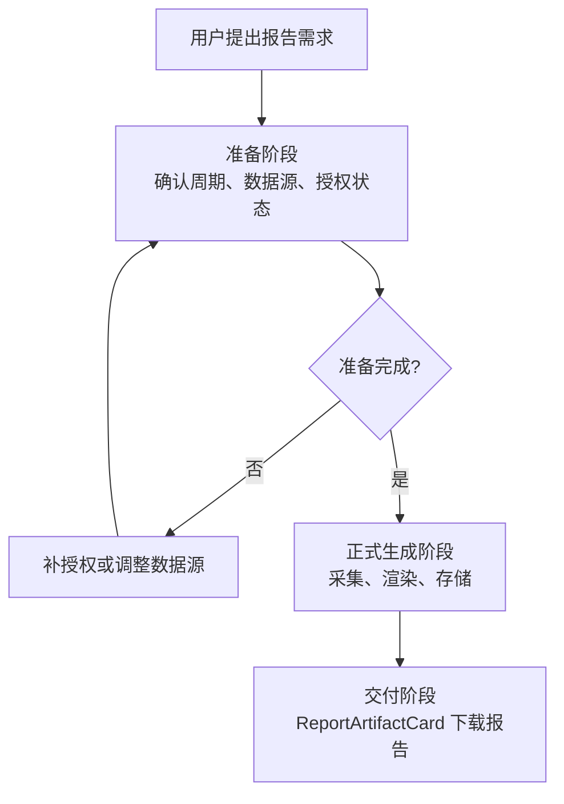
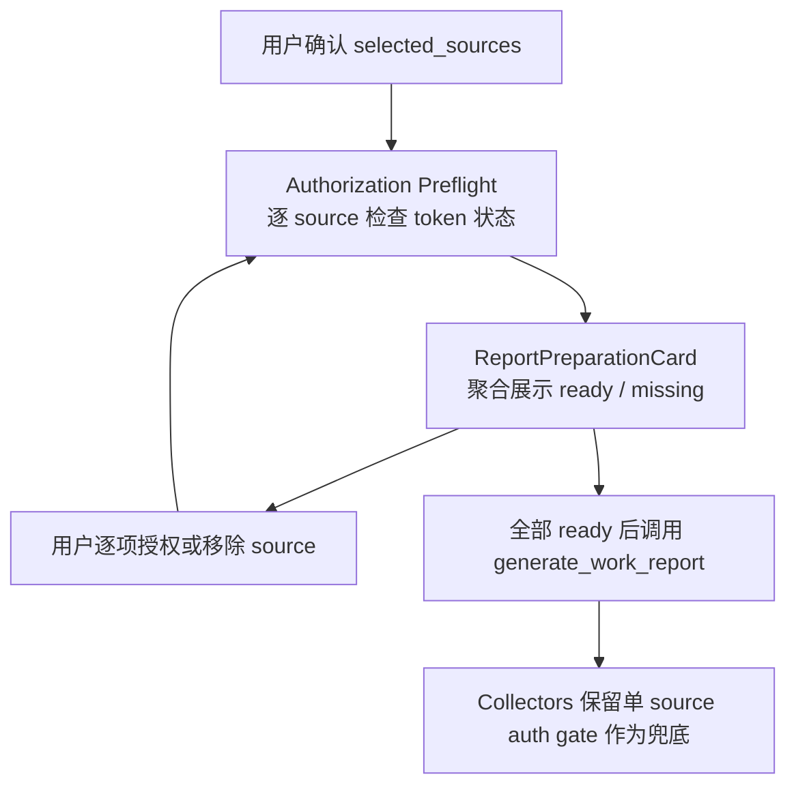
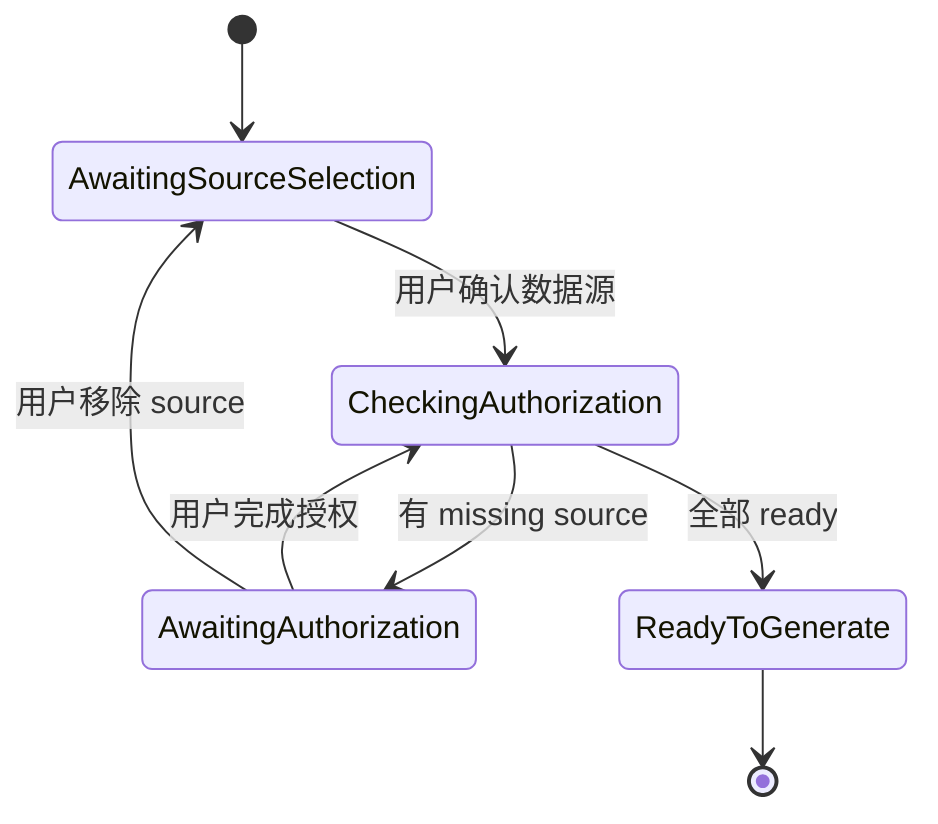
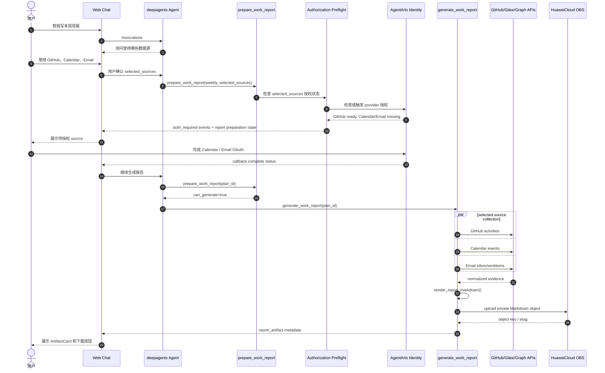
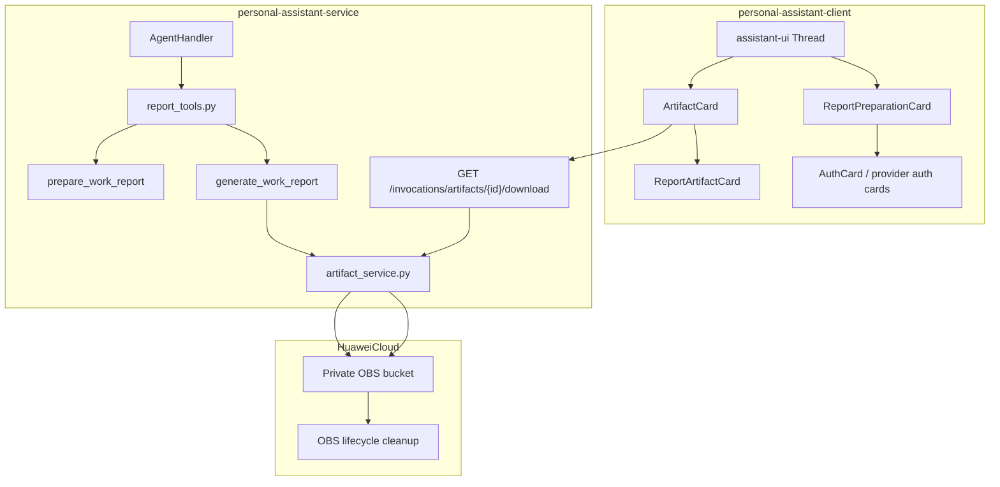
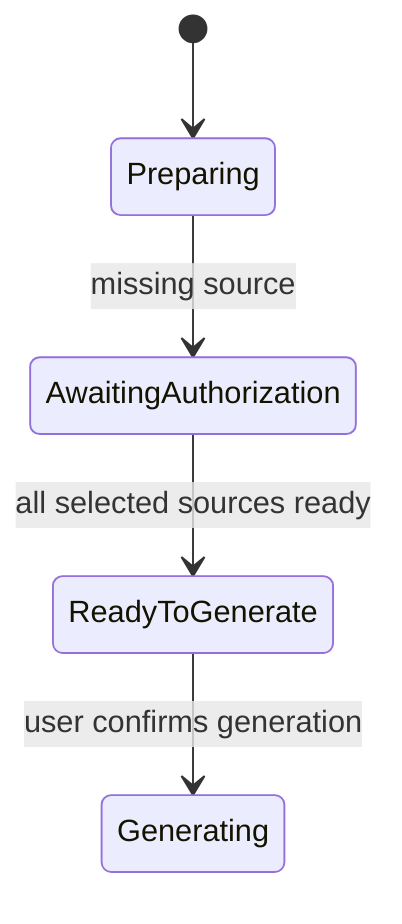
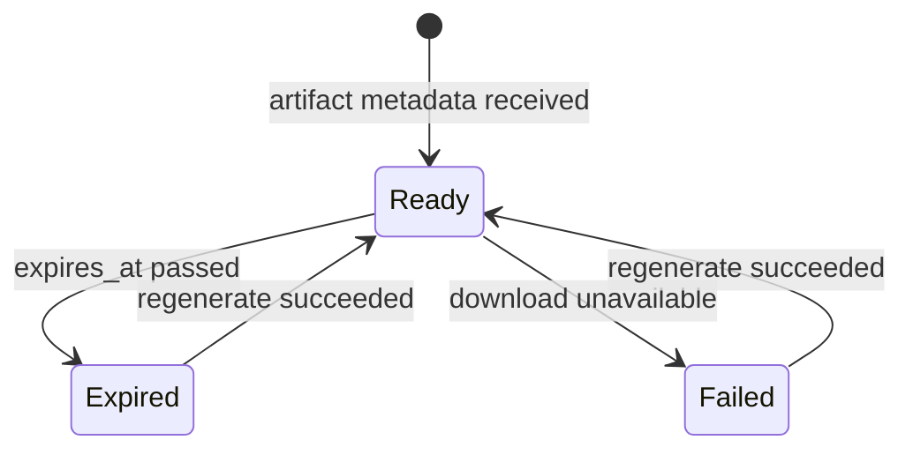

# 方案三：准备阶段 + OBS Artifact 工作报告设计

本文档描述第三种工作报告方案：先完成数据源选择与授权准备，再生成报告文件 artifact。该方案把“用户确认 / 授权准备”和“采集 / 渲染 / 下载”拆成两个阶段，避免报告生成过程中突然跳过未授权数据源，也避免前端从 Markdown 注释里猜测下载文件。

## 1. 设计原则

### 1.1 First Principles

工作报告功能的核心对象不是一段普通聊天文本，而是用户委托 Agent 生成的个人工作数据 artifact。它同时涉及用户意图、第三方授权、敏感数据、文件生命周期和下载权限。

因此方案三固定以下原则：

1. **数据源必须由用户确认**：系统不能默认悄悄读取所有可用 source。用户要知道报告使用 GitHub、Gitee、Calendar、Email 中的哪些数据。
2. **授权准备先于正式生成**：如果用户选择了某个 source，正式生成前必须确认该 source 已授权。未授权时先引导授权，不自动跳过。
3. **事实处理必须确定性**：分页、限流、去重、错误降级和 evidence normalization 由 Service 代码负责，不交给 LLM 临场决定。
4. **报告 artifact 是一等对象**：报告文件有 `artifact_id`、文件名、content type、过期时间、下载权限和审计日志，不藏在 Markdown marker 中。
5. **Agent 负责意图和解释**：deepagents 用于理解用户请求、确认数据源、解释准备状态和后续改写；不作为 API fanout 的唯一编排器。
6. **敏感数据最小化存储**：OBS 只保存最终 Markdown，默认不保存原始邮件正文、OAuth token 或完整 raw API response。

## 2. 高层流程



高层流程图只表达产品阶段，不展开 API 调用、OAuth 跳转、collector 并发、Markdown 渲染和 OBS 上传。那些实现细节放在后面的 sequence diagram 和组件图里。

## 3. 阶段一：准备阶段

准备阶段的目标是把报告生成前的可变因素固定下来：

- 报告类型：`daily` / `weekly` / `monthly`
- 报告周期：`period.start`、`period.end`
- 用户选择的数据源：`selected_sources`
- 数据源授权状态：`ready` / `missing_authorization` / `failed`
- 可选 scope：仓库白名单、最大采集数量、是否包含邮件收件箱等

### 3.1 什么是 Authorization Preflight

Authorization Preflight 指“授权预检”：在正式采集数据和生成报告前，系统先检查用户已确认的数据源是否具备可用授权。它不是让用户授权的动作本身，而是一个生成前的 gate。

这个预检只做四件事：

- 读取用户选择的 `selected_sources`。
- 检查每个 source 对应的 OAuth credential 是否存在、是否过期、scope 是否满足报告生成需要。
- 返回 `ready_sources`、`missing_sources` 和必要的 `auth_url`。
- 决定当前 `report_plan` 是否可以进入正式生成，也就是 `can_generate`。

Authorization Preflight 不会调用 GitHub、Gitee、Calendar、Email 等业务 API 拉取报告素材，也不会生成报告正文。它的价值是把授权问题提前暴露出来：如果用户选择了 Calendar 但还没授权，系统应先展示授权准备面板；只有用户完成授权、移除该 source，或明确选择跳过后，才进入正式生成阶段。

### 3.2 当前 AgentArts SDK 支持情况

当前项目锁定的 `agentarts-sdk` 版本是 `0.1.3`。这个版本没有暴露一个直接的 `is_authorized(provider_name, scopes)` 或 `check_authorization_status(...)` 公共 API。SDK 已支持的相关能力是：

- `@require_access_token(...)`：装饰业务函数。调用函数时，SDK 先尝试获取 OAuth2 access token；如果 token 已存在，就把 token 注入函数参数；如果 token 缺失，就生成 authorization URL 并进入轮询。
- `IdentityClient.get_resource_oauth2_token(...)`：更底层地执行同一件事。返回 access token 代表授权可用；返回 authorization URL 代表需要用户授权。
- `IdentityClient.client.get_resource_oauth2_token(...)`：华为云 Agent Identity SDK 的原始接口调用，REST path 为 `POST /v1/oauth2/token`。它直接返回 `GetResourceOauth2TokenResponse`，不自动进入装饰器函数或业务工具。

因此，Authorization Preflight 可以基于现有 SDK 实现，但它不是 SDK 原生的一行状态查询。推荐实现方式是封装一个 Service helper，直接调用 `GetResourceOauth2Token` 原始接口：只做一次 token 获取尝试，不调用业务 API，不等待用户完成授权。

伪代码：

```python
async def check_oauth2_authorization(
    *,
    provider_name: str,
    scopes: list[str],
    callback_url: str | None,
    custom_state: str,
) -> dict[str, Any]:
    identity = IdentityClient(region=get_settings().agentarts_region)
    response = identity.client.get_resource_oauth2_token(
        GetResourceOauth2TokenRequest(
            body=GetResourceOauth2TokenRequestBody(
                resource_credential_provider_name=provider_name,
                workload_access_token=AgentArtsRuntimeContext.get_workload_access_token(),
                oauth2_flow="USER_FEDERATION",
                scopes=scopes,
                resource_oauth2_return_url=callback_url,
                custom_state=custom_state,
                force_authentication=False,
            )
        )
    )

    if response.access_token:
        return {"status": "ready"}

    if response.authorization_url:
        return {
            "status": "missing_authorization",
            "auth_url": response.authorization_url,
            "session_uri": response.session_uri,
        }

    return {
        "status": "failed",
        "session_status": response.session_status,
    }
```

这个实现绕过 `@require_access_token` 装饰器，直接使用 Agent Identity 的 `GetResourceOauth2Token` 响应来判断状态：有 `access_token` 即 `ready`；有 `authorization_url` 即 `missing_authorization`；其他情况视为 `failed`。真实实现里不应把 access token 返回给 Agent 或前端，只返回状态、provider、source、scope 摘要、`auth_url` 和必要的 `session_uri`。如果 SDK 后续提供正式的 credential status API，应优先替换成官方状态查询接口，避免为 preflight 创建临时授权 session。

注意：preflight 不应该在每次页面重渲染时反复调用，否则可能创建多个授权 session。建议只在用户确认数据源、OAuth callback 完成、或用户点击“重新检查授权”时触发，并把 `auth_url` / `session_uri` 绑定到当前 `report_plan`。

### 3.3 第一阶段授权编排方案评估

第一阶段要解决的问题不是“怎样调用 OAuth”，而是“在什么时候、用什么 UI、以什么粒度让用户完成授权”。如果这个决策不清楚，后续实现很容易变成生成过程中多个 tool 轮流弹授权，用户不知道本次报告到底用了哪些数据源。

#### 3.3.1 流程方案

| 方案 | 做法 | 优点 | 风险 | 适用场景 |
|---|---|---|---|---|
| A. Preflight 后授权 | 用户确认 `selected_sources` 后，Service 逐个 source 调用 `GetResourceOauth2Token` 做授权预检；已授权 source 标记 ready，未授权 source 返回 `auth_url` | 用户在生成前就知道哪些 source 可用；不会正式生成到一半才弹授权；适合聚合展示多个待授权 source | 多一次准备阶段调用；需要避免反复创建授权 session | 方案三主流程 |
| B. 不做 preflight，确认数据源后直接请求授权 | 用户确认 `selected_sources` 后，系统直接为所有选中 source 创建授权入口，不先区分已有授权和缺失授权 | 流程表面简单；用户确认后马上进入授权动作 | 已授权 source 也可能被重复打扰；需要处理不必要的授权 session；难以表达哪些 source 已 ready | 少量 source 且授权状态不可查时的退路 |
| C. 不做 preflight，等业务 tool 调用时触发授权 | 正式生成时调用 GitHub、Gitee、Calendar、Email collector；哪个 tool 缺 token，哪个 tool 的 `@require_access_token` 触发 AuthCard | 最接近当前工具模式；实现成本最低 | 授权问题发生在生成中途；多 source 授权顺序不可控；用户可能看到部分报告、缺口和授权入口混在一起 | 轻量原型或单 source tool |

分析结论：

- A 最符合方案三的核心目标：正式生成前完成准备，生成阶段只处理已经确认并授权的数据源。
- B 看起来省掉了 preflight，但实际上会把“状态判断”转移给用户：用户需要自己分辨哪些 source 已授权、哪些 source 需要重新授权。
- C 可以保留为 collector 层兜底，但不应该作为第一阶段主流程，因为它会让“准备阶段”和“正式生成阶段”重新耦合。

选择理由：

方案三选择 **A. Preflight 后授权**。原因是工作报告是多源聚合任务，最重要的用户承诺是“我将基于这些已确认的数据源生成报告”。只有先做 preflight，系统才能在生成前明确回答三个问题：哪些 source 会被使用、哪些 source 还需要授权、用户是否愿意移除或跳过未授权 source。

#### 3.3.2 授权实现与 UI 方案

| 方案 | 做法 | 优点 | 风险 | 结论 |
|---|---|---|---|---|
| D. 多个业务 tool 各自单装饰器 | GitHub、Gitee、Calendar、Email collector 各自使用一个 `@require_access_token` | 和当前工具模式一致；source 边界清晰；适合作为正式生成阶段的安全防线 | 授权触发偏懒，可能在生成过程中才出现；多个 AuthCard 状态容易分散 | 保留为兜底，不作为准备阶段主编排 |
| E. 一个大 tool 叠多个装饰器 | 在 `generate_work_report` 或类似大工具上堆多个 `@require_access_token` | 表面上能保证函数执行前拿到多个 token | 装饰器顺序、错误归因、partial ready、用户取消、多 provider UI 都会变复杂；也会把数据源选择和授权绑定死 | 不推荐 |
| F. 一个聚合型准备 card | `prepare_work_report` 返回 `ready_sources` / `missing_sources`，前端用一个 `ReportPreparationCard` 展示所有 source 的状态和授权入口 | 用户看到一个准备面板；可逐项授权、移除 source、重新检查；和“全部 ready 后再生成”一致 | 需要前端新增聚合状态 UI | 方案三主 UI |

分析结论：

- D 是好的工具边界，但不是好的产品编排。它应该继续存在，因为 token 可能在 preflight 后过期或被用户撤销；但用户不应该主要通过多个分散 AuthCard 理解本次报告准备状态。
- E 把多 source 授权塞进一个函数调用，看起来集中，实际会制造隐式复杂度。多个装饰器的执行顺序会影响用户看到的授权顺序，也难以表达“GitHub ready、Calendar missing、Email skipped”这种 partial state。
- F 把授权状态当成准备阶段的业务状态，而不是 tool 调用副作用。它更适合报告生成这类多源任务，也更容易在 UI 中展示 source 列表、授权入口、重新检查和移除 source。

选择理由：

方案三选择 **F. 一个聚合型 `ReportPreparationCard`** 作为第一阶段 UI，同时保留 **D. 多个业务 tool 各自单装饰器** 作为正式生成阶段兜底。这样可以同时获得两个好处：用户体验上是一个清楚的准备面板，工程上仍然保留每个 source 的最小权限边界和 token 防线。

不选择 **E. 一个大 tool 叠多个装饰器**，因为它会把多 source 授权、source 选择、错误恢复和业务采集合并到一个隐式调用链里。这个设计短期可能少写代码，但长期会让报告工具变成难测试、难解释、难扩展的中心化编排器。

推荐组合：



也就是说，准备阶段的主编排不是多个 AuthCard，也不是一个叠满装饰器的大 tool，而是：

- Service 用 `prepare_work_report` 做 source 选择和 preflight。
- 前端用一个 `ReportPreparationCard` 聚合展示多个 source 的授权状态。
- 正式生成阶段的 collector 仍可保留各自的 `@require_access_token`，防止 token 在准备完成后过期或被撤销。

### 3.4 准备阶段工具

```python
prepare_work_report(
    report_type: Literal["daily", "weekly", "monthly"],
    anchor_date: str | None = None,
    selected_sources: list[Literal["github", "gitee", "calendar", "email"]] | None = None,
    github_repositories: list[str] | None = None,
    gitee_repositories: list[str] | None = None,
) -> dict[str, Any]
```

返回结构：

```python
{
    "ok": True,
    "phase": "prepare",
    "report_plan": {
        "plan_id": "rplan_...",
        "report_type": "weekly",
        "period": {
            "timezone": "Asia/Shanghai",
            "start": "2026-06-29T00:00:00+08:00",
            "end": "2026-07-06T00:00:00+08:00",
        },
        "selected_sources": ["github", "calendar", "email"],
    },
    "authorization": {
        "ready_sources": ["github"],
        "missing_sources": [
            {
                "source": "calendar",
                "provider": "m365-calendar-provider",
                "auth_url": "https://...",
                "message": "日历功能需要授权后才能用于周报。",
            }
        ],
    },
    "can_generate": False,
}
```

### 3.5 授权策略

用户选择的数据源全部 ready 后才能进入正式生成。未授权 source 的默认处理不是自动跳过，而是进入授权准备状态。

如果用户明确说“未授权的先跳过”，Agent 可以更新 `selected_sources` 后重新执行准备阶段。跳过必须是用户明确选择，而不是系统静默降级。

### 3.6 准备阶段状态图



## 4. 阶段二：正式生成阶段

正式生成阶段只处理已经确认并授权的数据源：

```python
generate_work_report(
    plan_id: str,
    max_items_per_source: int = 50,
) -> dict[str, Any]
```

返回结构：

```python
{
    "ok": True,
    "phase": "generated",
    "report_artifact": {
        "artifact_id": "rpt_...",
        "type": "work_report",
        "filename": "work-report-weekly-2026-06-29_2026-07-05.md",
        "content_type": "text/markdown;charset=utf-8",
        "size_bytes": 18342,
        "source_summary": ["github", "calendar", "email"],
        "created_at": "2026-07-07T12:00:00+08:00",
        "expires_at": "2026-07-14T12:00:00+08:00",
        "download_url": "/invocations/artifacts/rpt_.../download",
    },
    "source_counts": {"github": 8, "calendar": 5, "email": 10},
    "warnings": [],
}
```

Service 可以同时在 assistant message 中返回简短摘要，但下载文件以 `report_artifact` 为准。

## 5. Sequence Diagram



## 6. 组件图



## 7. OBS Artifact 设计

OBS bucket 必须是 private，不允许 public read。推荐 object key：

```text
reports/{user_hash}/{artifact_id}.md
```

约束：

- `user_hash` 使用不可逆 hash，不放邮箱、姓名或 user id 明文。
- `artifact_id` 使用随机 ID，不从报告标题或日期直接推导。
- Object metadata 只保存非敏感字段，例如 artifact type、content type、created_at。
- 通过短期 signed URL 或 Service 鉴权下载 route 访问文件。
- 默认保留 7 天或 30 天，由 OBS lifecycle 自动清理。
- 日志记录 artifact_id、user_hash、size、request_id，不记录报告全文。

### 7.1 下载方式选择

| 方式 | 描述 | 优点 | 风险 | 建议 |
|---|---|---|---|---|
| 后端鉴权下载 route | 前端请求 `/invocations/artifacts/{id}/download`，Service 校验 user_id 后从 OBS 读取或生成签名 URL | 权限边界清晰，可统一审计 | Service 多一条 route | 推荐 |
| 短期 signed URL | Service 返回短期 OBS signed URL | 实现简单，下载不占 Service 带宽 | URL 泄露窗口内可被访问 | 可作为优化 |
| Public OBS URL | 文件公开访问 | 最简单 | 不符合隐私要求 | 禁止 |

## 8. Card 预览与状态边界

方案三不应该让一个 card 承担“选择数据源、补授权、生成进度、文件下载、过期重试”的完整生命周期。聊天窗口里建议拆成两个 UI 单元：

- `ReportPreparationCard`：只负责准备阶段，展示已选数据源、缺失授权和“开始生成”动作。
- `ReportArtifactCard`：只负责生成后的文件 artifact，展示文件信息、下载、过期和重新生成入口。

以下是 `ReportArtifactCard` 的文字 wireframe，真实实现应使用 design tokens 和现有 AuthCard / tool UI 的视觉语言：

```text
┌──────────────────────────────────────────────────────────────┐
│  [FileTextIcon]  本周周报.md                                  │
│                 Markdown 报告已生成 · 18 KB · 7 天后过期       │
│                 数据源：GitHub、Calendar、Email               │
│                                                              │
│                                            [下载] [重新生成]  │
└──────────────────────────────────────────────────────────────┘
```

### 8.1 准备阶段状态

准备阶段属于 `ReportPreparationCard`，不属于 `ReportArtifactCard`：



### 8.2 ArtifactCard 状态

`ReportArtifactCard` 只展示稳定的文件状态，不展示 `uploading` / `downloading` 这类瞬时操作状态：

- `ready`：文件已生成，可下载。
- `expired`：文件已过期，需要重新生成。
- `failed`：文件生成失败或下载入口不可用。

上传过程属于后端生成流程，失败时用 assistant error message 或 `ReportPreparationCard` 的生成失败状态表达。下载过程属于按钮交互，按钮可以短暂显示 loading / disabled，但不改变 card 的主状态。



这样 `ReportArtifactCard` 的职责只是“展示一个文件结果”，而不是编排生成流程。

## 9. deepagents 使用边界

方案三仍然使用 deepagents，但不让 deepagents 独自承担 API fanout：

- deepagents 主 Agent 负责理解用户意图、确认数据源、调用 `prepare_work_report` 和 `generate_work_report`。
- Service collectors 负责实际 API fanout：分页、限流、并发、重试、去重和错误降级。
- 后续可以把 source-specific evidence summarization 放入 deepagents `SubAgent`，例如 `github-report-analyst` 或 `communication-report-analyst`。
- SubAgent 只处理已采集、已脱敏、已截断的 evidence，不直接持有 OAuth credential，也不直接决定授权策略。

这样既利用 deepagents 的对话与多工具规划能力，又保留授权、安全和外部 API 调用的确定性边界。

## 10. 测试计划

Service tests：

- `prepare_work_report` 在未选择 source 时返回待确认状态。
- `prepare_work_report` 在 selected source 缺授权时返回 `missing_sources`，不调用 collectors。
- 用户移除未授权 source 后可进入 `can_generate=true`。
- `generate_work_report` 只采集 `report_plan.selected_sources`。
- collector 并发不会超过每 source 的 request budget。
- `render_report_markdown` 生成固定章节和安全 Markdown。
- OBS upload 使用 private bucket 和安全 object key。
- 下载 route 校验当前 Gateway user_id 与 artifact owner 匹配。
- 过期 artifact 下载返回可理解错误。

Client tests：

- `ReportPreparationCard` 展示 selected / missing / ready source。
- 同一报告准备消息可展示多个 provider 授权入口。
- `ReportArtifactCard` 展示 filename、source summary、expires_at 和下载按钮。
- 点击下载调用 artifact download URL。
- 过期、下载失败、重新生成入口都有可见状态。

E2E tests：

- 用户选择 GitHub + Calendar，Calendar 未授权时先展示授权准备面板。
- 完成授权后再生成报告。
- 报告生成成功后展示 artifact card，下载 Markdown 内容正确。
- 用户选择跳过未授权 source 时，报告只包含剩余 selected source，并在缺口中说明。
