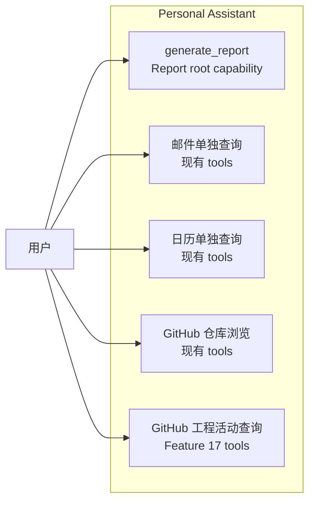

# Feature 18: Report Root Capability

本 Feature 新增用户可见的 **Report（报表）root capability**。用户可以通过自然语言生成日/周/月报、工作总结或研发进展总结。Report 能力统一编排多个 data source，包括现有 Email / Calendar tools，以及 Feature 17 提供的 GitHub MCP internal activity source。Feature 17 的 Agent-visible GitHub activity tools  继续服务独立工程活动查询，但不是 Report 的调用依赖。

Implementation Plan 见 [plan.md](./plan.md)。

## 背景

当前 Personal Assistant 已有多个低层 tools，但日报 / 周报 / 月报不是简单的 tool 串联问题：

- 用户表达的是“生成报表”这个高层目标；
- Service 需要统一解析 report type、时间窗口、timezone 和 source selection；
- 各 source 需要归一化为可引用证据；
- 单个 source 失败时不能让整份报表失败；
- LLM 不应临时决定如何串联 Email、Calendar 和 GitHub MCP 原子工具。

因此 Report 应作为用户视角的 root capability，以 `generate_report` high-level tool 形式存在。Report 直接复用 GitHub MCP internal activity source，不通过 Feature 17 的 Agent-facing tool object 串联数据采集。

图类型：**Use Case Diagram（用例图）**。用于说明用户视角的 Report 能力边界。

## 目标

- 新增 Agent 可见的 `generate_report` high-level tool，作为日/周/月报、工作总结和研发进展总结的 root entry。
- `sources` 未传时默认同时采集 GitHub、Email 和 Calendar；用户显式指定时仅采集指定 source。
- 用户给出单个日期时以该日期作为自然日/周/月锚点；给出起止日期时严格使用该范围，
  不得回退到当前日期或当前周期。
- `generate_report` 内部复用现有 Email / Calendar functions。
- Email 默认读取 `inbox` 和 `sentitems`，并按规范化 report window 过滤证据。
- `generate_report` 在需要工程活动数据时先通过 GitHub OAuth 确认主体账号 A，再调用
  Feature 17 的 GitHub MCP activity source。
- `generate_report` 直接依赖 typed internal source contract，以 `actor=A` 和 OAuth
  repository allowlist 读取活动，不调用 `github_search_activity` Agent tool object，也不
  回退到 platform repository discovery。
- 输出统一的 `ReportEvidence` / `ReportResult`。
- 首期使用 deterministic Markdown renderer 生成正文，不在 tool 内发起额外 LLM 调用。
- 报告生成完成后通过 custom SSE 发送原始 Markdown artifact，Web Chat 在报告正文下方
  展示与 OAuth Auth Card 状态语言一致的下载卡片。
- 授权结束后通过结构化 `report_progress` custom SSE 持续展示采集阶段与安全计数；
  GitHub 长耗时分页和详情补充期间不得出现无可见反馈的静默阶段。
- 用户点击下载后，支持浏览器原生“另存为”选择文件名与本机目录；不支持 File System
  Access API 的浏览器回退为标准 `.md` 下载。
- 支持 source partial failure：单个 source 失败时返回 warning，并继续生成部分报表。
- GitHub 工程活动全局最多 100 条，且在分页 cursor 翻完后再做截断与 detail 补充。
- 更新 prompt / tool selection 规则，让 Agent 默认选择 `generate_report`，而不是临时串联多个 low-level tools。

## 范围

### 包含

- `app/tools/report_tools.py`：
  - `generate_report`；
  - report window resolver；
  - source selection；
  - evidence normalization；
  - warning aggregation。
- 复用现有 `email_tools.py` / `calendar_tools.py` 中的 async functions。
- 为 GitHub、Email、Calendar 增加仅供 Report 内部使用的 OAuth preflight；所有选中
  source 完成授权判定后才进入数据采集阶段。
- 接入 Feature 17 的 `github_mcp_search_activity` / `github_mcp_get_detail`。
- 新增 `ReportEvidence` / `ReportResult` 类型。
- 新增 `report_ready` SSE event、按 assistant message 隔离的 Report Download Store、
  Markdown 保存 helper 与 `ReportDownloadCard`。
- 新增 `report_progress` SSE event、按 assistant message 隔离且防乱序的 Report Progress
  Store 与普通文档流 `ReportProgressCard`；`report_ready` 到达后由下载卡接管。
- Auth Card Store 支持同一 assistant message 下多个 provider card 按到达顺序并存，
  后续授权事件不得覆盖先前 card。
- 更新 `SYSTEM_PROMPT` 的报表工具选择规则。
- 单元测试、集成测试和 E2E 覆盖日/周/月报、partial failure 和 GitHub source 可选接入。

### 不包含

- 不创建 / 更新 AgentArts MCP Gateway 或 GitHub MCP Target；这些由 Feature 17 完成。
- 不实现 GitHub MCP 底层 IAM / STS / PAT 接入。
- 不迁移 Email / Calendar tools 到 MCP Gateway。
- 不提供 raw MCP passthrough。
- 不实现报表导出为 PDF / DOCX / PPT；后续可由 Sandbox / documents capability 扩展。
- 不实现报表偏好长期记忆；后续由 Memory skill 扩展。
- 不把 report artifact 持久化到 Conversation history；本期专用下载卡针对实时生成事件，
  页面刷新后的 artifact 恢复另行设计。

## 验收标准

### AC1：Report root tool 可用

- [ ] `build_tools()` 注册 `generate_report`。
- [ ] 用户请求“生成今天的日报 / 本周周报 / 本月月报”时，Agent 优先调用 `generate_report`。
- [ ] `generate_report` 能解析 daily / weekly / monthly / custom 时间窗口。
- [ ] 用户显式给定日期或日期范围时，Report 严格使用该日期，不能替换为今天、本周或本月。
- [ ] 未传 `sources` 时默认启用 `github`、`email`、`calendar`；显式指定时遵循用户选择。
- [ ] `generate_report` 输出 `ReportResult`，包含正文、证据、warnings 和 source coverage。
- [ ] `content` 由 deterministic Markdown renderer 生成，相同输入产生稳定结构。

### AC2：复用 Email / Calendar

- [ ] Report 直接复用现有 Email / Calendar functions。
- [ ] Email source 默认读取 `inbox` 和 `sentitems`，并按 report window 过滤邮件证据。
- [ ] 不新增重复的 Email / Calendar MCP tools。
- [ ] 邮件或日历 source 单独失败时，返回 warning 并继续使用其他 source。

### AC3：接入 GitHub activity source

- [ ] 当 `GITHUB_MCP_ENABLED=true` 且报表需要工程活动时，Report 调用 Feature 17 的 GitHub MCP activity source。
- [ ] 当 GitHub source unavailable 时，Report 返回 warning 并继续生成 Email / Calendar 报表。
- [ ] GitHub 尚未授权时先触发 `auth_required` Auth Card 并等待用户授权；只有授权失败或
  超时后才将 GitHub source 降级为 warning。
- [ ] GitHub source 先通过 OAuth `/user` 确认主体账号 A，再枚举 `/user/repos` 形成仓库 allowlist。
- [ ] GitHub source 以 `actor=A` 读取 A 自己的活动，不回退到 platform actor 或 platform repository discovery。
- [ ] GitHub source 在分页 cursor 翻完后再按全局最多 100 条截断，并为选中活动补充 detail。

### AC3A：授权阶段先于采集阶段

- [ ] 默认 sources 按 `GitHub -> Email -> Calendar` 串行完成 OAuth preflight；第三项完成
  或失败前，不得发起任何 GitHub API/MCP、Email Graph 或 Calendar Graph 数据请求。
- [ ] 显式 `sources` 只授权被选中的 source，但授权顺序始终取上述 canonical order 的子集。
- [ ] 单个 source 授权失败或超时后继续检查后续 provider；全部授权尝试结束后，仅采集
  已授权 source，并为失败项返回脱敏 warning 与 `unavailable` coverage。
- [ ] Report 内部 access token 不进入 public tool schema、结果、SSE、日志或 dataclass repr。

### AC4：工具选择边界清晰

- [ ] 生成日/周/月报、工作总结、研发进展总结时，Agent 优先使用 `generate_report`。
- [ ] 邮件 / 日历单独查询继续使用现有 Microsoft 365 tools。
- [ ] GitHub 仓库浏览、文件读取、代码搜索和 star 继续使用现有 GitHub local tools。
- [ ] 单独查询指定仓库和时间窗口内的工程活动时，继续使用 Feature 17 的 `github_search_activity`。
- [ ] Report 直接调用 Feature 17 internal source，不通过 Agent-facing GitHub activity tools 采集数据。

### AC5：凭据不泄露

- [ ] `generate_report` schema 不包含 `access_token`、`api_key`、`secret`、PAT、AK/SK 或 STS 字段。
- [ ] Report warning 不包含 token、PAT、AK/SK、STS 或签名 header。
- [ ] SSE、日志、tool result 和 LLM-visible error 不包含 credential。

### AC6：Markdown 报告可下载

- [ ] `generate_report` 完成后发送 `report_ready` custom SSE event，携带 deterministic
  renderer 生成的原始 Markdown、报告类型、时间窗口和安全的 `.md` 建议文件名。
- [ ] Web Chat 仅在对应 assistant message 的报告正文下方显示专用下载卡，不影响普通
  assistant message、Feature 17 GitHub activity tools 或 OAuth Auth Card。
- [ ] 同一 assistant message 的 GitHub、Email、Calendar Auth Card 按到达顺序纵向并存；
  新 card、完成/失败事件、单卡关闭或 `report_ready` 均不得替换或清除其他 card。
- [ ] 下载卡的 pending / saved / failed 状态与 GitHub、Email、Calendar OAuth Card 的
  蓝 / 绿 / 红视觉语义一致。
- [ ] 支持原生“另存为”；用户取消时不产生 fallback 文件，浏览器不支持原生 picker 时
  回退为标准 `.md` 下载。
- [ ] 保存内容与 `ReportResult.content` 完全一致，并使用 UTF-8 Markdown MIME type。

### AC7：长耗时采集具有实时进度

- [ ] 授权阶段仍按 `GitHub -> Email -> Calendar` 串行完成；全部授权尝试结束后，已授权
  source 使用 `asyncio.gather` 跨 source 并行采集，结果仍按用户选择顺序确定性合并。
- [ ] 最后一个授权尝试结束后立即发送可见进度；GitHub context、活动分页、详情补充、
  Email、Calendar 和 Markdown rendering 均有明确 stage，详情阶段显示真实 `current / total`。
- [ ] GitHub 搜索总量未知时使用 indeterminate 状态和已发现数量，不展示伪百分比；进度
  更新进行 300-500ms 节流，stage 切换与 terminal 状态不得被节流丢弃。
- [ ] `report_progress` 仅包含单调递增 `sequence`、枚举字段和非负计数，不包含
  `system_message`、token、cursor、仓库名、邮件主题或原始异常。
- [ ] 进度面板按 `assistantMessageId` 隔离，位于 Auth Card 下方的普通文档流中；桌面和移动端
  均不得覆盖授权 UI、正文或下载卡，也不得造成横向滚动。
- [ ] `report_ready` 或 stream error 将进度状态置为 terminal；迟到或重复 sequence 不得让
  进度面板重新出现，进度事件不得进入正文或 Conversation history。

## 依赖

- Feature 17：GitHub MCP activity data source。
- 现有 Email / Calendar tools。
- 现有 Agent / ToolNode / `build_tools()` 注册机制。

## 参考

- [plan.md](./plan.md)
- [Feature 17: GitHub MCP Activity Data Source](../feature-17-github-mcp-data-source/issue.md)
