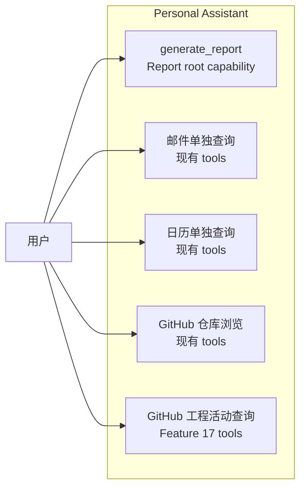

# Feature 18: Report Root Capability

本 Feature 新增用户可见的 **Report（报表）root capability**。用户可以通过自然语言生成日/周/月报、工作总结或研发进展总结。Report 能力统一编排多个 data source，包括现有 Email / Calendar tools，以及 Feature 17 提供的 GitHub MCP internal activity source。Feature 17 的 Agent-visible GitHub activity tools  继续服务独立工程活动查询，但不是 Report 的调用依赖。

Implementation Plan 见 [plan.md](./plan.md)。

## 背景

当前 Personal Assistant 已有多个低层 tools，但日报 / 周报 / 月报不是简单的 tool 串联问题：

- 用户表达的是“生成报表”这个高层目标；
- Service 需要统一解析 report type、时间窗口、timezone 和 source selection；
- 各 source 需要归一化为可引用证据；
- 单个 source 失败时不能让整份报表失败；
- LLM 不应临时决定如何串联 Email、Calendar 和 GitHub MCP 原子工具。

因此 Report 应作为用户视角的 root capability，以 `generate_report` high-level tool 形式存在。Report 直接复用 GitHub MCP internal activity source，不通过 Feature 17 的 Agent-facing tool object 串联数据采集。

图类型：**Use Case Diagram（用例图）**。用于说明用户视角的 Report 能力边界。

## 目标

- 新增 Agent 可见的 `generate_report` high-level tool，作为日/周/月报、工作总结和研发进展总结的 root entry。
- `generate_report` 内部复用现有 Email / Calendar functions。
- `generate_report` 在需要工程活动数据时调用 Feature 17 的 GitHub MCP activity source。
- `generate_report` 直接依赖 typed internal source contract，不调用 `github_search_activity` Agent tool object。
- 输出统一的 `ReportEvidence` / `ReportResult`。
- 支持 source partial failure：单个 source 失败时返回 warning，并继续生成部分报表。
- 更新 prompt / tool selection 规则，让 Agent 默认选择 `generate_report`，而不是临时串联多个 low-level tools。

## 范围

### 包含

- `app/tools/report_tools.py`：
  - `generate_report`；
  - report window resolver；
  - source selection；
  - evidence normalization；
  - warning aggregation。
- 复用现有 `email_tools.py` / `calendar_tools.py` 中的 async functions。
- 接入 Feature 17 的 `github_mcp_search_activity` / `github_mcp_get_detail`。
- 新增 `ReportEvidence` / `ReportResult` 类型。
- 更新 `SYSTEM_PROMPT` 的报表工具选择规则。
- 单元测试、集成测试和 E2E 覆盖日/周/月报、partial failure 和 GitHub source 可选接入。

### 不包含

- 不创建 / 更新 AgentArts MCP Gateway 或 GitHub MCP Target；这些由 Feature 17 完成。
- 不实现 GitHub MCP 底层 IAM / STS / PAT 接入。
- 不迁移 Email / Calendar tools 到 MCP Gateway。
- 不提供 raw MCP passthrough。
- 不实现报表导出为 PDF / DOCX / PPT；后续可由 Sandbox / documents capability 扩展。
- 不实现报表偏好长期记忆；后续由 Memory skill 扩展。

## 验收标准

### AC1：Report root tool 可用

- [ ] `build_tools()` 注册 `generate_report`。
- [ ] 用户请求“生成今天的日报 / 本周周报 / 本月月报”时，Agent 优先调用 `generate_report`。
- [ ] `generate_report` 能解析 daily / weekly / monthly / custom 时间窗口。
- [ ] `generate_report` 输出 `ReportResult`，包含正文、证据、warnings 和 source coverage。

### AC2：复用 Email / Calendar

- [ ] Report 直接复用现有 Email / Calendar functions。
- [ ] 不新增重复的 Email / Calendar MCP tools。
- [ ] 邮件或日历 source 单独失败时，返回 warning 并继续使用其他 source。

### AC3：接入 GitHub activity source

- [ ] 当 `GITHUB_MCP_ENABLED=true` 且报表需要工程活动时，Report 调用 Feature 17 的 GitHub MCP activity source。
- [ ] 当 GitHub source unavailable 时，Report 返回 warning 并继续生成 Email / Calendar 报表。
- [ ] GitHub source 使用 `actor = platform` 语义，不表达 Web Chat 当前用户的 GitHub 活动。

### AC4：工具选择边界清晰

- [ ] 生成日/周/月报、工作总结、研发进展总结时，Agent 优先使用 `generate_report`。
- [ ] 邮件 / 日历单独查询继续使用现有 Microsoft 365 tools。
- [ ] GitHub 仓库浏览、文件读取、代码搜索和 star 继续使用现有 GitHub local tools。
- [ ] 单独查询指定仓库和时间窗口内的工程活动时，继续使用 Feature 17 的 `github_search_activity`。
- [ ] Report 直接调用 Feature 17 internal source，不通过 Agent-facing GitHub activity tools 采集数据。

### AC5：凭据不泄露

- [ ] `generate_report` schema 不包含 `access_token`、`api_key`、`secret`、PAT、AK/SK 或 STS 字段。
- [ ] Report warning 不包含 token、PAT、AK/SK、STS 或签名 header。
- [ ] SSE、日志、tool result 和 LLM-visible error 不包含 credential。

## 依赖

- Feature 17：GitHub MCP activity data source。
- 现有 Email / Calendar tools。
- 现有 Agent / ToolNode / `build_tools()` 注册机制。

## 参考

- [plan.md](./plan.md)
- [Feature 17: GitHub MCP Activity Data Source](../feature-17-github-mcp-data-source/issue.md)
