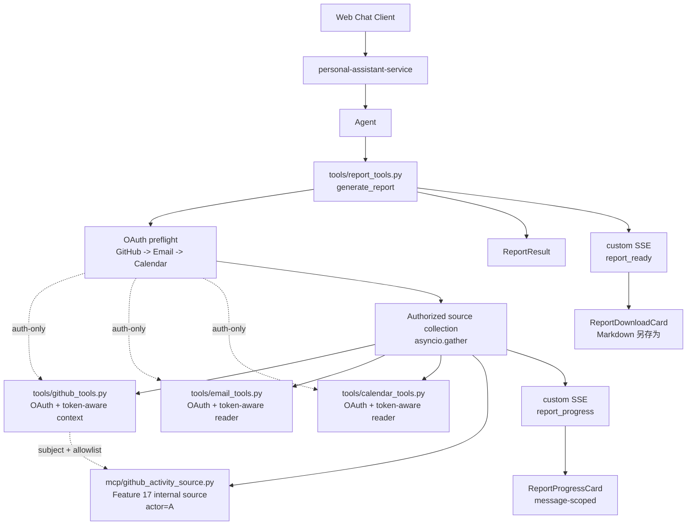
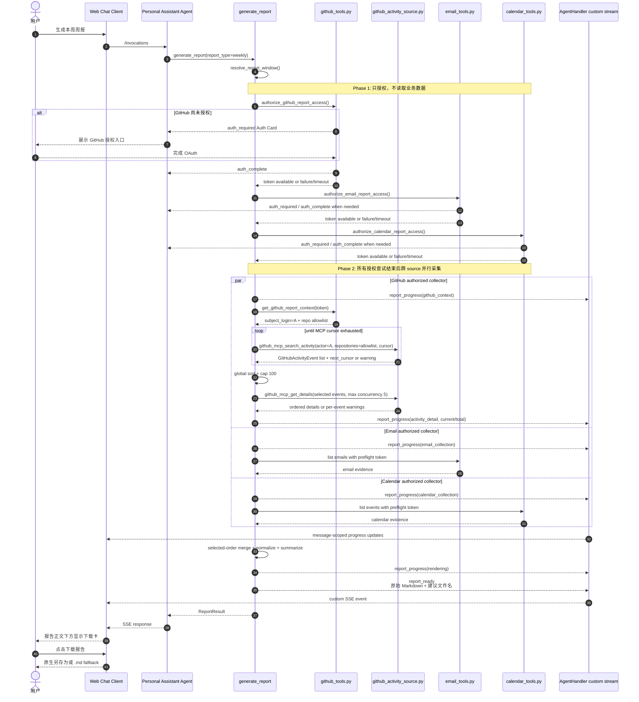

# Feature 18：Report Root Capability Implementation Plan

> 状态：Implementation Complete / Deployment Validation Pending
> 日期：2026-07-17
> 范围：新增 `generate_report` root tool，复用现有 Email / Calendar tools，接入 Feature 17 的 GitHub MCP activity data source，并为 Web Chat 提供 Markdown 下载卡。

## 1. 概要

本 Feature 的 root capability 是 **Report（报表）**：用户可以通过自然语言生成日/周/月报、工作总结或研发进展总结。Report 能力统一编排多个 data source，包括现有 Email / Calendar tools，以及 Feature 17 新增的 GitHub MCP internal activity source。Feature 17 的 Agent-visible GitHub activity tools 继续服务独立查询场景。

本 Feature 不处理 AgentArts MCP Gateway / GitHub Target 的底层接入；该基础能力由 Feature 17 提供。Report 只消费稳定的 source contract。

设计目标：

- 新增 Agent 可见的 `generate_report` high-level tool。
- `generate_report` 内部确定性编排 Email、Calendar、GitHub activity source，而不是依赖 LLM 自行串联多个 low-level tools。
- `sources` 为空时默认启用 `github`、`email`、`calendar`；用户显式指定时仅调用指定 source。
- 对已选 source 先按 `GitHub -> Email -> Calendar` 的 canonical order 串行完成 OAuth
  preflight，所有授权尝试结束后才开始任何远端数据采集。
- 授权成功的 source 在 preflight 全部结束后通过 `asyncio.gather` 跨 source 并行采集，
  采集完成顺序不改变 evidence、warning、coverage 和 context 的确定性合并顺序。
- 通过结构化 `report_progress` custom SSE 实时展示 GitHub context / search / detail、
  Email、Calendar 与 rendering 进度，`report_ready` 到达后由下载卡接管。
- Email source 默认读取 `inbox` 和 `sentitems`，再按规范化 report window 过滤证据。
- GitHub source 默认先通过当前 Web Chat 用户的 GitHub OAuth `/user` 确认主体账号 A，
  再全分页枚举 `/user/repos` 作为 A 可访问仓库 allowlist。
- Report 通过 Feature 17 MCP internal source 以 `actor=A` 查询 allowlist 内 A 自己的活动；
  MCP credential 仅表示 `data_access_identity=platform_mcp` 读取通道。
- 输出统一 `ReportEvidence` / `ReportResult`。
- 首期通过 deterministic Markdown renderer 生成正文，不在 tool 内追加 LLM 调用。
- 支持 source partial failure 和 warnings。
- 更新 prompt，使 Agent 在报表类请求中选择 `generate_report`。

## 2. 调用边界

```text
Agent 可见 root tool:
  generate_report(...)

generate_report 内部复用:
  - email_tools.py: Report auth-only helper + token-aware email reader
  - calendar_tools.py: Report auth-only helper + token-aware calendar reader
  - tools/github_tools.py: Report auth-only helper + OAuth subject / repo allowlist reader
  - app/mcp/github_activity_source.py: github_mcp_search_activity / github_mcp_get_details
```

设计原则：

- Agent 默认只需要选择 `generate_report`。
- 单独查询指定 repository 和时间窗口内的工程活动时，Agent 使用 Feature 17 的 `github_search_activity`。
- `generate_report` 负责 report type、时间窗口、timezone、source selection、部分失败降级、数据归一化和去重。
- 默认 source selection 固定为 GitHub + Email + Calendar；该默认值不随 report type 隐式变化。
- 授权与采集是两个独立阶段：授权阶段按 canonical order 串行处理所有已选 source；
  采集阶段只能使用 preflight 返回的内部 token，不能重新进入 OAuth decorator。
- 单项授权失败不提前启动采集，也不阻断后续 provider 的授权尝试；全部授权判定结束后，
  失败 source 降级为 warning，成功 source 才并行进入采集。
- Email 默认读取 `inbox` 和 `sentitems`，以覆盖收到和发出的工作沟通。
- `generate_report` 先解析 GitHub OAuth subject / repository allowlist，再直接调用
  Feature 17 internal source contract，不调用 Feature 17 的 Agent-facing tool object。
- GitHub Report 只保留 OAuth 账号 A 的活动；OAuth context 不可用时 GitHub source
  降级为 warning，Email / Calendar 继续。
- Report 正文由 deterministic Markdown renderer 根据已归一化 evidence、coverage 和 warnings 生成；Agent 可在 tool 返回后润色，但不负责数据采集编排。
- Skill 只负责报表意图识别、写作风格和数据可信边界说明；不承担数据采集和编排职责。
- GitHub MCP source 不替代现有 GitHub repository browsing tools。

## 3. 触发场景

Report root tool 的触发条件是：用户请求日/周/月报、工作总结或研发进展总结。

典型触发话术：

- “帮我生成今天的日报”
- “帮我生成本周周报”
- “帮我整理这个月的月报”
- “帮我汇总 personal-assistant 仓库这周的开发进展”
- “总结 personal-assistant 仓库今天的工程活动”

不触发 Report 的场景：

- 纯聊天、问答或不需要生成报表的请求。
- 只是查看 GitHub 仓库文件、目录或代码搜索。
- 只是查询指定仓库和时间窗口内的 commits、PR、issues、reviews / comments；此时使用 Feature 17 的 GitHub activity tools。
- 只是 star 仓库等非报表动作。
- 只是查询 / 发送邮件或查询日历，此时继续直接使用现有 Email / Calendar tools。

## 4. 设计图

图类型：**Component Diagram（组件图）**。用于说明 Report root capability 的组件结构。



图类型：**Sequence Diagram（时序图）**。用于说明一次周报请求的调用顺序。



## 5. Tool Interface

### 5.1 `generate_report`

输入：

```json
{
  "report_type": "weekly",
  "reference_date": null,
  "start_at": null,
  "end_at": null,
  "timezone": "Asia/Shanghai",
  "sources": ["email", "calendar", "github"],
  "audience": "self",
  "format": "markdown"
}
```

字段说明：

| 字段 | 说明 |
|---|---|
| `report_type` | `daily`、`weekly`、`monthly`、`custom` |
| `reference_date` | 用户给定单个日期时使用；daily 取该日，weekly/monthly 取该日期所在自然周/月 |
| `start_at` / `end_at` | 用户给定起止日期时必须同时传入，并严格使用该范围；custom 必须提供 |
| `timezone` | 默认使用用户或系统 timezone |
| `sources` | 可选：`email`、`calendar`、`github`；为空时固定启用三者 |
| `audience` | `self`、`team` 等后续扩展 |
| `format` | 首期固定 `markdown`，由 deterministic renderer 生成 |

GitHub source 不暴露 `repositories` 输入。仓库范围由 Report 内部通过 GitHub OAuth
`/user/repos` 自动枚举，形成 `repository_scope=oauth_accessible` allowlist。

输出：

```json
{
  "report_type": "weekly",
  "window": {
    "start_at": "2026-07-06T00:00:00+08:00",
    "end_at": "2026-07-12T23:59:59+08:00",
    "timezone": "Asia/Shanghai"
  },
  "content": "## 本周周报\n...",
  "evidence": [],
  "warnings": [],
  "source_coverage": {
    "email": "ok",
    "calendar": "ok",
    "github": "partial"
  },
  "source_context": {
    "github": {
      "subject_login": "A",
      "repository_scope": "oauth_accessible",
      "repository_count": 42,
      "data_access_identity": "platform_mcp"
    }
  }
}
```

## 6. 数据模型

`ReportEvidence`：

| 字段 | 说明 |
|---|---|
| `source` | `email`、`calendar`、`github` 等 |
| `source_id` | source 内部 ID / message ID / event ID / GitHub external ID |
| `title` | 证据标题 |
| `occurred_at` | 事件发生时间 |
| `summary` | 面向报表的短摘要 |
| `url` | 可选原始链接 |
| `metadata` | source-specific 扩展信息 |

`ReportResult`：

| 字段 | 说明 |
|---|---|
| `report_type` | 日报 / 周报 / 月报 / custom |
| `window` | 规范化时间窗口 |
| `content` | 面向用户的 Markdown 报表正文 |
| `evidence` | `ReportEvidence[]` |
| `warnings` | source failure、权限不足、数据不完整等 warning |
| `source_coverage` | 每个 source 的状态：`ok`、`partial`、`unavailable`、`skipped` |
| `source_context` | 可选 source 元数据，例如 GitHub 的 `subject_login`、`repository_scope` 和 `data_access_identity` |

## 7. 实现变更

### 7.1 Service

- 新增 `app/tools/report_tools.py`。
- 在 `build_tools()` 中注册 `generate_report`。
- 新增 report window resolver：
  - daily：`reference_date` 指定日；未指定时才使用用户 timezone 当日；
  - weekly：`reference_date` 所在自然周；未指定时才使用当前自然周；
  - monthly：`reference_date` 所在自然月；未指定时才使用当前自然月；
  - custom：使用用户指定 `start_at` / `end_at`。
  - 任意 report type 同时收到 `start_at` / `end_at` 时严格采用显式范围。
- 复用现有 Email / Calendar async functions。
- Email source 默认分别调用 `list_emails(folder="inbox")` 与 `list_emails(folder="sentitems")`，并在 Report 层按 window 过滤；不修改现有 Email public tool schema。
- GitHub source 先在 `tools/github_tools.py` 内部解析 OAuth `/user` 主体账号 A，并全分页读取
  `/user/repos` 形成 allowlist；该 helper 不注册为 Agent Tool。
- 接入 Feature 17 的 GitHub activity source，传入 `repositories=allowlist` 与 `actor=A`。
- 跟随 MCP cursor 直到耗尽或 typed warning，再按全局最多 100 条活动截断，并对选中活动调用
  `github_mcp_get_details`，在一个 STS/MCP session 内以最多 5 路并发获取 detail。
- 通过 typed internal source contract 接入，不调用 `github_search_activity` / `github_get_activity_detail` Agent tool object。
- 将各 source 原始数据归一化为 `ReportEvidence`。
- 对 source error 做 warning aggregation。
- 在任何远端数据调用前，按 GitHub、Email、Calendar 顺序对已选 source 执行 auth-only
  preflight；token 仅保存在本次 Report 内部上下文且不进入 repr。
- 采集使用 preflight token-aware helper，不重新进入 OAuth decorator，也不重复发送
  `auth_complete`。
- 三个默认 source 相互隔离执行；任一授权或采集失败只改变对应 `source_coverage` 并追加
  warning，不阻断后续授权、其他 source 或 Markdown 渲染。
- 所有 auth preflight 完成后，通过 `asyncio.gather` 启动已授权 source 的 collector；
  collector completion 可乱序，但最终结果严格按 selected source order 合并。
- 每次 Report 使用独立 `_ReportProgressEmitter` 发送单调递增 `sequence`。事件 stage 固定为
  `preparing`、`github_context`、`activity_search`、`activity_detail`、`email_collection`、
  `calendar_collection`、`rendering`，只携带 status 与非负计数。
- GitHub search 更新页数与 `discovered`，detail batch callback 更新真实 `current / total`；
  高频更新以 350ms 为最小间隔，stage 切换和完成 / 失败状态强制发送。
- `report_progress` 不携带 `system_message`、credential、cursor、仓库 / 活动内容或原始异常；
  progress writer 不可用时不得改变 collector 结果。
- Markdown 渲染完成后通过 `get_stream_writer()` 发送 `report_ready` custom event；event
  携带原始 `content`、日期化 `.md` 文件名、`report_type` 和 `window`，不依赖 Agent
  最终文本识别报告。

### 7.2 Prompt / Tool Selection

`SYSTEM_PROMPT` 增加规则：

- 日/周/月报、工作总结、研发进展总结优先使用 `generate_report`。
- 邮件 / 日历单独查询继续使用现有 Microsoft 365 tools。
- GitHub 仓库浏览、文件读取、代码搜索和 star 继续使用现有 GitHub local tools。
- 单独查询 GitHub 工程活动时继续使用 Feature 17 的 `github_search_activity`。
- Report 意图不得退化为 Agent 自行串联 GitHub activity tools。
- 写操作仍遵守 Guard。

### 7.3 Client / Infra

- 扩展 `SSEEvent` 和 `chat-event-handler.ts`，识别 `report_ready` 并按当前
  `assistantMessageId` 写入独立 Report Download Store；event 不拼入可见聊天正文。
- `chat-event-handler.ts` 将合法 `report_progress` 写入独立 Report Progress Store；Store
  按 message 保存 global/source snapshot，拒绝重复或倒退 sequence，并以 terminal
  tombstone 防止 `report_ready` 后迟到事件复活面板。
- `ReportProgressCard` 紧跟 `AuthCard`、位于 message parts 前，以普通文档流展示固定顺序的
  GitHub / Email / Calendar 行；未知总量只显示 spinner 与 discovered count，不伪造百分比。
- 在 `AssistantMessage` 正文后挂载 `ReportDownloadCard`；只有对应 message 存在 report
  artifact 时渲染，视觉状态复用 OAuth Auth Card 的蓝 / 绿 / 红语义。
- 保存 helper 优先调用 `window.showSaveFilePicker`，允许用户选择本机目录和文件名；用户
  取消时静默返回，API 不可用或非取消错误时使用 Blob + `<a download>` fallback。
- artifact 仅保存在当前 Browser runtime 的 Zustand store；Conversation history artifact
  持久化不在本期范围。
- Auth Card Store 以 `assistantMessageId -> AuthCardEntry[]` 保存同一响应中的多 provider
  授权卡；按 `provider + oauth2_state/auth_url` upsert，完成、失败和关闭只作用于匹配卡片。
- Infra 无新增资源；Feature 17 已负责 MCP Gateway / Target 手动配置要求。

## 8. 测试计划

### 8.1 单元测试

- `generate_report` 正确解析 daily / weekly / monthly / custom 时间窗口。
- `generate_report` 能复用 Email / Calendar functions。
- `generate_report` 在单个 source 失败时返回 `warnings` 而非整体失败。
- `generate_report` schema 不包含 `access_token`、`api_key`、`secret` 等 credential 参数。
- 默认 source 的调用轨迹必须先完成 `auth:github -> auth:email -> auth:calendar`，之后才允许
  出现任意 `collect:*`；显式 sources 使用 canonical order 子集。
- 使用 barrier 证明已授权 collectors 可并行启动，并验证逆序完成不改变最终结果顺序。
- 单项授权失败后继续后续 provider 授权，采集阶段跳过失败 source 并返回 warning。
- GitHub OAuth context 先于 MCP source 解析；未授权时先触发 `auth_required` 并等待授权，
  只有授权失败或超时才将 GitHub 降级为 warning，且不调用 MCP。
- OAuth repository allowlist 为空时，Report 不触发 platform repository discovery。
- GitHub source 使用 `actor=A`，仅保留 OAuth 账号 A 的活动。
- GitHub source 跟随 MCP cursor 后再做全局 100 条截断，并为选中活动调用 detail。
- source selection 正确处理：
  - 默认 sources 固定为 `github`、`email`、`calendar`；
  - 用户指定 sources；
  - `GITHUB_MCP_ENABLED=false`；
  - GitHub source unavailable。
- Email source 默认覆盖 `inbox` 与 `sentitems`，且只保留 report window 内的邮件。
- deterministic Markdown renderer 对相同 evidence 生成稳定章节结构。
- `generate_report` 发送的 `report_ready.report_content` 与 `ReportResult.content` 完全一致，
  且建议文件名严格使用 resolved report window。
- `report_progress.sequence` 严格递增且 event 不包含 secret、业务内容或 `system_message`；
  GitHub detail callback 对成功、单项失败都推进真实完成计数且不改变结果位置。
- Client event handler 只更新匹配 message 的 Report Download Store，不修改 token 文本或
  OAuth Auth Card state。
- 同一 assistant message 连续收到 GitHub、Email、Calendar 授权事件时保留三张卡；
  provider/state 状态更新和单卡关闭不影响其他卡。
- Markdown save helper 覆盖原生 picker 成功、用户取消、文件名清洗和 anchor fallback。
- `ReportDownloadCard` 覆盖 idle、saved、failed 及多 message 隔离状态。
- Report Progress Store / Card 覆盖 message 隔离、source 固定顺序、已知 / 未知总量、
  stale sequence、terminal 防复活与不写入 assistant 正文。

### 8.2 集成测试

- `build_tools()` 注册 `generate_report` root tool。
- Agent 请求“生成本周周报”时，优先调用 `generate_report`。
- `GITHUB_MCP_ENABLED=true` 且 GitHub OAuth context 可用时，`generate_report` 可以调用
  GitHub MCP activity source。
- 验证 `generate_report` 调用 internal source contract，而不是 Agent-facing GitHub activity tool object。
- MCP Gateway unavailable 时，GitHub source 降级为 warning；`generate_report` 仍可使用邮件 / 日历 source 生成部分报表。

### 8.3 E2E / Staging 验证

- 用户请求“生成本周周报”。
- Agent 调用 `generate_report`。
- 输出包含邮件、会议、GitHub 工程活动三类信息来源。
- GitHub 已授权时，输出包含 OAuth 账号 A、仓库 allowlist 范围与 GitHub coverage。
- 当 GitHub source 故障时，输出包含 warning 且仍返回 Email / Calendar 报表。
- 报告正文下方显示专用下载卡；下载文件扩展名为 `.md`，内容包含用户给定日期及已采集的
  GitHub、Email、Calendar 章节。
- Browser SSE double 先停在采集中间态，桌面 / 移动端验证三张 Auth Card 与进度面板纵向
  并存且无横向滚动；释放 `report_ready` 后验证进度面板消失、下载卡接管、Auth Card 保留。
- 验证 token 不进入 SSE、日志、tool result 或 LLM-visible error。

## 9. 预期项目文件目录

```text
personal-assistant/
├── personal-assistant-meta/
│   ├── issues/features/backlog/feature-18-report-root-capability/
│   │   ├── issue.md
│   │   └── plan.md
│   ├── specs/
│   │   ├── overall_specifications.md   # 修改：登记 Report root capability
│   │   └── dictionary.md               # 修改：补充 ReportEvidence / ReportResult
│   └── architecture/
│       ├── overall_architecture.md      # 修改：登记 Report 编排
│       └── backend_architecture.md      # 修改：补充 report_tools.py
├── personal-assistant-service/
│   ├── app/
│   │   ├── tools/
│   │   │   └── report_tools.py
│   │   └── agent_handler.py
│   └── tests/
│       └── test_report_tools.py
├── personal-assistant-client/
│   └── src/
│       ├── components/chat/ReportDownloadCard.tsx
│       ├── lib/save-markdown.ts
│       ├── stores/report-download-store.ts
│       └── types/chat.ts
└── personal-assistant-e2e/
    └── tests/manual/
        └── test_feature_18_report_root_capability.py
```

## 10. 依赖 Feature 17 的契约

Feature 18 只依赖 Feature 17 的稳定 internal source contract：

- `github_mcp_search_activity(GitHubActivityQuery) -> GitHubActivityResult`；
- `github_mcp_get_detail(GitHubActivityRef) -> GitHubActivityDetail`；
- `github_mcp_get_details(list[GitHubActivityEvent]) -> list[GitHubActivityEvent | GitHubMCPWarning]`
  仅供 Feature 18 内部批处理，Feature 17 facade 继续使用单条 detail contract；
- source unavailable / partial failure 以 typed warning 表达；
- GitHub MCP source 不泄露 credential；
- Agent-facing activity tools 的 `identity_scope=platform` 只表示 MCP 数据访问身份；默认
  不强制 actor 过滤，可以返回该身份可见仓库内的其他作者活动；
- Report 内部必须显式传入 `actor=A` 与 OAuth repository allowlist，不使用 platform actor
  或 platform repository discovery 作为主体 / 范围回退。

Feature 18 不依赖 `GITHUB_ACTIVITY_TOOLS` 或 Agent-facing tool schema；这些 tools 与 Report 共享 internal source，但保持独立调用边界。
