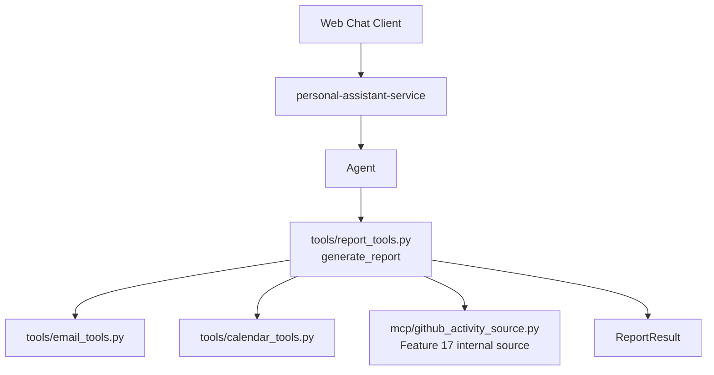
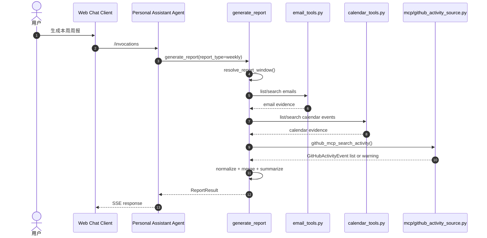

# Feature 18：Report Root Capability Implementation Plan

> 状态：Draft  
> 日期：2026-07-17
> 范围：新增 `generate_report` root tool，复用现有 Email / Calendar tools，并接入 Feature 17 的 GitHub MCP activity data source。

## 1. 概要

本 Feature 的 root capability 是 **Report（报表）**：用户可以通过自然语言生成日/周/月报、工作总结或研发进展总结。Report 能力统一编排多个 data source，包括现有 Email / Calendar tools，以及 Feature 17 新增的 GitHub MCP internal activity source。Feature 17 的 Agent-visible GitHub activity tools 继续服务独立查询场景。

本 Feature 不处理 AgentArts MCP Gateway / GitHub Target 的底层接入；该基础能力由 Feature 17 提供。Report 只消费稳定的 source contract。

设计目标：

- 新增 Agent 可见的 `generate_report` high-level tool。
- `generate_report` 内部确定性编排 Email、Calendar、GitHub activity source，而不是依赖 LLM 自行串联多个 low-level tools。
- 输出统一 `ReportEvidence` / `ReportResult`。
- 支持 source partial failure 和 warnings。
- 更新 prompt，使 Agent 在报表类请求中选择 `generate_report`。

## 2. 调用边界

```text
Agent 可见 root tool:
  generate_report(...)

generate_report 内部复用:
  - email_tools.py: list_emails / search_emails / get_email
  - calendar_tools.py: list_calendar_events / search_calendar_events / get_calendar_event
  - app/mcp/github_activity_source.py: github_mcp_search_activity / github_mcp_get_detail
```

设计原则：

- Agent 默认只需要选择 `generate_report`。
- 单独查询指定 repository 和时间窗口内的工程活动时，Agent 使用 Feature 17 的 `github_search_activity`。
- `generate_report` 负责 report type、时间窗口、timezone、source selection、部分失败降级、数据归一化和去重。
- `generate_report` 直接调用 internal source contract，不调用 Feature 17 的 Agent-facing tool object。
- Skill 只负责报表意图识别、写作风格和数据可信边界说明；不承担数据采集和编排职责。
- GitHub MCP source 不替代现有 GitHub repository browsing tools。

## 3. 触发场景

Report root tool 的触发条件是：用户请求日/周/月报、工作总结或研发进展总结。

典型触发话术：

- “帮我生成今天的日报”
- “帮我生成本周周报”
- “帮我整理这个月的月报”
- “帮我汇总 personal-assistant 仓库这周的开发进展”
- “总结 personal-assistant 仓库今天的工程活动”

不触发 Report 的场景：

- 纯聊天、问答或不需要生成报表的请求。
- 只是查看 GitHub 仓库文件、目录或代码搜索。
- 只是查询指定仓库和时间窗口内的 commits、PR、issues、reviews / comments；此时使用 Feature 17 的 GitHub activity tools。
- 只是 star 仓库等非报表动作。
- 只是查询 / 发送邮件或查询日历，此时继续直接使用现有 Email / Calendar tools。

## 4. 设计图

图类型：**Component Diagram（组件图）**。用于说明 Report root capability 的组件结构。



图类型：**Sequence Diagram（时序图）**。用于说明一次周报请求的调用顺序。



## 5. Tool Interface

### 5.1 `generate_report`

输入：

```json
{
  "report_type": "weekly",
  "start_at": null,
  "end_at": null,
  "timezone": "Asia/Shanghai",
  "sources": ["email", "calendar", "github"],
  "repositories": ["git-malu/personal-assistant"],
  "audience": "self",
  "format": "markdown"
}
```

字段说明：

| 字段 | 说明 |
|---|---|
| `report_type` | `daily`、`weekly`、`monthly`、`custom` |
| `start_at` / `end_at` | custom 窗口使用；daily / weekly / monthly 可由 resolver 推导 |
| `timezone` | 默认使用用户或系统 timezone |
| `sources` | 可选：`email`、`calendar`、`github`；为空时按 report type 自动选择 |
| `repositories` | GitHub source 可选仓库范围 |
| `audience` | `self`、`team` 等后续扩展 |
| `format` | 首期固定 `markdown` |

输出：

```json
{
  "report_type": "weekly",
  "window": {
    "start_at": "2026-07-06T00:00:00+08:00",
    "end_at": "2026-07-12T23:59:59+08:00",
    "timezone": "Asia/Shanghai"
  },
  "content": "## 本周周报\n...",
  "evidence": [],
  "warnings": [],
  "source_coverage": {
    "email": "ok",
    "calendar": "ok",
    "github": "partial"
  }
}
```

## 6. 数据模型

`ReportEvidence`：

| 字段 | 说明 |
|---|---|
| `source` | `email`、`calendar`、`github` 等 |
| `source_id` | source 内部 ID / message ID / event ID / GitHub external ID |
| `title` | 证据标题 |
| `occurred_at` | 事件发生时间 |
| `summary` | 面向报表的短摘要 |
| `url` | 可选原始链接 |
| `metadata` | source-specific 扩展信息 |

`ReportResult`：

| 字段 | 说明 |
|---|---|
| `report_type` | 日报 / 周报 / 月报 / custom |
| `window` | 规范化时间窗口 |
| `content` | 面向用户的 Markdown 报表正文 |
| `evidence` | `ReportEvidence[]` |
| `warnings` | source failure、权限不足、数据不完整等 warning |
| `source_coverage` | 每个 source 的状态：`ok`、`partial`、`unavailable`、`skipped` |

## 7. 实现变更

### 7.1 Service

- 新增 `app/tools/report_tools.py`。
- 在 `build_tools()` 中注册 `generate_report`。
- 新增 report window resolver：
  - daily：用户 timezone 当日；
  - weekly：用户 timezone 当前自然周；
  - monthly：用户 timezone 当前自然月；
  - custom：使用用户指定 `start_at` / `end_at`。
- 复用现有 Email / Calendar async functions。
- 接入 Feature 17 的 GitHub activity source。
- 通过 typed internal source contract 接入，不调用 `github_search_activity` / `github_get_activity_detail` Agent tool object。
- 将各 source 原始数据归一化为 `ReportEvidence`。
- 对 source error 做 warning aggregation。

### 7.2 Prompt / Tool Selection

`SYSTEM_PROMPT` 增加规则：

- 日/周/月报、工作总结、研发进展总结优先使用 `generate_report`。
- 邮件 / 日历单独查询继续使用现有 Microsoft 365 tools。
- GitHub 仓库浏览、文件读取、代码搜索和 star 继续使用现有 GitHub local tools。
- 单独查询 GitHub 工程活动时继续使用 Feature 17 的 `github_search_activity`。
- Report 意图不得退化为 Agent 自行串联 GitHub activity tools。
- 写操作仍遵守 Guard。

### 7.3 Client / Infra

- Client 无新增 UI 要求；沿用现有 Web Chat SSE 渲染 Markdown。
- Infra 无新增资源；Feature 17 已负责 MCP Gateway / Target 手动配置要求。

## 8. 测试计划

### 8.1 单元测试

- `generate_report` 正确解析 daily / weekly / monthly / custom 时间窗口。
- `generate_report` 能复用 Email / Calendar functions。
- `generate_report` 在单个 source 失败时返回 `warnings` 而非整体失败。
- `generate_report` schema 不包含 `access_token`、`api_key`、`secret` 等 credential 参数。
- source selection 正确处理：
  - 默认 sources；
  - 用户指定 sources；
  - `GITHUB_MCP_ENABLED=false`；
  - GitHub source unavailable。

### 8.2 集成测试

- `build_tools()` 注册 `generate_report` root tool。
- Agent 请求“生成本周周报”时，优先调用 `generate_report`。
- `GITHUB_MCP_ENABLED=true` 时，`generate_report` 可以调用 GitHub MCP activity source。
- 验证 `generate_report` 调用 internal source contract，而不是 Agent-facing GitHub activity tool object。
- MCP Gateway unavailable 时，GitHub source 降级为 warning；`generate_report` 仍可使用邮件 / 日历 source 生成部分报表。

### 8.3 E2E / Staging 验证

- 用户请求“生成本周周报”。
- Agent 调用 `generate_report`。
- 输出包含邮件、会议、GitHub 工程活动三类信息来源。
- 当 GitHub source 故障时，输出包含 warning 且仍返回 Email / Calendar 报表。
- 验证 token 不进入 SSE、日志、tool result 或 LLM-visible error。

## 9. 预期项目文件目录

```text
personal-assistant/
├── personal-assistant-meta/
│   ├── issues/features/backlog/feature-18-report-root-capability/
│   │   ├── issue.md
│   │   └── plan.md
│   ├── specs/
│   │   ├── overall_specifications.md   # 修改：登记 Report root capability
│   │   └── dictionary.md               # 修改：补充 ReportEvidence / ReportResult
│   └── architecture/
│       ├── overall_architecture.md      # 修改：登记 Report 编排
│       └── backend_architecture.md      # 修改：补充 report_tools.py
└── personal-assistant-service/
    ├── app/
    │   ├── tools/
    │   │   └── report_tools.py
    │   ├── agent_handler.py
    │   └── prompts.py
    └── tests/
        └── test_report_tools.py
```

## 10. 依赖 Feature 17 的契约

Feature 18 只依赖 Feature 17 的稳定 internal source contract：

- `github_mcp_search_activity(GitHubActivityQuery) -> GitHubActivityResult`；
- `github_mcp_get_detail(GitHubActivityRef) -> GitHubActivityDetail`；
- source unavailable / partial failure 以 typed warning 表达；
- GitHub MCP source 不泄露 credential；
- `actor = platform` 表示 PAT / platform GitHub account。

Feature 18 不依赖 `GITHUB_ACTIVITY_TOOLS` 或 Agent-facing tool schema；这些 tools 与 Report 共享 internal source，但保持独立调用边界。
