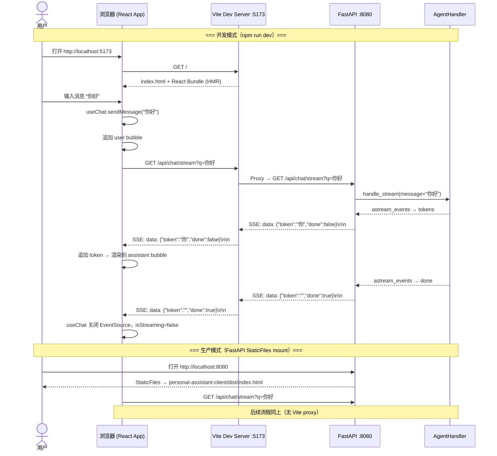

# Feature 1.1: Web Chat 前端工程化 — Implementation Plan

> 状态：Planning | 关联 Issue：`feature-1.1-web-chat-frontend/issue.md`

---

## 0. Issue Evaluation

| 维度 | 结果 | 说明 |
|------|------|------|
| Staleness | ✅ | `personal-assistant-client/` 仅含 `.gitkeep` + `AGENTS.md`，尚未初始化；`personal-assistant-service/web/index.html` 仍存在待替换；ADR-008 状态为 Accepted；`frontend_architecture.md` 内容与 issue 一致 |
| Feasibility | ✅ | ADR-008 明确选型 Vite + React + TypeScript + Tailwind CSS，无冲突 ADR；`/api/chat/stream` SSE 端点已实现（格式：`data: {"token":"...","done":false}\n\n`），前端可直接消费；StaticFiles mount 改动仅一行 |
| Completeness | ✅ | Issue 包含明确范围、任务拆解、验证标准和依赖声明；不涉及的部分明确列出 |
| Impact Scope | ✅ | 影响范围清晰：`personal-assistant-client/` 新建项目；`personal-assistant-service/app/main.py` 一行改动 + 删除 `web/index.html`；无新 API 端点、无数据库变更 |

**判定：ACCEPT** → 继续编写 Implementation Plan。

---

## 1. Issue Summary

将 Feature 1 的单文件 `personal-assistant-service/web/index.html`（Vanilla HTML/JS + 内联 CSS）升级为工程化前端项目 `personal-assistant-client/`，技术栈：**Vite + React + TypeScript + Tailwind CSS**（遵循 ADR-008）。

- **类型**：Feature
- **架构文档引用**：
  - `architecture/ADR/ADR-008-web-chat-frontend-framework.md`
  - `architecture/frontend_architecture.md` §2.1 Web Chat
  - `architecture/frontend_architecture.md` §6.2 部署（Phase 1 同容器 serve）
- **feature branch**：`feat/web-chat-frontend`

---

## 2. API Contracts

### 2.1 现有 API 端点（不变）

当前 `personal-assistant-service/app/main.py` 已实现的端点：

| 端点 | 方法 | 用途 | 本 Feature 是否需要改动 |
|------|------|------|------------------------|
| `/api/chat/stream?q=...` | GET | SSE 流式对话 | **否** — 格式兼容，前端直接消费 |
| `/api/invocations` | POST | AgentArts/OfficeClaw 调用 | **否** |
| `/api/ping` | GET | 健康检查 | **否** |
| `/` | StaticFiles | serve 静态前端文件 | **是** — 路径从 `web/` 改为 `dist/` |

### 2.2 SSE 协议格式（已确认）

当前 `agent_handler.py` 产生的 SSE 格式：

```
data: {"token": "你", "done": false}

data: {"token": "好", "done": false}

data: {"token": "", "done": true}
```

前端 `useChat` hook 直接使用 `EventSource` 解析此格式，**无需修改后端**。

> **技术决策说明**：ADR-008 推荐使用 `@ai-sdk/react`（Vercel AI SDK），但该库的 `useChat` hook 期望 AI SDK 专有 streaming 协议（`{"type":"text-delta","textDelta":"..."}`），与当前后端自定义 SSE 格式（`data: {"token":"...","done":...}`）不兼容。改用原生 `EventSource` API + 自定义 `useChat` hook，简单且零额外依赖。若后续后端升级到 AI SDK streaming 协议，可无缝切换。

> **已知约束**：`/api/chat/stream?q=...` 使用 GET query parameter 传递消息内容，受浏览器 URL 长度限制（~2000 字符）。这是后端既有的设计约束，不影响当前聊天场景（单条消息通常远小于 2000 字符）。如需支持长文本输入，后续可改为 POST + request body（需后端配合）。

### 2.3 StaticFiles Mount 改动

**当前**（`app/main.py` L89）：
```python
app.mount("/", StaticFiles(directory="web", html=True), name="web")
```

**改为**双路径尝试（Docker 容器内优先，本地开发回退）：
```python
_proj_root = Path(__file__).resolve().parent.parent.parent
STATIC_DIR = _proj_root / "personal-assistant-client" / "dist"
if not STATIC_DIR.is_dir():
    STATIC_DIR = Path("dist")  # Docker: /app/dist/

if STATIC_DIR.is_dir():
    app.mount("/", StaticFiles(directory=str(STATIC_DIR), html=True), name="web")
else:
    logger.warning("前端构建产物目录不存在...")
```

> 详细实现见 §3.1。

### 2.4 Vite Dev 代理配置

开发模式下，Vite dev server 通过代理将 `/api/*` 转发到 FastAPI（`http://localhost:8080`）：

```typescript
// vite.config.ts
import { defineConfig } from 'vite'
import react from '@vitejs/plugin-react'

export default defineConfig({
  plugins: [react()],
  server: {
    proxy: {
      '/api': {
        target: 'http://localhost:8080',
        changeOrigin: true,
      },
    },
  },
})
```

### 2.5 无需新增 API 端点

本 Feature 不引入任何新 API 端点。OAuth 登录（`/auth/callback`）由 Feature 4 添加，前端只预留入口占位组件。

---

## 3. Service Tasks

Service-Dev 需完成的改动**极少**（仅 StaticFiles mount 路径变更 + 清理旧文件）。

### 3.1 修改 StaticFiles Mount

**文件**：`personal-assistant-service/app/main.py`

- [ ] 移除原有的 `StaticFiles(directory="web", html=True)` mount
- [ ] 添加双路径尝试逻辑：Docker 容器内 `dist/` 优先（`/app/dist/`），本地开发回退到 `../personal-assistant-client/dist`
- [ ] 若两个路径都不存在，记录 WARNING 日志但不阻止启动

**建议实现**：

```python
import logging
from pathlib import Path

logger = logging.getLogger("uvicorn")

# Docker 容器内路径优先（/app/dist/），本地开发回退到 monorepo 相对路径
_proj_root = Path(__file__).resolve().parent.parent.parent
STATIC_DIR = _proj_root / "personal-assistant-client" / "dist"
if not STATIC_DIR.is_dir():
    STATIC_DIR = Path("dist")  # Docker: /app/dist/

if STATIC_DIR.is_dir():
    app.mount("/", StaticFiles(directory=str(STATIC_DIR), html=True), name="web")
else:
    logger.warning(
        f"前端构建产物目录不存在（已尝试: {_proj_root / 'personal-assistant-client' / 'dist'}, dist/）。"
        "开发模式下请使用 `npm run dev` 在 personal-assistant-client/ 独立启动前端。"
        "部署模式下请确保 `npm run build` 已在 personal-assistant-client/ 执行。"
    )
```

### 3.3 更新 Dockerfile（前端构建产物集成）

**文件**：`personal-assistant-service/Dockerfile`

- [ ] 删除 `COPY web/ ./web/`（L13）
- [ ] 新增 `COPY personal-assistant-client/dist/ ./dist/`，将前端构建产物复制到容器内

**改动后**：

```dockerfile
FROM ghcr.io/astral-sh/uv:python3.12-bookworm

WORKDIR /app

# Copy dependency files first for Docker layer caching
COPY personal-assistant-service/pyproject.toml personal-assistant-service/uv.lock ./

# Install dependencies (production only)
RUN uv sync --frozen --no-dev

# Copy application code
COPY personal-assistant-service/app/ ./app/
COPY personal-assistant-client/dist/ ./dist/
COPY personal-assistant-service/.agentarts_config.yaml ./
COPY personal-assistant-service/config.yaml ./

EXPOSE 8080

CMD ["uv", "run", "uvicorn", "app.main:app", "--host", "0.0.0.0", "--port", "8080"]
```

> **重要**：Docker build context 必须为 monorepo 根目录（`personal-assistant/`），因为 `COPY` 路径跨越了 `personal-assistant-service/` 和 `personal-assistant-client/` 两个子目录。

**构建命令**（在 monorepo 根目录执行）：

```bash
# 1. 先构建前端
cd personal-assistant-client && npm ci && npm run build && cd ..

# 2. 再构建 Docker 镜像（context 为 monorepo 根目录）
docker build -f personal-assistant-service/Dockerfile -t personal-assistant .
```

**CI/CD 影响**：CI pipeline 需确保 `npm run build` 在 `docker build` 之前完成。若前端构建纳入 Docker multi-stage build，可省去前置步骤，但会增加镜像构建时间。当前方案保持构建职责分离，前端构建产物作为 artifact 输入到 Docker build。

### 3.4 删除旧前端文件

- [ ] 删除 `personal-assistant-service/web/index.html`
- [ ] 如 `web/` 目录为空，删除该目录

---

## 4. Client Tasks

Client-Dev 需要从零创建 `personal-assistant-client/` 项目并实现完整聊天界面。

### 4.1 项目初始化

- [ ] **4.1.1** 使用 Vite 脚手架初始化项目：
  ```bash
  npm create vite@latest personal-assistant-client -- --template react-ts
  ```
  或在已有 `personal-assistant-client/` 目录下手动配置（因为目录已存在且含 `AGENTS.md` 和 `.gitkeep`）

- [ ] **4.1.2** 安装依赖：
  ```bash
  npm install
  npm install tailwindcss @tailwindcss/vite
  npm install react-markdown@^9 rehype-highlight
  ```

- [ ] **4.1.3** 配置 Tailwind CSS：
  - 创建 `tailwind.config.ts`（或使用 Tailwind v4 的 CSS-first 配置）
  - 色板参考 iOS 风格：主色 `#007aff`（蓝色），背景 `#e5e5ea`（浅灰），user bubble `#007aff`，assistant bubble `#e5e5ea`
  - 支持暗色模式（`darkMode: 'class'` 或 `media`）
  - 配置响应式断点（移动优先，`max-width: 480px` 容器居中）

- [ ] **4.1.4** 配置 Vite 代理（`vite.config.ts`）：
  ```typescript
  server: {
    proxy: {
      '/api': {
        target: 'http://localhost:8080',
        changeOrigin: true,
      },
    },
  }
  ```

- [ ] **4.1.5** 建立目录结构：
  ```
  personal-assistant-client/
  ├── src/
  │   ├── components/      # React 组件
  │   │   ├── ChatContainer.tsx
  │   │   ├── MessageList.tsx
  │   │   ├── MessageBubble.tsx
  │   │   ├── ChatInput.tsx
  │   │   ├── StreamingText.tsx
  │   │   └── LoginPlaceholder.tsx  # OAuth 登录占位（Feature 4 前不可交互）
  │   ├── hooks/
  │   │   └── useChat.ts            # SSE 连接管理 hook
  │   ├── types/
  │   │   └── chat.ts               # Message, SSEEvent 等类型定义
  │   ├── App.tsx
  │   ├── main.tsx
  │   └── index.css                 # Tailwind 入口 + 自定义样式
  ├── index.html
  ├── vite.config.ts
  ├── tailwind.config.ts
  ├── tsconfig.json
  └── package.json
  ```

### 4.2 类型定义

**文件**：`src/types/chat.ts`

```typescript
export interface Message {
  id: string;
  role: 'user' | 'assistant';
  content: string;
  timestamp: number;
  isStreaming?: boolean;  // true 表示消息仍在流式接收中
}

export interface SSEEvent {
  token?: string;
  done?: boolean;
  error?: string;
}
```

### 4.3 SSE 连接管理 — `useChat` Hook

**文件**：`src/hooks/useChat.ts`

- [ ] **4.3.1** 实现 `useChat` hook，管理消息列表和 SSE 连接生命周期：

  ```typescript
  interface UseChatReturn {
    messages: Message[];
    sendMessage: (content: string) => void;
    isStreaming: boolean;
    error: string | null;
    clearError: () => void;
  }
  ```

  Hook 内部使用以下 ref 进行并发控制：
  - `abortRef: MutableRefObject<boolean>` — 标记当前连接是否应被中止。`sendMessage()` 设为 `true`，新连接就绪后重置为 `false`。所有事件回调在处理前检查此标志。
  - `retryCountRef: MutableRefObject<number>` — 跟踪 EventSource 自动重连次数。`sendMessage()` 重置为 0，`done: true` 重置为 0，`onerror` 递增。达到 3 次后设置永久 error。

- [ ] **4.3.2** `sendMessage(content)` 流程：
  1. 设置 `abortRef.current = true`，阻止旧连接的后续事件污染状态
  2. 若已有活跃 `EventSource`，先 `close()` 关闭
  3. 将 user 消息追加到 `messages` 列表
  4. 创建空的 assistant 消息（`isStreaming: true`），重置 `retryCountRef` 为 0，设置 `abortRef.current = false`
  5. 创建 `EventSource(`/api/chat/stream?q=${encodeURIComponent(content)}`)`
  6. `onmessage`：检查 `abortRef.current`，若为 `true` 则 return → 解析 `data: {"token":"...","done":...}` → 追加 token 到当前 assistant 消息内容
  7. `done: true` → 关闭 EventSource，设置 `isStreaming: false`，重置重连计数器
  8. `onerror` → 检查 `abortRef.current`，若为 `true` 则 return → 递增重连计数，超限后设置 `error` 状态

- [ ] **4.3.3** 并发保护：
  - 使用 `useRef` 维护 `abortRef` 标志：
    - `sendMessage()` 调用时设置 `abortRef.current = true`，然后关闭已有 `EventSource`
    - `closeConnection(isError: boolean)` 检查 `abortRef` — 若已设置则跳过重连和状态更新
  - `onmessage` / `onerror` / 重连逻辑中，处理前检查 `abortRef.current`，若为 `true` 则直接 return（避免在新消息已发送后，旧连接的延迟事件污染状态）
  - 设置 `isStreaming` 为 `true` 时禁用输入

- [ ] **4.3.4** 错误处理与重连控制：
  - `EventSource` 浏览器内置自动重连机制 — 需通过状态变量抑制无限重连
  - 维护 `retryCountRef`（最大 3 次重连），在 `onerror` 中递增并通过 `setTimeout` 延迟显示错误（给重连一个窗口期）
  - 当 `retryCountRef >= 3` 时，设置永久 `error` 状态，关闭连接
  - 网络断开 → `EventSource.onerror` 触发 → 若重连次数未超限，静默等待；超限后设置 `error` 消息
  - HTTP 500 → SSE 流中断 → 显示错误提示
  - 收到 `done: true` 时重置 `retryCountRef` 为 0
  - 已接收部分 token 的流中断：保留已接收内容 + 附加 "[连接中断]" 后缀，不清空已渲染文本
  - 连接超时：`EventSource` 浏览器默认约 45s 超时（`readyState` 变为 `CLOSED`），由 `onerror` 统一处理

- [ ] **4.3.5** 消息 ID 生成：使用 `crypto.randomUUID()` 或自增计数器

### 4.4 核心组件

#### 4.4.1 `ChatContainer`

**文件**：`src/components/ChatContainer.tsx`

- 主布局组件，包含 header + messages + input 三段式结构
- 使用 Flexbox 布局：`flex flex-col h-screen max-w-[480px] mx-auto`
- 渲染 `LoginPlaceholder`（顶部横幅，不可交互，Feature 4 前仅展示）
- 引入 `useChat` hook，将状态传递给子组件

```
┌─────────────────────────┐
│  LoginPlaceholder       │  ← 登录占位横幅
├─────────────────────────┤
│  Personal Assistant     │  ← header
├─────────────────────────┤
│  MessageList            │  ← 消息列表（flex-1 overflow-y-auto）
├─────────────────────────┤
│  ChatInput              │  ← 输入框（flex-shrink-0）
└─────────────────────────┘
```

#### 4.4.2 `MessageList`

**文件**：`src/components/MessageList.tsx`

- [ ] 渲染消息列表，使用 `useRef` + `useEffect` 实现**自动滚底**
- [ ] 流式追加时滚动行为：仅在用户已在底部时自动滚底（避免用户翻阅历史时被打断）
- [ ] 使用 `useEffect` 监听 `messages` 变化触发滚动

#### 4.4.3 `MessageBubble`

**文件**：`src/components/MessageBubble.tsx`

- [ ] 根据 `role` 区分样式：
  - **user**：右对齐（`self-end`），蓝色背景（`bg-[#007aff]`），白色文字，`rounded-bl-lg`
  - **assistant**：左对齐（`self-start`），灰色背景（`bg-[#e5e5ea]`），黑色文字（暗色模式白色），`rounded-br-lg`
- [ ] 公共样式：`max-w-[75%] px-3 py-2 rounded-2xl break-words`
- [ ] 内容渲染：使用 `react-markdown` + `rehype-highlight` 渲染 Markdown
- [ ] 流式状态：`isStreaming` 时在内容末尾显示闪烁光标

#### 4.4.4 `ChatInput`

**文件**：`src/components/ChatInput.tsx`

- [ ] 自动伸缩 textarea（根据内容高度增长，`max-h-32`）
- [ ] `Enter` 发送，`Shift+Enter` 换行
- [ ] 发送中或空内容时禁用输入和发送按钮
- [ ] 发送按钮：圆形蓝色按钮（右箭头图标 ▸）
- [ ] 样式与现有 `index.html` 一致：`border-[#d1d1d6] rounded-2xl p-2.5 px-4`

#### 4.4.5 `StreamingText`

**文件**：`src/components/StreamingText.tsx`

- [ ] 流式文本渲染组件，接收 `text: string` 和 `isStreaming: boolean`
- [ ] 非流式时直接渲染（通过 `react-markdown`）
- [ ] 流式时在文本末尾添加闪烁光标动画（CSS animation `blink`）

#### 4.4.6 `LoginPlaceholder`

**文件**：`src/components/LoginPlaceholder.tsx`

- [ ] 顶部横幅，固定文字："登录后可体验完整功能"（灰色背景，小字体）
- [ ] 不可交互，Feature 4 替换为实际的 OAuth 登录按钮
- [ ] 用 `disabled` 属性或 `opacity-50 cursor-not-allowed` 表示占位状态

### 4.5 入口文件

#### 4.5.1 `App.tsx`

```typescript
import { ChatContainer } from './components/ChatContainer'

function App() {
  return <ChatContainer />
}

export default App
```

#### 4.5.2 `main.tsx`

标准 Vite React 入口，引入 `index.css`（Tailwind 样式）。

#### 4.5.3 `index.css`

```css
@import "tailwindcss";

/* 闪烁光标动画 */
@keyframes blink {
  0%, 100% { opacity: 1; }
  50% { opacity: 0; }
}

.cursor-blink::after {
  content: '▍';
  animation: blink 1s infinite;
  color: #007aff;
}
```

### 4.6 构建配置

- [ ] **4.6.1** `vite.config.ts` 构建配置：
  ```typescript
  import { defineConfig } from 'vite'
  import react from '@vitejs/plugin-react'

  export default defineConfig({
    plugins: [react()],
    build: {
      outDir: 'dist',
      sourcemap: false,  // 生产构建不输出 sourcemap
    },
  })
  ```
  > `base` 默认 `/`，因为 Phase 1 同容器 serve 路径即为根路径。Phase 2 切换到 CDN 时无需更改（CDN 回源到 OBS 同样从根路径 serve）。

- [ ] **4.6.2** `tsconfig.json`：确保 `strict: true`，`jsx: "react-jsx"`

- [ ] **4.6.3** `package.json` scripts：
  ```json
  {
    "scripts": {
      "dev": "vite",
      "build": "tsc -b && vite build",
      "preview": "vite preview"
    }
  }
  ```

### 4.7 清理

- [ ] **4.7.1** 删除 Vite 脚手架生成的默认文件（`src/App.css`, `src/assets/`, `public/vite.svg` 等）
- [ ] **4.7.2** 删除 `personal-assistant-client/.gitkeep`（项目已有实际文件）

---

## 5. Sequence Diagram — 核心用户流程



---

## 6. Dependencies

| 依赖 | 状态 | 说明 |
|------|------|------|
| Feature 1（Agent 骨架） | ✅ 已实现 | `/api/chat/stream` SSE 端点 + `AgentHandler` 就绪 |
| ADR-008（前端框架选型） | ✅ Accepted | 决策 Vite + React + TypeScript + Tailwind CSS |
| ADR-004（FastAPI） | ✅ Accepted | FastAPI `StaticFiles` mount 机制可用 |

**无其他阻塞依赖**。Feature 1.2（PostgreSQL）、Feature 1.3（多 LLM Provider）与本 Feature 可并行。

---

## 7. Risks and Mitigations

| 风险 | 概率 | 影响 | 缓解措施 |
|------|------|------|---------|
| **`EventSource` 与 Vite proxy 兼容性** | 低 | 中 | Vite proxy 默认支持 SSE 转发，已验证。若遇问题可改用 `http-proxy-middleware` 配置 |
| **Tailwind CSS v4 与 `@tailwindcss/vite` 的兼容性** | 中 | 低 | Tailwind v4 使用 CSS-first 配置（`@import "tailwindcss"`），与 v3 `tailwind.config.ts` 方式不同。若 v4 不稳定，降级到 v3 + PostCSS |
| **FastAPI 容器化部署时 `dist/` 路径** | 低 | 高 | 当前 Dockerfile 从 `personal-assistant-service/` 构建，需确保 `dist/` 已构建并复制。建议在 Dockerfile 中添加 multi-stage build 或 CI 步骤 |
| **`react-markdown` + `rehype-highlight` XSS 风险** | 低 | 高 | `react-markdown` 默认不渲染 HTML，但需确认不启用 `rehype-raw`。若需代码高亮，确保 `rehype-highlight` 使用最新版本 |
| **SSE 流中断时消息不完整** | 中 | 中 | `EventSource.onerror` 时保留部分内容 + 附加 "[连接中断]" 提示，不清空已接收的 token |

---

## 8. Test Requirements

### 8.1 Client 单元测试（Vitest）

- [ ] `useChat` hook：mock `EventSource`，测试消息发送、token 接收、done 信号、error 处理
- [ ] `MessageBubble`：渲染 user/assistant 不同样式，流式光标显示
- [ ] `ChatInput`：Enter 发送、Shift+Enter 换行、禁用状态
- [ ] `MessageList`：消息列表渲染、自动滚底

### 8.2 Client 集成测试

- [ ] 确认 `vite build` 无错误，产出 `dist/` 目录
- [ ] 确认 `tsc` 类型检查通过
- [ ] 确认 Tailwind CSS 样式正确编译（无 missing class 警告）

### 8.3 E2E 测试（`personal-assistant-e2e/`）

- [ ] **开发模式**：`npm run dev` → 浏览器访问 → 发送消息 → SSE 流式返回 → 逐 token 渲染
- [ ] **生产模式**：`npm run build` → FastAPI serve `dist/` → 浏览器访问 `localhost:8080` → 功能同开发模式
- [ ] **多轮对话**：连续发送 5 条消息 → 消息列表不串消息、不崩溃、自动滚底
- [ ] **断网恢复**：断开网络 → 发送消息 → 显示错误提示（不白屏）
- [ ] **空消息**：输入空白 → 发送按钮禁用 / 发送无效
- [ ] **快速连发**：连续快速发送 3 条消息 → 每条消息独立 SSE 连接，前一条被关闭

---

## 9. Verification Checklist

- [ ] `npm run dev` 启动无错误
- [ ] 浏览器打开 `http://localhost:5173` → 看到聊天界面
- [ ] 输入消息 → 流式返回，逐 token 渲染（文案在光标前逐字出现）
- [ ] 多轮对话不串消息、不崩溃
- [ ] 断网/服务器宕机 → 界面显示错误提示（不白屏）
- [ ] `npm run build` 无错误，`dist/` 目录产出正确
- [ ] FastAPI 启动时 mount `dist/` 成功（如路径存在）
- [ ] FastAPI serve 模式下聊天正常（`http://localhost:8080`）
- [ ] `npm run preview` 模式聊天正常
- [ ] `personal-assistant-service/web/index.html` 已删除
- [ ] 所有 TypeScript 类型检查通过（`tsc -b`）
- [ ] Tailwind 样式正确渲染（iOS 风格色板、暗色模式切换）
- [ ] LoginPlaceholder 显示但不可交互

---

## 10. File Change Summary

### 新建文件

| 文件 | 说明 |
|------|------|
| `personal-assistant-client/src/main.tsx` | Vite React 入口 |
| `personal-assistant-client/src/App.tsx` | 根组件 |
| `personal-assistant-client/src/index.css` | Tailwind + 自定义动画 |
| `personal-assistant-client/src/components/ChatContainer.tsx` | 主布局 |
| `personal-assistant-client/src/components/MessageList.tsx` | 消息列表 |
| `personal-assistant-client/src/components/MessageBubble.tsx` | 消息气泡 |
| `personal-assistant-client/src/components/ChatInput.tsx` | 输入框 |
| `personal-assistant-client/src/components/StreamingText.tsx` | 流式文本 |
| `personal-assistant-client/src/components/LoginPlaceholder.tsx` | OAuth 登录占位 |
| `personal-assistant-client/src/hooks/useChat.ts` | SSE 连接管理 hook |
| `personal-assistant-client/src/types/chat.ts` | 类型定义 |
| `personal-assistant-client/vite.config.ts` | Vite 配置（代理 + 构建） |
| `personal-assistant-client/tailwind.config.ts` | Tailwind 配置（如用 v3） |
| `personal-assistant-client/tsconfig.json` | TypeScript 配置 |
| `personal-assistant-client/package.json` | 项目依赖 |

### 修改文件

| 文件 | 改动 |
|------|------|
| `personal-assistant-service/app/main.py` | StaticFiles mount 路径：`directory="web"` → 双路径尝试（Docker `dist/` / 本地 `../personal-assistant-client/dist/`）+ 路径存在性检查 |
| `personal-assistant-service/Dockerfile` | 删除 `COPY web/ ./web/`；新增 `COPY personal-assistant-client/dist/ ./dist/`；所有 COPY 路径从 monorepo 根目录相对 |
| `personal-assistant-meta/architecture/frontend_architecture.md` | 更新前端项目路径引用，标记 `personal-assistant-client/` 为实际实现 |
| `personal-assistant-meta/architecture/overall_architecture.md` | §9 项目文件结构：删除 `web/` 条目，替换为 `personal-assistant-client/` 目录树

### 删除文件

| 文件 | 说明 |
|------|------|
| `personal-assistant-service/web/index.html` | Feature 1 单文件前端，已迁移到 `personal-assistant-client/` |
| `personal-assistant-client/.gitkeep` | 项目已有实际文件，占位不再需要 |
| `personal-assistant-client/src/App.css`（脚手架默认） | 样式由 Tailwind 管理 |
| `personal-assistant-client/src/assets/`（脚手架默认） | 删除默认 SVG 资源 |

---

## 11. Architecture Doc Updates

### 11.1 `frontend_architecture.md` §2.1 Web Chat

- [ ] 补充 `personal-assistant-client/` 项目路径和技术栈（Vite + React + TypeScript + Tailwind CSS）
- [ ] 更新部署拓扑，将 `web/index.html` 改为 `personal-assistant-client/dist/`（Phase 1 StaticFiles mount）
- [ ] 添加开发模式代理配置说明（Vite dev server proxy → FastAPI）

### 11.2 `overall_architecture.md` §9 项目文件结构

- [ ] 删除 `├── web/` 条目（L678-679），替换为：
  ```
  ├── personal-assistant-client/       # Web Chat 前端项目（Vite + React + TypeScript + Tailwind CSS）
  │   ├── src/
  │   │   ├── components/
  │   │   ├── hooks/
  │   │   └── types/
  │   ├── dist/                        # Vite build 产物
  │   ├── package.json
  │   ├── vite.config.ts
  │   ├── tailwind.config.ts
  │   └── tsconfig.json
  ```
- [ ] 更新 L683 注释："前端不再作为 `adapters/` 目录放在同一仓库" → 改为"Web Chat 前端为独立项目 `personal-assistant-client/`"
