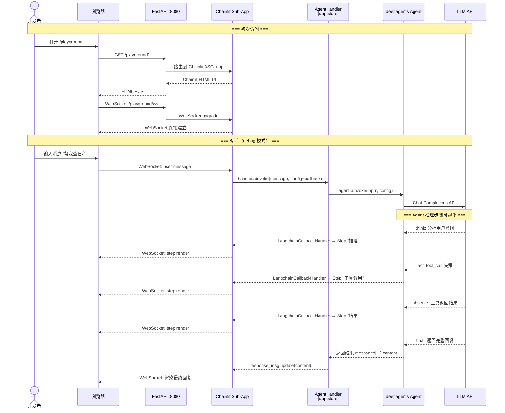
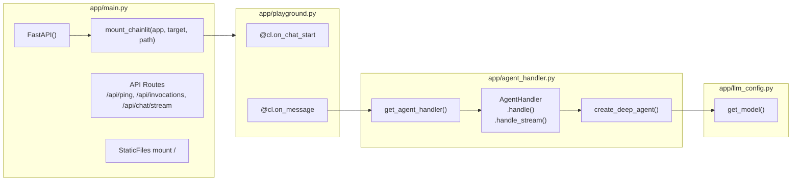

# Feature 1.4: Chainlit Playground — Implementation Plan

> 版本：v1.1 | 日期：2026-06-07 | 状态：Accepted

---

## 0. Issue Evaluation

| 维度 | 结果 | 说明 |
|------|------|------|
| Staleness | ✅ | 引用的架构文档 `frontend_architecture.md` §2.1.1 存在且内容匹配；Feature 1 依赖已验证完成；Chainlit 是活跃维护的包 |
| Feasibility | ✅ | Chainlit 官方提供 `mount_chainlit()` FastAPI 集成 API；`AgentHandler` 已有 `handle()` / `handle_stream()` 方法可复用；deepagents 底层是 LangGraph，Chainlit 的 `LangchainCallbackHandler` 可直接对接 |
| Completeness | ✅ | Issue 包含 4 个子任务、明确验收标准、范围清晰（in scope / not in scope） |
| Impact Scope | ✅ | Service 侧：`pyproject.toml`（新增依赖）、`app/playground.py`（新建）、`app/main.py`（新增 mount）。Client 侧：零变更（Chainlit 是 Python 原生 server-rendered UI，无需 npm 构建） |
| ADR Conflicts | ✅ | 无冲突：ADR-009（deepagents）底层 LangGraph 与 Chainlit callback 兼容；ADR-004（FastAPI）明确选择了路由灵活的 FastAPI，mount sub-app 完全一致；ADR-010（uv）工具链支持 `uv add chainlit` |

**判定：ACCEPT** → 继续编写 Implementation Plan。

---

## 1. Issue Summary

**Feature 1.4** 在 FastAPI 容器内挂载 Chainlit 作为 Python 原生 Agent 调试 UI。路径 `/playground`，与现有的 Vite+React Web Chat 长期共存。

**设计定位**（来自 `architecture/frontend_architecture.md` §2.1.1）：
- Chainlit 是**开发调试工具**，非生产用户界面
- 零构建（不需要 `npm run dev/build`），Python 原生
- 与后端同一 FastAPI 进程，共享 `agent_handler`
- Chainlit 内置 LangChain callback，直接展示 Agent 推理步骤（think → act → observe）
- 使用 WebSocket 协议（不同于 Web Chat 的 SSE）
- 路径 `/playground` 避免与 `/chat`（未来 OAuth 入口）冲突

**参考架构文档**：
- `personal-assistant-meta/architecture/frontend_architecture.md` §2.1.1
- `personal-assistant-meta/architecture/overall_architecture.md` §9（项目文件结构）
- [Chainlit FastAPI 集成文档](https://docs.chainlit.io/integrations/fastapi)
- [Chainlit LangChain 集成文档](https://docs.chainlit.io/integrations/langchain)

---

## 2. Architecture / Design

### 2.1 路由拓扑

Chainlit 作为 ASGI sub-application 挂载到 FastAPI。挂载后的路由拓扑如下：

```
FastAPI 容器 :8080
  ├── /                        → StaticFiles mount dist/（Web Chat 静态文件）
  ├── /playground              → Chainlit ASGI sub-app（调试 UI + WebSocket）
  │   ├── /playground/         → Chainlit HTML UI
  │   └── /playground/ws       → Chainlit WebSocket 通信
  ├── /api/ping                → GET 健康检查
  ├── /api/invocations         → POST 同步调用
  ├── /api/chat/stream         → GET SSE 流式对话
  └── /api/*                   → 未来 API 路由
```

### 2.2 请求流（Sequence Diagram）



### 2.3 组件耦合



**关键设计决策**：
1. **复用 `AgentHandler`**：通过 `app/agent_handler.py` 模块级单例 `get_agent_handler()` 在 FastAPI lifespan 和 Chainlit app 间共享同一实例，避免创建多份 agent/model
2. **Callback 注入**：通过 `RunnableConfig(callbacks=[cl.LangchainCallbackHandler()])` 将 Chainlit 的 LangChain callback 注入 deepagents 调用，自动捕获并可视化 agent 推理中间步骤
3. **Mount 顺序**：`mount_chainlit()` 必须在 API routes 之后、`StaticFiles mount /` 之前调用，确保路径优先级正确

---

## 3. API Changes

**无 OpenAPI spec 变更**。Chainlit 使用自己的 WebSocket 协议，不暴露 REST API 端点，不会出现在 FastAPI 自动生成的 `/docs` OpenAPI 中。

`/api/*` 路由不受影响，`/api/ping`、`/api/invocations`、`/api/chat/stream` 保持不变。

---

## 4. Service Tasks

### 4.1 Subtask 1.4.1: 安装 Chainlit 依赖

**目标**：将 `chainlit` 包添加到项目依赖。

**文件**：`personal-assistant-service/pyproject.toml`

**操作**：
1. 在 `personal-assistant-service/` 目录执行：
   ```bash
   uv add chainlit
   ```
2. 验证：
   ```bash
   uv run chainlit --version
   ```
   预期输出 Chainlit 版本号（如 `2.x.x`）。

**注意**：
- `uv add` 会自动更新 `pyproject.toml` 的 `[project.dependencies]` 并更新 `uv.lock`
- chainlit 依赖会包含 `fastapi`（已有）、`uvicorn`（已有）、`websockets` 等

**验收标准**：`pyproject.toml` 包含 `chainlit` 依赖，`chainlit --version` 正常输出。

---

### 4.2 Subtask 1.4.2: 创建 Chainlit App (`app/playground.py`)

**目标**：创建 Chainlit 应用文件，挂接 `agent_handler`，支持对话并展示 Agent 推理步骤。

**文件**：`personal-assistant-service/app/playground.py`（新建）

**内容设计**：

```python
"""Chainlit Playground — Agent 调试 UI。

与 main.py 共享同一 FastAPI 进程内的 AgentHandler。
通过 Chainlit 原生 WebSocket + LangchainCallbackHandler 直接展示 Agent 推理步骤。
"""

import chainlit as cl
from langchain.schema.runnable.config import RunnableConfig

from app.agent_handler import get_agent_handler


@cl.on_chat_start
async def on_chat_start():
    """初始化 session：注入欢迎消息，确保 agent_handler 可用。"""
    handler = get_agent_handler()
    cl.user_session.set("agent_handler", handler)

    await cl.Message(
        content="👋 欢迎使用 **Personal Assistant Playground**！\n\n"
        "这是一个 Agent 调试工具，你可以在这里与 Agent 对话，\n"
        "观察每一步推理过程（think → act → observe）。\n\n"
        "试试输入：*帮我安排明天下午三点的会议*"
    ).send()


@cl.on_message
async def on_message(message: cl.Message):
    """处理用户消息：调用 Agent，通过 callback 可视化推理步骤。"""
    handler = get_agent_handler()

    # 创建 Chainlit 消息对象，用于流式输出最终回复
    response_msg = cl.Message(content="")
    await response_msg.send()

    # 使用 LangchainCallbackHandler 捕获并可视化中间步骤
    callback = cl.LangchainCallbackHandler()

    try:
        # 方式 A：使用 ainvoke 获取完整结果，callback 自动捕获中间步骤
        result = await handler.agent.ainvoke(
            {"messages": [{"role": "user", "content": message.content}]},
            config=RunnableConfig(callbacks=[callback]),
        )

        # 输出最终回复
        final_content = result["messages"][-1].content if result.get("messages") else ""
        response_msg.content = final_content
        await response_msg.update()

    except Exception as e:
        response_msg.content = f"❌ Agent 调用失败: {str(e)}"
        await response_msg.update()
```

**设计说明**：

| 关注点 | 设计决策 | 原因 |
|--------|---------|------|
| **Agent 复用** | `get_agent_handler()` 模块级单例 | 避免创建多份 model/agent 实例；与 `main.py` lifespan 共享同一 `AgentHandler` |
| **Callback 注入** | `RunnableConfig(callbacks=[cl.LangchainCallbackHandler()])` | Chainlit 原生 LangChain callback，自动将 agent 中间步骤渲染为 UI step |
| **流式 vs 非流式** | 第一版使用 `.ainvoke()`（非流式） | 简化实现；Chainlit callback 已展示中间步骤（think/act/observe），最终回复一次性输出可接受。后续可升级为流式 token 输出 |
| **错误处理** | try/except 包裹，错误信息展示到 UI | 调试场景下暴露错误信息有助于排查问题 |
| **Session 初始化** | `cl.user_session.set("agent_handler", ...)` | 为后续会话级状态扩展预留（如 session-specific config） |
| **绕过 `handle()` 直接调用 `.agent.ainvoke()`** | `handler.agent.ainvoke(...)` 而非 `handler.handle(...)` | **两个原因**：(1) `handle()` 方法当前仅是 `agent.ainvoke()` 的薄封装，且剥离了返回结构只输出 `messages[-1].content`，不暴露中间推理步骤；(2) 更关键的是——Playground 需要传入 `RunnableConfig(callbacks=[cl.LangchainCallbackHandler()])` 来启用 Chainlit 的可视化推理步骤，而 `handle()` 签名不接受 `config` 参数。未来若 `handle()` 扩展支持 `config` 参数，Playground 应迁移到调用 `handle()` 以保持单一切入点 |

**⚠️ 与 Issue 验收标准的偏差说明**：

Issue §1.4.2 验收标准要求"通过 `cl.Message.stream_token()` 流式输出"。本 plan **有意偏离**此要求：
- 第一版实现使用 `ainvoke()` 一次性返回结果（非流式），通过 `response_msg.update()` 输出最终回复
- 偏离原因：Chainlit 的 `LangchainCallbackHandler` 已经自动捕获并可视化 Agent 推理中间步骤（think/act/observe），最终回复非流式输出仍可满足调试需求；且 `astream_events` 流式版本需验证与 `LangchainCallbackHandler` 的兼容性（是否会导致双重渲染）
- `stream_token()` 流式输出的验收标准推迟到后续增强迭代（见 §9 Future Enhancements）

**关于流式输出（后续优化方向）**：
当前方案使用 `ainvoke()` 一次性获取结果。若需要流式逐字输出，可参考以下模式（暂不实现）：

```python
# 流式版本（注：仅供参考，非本期实现）
async for event in handler.agent.astream_events(
    {"messages": [{"role": "user", "content": message.content}]},
    version="v2",
    config=RunnableConfig(callbacks=[callback]),
):
    if event["event"] == "on_chat_model_stream":
        token = event["data"]["chunk"].content
        if token:
            await response_msg.stream_token(token)
```

**注意**：`astream_events` 流式版本需验证与 `LangchainCallbackHandler` 的兼容性（是否会导致双重渲染）。当前选择 `ainvoke` 是最稳妥的起步方案。

**验收标准**：`app/playground.py` 文件存在，包含 `@cl.on_chat_start` 和 `@cl.on_message` 装饰器。

---

### 4.3 Subtask 1.4.3: FastAPI 挂载 Chainlit

**目标**：修改 `app/main.py`，在 `/playground` 路径挂载 Chainlit ASGI sub-app。

**文件**：`personal-assistant-service/app/main.py`（修改）

**修改内容**：

在现有 `app/main.py` 中：

1. **新增 import**（在文件顶部其他 import 附近）：
   ```python
   from chainlit.utils import mount_chainlit
   ```

2. **新增 Chainlit mount**（在 API routes 之后、StaticFiles mount 之前）：
   ```python
   # Chainlit Playground — Agent 调试 UI（/playground）
   # Mount 必须在 API routes 之后、StaticFiles mount 之前
   mount_chainlit(app=app, target="app/playground.py", path="/playground")
   ```

3. **修改 `app/agent_handler.py`**（新增模块级单例函数）：
   ```python
   # 在 app/agent_handler.py 顶部（class AgentHandler 定义之前或之后）新增：

   _handler_instance: AgentHandler | None = None

   def get_agent_handler() -> AgentHandler:
       """获取模块级 AgentHandler 单例。

       在 FastAPI lifespan（main.py）和 Chainlit app（playground.py）间共享同一实例。
       首次调用时初始化，后续调用返回缓存实例。
       """
       global _handler_instance
       if _handler_instance is None:
           _handler_instance = AgentHandler()
       return _handler_instance
   ```

4. **修改 lifespan**（将 `app.state.agent_handler = AgentHandler()` 替换为使用单例）：
   ```python
   # 原代码：
   # app.state.agent_handler = AgentHandler()
   
   # 修改为：
   from app.agent_handler import get_agent_handler
   app.state.agent_handler = get_agent_handler()
   ```

**完整 main.py 结构（修改后）**示意：

```python
# ... 现有 import ...
from chainlit.utils import mount_chainlit
from app.agent_handler import AgentHandler, get_agent_handler

@asynccontextmanager
async def lifespan(app: FastAPI):
    # ... LLM config validation ...
    app.state.agent_handler = get_agent_handler()  # 使用单例
    yield

app = FastAPI(title="Personal Assistant", version="0.1.0", lifespan=lifespan)

# === API Routes ===
@app.get("/api/ping")
async def ping(): ...

@app.post("/api/invocations")
async def invocations(request: Request): ...

@app.get("/api/chat/stream")
async def chat_stream(request: Request, q: str = ""): ...

# === Chainlit Playground（调试 UI）===
# Mount 在 API routes 之后、StaticFiles 之前，确保路径优先级正确
mount_chainlit(app=app, target="app/playground.py", path="/playground")

# === Static File Serving（Web Chat）===
# ... 现有 StaticFiles mount 逻辑 ...
```

**Mount 顺序分析**：

| Mount 顺序 | 组件 | 原因 |
|-----------|------|------|
| 1 | API routes（`/api/ping`, `/api/invocations`, `/api/chat/stream`） | 路由装饰器最先注册，优先级最高 |
| 2 | `mount_chainlit(..., path="/playground")` | `/playground` 及其子路径和 WebSocket 路由 |
| 3 | `app.mount("/", StaticFiles(...))` | 最后注册 `/` catch-all，避免拦截 `/playground` 和 `/api/*` |

**验收标准**：
- `mount_chainlit` 调用在 `main.py` 中存在
- `app/agent_handler.py` 包含 `get_agent_handler()` 函数
- lifespan 使用 `get_agent_handler()` 获取 handler 实例
- `uv run uvicorn app.main:app` 启动成功后 `/playground` 可访问

---

### 4.4 Subtask 1.4.4: 验证

**目标**：端到端验证 Chainlit Playground 功能正常，且不影响现有 API 和 Web Chat。

**验证步骤**：

| 步骤 | 操作 | 预期结果 |
|------|------|---------|
| 1 | `uv run uvicorn app.main:app --host 0.0.0.0 --port 8080` | FastAPI + Chainlit 正常启动，无 import 错误 |
| 2 | 浏览器打开 `http://localhost:8080/playground` | Chainlit UI 显示，显示欢迎消息 |
| 3 | 在 Chainlit 输入消息 "你好" 并发送 | Agent 回复正常，推理步骤（若有）在 UI 中以 step 形式展示 |
| 4 | `curl http://localhost:8080/api/ping` | 返回 `{"status": "ok"}`，API 路由未受影响 |
| 5 | `curl -X POST http://localhost:8080/api/invocations -H 'Content-Type: application/json' -d '{"message":"hello"}'` | 返回 `{"response": "..."}` |
| 6 | `curl http://localhost:8080/api/chat/stream?q=hello` | SSE 流式响应正常 |
| 7 | 浏览器打开 `http://localhost:8080/`（如有 dist/） | Web Chat 静态文件正常加载，未受 `/playground` mount 影响 |
| 8 | 打开 `http://localhost:8080/docs` | OpenAPI 文档正常，`/playground` 不出现（Chainlit 不在 OpenAPI 中） |

**验证注意事项**：
- Chainlit 首次启动时可能会在项目根目录创建 `.chainlit/` 配置目录（如 `config.toml`）——这是 Chainlit 的正常行为，用于存储 UI 配置
- 如果 LLM API Key 未配置，Agent 调用会失败。此时 Chainlit UI 应显示错误信息，不会 crash
- WebSocket 连接在浏览器 DevTools Network 面板中可观察（`/playground/ws`）

---

## 5. Client Tasks

**无 Client 侧任务**。Chainlit 是 Python 原生 server-rendered UI，所有 UI 由 Chainlit 服务端生成，不涉及 Vite/React/TypeScript 前端代码。

`personal-assistant-client/` 目录零变更。

---

## 6. File Change Summary

| 文件 | 操作 | 说明 |
|------|------|------|
| `personal-assistant-service/pyproject.toml` | 修改 | `uv add chainlit` 自动添加依赖到 `[project.dependencies]` |
| `personal-assistant-service/uv.lock` | 修改 | `uv add` 自动更新锁文件 |
| `personal-assistant-service/app/playground.py` | **新建** | Chainlit app 文件，`on_chat_start` + `on_message` |
| `personal-assistant-service/app/main.py` | 修改 | 新增 `from chainlit.utils import mount_chainlit`；在 API routes 之后新增 `mount_chainlit(...)`；lifespan 改用 `get_agent_handler()` |
| `personal-assistant-service/app/agent_handler.py` | 修改 | 新增 `get_agent_handler()` 模块级单例函数 |
| `personal-assistant-client/` | 不涉及 | — |

---

## 7. Test Requirements

### 7.1 Unit Tests（Service 侧）

| 测试文件 | 测试内容 |
|---------|---------|
| `tests/test_agent_handler.py` | 验证 `get_agent_handler()` 返回同一实例（单例行为） |
| `tests/test_playground.py` | 验证 `app/playground.py` 可正确导入，`on_chat_start` 和 `on_message` decorator 已注册 |

### 7.2 Integration Tests（Service 侧）

| 测试用例 | 方法 |
|---------|------|
| FastAPI app 启动包含 `/playground` mount | `TestClient` 验证 app 实例包含 Chainlit sub-app |
| `/api/ping` 在 mount Chainlit 后仍正常 | `TestClient.get("/api/ping")` → 200 |
| `get_agent_handler()` 与 `app.state.agent_handler` 指向同一实例 | 在 lifespan 中设置后，通过 `get_agent_handler()` 获取，assert `is` |

### 7.3 E2E Tests（e2e 侧）

| 场景 | 描述 |
|------|------|
| Chainlit UI 可访问 | 浏览器访问 `/playground`，页面加载成功，显示"Welcome" |
| 对话流程 | 在 Chainlit 中发消息 → Agent 回复，推理步骤可见 |
| API 不受影响 | 同时请求 `/api/ping` 和 `/playground`，两路由独立工作 |

### 7.4 Edge Cases

| 场景 | 预期行为 |
|------|---------|
| LLM API Key 未配置 | Chainlit 显示错误信息在聊天界面，不会导致进程 crash |
| `/playground` 被 CDN 暴露（未来 Phase 2 生产部署时） | CDN 规则不匹配 `/playground*`，直连容器地址才可达。无需代码层面处理 |
| 并发访问 `/playground` | Chainlit 每个 WebSocket 连接独立 session，AgentHandler 共享，无 race condition（deepagents agent 内部线程安全） |
| Chainlit 版本升级 breaking change | 依赖锁定在 `uv.lock`，升级需显式 `uv add chainlit@latest` |

---

## 8. Risk Assessment

| 风险 | 可能性 | 影响 | 缓解措施 |
|------|--------|------|---------|
| Chainlit `mount_chainlit` API 与 FastAPI `StaticFiles mount /` 路由冲突 | 低 | 中 — `/playground` 被 StaticFiles 拦截返回 404 | Mount 顺序：API routes → Chainlit → StaticFiles。Chainlit 在 StaticFiles 之前注册，路径 `/playground` 不会被 `/` catch-all 拦截 |
| deepagents 与 `LangchainCallbackHandler` 兼容性 | 低 | 中 — 中间步骤不可视 | deepagents 底层是 LangGraph `CompiledGraph`，完全兼容 LangChain callback。如遇兼容问题，降级为不使用 callback，只输出最终回复 |
| Chainlit WebSocket 与 uvicorn 兼容性 | 极低 | 高 — Chainlit 完全不可用 | uvicorn 原生支持 WebSocket（ASGI specification），Chainlit 官方明确支持 FastAPI + uvicorn 部署 |
| `get_agent_handler()` 单例线程安全 | 低 | 低 — 多线程下可能创建多个实例 | Python GIL 环境下 `global` 赋值是原子的；即使创建了多个实例（竞态条件），功能上也无影响（只是浪费少量内存） |

---

## 9. Future Enhancements（不在本期范围）

- **流式 token 输出**：当前使用 `ainvoke()` 一次性返回，后续可升级为 `astream_events()` 流式输出 token
- **自定义 Chainlit 主题**：在 `.chainlit/config.toml` 中配置 UI 主题、logo 等
- **Chainlit Data Layer**：对接 SQLAlchemy Data Layer 实现对话历史持久化
- **Agent step 可视化增强**：自定义 `@cl.step` decorator 为不同类型的工具调用添加图标和分类
